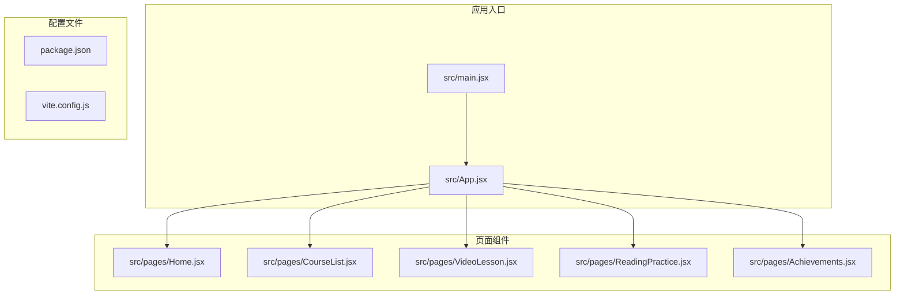
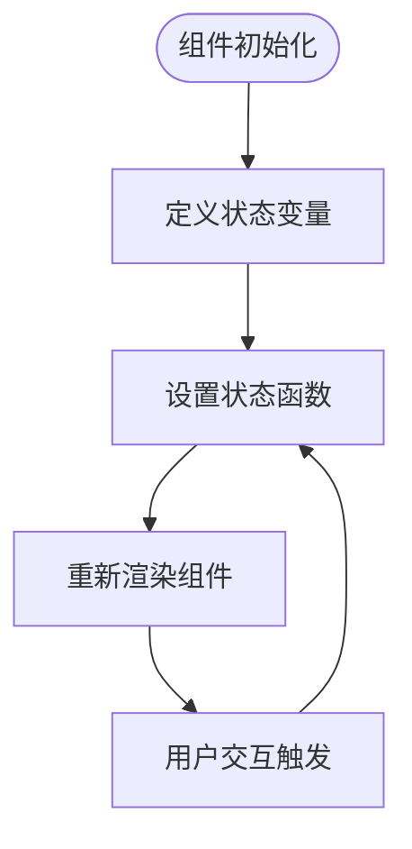
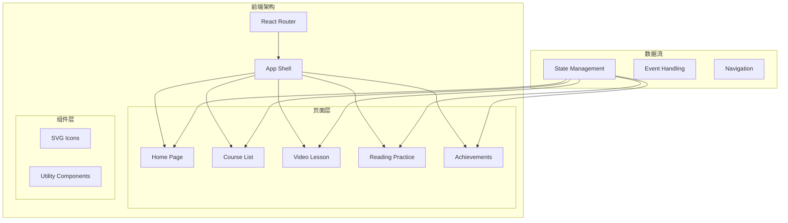
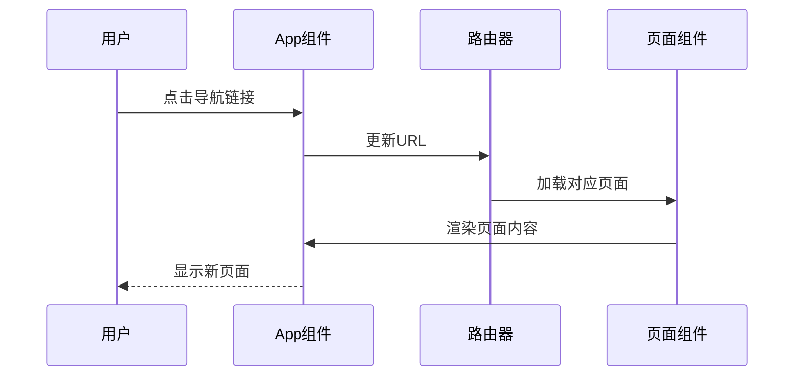
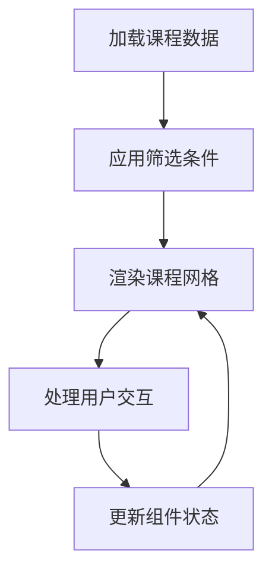

# 代码规范与最佳实践

<cite>
**本文档引用的文件**
- [App.jsx](file://src/App.jsx)
- [main.jsx](file://src/main.jsx)
- [Home.jsx](file://src/pages/Home.jsx)
- [CourseList.jsx](file://src/pages/CourseList.jsx)
- [VideoLesson.jsx](file://src/pages/VideoLesson.jsx)
- [ReadingPractice.jsx](file://src/pages/ReadingPractice.jsx)
- [Achievements.jsx](file://src/pages/Achievements.jsx)
- [package.json](file://package.json)
- [vite.config.js](file://vite.config.js)
</cite>

## 目录
1. [项目概述](#项目概述)
2. [项目结构](#项目结构)
3. [核心组件规范](#核心组件规范)
4. [架构概览](#架构概览)
5. [详细组件分析](#详细组件分析)
6. [依赖关系分析](#依赖关系分析)
7. [性能考虑](#性能考虑)
8. [故障排除指南](#故障排除指南)
9. [结论](#结论)

## 项目概述

这是一个基于 React 和 Vite 的 Minecraft 英语学习应用，采用函数式组件和 Hooks 模式的现代 React 开发实践。项目实现了完整的英语学习功能，包括课程学习、视频播放、阅读练习和成就系统。

## 项目结构



**图表来源**
- [main.jsx:1-14](file://src/main.jsx#L1-L14)
- [App.jsx:1-112](file://src/App.jsx#L1-L112)

**章节来源**
- [main.jsx:1-14](file://src/main.jsx#L1-L14)
- [package.json:1-22](file://package.json#L1-L22)

## 核心组件规范

### 函数式组件编写规范

#### 基本结构
- 使用箭头函数语法定义组件：`export default () => {}`
- 组件名称使用 PascalCase 命名约定
- 所有组件接收 props 参数并使用解构赋值

#### Props 处理最佳实践
- 使用 qoderProps 作为通用 props 参数名，支持样式和类名传递
- 通过扩展运算符安全地传递 props：`{...props?.style}`
- 避免直接修改传入的 props 对象

#### 状态管理规范
- 使用 useState Hook 管理本地状态
- 将状态更新逻辑封装在独立的函数中
- 避免在渲染过程中直接调用 setState

**章节来源**
- [Home.jsx:48-293](file://src/pages/Home.jsx#L48-L293)
- [CourseList.jsx:163-314](file://src/pages/CourseList.jsx#L163-L314)
- [VideoLesson.jsx:20-288](file://src/pages/VideoLesson.jsx#L20-L288)

### Hooks 使用规范

#### 状态 Hooks


**图表来源**
- [CourseList.jsx](file://src/pages/CourseList.jsx#L164)
- [VideoLesson.jsx:21-24](file://src/pages/VideoLesson.jsx#L21-L24)

#### 状态更新模式
- 使用不可变更新：`setAnswers({...answers, [qId]: ansIdx})`
- 批量状态更新：避免多次单独的状态更新
- 条件状态更新：仅在必要时更新状态

**章节来源**
- [ReadingPractice.jsx:46-68](file://src/pages/ReadingPractice.jsx#L46-L68)

### Props 传递和事件处理

#### 事件处理最佳实践
- 使用内联箭头函数处理简单事件
- 对于复杂事件，使用预绑定的回调函数
- 避免在渲染过程中创建新的函数实例

#### 导航组件规范
- 使用 React Router 的 Link 组件进行页面导航
- 通过 to 属性指定目标路由
- 支持嵌套导航和条件导航

**章节来源**
- [App.jsx:96-108](file://src/App.jsx#L96-L108)
- [CourseList.jsx:207-211](file://src/pages/CourseList.jsx#L207-L211)

## 架构概览



**图表来源**
- [App.jsx:1-112](file://src/App.jsx#L1-L112)
- [main.jsx:1-14](file://src/main.jsx#L1-L14)

## 详细组件分析

### 应用外壳组件 (App.jsx)

App 组件作为整个应用的外壳，负责：

#### 导航系统设计
- 实现底部导航栏，支持多页面切换
- 使用 NavLink 进行路由激活状态管理
- 实现动态导航高亮效果

#### 头部状态栏
- 显示用户头像和等级信息
- 实现经验值进度条
- 展示连续学习天数徽章

#### 路由配置
- 定义所有页面路由
- 支持嵌套路由
- 实现路由参数传递



**图表来源**
- [App.jsx:47-112](file://src/App.jsx#L47-L112)

**章节来源**
- [App.jsx:1-112](file://src/App.jsx#L1-L112)

### 主页组件 (Home.jsx)

主页组件展示了完整的课程推荐和学习进度：

#### 卡片组件模式
- 使用统一的卡片样式系统
- 实现响应式网格布局
- 支持悬停和点击交互效果

#### 进度跟踪
- 实现 XP 进度条显示
- 展示连续学习天数
- 提供课程完成状态指示

#### 内容组织
- 使用语义化 HTML 结构
- 实现像素艺术风格的装饰元素
- 支持主题色系切换

**章节来源**
- [Home.jsx:1-293](file://src/pages/Home.jsx#L1-L293)

### 课程列表组件 (CourseList.jsx)

课程列表组件实现了完整的课程浏览和筛选功能：

#### 数据驱动渲染
- 使用静态数据数组管理课程信息
- 实现动态课程过滤和排序
- 支持课程进度状态显示

#### 交互设计
- 实现标签筛选功能
- 支持课程锁定状态处理
- 提供进度条可视化

#### 组件复用
- 创建可复用的星级评分组件
- 实现像素风格的课程缩略图
- 支持课程难度等级标识



**图表来源**
- [CourseList.jsx:4-61](file://src/pages/CourseList.jsx#L4-L61)
- [CourseList.jsx:173-176](file://src/pages/CourseList.jsx#L173-L176)

**章节来源**
- [CourseList.jsx:1-314](file://src/pages/CourseList.jsx#L1-L314)

### 视频课程组件 (VideoLesson.jsx)

视频课程组件提供了完整的视频学习体验：

#### 多区域布局
- 视频播放区域
- 字幕显示区域
- 课程内容区域

#### 交互功能
- 字幕语言切换
- 视频片段时间轴
- 听力理解测验

#### 状态管理
- 字幕显示状态控制
- 测验答案状态管理
- 学习进度跟踪

**章节来源**
- [VideoLesson.jsx:1-288](file://src/pages/VideoLesson.jsx#L1-L288)

### 阅读练习组件 (ReadingPractice.jsx)

阅读练习组件实现了完整的阅读理解功能：

#### 双列布局设计
- 左侧阅读材料
- 右侧练习题
- 响应式布局适配

#### 词汇学习功能
- 词汇高亮显示
- 词汇收藏机制
- 词汇释义提示

#### 测验系统
- 多种题型支持
- 实时答案反馈
- 学习结果统计

**章节来源**
- [ReadingPractice.jsx:1-293](file://src/pages/ReadingPractice.jsx#L1-L293)

### 成就系统组件 (Achievements.jsx)

成就系统组件展示了用户的学习成果：

#### 成就展示
- 成就徽章网格布局
- 进度条显示未解锁成就
- 成就状态分类

#### 物品收集
- 物品稀有度分级
- 像素风格物品图标
- 收集状态可视化

#### 用户统计
- 学习等级计算
- 总 XP 统计
- 学习成就概览

**章节来源**
- [Achievements.jsx:1-297](file://src/pages/Achievements.jsx#L1-L297)

## 依赖关系分析

```mermaid
graph TB
subgraph "运行时依赖"
react[react ^18.2.0]
react_dom[react-dom ^18.2.0]
router[react-router-dom ^6.20.0]
end
subgraph "开发依赖"
vite[vite ^5.0.0]
react_plugin[@vitejs/plugin-react ^4.2.0]
end
subgraph "项目文件"
main_js[src/main.jsx]
app_js[src/App.jsx]
pages[页面组件]
end
main_js --> react
main_js --> react_dom
app_js --> router
pages --> react
pages --> router
vite --> react_plugin
```

**图表来源**
- [package.json:12-21](file://package.json#L12-L21)

**章节来源**
- [package.json:1-22](file://package.json#L1-L22)
- [vite.config.js:1-11](file://vite.config.js#L1-L11)

## 性能考虑

### 渲染优化
- 使用 React.memo 优化频繁更新的组件
- 实现虚拟滚动处理大量数据
- 避免不必要的 re-render

### 状态管理
- 合理拆分组件状态，避免全局状态污染
- 使用 useMemo 和 useCallback 优化性能
- 实现状态缓存机制

### 资源加载
- 图片懒加载策略
- SVG 图标内联减少 HTTP 请求
- CSS 样式按需加载

## 故障排除指南

### 常见问题诊断

#### 组件渲染问题
- 检查 props 类型和默认值
- 验证状态初始化是否正确
- 确认事件处理器绑定

#### 路由导航问题
- 验证路由路径配置
- 检查 Link 组件的 to 属性
- 确认路由参数传递

#### 样式显示异常
- 检查 CSS 变量定义
- 验证主题色系配置
- 确认响应式断点设置

**章节来源**
- [App.jsx:47-112](file://src/App.jsx#L47-L112)
- [main.jsx:1-14](file://src/main.jsx#L1-L14)

## 结论

本项目展示了现代 React 开发的最佳实践，包括：

1. **组件设计**：采用函数式组件和 Hooks 模式，实现清晰的组件职责分离
2. **状态管理**：合理使用 useState 和其他 Hooks，避免状态污染
3. **性能优化**：通过合理的组件结构和状态管理提升应用性能
4. **用户体验**：提供直观的导航和丰富的交互功能
5. **代码组织**：遵循一致的命名约定和文件组织结构

这些规范为类似教育类应用的开发提供了良好的参考模板，有助于构建可维护、高性能的 React 应用程序。