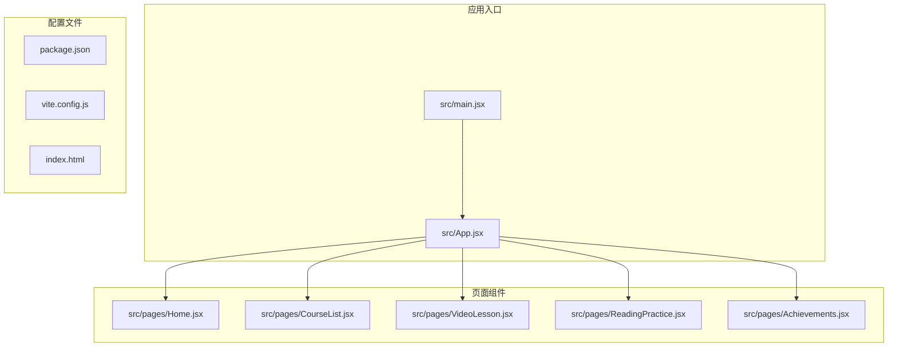
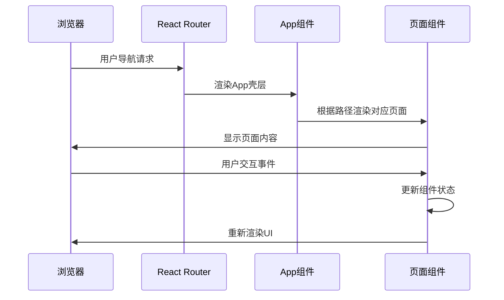
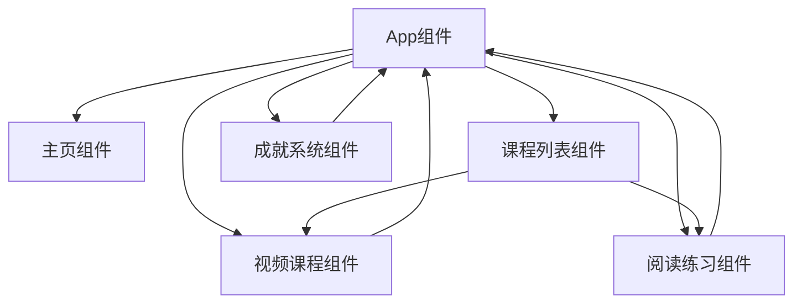
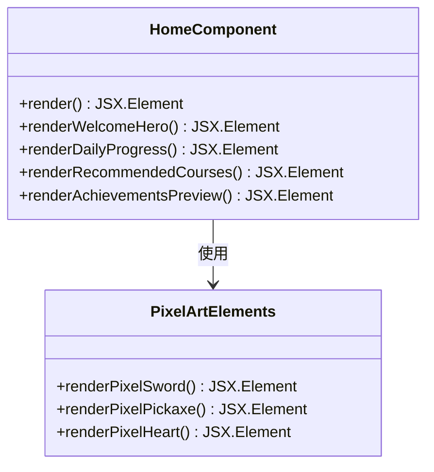
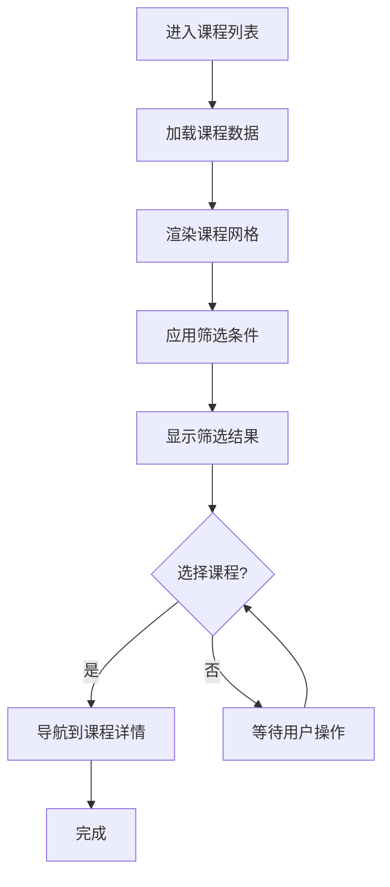
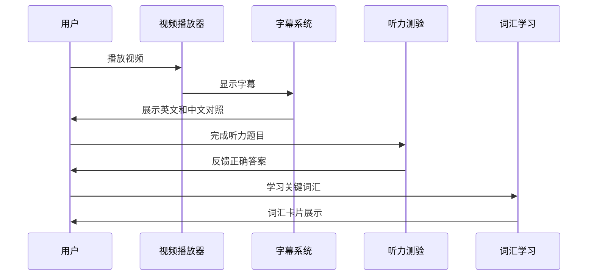
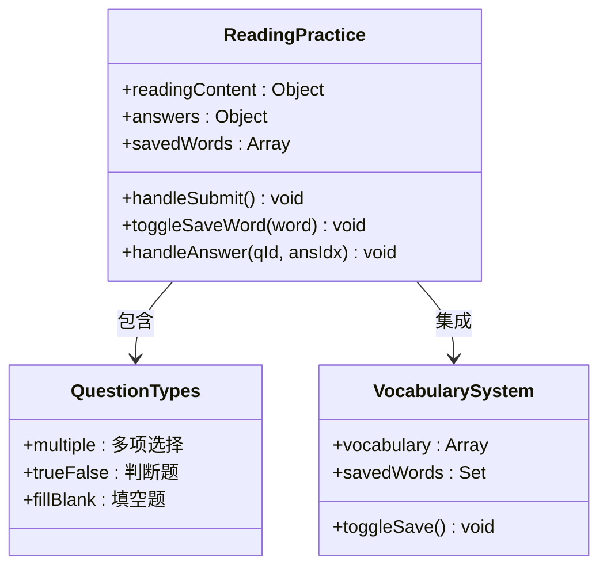
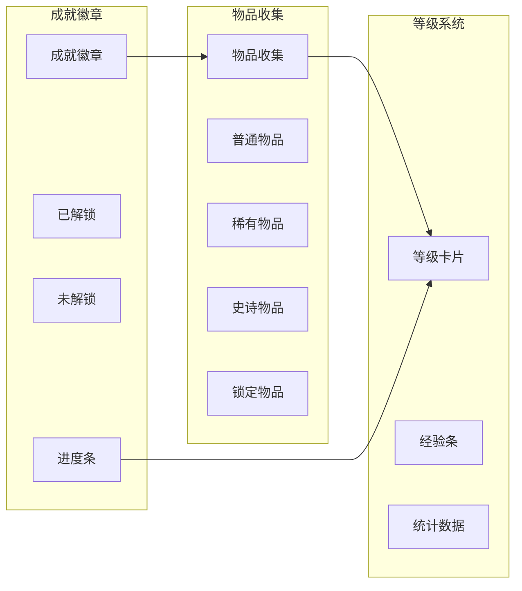

# 开发指南

<cite>
**本文档引用的文件**
- [App.jsx](file://src/App.jsx)
- [main.jsx](file://src/main.jsx)
- [Home.jsx](file://src/pages/Home.jsx)
- [CourseList.jsx](file://src/pages/CourseList.jsx)
- [VideoLesson.jsx](file://src/pages/VideoLesson.jsx)
- [ReadingPractice.jsx](file://src/pages/ReadingPractice.jsx)
- [Achievements.jsx](file://src/pages/Achievements.jsx)
- [package.json](file://package.json)
- [vite.config.js](file://vite.config.js)
- [index.html](file://index.html)
</cite>

## 目录
1. [简介](#简介)
2. [项目结构](#项目结构)
3. [核心组件](#核心组件)
4. [架构概览](#架构概览)
5. [详细组件分析](#详细组件分析)
6. [依赖关系分析](#依赖关系分析)
7. [性能考虑](#性能考虑)
8. [故障排除指南](#故障排除指南)
9. [结论](#结论)
10. [附录](#附录)

## 简介

这是一个基于React和Vite构建的Minecraft英语学习应用。应用采用像素艺术风格设计，通过Minecraft主题的游戏化元素来帮助用户学习英语。项目实现了完整的英语学习功能，包括视频课程、阅读练习、词汇学习和成就系统。

该应用的核心特色是将教育内容与游戏化机制相结合，通过经验值、等级系统、成就徽章和物品收集等元素来激励用户持续学习。

## 项目结构

项目采用模块化的React架构，主要文件组织如下：



**图表来源**
- [main.jsx:1-14](file://src/main.jsx#L1-L14)
- [App.jsx:1-112](file://src/App.jsx#L1-L112)

**章节来源**
- [main.jsx:1-14](file://src/main.jsx#L1-L14)
- [package.json:1-22](file://package.json#L1-L22)
- [vite.config.js:1-11](file://vite.config.js#L1-L11)

## 核心组件

### 应用壳层组件

应用的主要容器组件负责路由管理和全局UI布局：

- **导航系统**：底部导航栏提供主页、课程列表、成就三个主要功能区域
- **状态栏**：顶部显示用户头像、等级信息和学习进度
- **路由管理**：使用React Router进行页面间导航

### 页面组件架构

应用包含五个核心页面组件，每个都针对特定的学习功能：

1. **主页** - 学习进度概览和推荐课程
2. **课程列表** - 所有可用课程的展示和筛选
3. **视频课程** - 视频学习和听力练习
4. **阅读练习** - 文本阅读和词汇学习
5. **成就系统** - 用户进度和奖励展示

**章节来源**
- [App.jsx:47-112](file://src/App.jsx#L47-L112)
- [Home.jsx:48-293](file://src/pages/Home.jsx#L48-L293)
- [CourseList.jsx:163-314](file://src/pages/CourseList.jsx#L163-L314)

## 架构概览

应用采用单页应用(SPA)架构，使用React Router进行客户端路由管理：



**图表来源**
- [App.jsx:85-91](file://src/App.jsx#L85-L91)
- [main.jsx:7-13](file://src/main.jsx#L7-L13)

### 组件通信模式

应用采用自上而下的数据流模式：



**图表来源**
- [App.jsx:85-91](file://src/App.jsx#L85-L91)
- [CourseList.jsx:207-211](file://src/pages/CourseList.jsx#L207-L211)

## 详细组件分析

### 主页组件分析

主页组件实现了学习进度的综合展示：



**图表来源**
- [Home.jsx:4-46](file://src/pages/Home.jsx#L4-L46)
- [Home.jsx:48-293](file://src/pages/Home.jsx#L48-L293)

主页的核心功能包括：

1. **欢迎横幅** - 展示用户问候和学习按钮
2. **每日进度** - XP进度条和连续学习天数
3. **推荐课程** - 基于用户水平的课程推荐
4. **最近成就** - 成就徽章预览

**章节来源**
- [Home.jsx:48-293](file://src/pages/Home.jsx#L48-L293)

### 课程列表组件分析

课程列表组件提供了完整的课程浏览和筛选功能：



**图表来源**
- [CourseList.jsx:163-314](file://src/pages/CourseList.jsx#L163-L314)

课程列表的关键特性：

- **多维度筛选** - 支持按类型(听力、阅读、词汇)筛选
- **进度跟踪** - 显示已完成的课程
- **锁定机制** - 高级课程需要解锁
- **响应式布局** - 自适应不同屏幕尺寸

**章节来源**
- [CourseList.jsx:163-314](file://src/pages/CourseList.jsx#L163-L314)

### 视频课程组件分析

视频课程组件实现了沉浸式的英语学习体验：



**图表来源**
- [VideoLesson.jsx:20-288](file://src/pages/VideoLesson.jsx#L20-L288)

视频课程的核心功能：

1. **双语字幕** - 支持英文和中文字幕切换
2. **分段学习** - 将长视频分解为学习片段
3. **互动测验** - 听力理解测试
4. **关键词汇** - 重点词汇学习

**章节来源**
- [VideoLesson.jsx:20-288](file://src/pages/VideoLesson.jsx#L20-L288)

### 阅读练习组件分析

阅读练习组件专注于文本理解和词汇积累：



**图表来源**
- [ReadingPractice.jsx:45-293](file://src/pages/ReadingPractice.jsx#L45-L293)

阅读练习的特色功能：

- **智能词汇高亮** - 自动识别和标记目标词汇
- **多题型支持** - 多项选择、判断题、填空题
- **即时反馈** - 提交后立即显示正确答案
- **词汇收藏** - 用户可以保存重要词汇

**章节来源**
- [ReadingPractice.jsx:45-293](file://src/pages/ReadingPractice.jsx#L45-L293)

### 成就系统组件分析

成就系统组件实现了完整的游戏化激励机制：



**图表来源**
- [Achievements.jsx:113-297](file://src/pages/Achievements.jsx#L113-L297)

成就系统的完整功能：

1. **多层次成就** - 从简单任务到复杂挑战
2. **进度可视化** - 未解锁成就的完成进度
3. **物品收集** - 通过成就获得的虚拟物品
4. **等级成长** - 全局学习进度追踪

**章节来源**
- [Achievements.jsx:113-297](file://src/pages/Achievements.jsx#L113-L297)

## 依赖关系分析

应用的依赖关系相对简洁，主要依赖于React生态系统：

```mermaid
graph TB
subgraph "运行时依赖"
react[react ^18.2.0]
react_dom[react-dom ^18.2.0]
router[react-router-dom ^6.20.0]
end
subgraph "开发依赖"
vite[vite ^5.0.0]
react_plugin[@vitejs/plugin-react ^4.2.0]
end
subgraph "应用代码"
main_js[src/main.jsx]
app_js[src/App.jsx]
pages_js[src/pages/*.jsx]
end
main_js --> react
main_js --> react_dom
app_js --> router
pages_js --> react
pages_js --> router
vite --> react_plugin
```

**图表来源**
- [package.json:12-21](file://package.json#L12-L21)

**章节来源**
- [package.json:1-22](file://package.json#L1-L22)

## 性能考虑

### 代码分割和懒加载

虽然当前项目没有实现代码分割，但以下位置适合实施懒加载：

1. **路由级别的代码分割** - 将大型页面组件按路由拆分
2. **图片资源优化** - 实现图片的延迟加载和格式优化
3. **字体加载策略** - 使用字体预加载和回退方案

### 状态管理优化

当前应用的状态管理相对简单，可以考虑：

1. **局部状态优化** - 将大型对象的状态分解为更小的局部状态
2. **记忆化优化** - 对计算密集型操作使用useMemo和useCallback
3. **事件处理优化** - 避免在渲染过程中创建新函数

### 渲染性能

1. **虚拟滚动** - 对大量列表使用虚拟滚动技术
2. **CSS动画优化** - 使用transform和opacity属性而非改变布局属性
3. **图片优化** - 使用WebP格式和适当的尺寸

## 故障排除指南

### 常见问题和解决方案

1. **路由不工作**
   - 检查BrowserRouter包装是否正确
   - 确认路由路径配置正确
   - 验证NavLink的to属性

2. **样式问题**
   - 检查CSS变量定义
   - 确认字体加载完成
   - 验证响应式断点设置

3. **组件渲染问题**
   - 检查props传递
   - 验证状态更新逻辑
   - 确认事件处理器绑定

### 调试工具

1. **React DevTools** - 检查组件树和状态
2. **浏览器开发者工具** - 分析网络请求和性能
3. **Vite调试** - 利用Vite的热重载功能

**章节来源**
- [main.jsx:7-13](file://src/main.jsx#L7-L13)
- [App.jsx:47-112](file://src/App.jsx#L47-L112)

## 结论

这个Minecraft英语学习应用展现了良好的架构设计和用户体验。通过像素艺术风格和游戏化元素的结合，为英语学习提供了有趣且有效的平台。

应用的主要优势包括：
- 清晰的组件架构和职责分离
- 完整的学习功能覆盖
- 优秀的用户体验设计
- 简洁的代码结构便于维护

未来可以考虑的改进方向：
- 实现更完善的状态管理
- 添加更多个性化学习功能
- 优化性能和加载速度
- 扩展内容管理系统

## 附录

### 开发环境设置

1. **安装依赖**
   ```bash
   npm install
   ```

2. **启动开发服务器**
   ```bash
   npm run dev
   ```

3. **构建生产版本**
   ```bash
   npm run build
   ```

### 代码规范

1. **文件命名** - 使用PascalCase命名组件文件
2. **组件导出** - 默认导出组件，避免命名冲突
3. **样式组织** - 使用CSS变量和响应式设计
4. **注释规范** - 为复杂逻辑添加清晰的注释

### 部署指南

1. **静态资源** - 确保所有静态资源正确打包
2. **路由配置** - 配置正确的基础路径
3. **环境变量** - 设置必要的环境变量
4. **CDN优化** - 考虑使用CDN加速静态资源