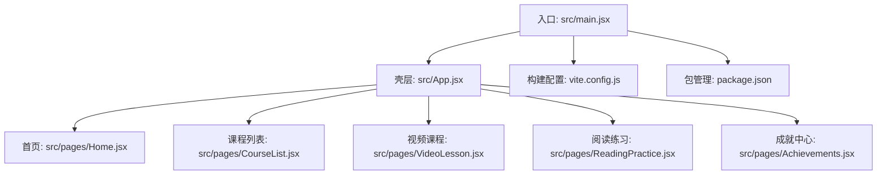
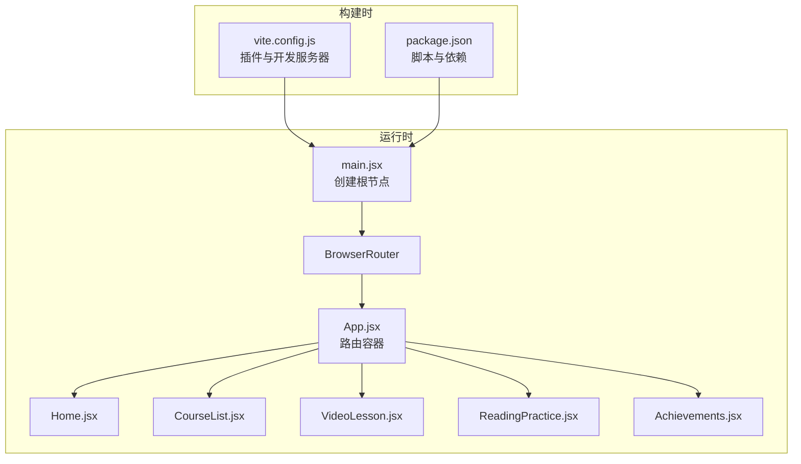
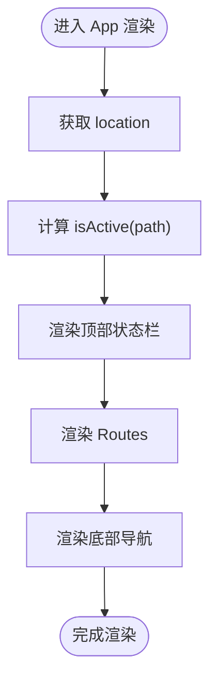
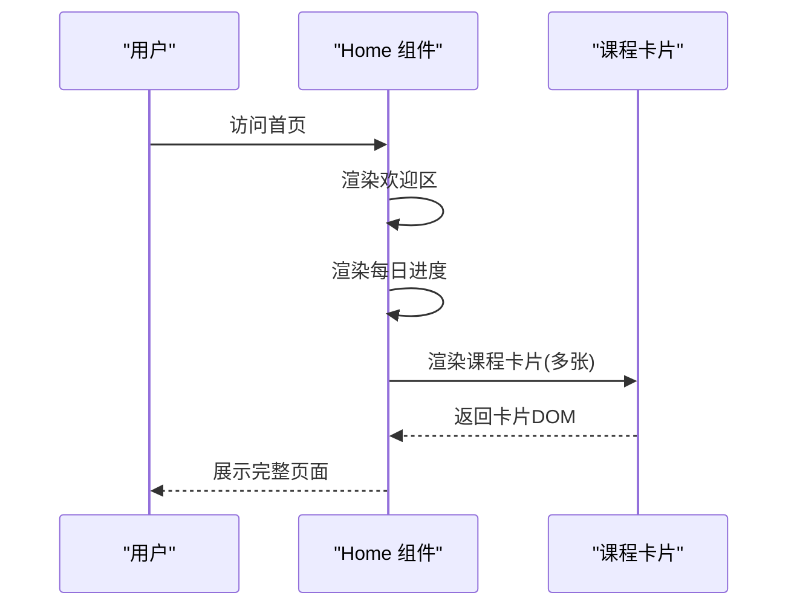
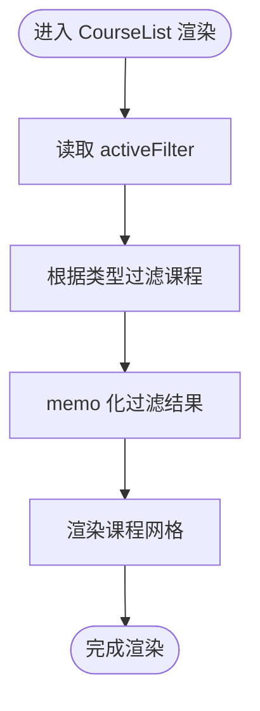
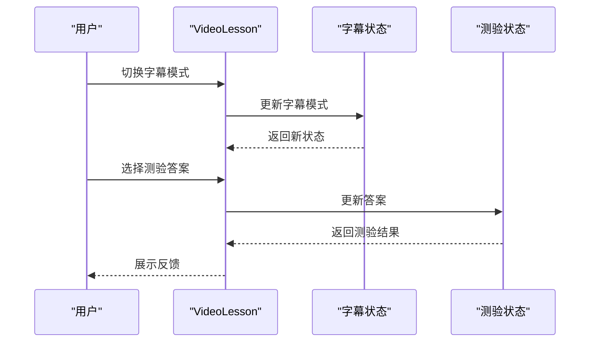
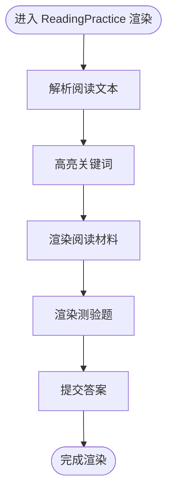
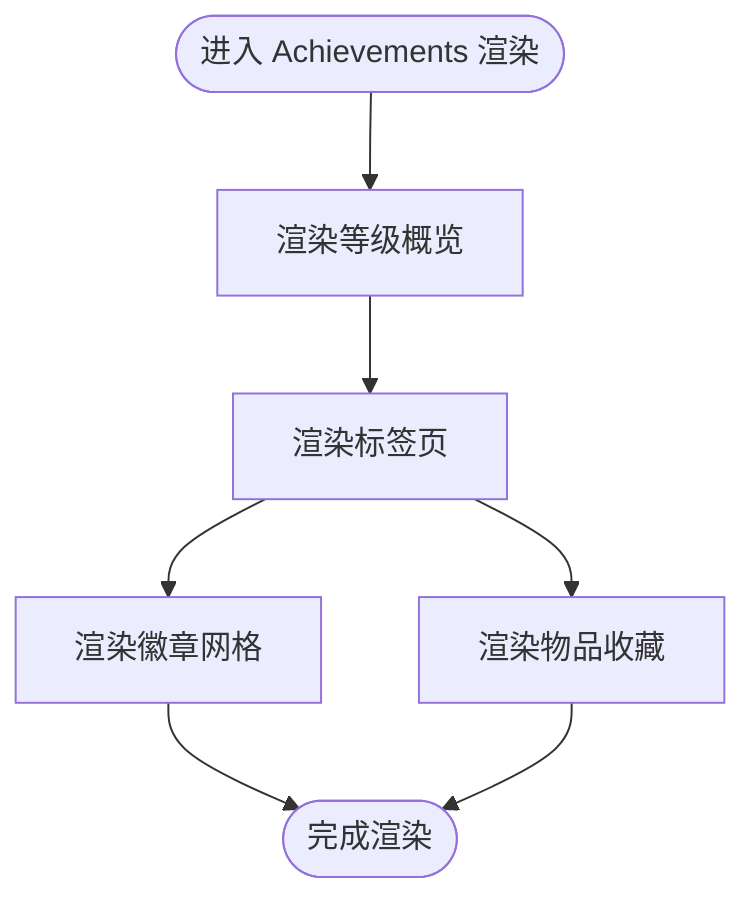
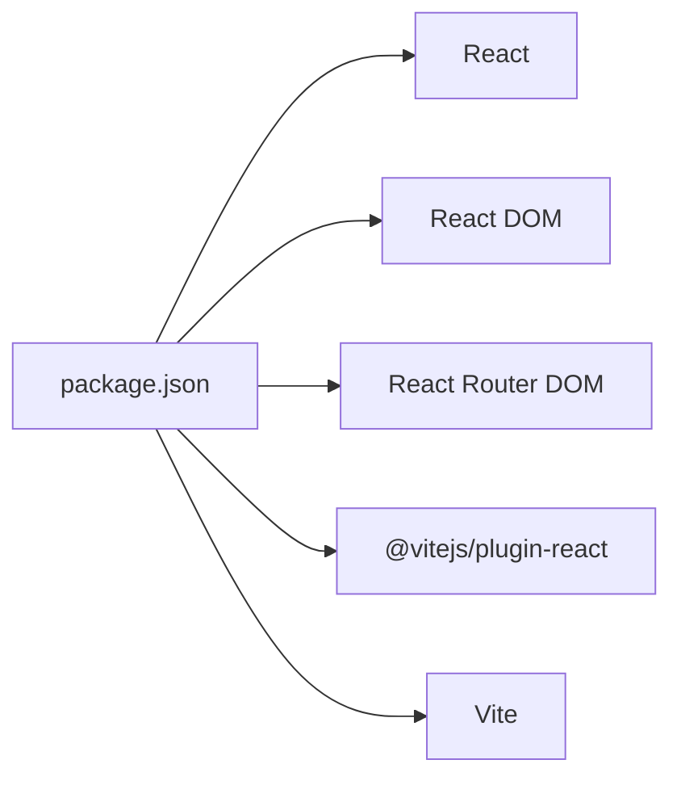

# 性能优化与调试

<cite>
**本文档引用的文件**
- [package.json](file://package.json)
- [vite.config.js](file://vite.config.js)
- [src/main.jsx](file://src/main.jsx)
- [src/App.jsx](file://src/App.jsx)
- [src/pages/Home.jsx](file://src/pages/Home.jsx)
- [src/pages/CourseList.jsx](file://src/pages/CourseList.jsx)
- [src/pages/VideoLesson.jsx](file://src/pages/VideoLesson.jsx)
- [src/pages/ReadingPractice.jsx](file://src/pages/ReadingPractice.jsx)
- [src/pages/Achievements.jsx](file://src/pages/Achievements.jsx)
</cite>

## 目录
1. [简介](#简介)
2. [项目结构](#项目结构)
3. [核心组件](#核心组件)
4. [架构概览](#架构概览)
5. [详细组件分析](#详细组件分析)
6. [依赖分析](#依赖分析)
7. [性能考虑](#性能考虑)
8. [故障排除指南](#故障排除指南)
9. [结论](#结论)
10. [附录](#附录)

## 简介
本指南面向React Vite项目的性能优化与调试，结合现有代码库，系统阐述以下主题：
- React应用性能监控、瓶颈识别与优化策略
- React DevTools使用方法、性能分析工具与内存泄漏检测技巧
- 代码分割、懒加载与Bundle优化实践
- 具体优化案例：组件渲染优化、事件处理优化、资源加载优化
- Vite构建工具的性能配置、Tree Shaking与压缩策略
- 调试技巧、错误追踪与性能指标监控
- 实际性能测试工具使用与基准测试实施方法

## 项目结构
该项目采用Vite作为构建工具，基于React 18与React Router DOM组织页面路由。项目结构清晰，页面组件按功能模块划分，便于进行性能分析与优化。

**图表来源**
- [src/main.jsx:1-14](file://src/main.jsx#L1-L14)
- [src/App.jsx:1-112](file://src/App.jsx#L1-L112)
- [src/pages/Home.jsx:1-293](file://src/pages/Home.jsx#L1-L293)
- [src/pages/CourseList.jsx:1-314](file://src/pages/CourseList.jsx#L1-L314)
- [src/pages/VideoLesson.jsx:1-288](file://src/pages/VideoLesson.jsx#L1-L288)
- [src/pages/ReadingPractice.jsx:1-293](file://src/pages/ReadingPractice.jsx#L1-L293)
- [src/pages/Achievements.jsx:1-297](file://src/pages/Achievements.jsx#L1-L297)
- [vite.config.js:1-11](file://vite.config.js#L1-L11)
- [package.json:1-22](file://package.json#L1-L22)

**章节来源**
- [src/main.jsx:1-14](file://src/main.jsx#L1-L14)
- [src/App.jsx:1-112](file://src/App.jsx#L1-L112)
- [vite.config.js:1-11](file://vite.config.js#L1-L11)
- [package.json:1-22](file://package.json#L1-L22)

## 核心组件
- 应用壳层（App）：负责导航、路由与全局状态（如位置状态），是性能监控的关键节点。
- 页面组件：Home、CourseList、VideoLesson、ReadingPractice、Achievements，承担不同业务场景的渲染与交互。
- 构建配置：Vite配置插件与开发服务器设置，影响打包体积与运行时性能。

优化要点：
- 将昂贵计算与副作用移出渲染路径，避免在渲染期间创建新对象或执行重任务。
- 使用React Router的懒加载与代码分割，减少首屏加载体积。
- 合理使用CSS变量与内联样式，避免重复渲染导致的样式抖动。

**章节来源**
- [src/App.jsx:47-112](file://src/App.jsx#L47-L112)
- [src/pages/Home.jsx:48-293](file://src/pages/Home.jsx#L48-L293)
- [src/pages/CourseList.jsx:163-314](file://src/pages/CourseList.jsx#L163-L314)
- [src/pages/VideoLesson.jsx:20-288](file://src/pages/VideoLesson.jsx#L20-L288)
- [src/pages/ReadingPractice.jsx:45-293](file://src/pages/ReadingPractice.jsx#L45-L293)
- [src/pages/Achievements.jsx:113-297](file://src/pages/Achievements.jsx#L113-L297)

## 架构概览
React应用通过BrowserRouter包裹，App作为路由容器，各页面组件在Routes中按路径渲染。页面内部通过本地状态驱动UI更新，部分组件包含交互式元素（按钮、输入框、链接等）。

**图表来源**
- [src/main.jsx:1-14](file://src/main.jsx#L1-L14)
- [src/App.jsx:1-112](file://src/App.jsx#L1-L112)
- [src/pages/Home.jsx:1-293](file://src/pages/Home.jsx#L1-L293)
- [src/pages/CourseList.jsx:1-314](file://src/pages/CourseList.jsx#L1-L314)
- [src/pages/VideoLesson.jsx:1-288](file://src/pages/VideoLesson.jsx#L1-L288)
- [src/pages/ReadingPractice.jsx:1-293](file://src/pages/ReadingPractice.jsx#L1-L293)
- [src/pages/Achievements.jsx:1-297](file://src/pages/Achievements.jsx#L1-L297)
- [vite.config.js:1-11](file://vite.config.js#L1-L11)
- [package.json:1-22](file://package.json#L1-L22)

## 详细组件分析

### 组件A：App（路由与导航）
- 职责：定义导航图标、路由表与当前激活状态判断；承载顶部状态栏与底部导航。
- 性能关注点：
  - isActive函数用于判断激活状态，应避免在渲染中频繁创建新函数。
  - 导航项中的SVG图标为纯展示，建议缓存或使用memo化组件。
  - Routes在App顶层，确保子组件懒加载后仍能正确匹配路径。

优化建议：
- 将isActive逻辑抽取为稳定函数，或使用useCallback包装。
- 对导航图标组件进行memo化，减少不必要的重渲染。

**图表来源**
- [src/App.jsx:47-112](file://src/App.jsx#L47-L112)

**章节来源**
- [src/App.jsx:47-112](file://src/App.jsx#L47-L112)

### 组件B：Home（首页）
- 职责：欢迎语、每日进度、推荐课程卡片、最近成就预览。
- 性能关注点：
  - 推荐课程网格使用两列布局，课程卡片包含多个SVG像素图，渲染量较大。
  - 每日进度条与徽章渲染较为简单，但整体布局复杂度较高。

优化建议：
- 将课程卡片内容拆分为更小的可复用组件，并对昂贵的SVG渲染进行memo化。
- 使用虚拟滚动（如react-window）处理长列表渲染。
- 避免在渲染中进行复杂的字符串拼接或正则替换。

**图表来源**
- [src/pages/Home.jsx:48-293](file://src/pages/Home.jsx#L48-L293)

**章节来源**
- [src/pages/Home.jsx:48-293](file://src/pages/Home.jsx#L48-L293)

### 组件C：CourseList（课程列表）
- 职责：课程过滤、筛选器、课程网格与进度显示。
- 性能关注点：
  - 过滤逻辑在渲染中执行，若课程数据量大，可能成为瓶颈。
  - 课程网格为响应式两列布局，SVG缩略图较多。

优化建议：
- 将过滤逻辑移至useMemo或离线计算，避免每次渲染都重新过滤。
- 将SVG缩略图组件memo化，减少重复渲染。
- 对课程卡片的点击事件绑定进行节流或防抖。

**图表来源**
- [src/pages/CourseList.jsx:163-314](file://src/pages/CourseList.jsx#L163-L314)

**章节来源**
- [src/pages/CourseList.jsx:163-314](file://src/pages/CourseList.jsx#L163-L314)

### 组件D：VideoLesson（视频课程）
- 职责：视频播放模拟、字幕切换、分段时间轴、听力测验。
- 性能关注点：
  - 字幕切换与测验答案选择涉及状态更新，需避免在渲染中产生副作用。
  - 时间轴列表包含多个交互项，需要关注点击事件的性能。

优化建议：
- 将字幕切换与测验答案选择的状态更新封装为受控组件，避免未提交状态导致的重渲染。
- 对时间轴列表使用虚拟化或分页加载。
- 将高亮词汇点击事件进行防抖处理。

**图表来源**
- [src/pages/VideoLesson.jsx:20-288](file://src/pages/VideoLesson.jsx#L20-L288)

**章节来源**
- [src/pages/VideoLesson.jsx:20-288](file://src/pages/VideoLesson.jsx#L20-L288)

### 组件E：ReadingPractice（阅读练习）
- 职责：阅读材料、词汇表、问答测验、答案提交。
- 性能关注点：
  - 阅读材料中对词汇进行高亮与保存操作，涉及字符串处理与状态更新。
  - 测验题型多样（单选、判断、填空），需要统一的状态管理。

优化建议：
- 将词汇高亮逻辑抽取为纯函数并在渲染前计算，避免在渲染中进行复杂字符串处理。
- 使用统一的答案提交流程，减少重复渲染。
- 对填空题的答案输入进行防抖处理。

**图表来源**
- [src/pages/ReadingPractice.jsx:45-293](file://src/pages/ReadingPractice.jsx#L45-L293)

**章节来源**
- [src/pages/ReadingPractice.jsx:45-293](file://src/pages/ReadingPractice.jsx#L45-L293)

### 组件F：Achievements（成就中心）
- 职责：等级概览、成就徽章、物品收藏。
- 性能关注点：
  - 成就徽章网格与物品收藏网格均为响应式布局，包含大量SVG像素图。
  - Tab切换与进度条渲染较为频繁。

优化建议：
- 将SVG徽章组件memo化，减少重复渲染。
- 对Tab切换使用条件渲染，避免同时渲染两个面板。
- 使用CSS动画替代JavaScript动画，提升流畅度。

**图表来源**
- [src/pages/Achievements.jsx:113-297](file://src/pages/Achievements.jsx#L113-L297)

**章节来源**
- [src/pages/Achievements.jsx:113-297](file://src/pages/Achievements.jsx#L113-L297)

## 依赖分析
- 运行时依赖：React、React DOM、React Router DOM
- 开发时依赖：@vitejs/plugin-react、vite
- 脚本命令：dev、build、preview、dev:design

优化建议：
- 在生产构建中启用Tree Shaking与压缩，减少bundle体积。
- 使用动态导入实现代码分割，按需加载大型组件。

**图表来源**
- [package.json:1-22](file://package.json#L1-L22)

**章节来源**
- [package.json:1-22](file://package.json#L1-L22)

## 性能考虑
- 渲染优化
  - 使用React.memo与useMemo缓存昂贵计算与子组件。
  - 避免在渲染期间创建新对象或函数，使用useCallback与useMemo。
  - 对长列表使用虚拟滚动或分页加载。
- 事件处理优化
  - 将事件处理器绑定到稳定的引用上，避免重复渲染。
  - 对高频事件（如输入、滚动）进行防抖或节流。
- 资源加载优化
  - 使用动态导入实现代码分割，减少首屏加载体积。
  - 将静态资源（如SVG像素图）进行压缩与缓存。
- 构建优化
  - Vite默认开启Tree Shaking，确保未使用的导出被移除。
  - 生产构建启用压缩与最小化，减少传输体积。

## 故障排除指南
- 内存泄漏检测
  - 使用React DevTools Profiler记录渲染性能，识别异常高频更新。
  - 检查事件监听器是否正确清理，避免闭包持有旧状态。
- 错误追踪
  - 使用React Error Boundary捕获组件树内的错误，防止应用崩溃。
  - 在开发环境中启用严格模式，提前发现潜在问题。
- 性能指标监控
  - 使用浏览器性能面板记录长任务与布局抖动。
  - 监控关键渲染路径（FCP/LCP/FID）与交互延迟。

**章节来源**
- [src/main.jsx:7-13](file://src/main.jsx#L7-L13)

## 结论
通过对React Vite项目的深入分析，我们明确了性能优化的关键切入点：渲染路径优化、事件处理优化、资源加载优化与构建优化。结合React DevTools与浏览器性能工具，可以有效定位瓶颈并实施针对性优化。建议在后续迭代中持续监控性能指标，建立自动化基准测试流程，确保用户体验的持续提升。

## 附录
- React DevTools使用建议
  - Profiler：记录渲染次数与耗时，识别热点组件。
  - Components：查看组件树与props/state，定位异常更新。
- Vite构建配置建议
  - 启用压缩与最小化，确保Tree Shaking生效。
  - 使用动态导入实现代码分割，按需加载大型模块。
- 基准测试实施
  - 使用WebPageTest或Lighthouse进行端到端性能评估。
  - 建立CI流水线中的性能回归检测，设定阈值告警。