# 数据管理系统

<cite>
**本文档引用的文件**
- [package.json](file://package.json)
- [vite.config.js](file://vite.config.js)
- [src/lib/supabase.js](file://src/lib/supabase.js)
- [src/lib/courses.js](file://src/lib/courses.js)
- [src/lib/quests.js](file://src/lib/quests.js)
- [src/lib/rewards.js](file://src/lib/rewards.js)
- [src/lib/validation.js](file://src/lib/validation.js)
- [src/pages/CourseList.jsx](file://src/pages/CourseList.jsx)
- [src/App.jsx](file://src/App.jsx)
- [supabase-migration/03_courses_schema.sql](file://supabase-migration/03_courses_schema.sql)
- [supabase-migration/run-all.sh](file://supabase-migration/run-all.sh)
- [course-data/_skill-import.json](file://course-data/_skill-import.json)
- [scripts/generate-courses-v2.mjs](file://scripts/generate-courses-v2.mjs)
- [course-data/vocab-word-freq.json](file://course-data/vocab-word-freq.json)
</cite>

## 目录
1. [项目概述](#项目概述)
2. [项目结构](#项目结构)
3. [核心组件](#核心组件)
4. [架构概览](#架构概览)
5. [详细组件分析](#详细组件分析)
6. [依赖关系分析](#依赖关系分析)
7. [性能考虑](#性能考虑)
8. [故障排除指南](#故障排除指南)
9. [结论](#结论)

## 项目概述

CraftWords 是一个基于 React 和 Supabase 的 Minecraft 主题英语学习数据管理系统。该系统通过精心设计的数据结构和用户友好的界面，为学习者提供沉浸式的英语学习体验。

### 系统特性

- **多课程类型支持**：支持听力、阅读和词汇三种学习模式
- **进度跟踪系统**：实时记录用户学习进度和成就
- **Minecraft 主题化设计**：像素风格界面，融入 Minecraft 元素
- **离线缓存支持**：通过 PWA 技术实现离线访问
- **响应式设计**：适配各种设备屏幕尺寸

## 项目结构

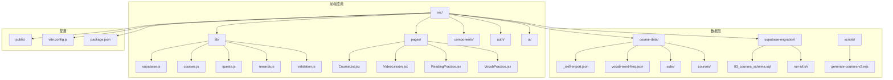

**图表来源**
- [src/lib/supabase.js:1-31](file://src/lib/supabase.js#L1-L31)
- [src/lib/courses.js:1-328](file://src/lib/courses.js#L1-L328)
- [src/pages/CourseList.jsx:1-584](file://src/pages/CourseList.jsx#L1-L584)

**章节来源**
- [package.json:1-24](file://package.json#L1-L24)
- [vite.config.js:1-70](file://vite.config.js#L1-L70)

## 核心组件

### 数据访问层

系统采用统一的数据访问层设计，所有数据库操作都通过专门的模块进行封装：

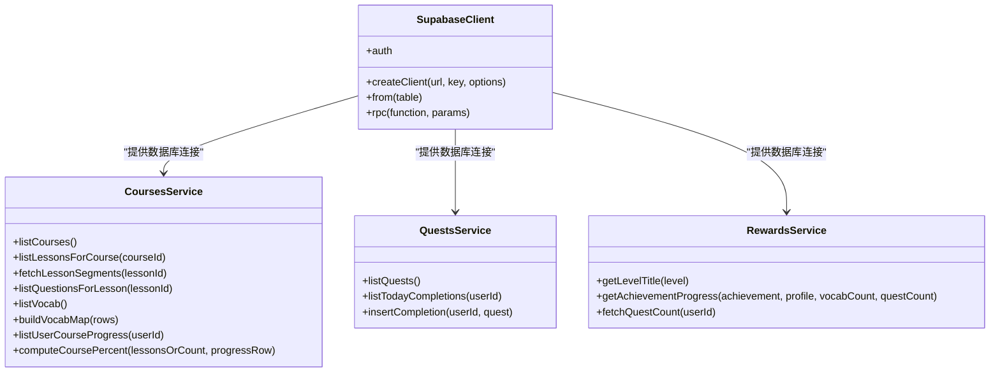

**图表来源**
- [src/lib/supabase.js:1-31](file://src/lib/supabase.js#L1-L31)
- [src/lib/courses.js:1-328](file://src/lib/courses.js#L1-L328)
- [src/lib/quests.js:1-54](file://src/lib/quests.js#L1-L54)
- [src/lib/rewards.js:1-101](file://src/lib/rewards.js#L1-L101)

### 用户界面组件

系统采用模块化的组件架构，每个页面都有明确的职责分工：

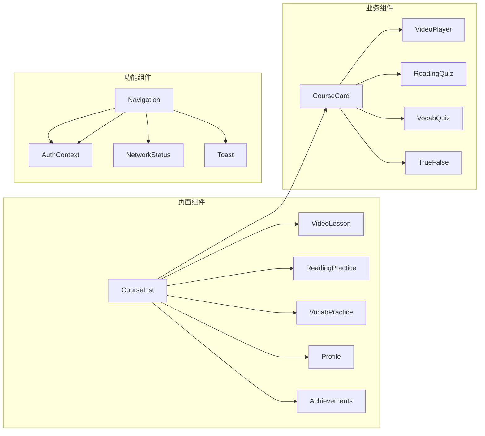

**图表来源**
- [src/pages/CourseList.jsx:334-584](file://src/pages/CourseList.jsx#L334-L584)
- [src/App.jsx:92-311](file://src/App.jsx#L92-L311)

**章节来源**
- [src/lib/courses.js:1-328](file://src/lib/courses.js#L1-L328)
- [src/lib/quests.js:1-54](file://src/lib/quests.js#L1-L54)
- [src/lib/rewards.js:1-101](file://src/lib/rewards.js#L1-L101)

## 架构概览

系统采用前后端分离架构，前端使用 React + Vite，后端使用 Supabase：

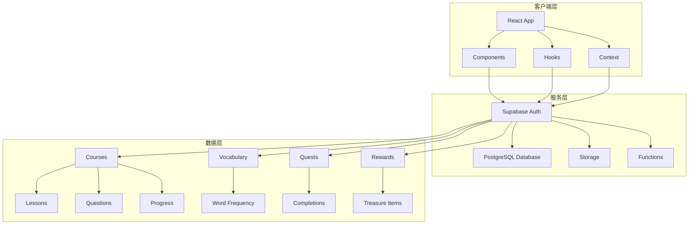

**图表来源**
- [src/lib/supabase.js:1-31](file://src/lib/supabase.js#L1-L31)
- [supabase-migration/03_courses_schema.sql:1-300](file://supabase-migration/03_courses_schema.sql#L1-L300)

### 数据流处理

系统实现了完整的数据生命周期管理：

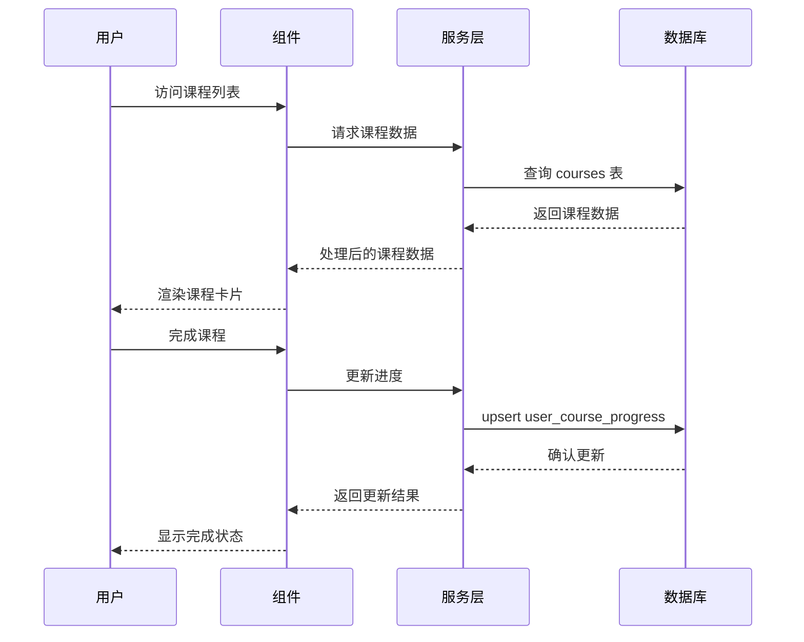

**图表来源**
- [src/lib/courses.js:174-205](file://src/lib/courses.js#L174-L205)
- [src/lib/courses.js:111-119](file://src/lib/courses.js#L111-L119)

## 详细组件分析

### 课程管理系统

课程系统是整个数据管理的核心，负责管理所有学习内容：

#### 课程数据模型

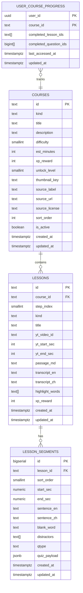

**图表来源**
- [supabase-migration/03_courses_schema.sql:17-36](file://supabase-migration/03_courses_schema.sql#L17-L36)
- [supabase-migration/03_courses_schema.sql:57-77](file://supabase-migration/03_courses_schema.sql#L57-L77)
- [supabase-migration/03_courses_schema.sql:192-210](file://supabase-migration/03_courses_schema.sql#L192-L210)
- [supabase-migration/03_courses_schema.sql:151-159](file://supabase-migration/03_courses_schema.sql#L151-L159)

#### 课程数据处理流程

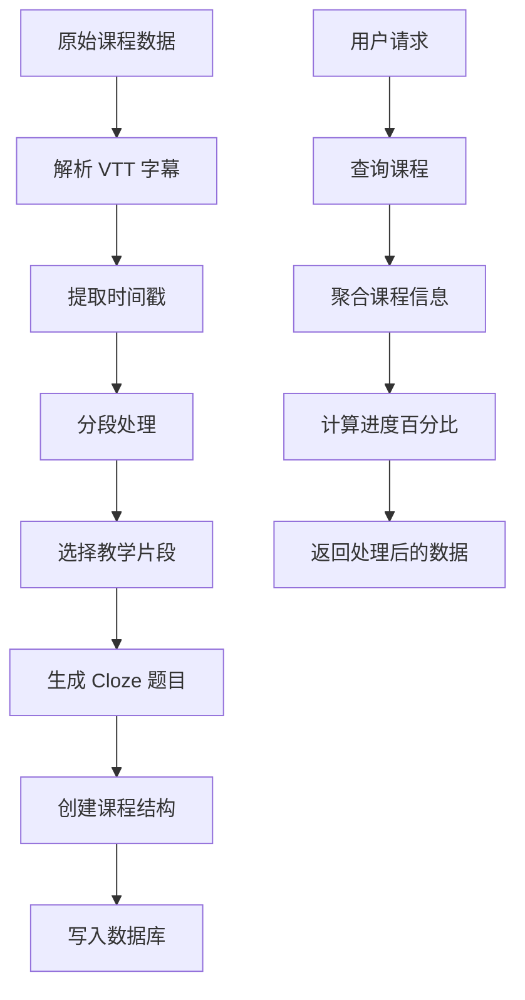

**图表来源**
- [scripts/generate-courses-v2.mjs:489-574](file://scripts/generate-courses-v2.mjs#L489-L574)
- [src/lib/courses.js:10-36](file://src/lib/courses.js#L10-L36)

**章节来源**
- [src/lib/courses.js:1-328](file://src/lib/courses.js#L1-L328)
- [scripts/generate-courses-v2.mjs:1-616](file://scripts/generate-courses-v2.mjs#L1-L616)

### 用户进度追踪系统

系统实现了完善的用户进度追踪机制：

#### 进度数据模型

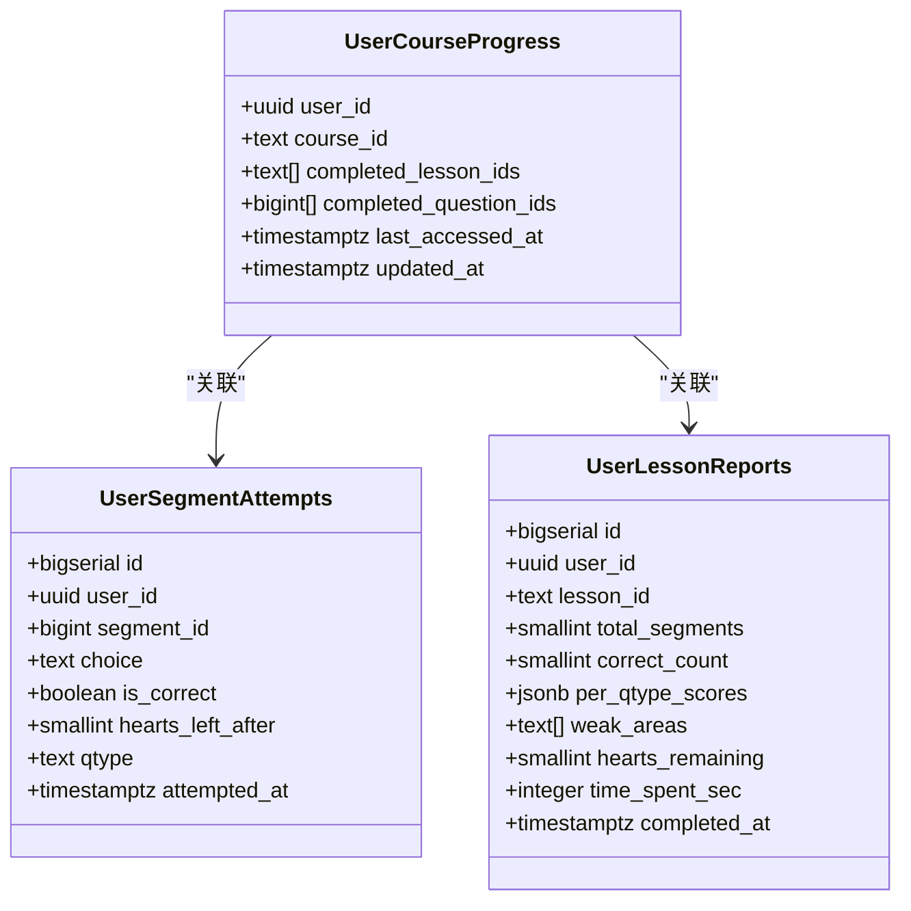

**图表来源**
- [supabase-migration/03_courses_schema.sql:151-159](file://supabase-migration/03_courses_schema.sql#L151-L159)
- [supabase-migration/03_courses_schema.sql:238-247](file://supabase-migration/03_courses_schema.sql#L238-L247)
- [supabase-migration/03_courses_schema.sql:271-282](file://supabase-migration/03_courses_schema.sql#L271-L282)

#### 进度更新流程

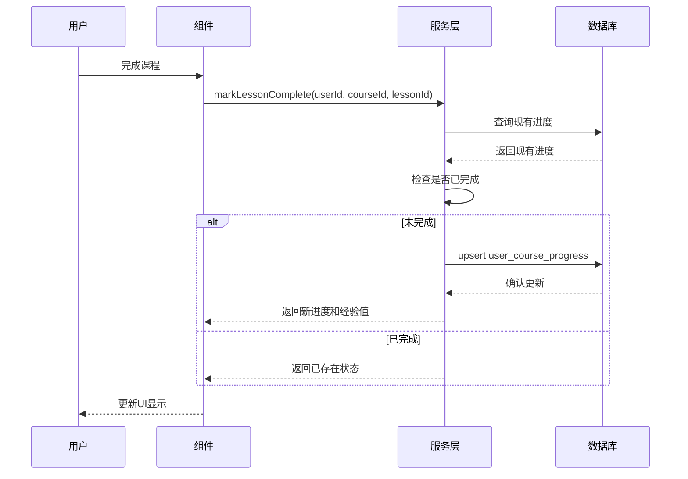

**图表来源**
- [src/lib/courses.js:174-205](file://src/lib/courses.js#L174-L205)

**章节来源**
- [src/lib/courses.js:111-275](file://src/lib/courses.js#L111-L275)

### 成就和奖励系统

系统集成了成就系统和奖励机制：

#### 奖励数据结构

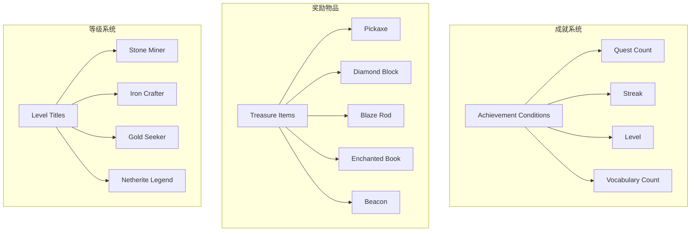

**图表来源**
- [src/lib/rewards.js:6-18](file://src/lib/rewards.js#L6-L18)
- [src/lib/rewards.js:66-81](file://src/lib/rewards.js#L66-L81)

**章节来源**
- [src/lib/rewards.js:1-101](file://src/lib/rewards.js#L1-L101)

### 词汇管理系统

系统提供了强大的词汇学习功能：

#### 词汇数据处理

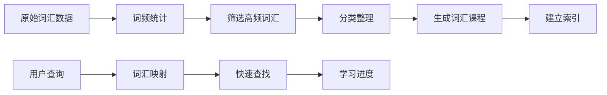

**图表来源**
- [course-data/vocab-word-freq.json:1-800](file://course-data/vocab-word-freq.json#L1-L800)
- [src/lib/courses.js:88-105](file://src/lib/courses.js#L88-L105)

**章节来源**
- [course-data/vocab-word-freq.json:1-800](file://course-data/vocab-word-freq.json#L1-L800)
- [src/lib/courses.js:88-105](file://src/lib/courses.js#L88-L105)

## 依赖关系分析

### 外部依赖

系统使用了现代化的前端技术栈：

```mermaid
graph TB
subgraph "核心依赖"
A[React 18.2.0] --> B[用户界面]
C[React Router DOM] --> D[路由管理]
E[@supabase/supabase-js] --> F[数据库访问]
end
subgraph "开发工具"
G[@vitejs/plugin-react] --> H[Vite 构建]
I[vite-plugin-pwa] --> J[PWA 支持]
end
subgraph "Supabase 功能"
K[Auth] --> L[用户认证]
M[PostgreSQL] --> N[数据存储]
O[Storage] --> P[文件存储]
Q[Functions] --> R[服务器函数]
end
```

**图表来源**
- [package.json:12-22](file://package.json#L12-L22)
- [src/lib/supabase.js:1-31](file://src/lib/supabase.js#L1-L31)

### 内部模块依赖

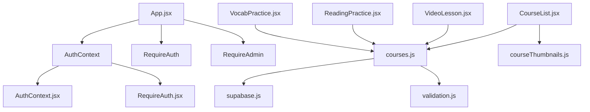

**图表来源**
- [src/App.jsx:1-311](file://src/App.jsx#L1-L311)
- [src/pages/CourseList.jsx:1-584](file://src/pages/CourseList.jsx#L1-L584)
- [src/lib/courses.js:1-328](file://src/lib/courses.js#L1-L328)

**章节来源**
- [package.json:1-24](file://package.json#L1-L24)
- [src/App.jsx:1-311](file://src/App.jsx#L1-L311)

## 性能考虑

### 缓存策略

系统采用了多层次的缓存机制：

1. **浏览器缓存**：通过 PWA 技术实现离线缓存
2. **数据库查询优化**：使用索引和适当的查询策略
3. **组件级缓存**：React 组件的状态缓存

### 数据加载优化

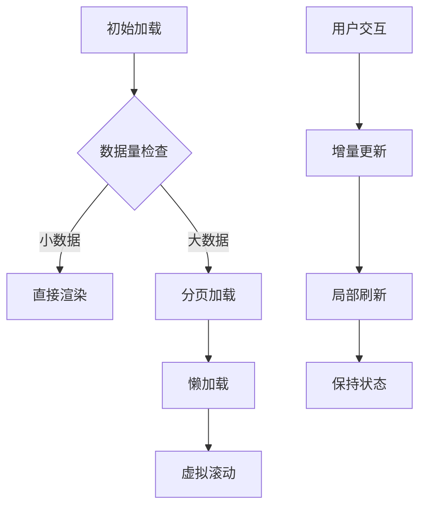

### 性能监控

系统集成了网络状态监控和错误处理机制，确保用户体验的稳定性。

## 故障排除指南

### 常见问题及解决方案

#### 数据库连接问题

**症状**：应用无法连接到数据库或出现连接超时

**解决方案**：
1. 检查环境变量配置
2. 验证 Supabase 凭据
3. 确认网络连接

#### 用户认证问题

**症状**：用户登录失败或会话异常

**解决方案**：
1. 检查浏览器的 Cookie 设置
2. 清除浏览器缓存
3. 验证用户账户状态

#### 数据同步问题

**症状**：用户进度不同步或显示异常

**解决方案**：
1. 强制刷新页面
2. 检查网络连接
3. 重新登录系统

**章节来源**
- [src/lib/supabase.js:6-12](file://src/lib/supabase.js#L6-L12)
- [src/lib/courses.js:264-275](file://src/lib/courses.js#L264-L275)

## 结论

CraftWords 数据管理系统展现了现代 Web 应用的最佳实践：

### 技术优势

1. **模块化设计**：清晰的组件分离和职责划分
2. **数据驱动**：以数据为核心的设计理念
3. **用户体验**：注重学习体验和界面友好性
4. **可扩展性**：良好的架构支持未来功能扩展

### 架构特点

- **前后端分离**：清晰的技术栈分离
- **数据一致性**：通过 Supabase 实现数据一致性
- **安全性**：完善的用户认证和授权机制
- **性能优化**：多层缓存和优化策略

### 发展方向

系统具备良好的扩展基础，可以进一步增强：
- 更丰富的学习内容
- 更智能的学习推荐
- 更完善的社交功能
- 更丰富的数据分析

该系统为构建教育类应用提供了优秀的参考模板，其设计理念和技术实现值得借鉴和学习。