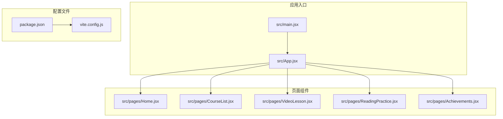
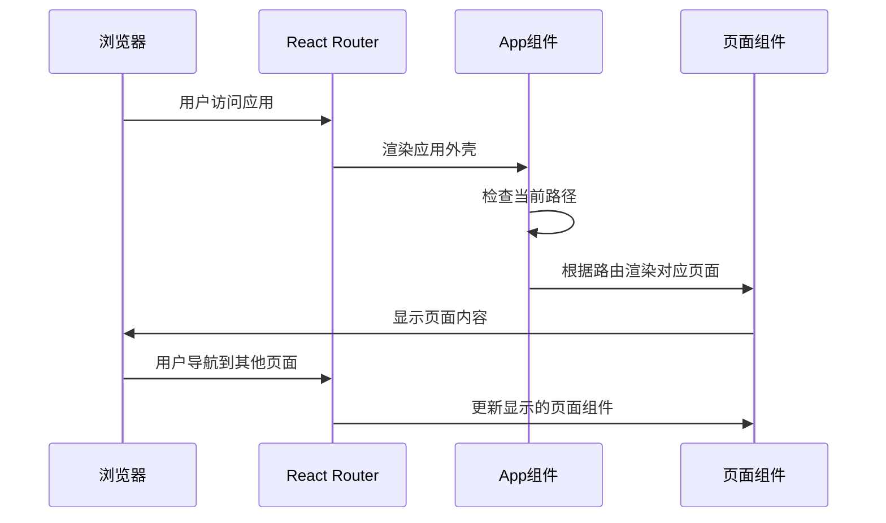
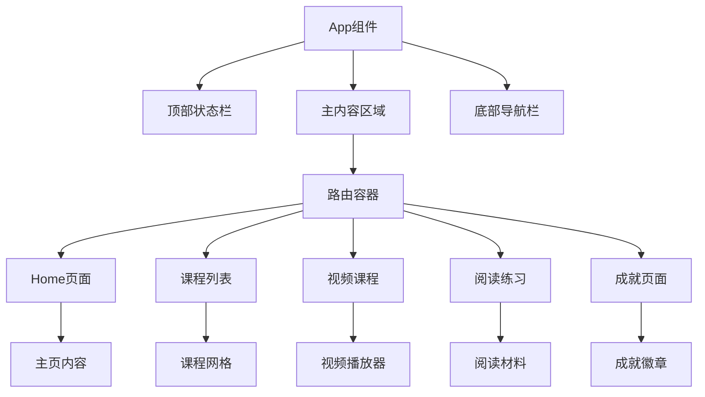
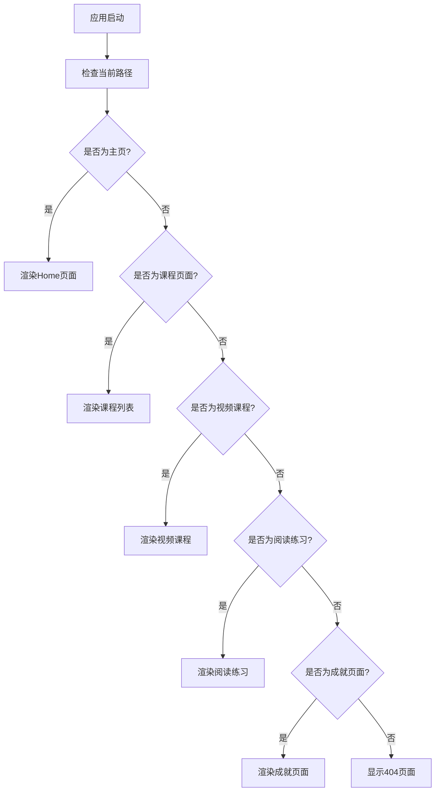
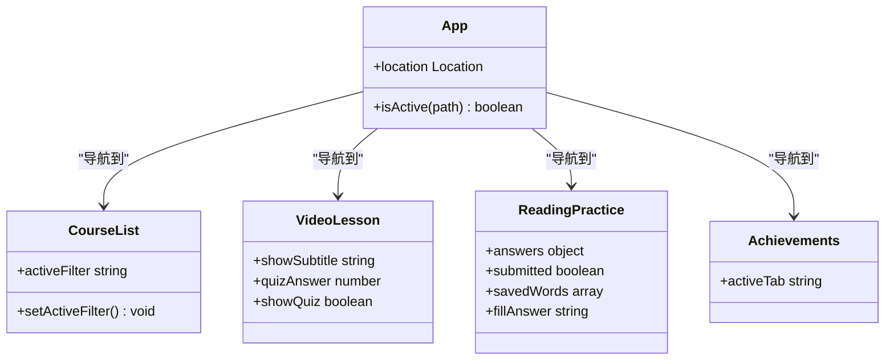

# 测试与调试策略

<cite>
**本文档引用的文件**
- [package.json](file://package.json)
- [vite.config.js](file://vite.config.js)
- [src/main.jsx](file://src/main.jsx)
- [src/App.jsx](file://src/App.jsx)
- [src/pages/Home.jsx](file://src/pages/Home.jsx)
- [src/pages/CourseList.jsx](file://src/pages/CourseList.jsx)
- [src/pages/VideoLesson.jsx](file://src/pages/VideoLesson.jsx)
- [src/pages/ReadingPractice.jsx](file://src/pages/ReadingPractice.jsx)
- [src/pages/Achievements.jsx](file://src/pages/Achievements.jsx)
</cite>

## 目录
1. [简介](#简介)
2. [项目结构](#项目结构)
3. [核心组件](#核心组件)
4. [架构概览](#架构概览)
5. [详细组件分析](#详细组件分析)
6. [依赖关系分析](#依赖关系分析)
7. [性能考虑](#性能考虑)
8. [故障排除指南](#故障排除指南)
9. [结论](#结论)

## 简介

本指南为基于 React 和 Vite 的 Minecraft 英语学习应用提供全面的测试与调试策略。该应用采用 React 18、React Router DOM 进行路由管理，并通过 Vite 提供开发服务器和构建功能。应用包含主页、课程列表、视频课程、阅读练习和成就展示等页面，具有像素风格的视觉设计和交互式学习体验。

## 项目结构

该项目采用典型的 React 单页应用结构，主要文件组织如下：



**图表来源**
- [src/main.jsx:1-14](file://src/main.jsx#L1-L14)
- [src/App.jsx:1-112](file://src/App.jsx#L1-L112)
- [package.json:1-22](file://package.json#L1-L22)
- [vite.config.js:1-11](file://vite.config.js#L1-L11)

**章节来源**
- [package.json:1-22](file://package.json#L1-L22)
- [vite.config.js:1-11](file://vite.config.js#L1-L11)
- [src/main.jsx:1-14](file://src/main.jsx#L1-L14)

## 核心组件

### 应用外壳组件 (App)
应用的核心外壳组件负责整体布局、导航和路由管理。该组件实现了以下关键功能：

- **状态管理**: 使用 `useLocation` 获取当前路由状态
- **导航系统**: 实现底部导航栏，支持活动状态高亮
- **路由配置**: 定义所有页面路由和对应的组件映射
- **样式系统**: 集成 CSS 变量和主题色彩系统

### 页面组件架构
应用包含五个主要页面组件，每个都具有特定的学习功能：

- **Home 页面**: 学习进度概览、每日任务和快捷入口
- **CourseList 页面**: 课程筛选、进度跟踪和解锁机制
- **VideoLesson 页面**: 视频播放器、字幕切换和听力练习
- **ReadingPractice 页面**: 阅读理解、词汇学习和答题系统
- **Achievements 页面**: 成就徽章、经验值统计和物品收集

**章节来源**
- [src/App.jsx:47-112](file://src/App.jsx#L47-L112)
- [src/pages/Home.jsx:48-293](file://src/pages/Home.jsx#L48-L293)
- [src/pages/CourseList.jsx:163-314](file://src/pages/CourseList.jsx#L163-L314)

## 架构概览

应用采用客户端路由架构，所有页面在单页应用中动态加载和渲染：



**图表来源**
- [src/main.jsx:7-12](file://src/main.jsx#L7-L12)
- [src/App.jsx:85-92](file://src/App.jsx#L85-L92)

### 组件层次结构



**图表来源**
- [src/App.jsx:56-110](file://src/App.jsx#L56-L110)
- [src/pages/Home.jsx:49-292](file://src/pages/Home.jsx#L49-L292)

## 详细组件分析

### 路由系统实现

应用使用 React Router DOM 实现客户端路由，支持嵌套路由和条件渲染：



**图表来源**
- [src/App.jsx:85-92](file://src/App.jsx#L85-L92)

### 状态管理系统

应用采用 React 内置的状态管理机制，通过 useState Hook 管理组件状态：



**图表来源**
- [src/App.jsx:48-53](file://src/App.jsx#L48-L53)
- [src/pages/CourseList.jsx:164-171](file://src/pages/CourseList.jsx#L164-L171)
- [src/pages/VideoLesson.jsx:21-24](file://src/pages/VideoLesson.jsx#L21-L24)
- [src/pages/ReadingPractice.jsx:46-49](file://src/pages/ReadingPractice.jsx#L46-L49)
- [src/pages/Achievements.jsx:114-114](file://src/pages/Achievements.jsx#L114-L114)

**章节来源**
- [src/App.jsx:47-112](file://src/App.jsx#L47-L112)
- [src/pages/CourseList.jsx:163-314](file://src/pages/CourseList.jsx#L163-L314)
- [src/pages/VideoLesson.jsx:20-288](file://src/pages/VideoLesson.jsx#L20-L288)
- [src/pages/ReadingPractice.jsx:45-293](file://src/pages/ReadingPractice.jsx#L45-L293)
- [src/pages/Achievements.jsx:113-297](file://src/pages/Achievements.jsx#L113-L297)

## 依赖关系分析

### 核心依赖关系

```mermaid
graph LR
subgraph "运行时依赖"
REACT[react ^18.2.0]
REACTDOM[react-dom ^18.2.0]
ROUTER[react-router-dom ^6.20.0]
end
subgraph "开发依赖"
VITE[vite ^5.0.0]
REACT_PLUGIN[@vitejs/plugin-react ^4.2.0]
end
subgraph "应用代码"
MAIN[src/main.jsx]
APP[src/App.jsx]
PAGES[页面组件]
end
REACT --> REACTDOM
REACT --> ROUTER
VITE --> REACT_PLUGIN
MAIN --> APP
APP --> PAGES
```

**图表来源**
- [package.json:12-20](file://package.json#L12-L20)
- [src/main.jsx:1-4](file://src/main.jsx#L1-L4)

### 开发服务器配置

Vite 配置提供了本地开发环境的优化设置：

- **主机配置**: 绑定到 127.0.0.1:5173
- **插件系统**: 集成 React 插件进行 JSX 转换
- **热重载**: 支持快速开发迭代

**章节来源**
- [package.json:12-20](file://package.json#L12-L20)
- [vite.config.js:4-10](file://vite.config.js#L4-L10)

## 性能考虑

### 渲染性能优化

1. **组件拆分**: 将大型组件拆分为更小的可复用组件
2. **状态局部化**: 将状态管理限制在需要的组件范围内
3. **条件渲染**: 使用条件渲染避免不必要的组件更新
4. **CSS 变量**: 利用 CSS 变量减少样式计算开销

### 资源优化策略

1. **图片资源**: 使用 SVG 图标和像素艺术，减少文件大小
2. **懒加载**: 对于大型组件可以考虑实现懒加载
3. **缓存策略**: 利用浏览器缓存机制提升重复访问速度

## 故障排除指南

### 常见问题诊断

#### 组件渲染问题
**症状**: 组件不显示或显示空白
**诊断步骤**:
1. 检查路由配置是否正确
2. 验证组件导入路径
3. 确认组件导出格式
4. 检查控制台错误信息

**解决方案**:
- 确保所有组件都有正确的默认导出
- 验证路由路径与组件映射关系
- 检查 CSS 类名拼写错误

#### 状态更新异常
**症状**: 点击按钮无响应或状态未更新
**诊断步骤**:
1. 检查 useState Hook 的使用
2. 验证事件处理器绑定
3. 确认状态更新函数调用
4. 检查组件重新渲染逻辑

**解决方案**:
- 确保状态更新函数正确传递给事件处理器
- 验证状态更新的幂等性
- 检查条件渲染逻辑中的状态依赖

#### 路由跳转错误
**症状**: 导航链接无法正常跳转
**诊断步骤**:
1. 检查 Link 组件的 to 属性
2. 验证路由配置
3. 确认路由参数传递
4. 检查路由守卫逻辑

**解决方案**:
- 确保 Link 组件的 to 属性指向正确的路由
- 验证路由配置中的路径匹配规则
- 检查动态路由参数的正确性

### 调试工具使用技巧

#### 浏览器开发者工具
1. **Elements 面板**: 检查 DOM 结构和样式应用
2. **Console 面板**: 查看 JavaScript 错误和警告
3. **Network 面板**: 监控资源加载和网络请求
4. **Performance 面板**: 分析应用性能瓶颈

#### React DevTools
1. **Components 面板**: 查看组件树结构和状态
2. **Profiler 面板**: 分析组件渲染性能
3. **Hooks 面板**: 检查 Hook 状态和更新频率

#### 网络请求监控
1. **请求拦截**: 使用浏览器开发者工具拦截 API 请求
2. **响应分析**: 检查请求响应时间和数据格式
3. **缓存验证**: 确认缓存策略的有效性

**章节来源**
- [src/main.jsx:7-12](file://src/main.jsx#L7-L12)
- [src/App.jsx:96-108](file://src/App.jsx#L96-L108)

## 结论

本测试与调试策略指南为 Minecraft 英语学习应用提供了全面的质量保证方法。通过合理的组件架构设计、完善的路由系统和有效的状态管理，应用能够提供流畅的学习体验。

建议在实际开发中重点关注以下方面：
1. **组件测试**: 为关键组件编写单元测试，确保功能正确性
2. **集成测试**: 测试组件间的交互和数据流
3. **端到端测试**: 验证完整的用户学习流程
4. **性能监控**: 持续监控应用性能指标
5. **用户体验**: 关注用户交互反馈和学习效果

通过实施这些测试策略和调试方法，可以确保应用的稳定性、可维护性和优秀的用户体验。