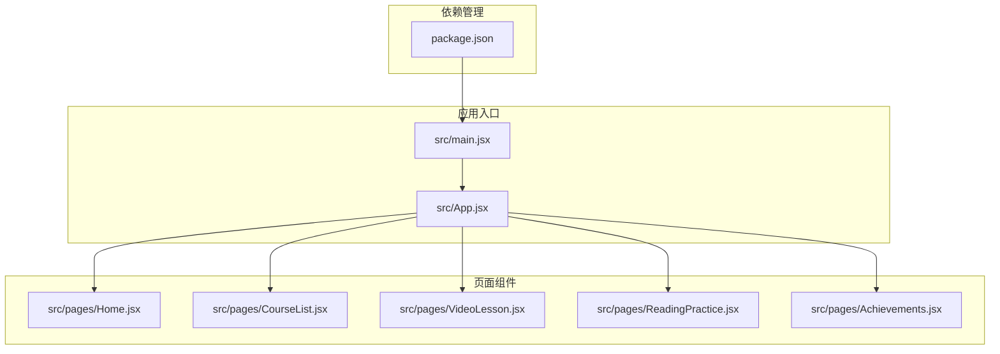
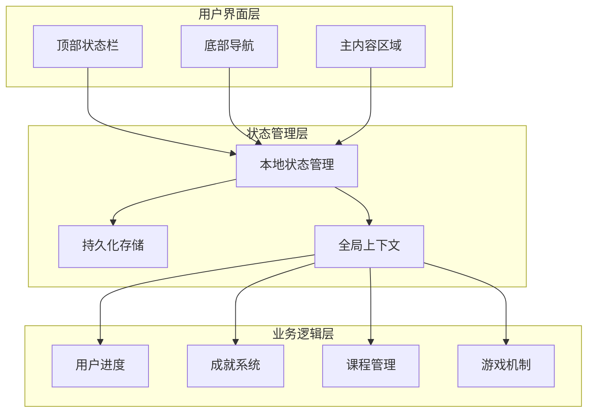
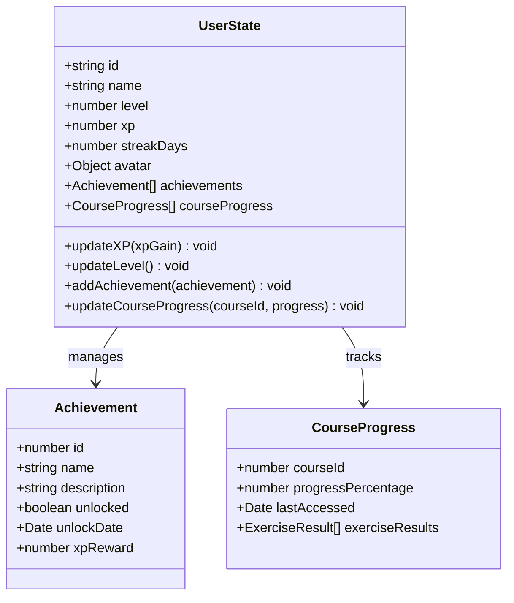
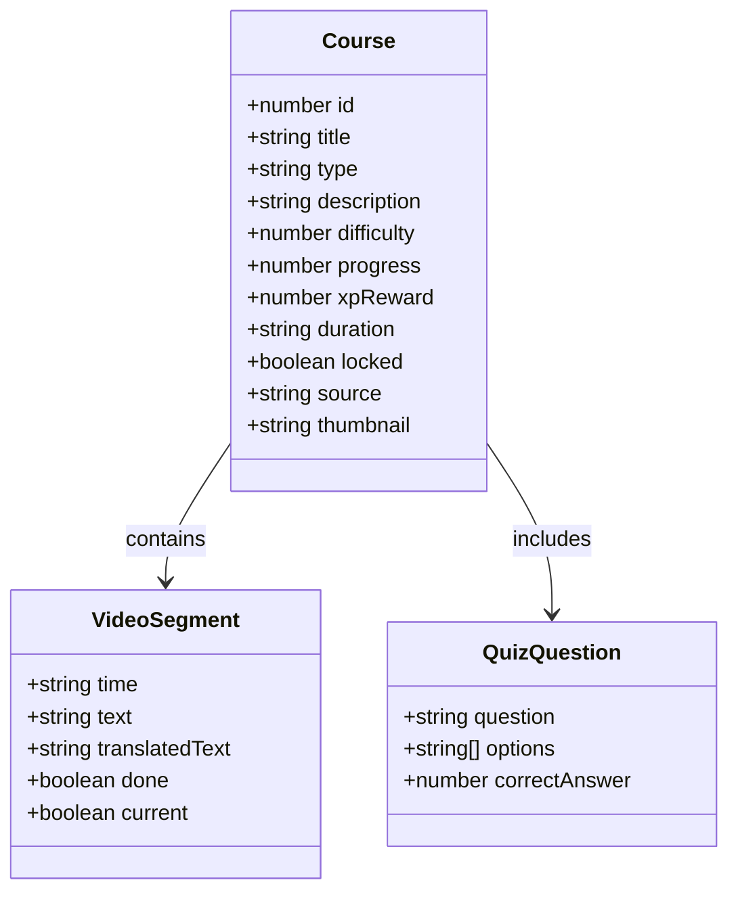
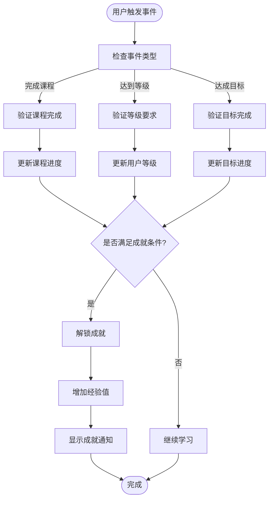
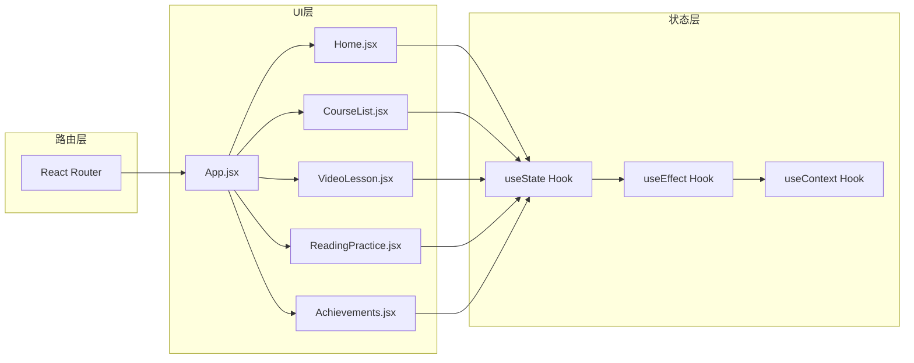

# 状态管理策略

<cite>
**本文档引用的文件**
- [App.jsx](file://src/App.jsx)
- [main.jsx](file://src/main.jsx)
- [Home.jsx](file://src/pages/Home.jsx)
- [Achievements.jsx](file://src/pages/Achievements.jsx)
- [CourseList.jsx](file://src/pages/CourseList.jsx)
- [VideoLesson.jsx](file://src/pages/VideoLesson.jsx)
- [ReadingPractice.jsx](file://src/pages/ReadingPractice.jsx)
- [package.json](file://package.json)
</cite>

## 目录
1. [引言](#引言)
2. [项目结构](#项目结构)
3. [核心组件](#核心组件)
4. [架构概览](#架构概览)
5. [详细组件分析](#详细组件分析)
6. [依赖关系分析](#依赖关系分析)
7. [性能考虑](#性能考虑)
8. [故障排除指南](#故障排除指南)
9. [结论](#结论)

## 引言

本指南专注于在React应用中实现有效的状态管理策略，特别针对教育类应用中的用户状态、学习进度和游戏化数据管理。该应用采用Minecraft主题设计，包含用户头像、经验值系统、成就徽章、课程进度跟踪等功能。

## 项目结构

该项目采用基于功能的模块组织方式，主要文件结构如下：

**图表来源**
- [main.jsx:1-14](file://src/main.jsx#L1-L14)
- [App.jsx:1-112](file://src/App.jsx#L1-L112)

**章节来源**
- [main.jsx:1-14](file://src/main.jsx#L1-L14)
- [package.json:1-22](file://package.json#L1-L22)

## 核心组件

### 应用壳层组件

App.jsx作为应用的主要容器，负责：
- 路由配置和导航管理
- 顶部状态栏显示用户信息
- 底部导航栏集成
- 全局样式和主题设置

### 页面级组件

各页面组件采用独立的状态管理模式：

**Home页面** - 展示用户概览和推荐内容
**CourseList页面** - 课程浏览和筛选功能
**VideoLesson页面** - 视频播放和测验功能
**ReadingPractice页面** - 阅读理解和词汇练习
**Achievements页面** - 成就系统和进度追踪

**章节来源**
- [App.jsx:47-112](file://src/App.jsx#L47-L112)
- [Home.jsx:48-293](file://src/pages/Home.jsx#L48-L293)
- [CourseList.jsx:163-314](file://src/pages/CourseList.jsx#L163-L314)

## 架构概览

应用采用单页应用(SPA)架构，通过React Router实现客户端路由：

**图表来源**
- [App.jsx:85-112](file://src/App.jsx#L85-L112)
- [main.jsx:7-13](file://src/main.jsx#L7-L13)

## 详细组件分析

### 用户状态管理系统

#### 用户信息状态结构

**图表来源**
- [Achievements.jsx:3-12](file://src/pages/Achievements.jsx#L3-L12)
- [Home.jsx:116-126](file://src/pages/Home.jsx#L116-L126)

#### 状态提升模式

在应用中，状态提升主要体现在：
- 用户级别和经验数据在App.jsx中集中管理
- 课程进度状态在CourseList.jsx中管理
- 个人成就状态在Achievements.jsx中管理

### 课程进度管理系统

#### 课程数据结构

**图表来源**
- [CourseList.jsx:4-61](file://src/pages/CourseList.jsx#L4-L61)
- [VideoLesson.jsx:4-18](file://src/pages/VideoLesson.jsx#L4-L18)

#### 进度跟踪机制

课程进度采用以下策略：
- 本地状态跟踪：使用useState管理当前选中课程
- 进度百分比计算：基于完成的视频片段数量
- 锁定状态管理：根据用户级别控制课程解锁

### 成就系统设计

#### 成就数据模型

**图表来源**
- [Achievements.jsx:3-12](file://src/pages/Achievements.jsx#L3-L12)
- [Achievements.jsx:206-249](file://src/pages/Achievements.jsx#L206-L249)

### 游戏化元素实现

#### 经验值系统

经验值系统采用渐进式增长：
- 基础经验值：每完成一个课程获得固定XP
- 连续登录奖励：每日登录额外获得XP
- 成就解锁奖励：特殊成就提供大量XP
- 课程难度系数：高级课程获得更多XP

#### 徽章收集系统

徽章系统包含三种类型：
- **基础徽章**：完成特定任务解锁
- **稀有徽章**：需要较高难度才能解锁
- **隐藏徽章**：特殊的隐藏条件解锁

**章节来源**
- [Achievements.jsx:14-23](file://src/pages/Achievements.jsx#L14-L23)
- [Home.jsx:267-288](file://src/pages/Home.jsx#L267-L288)

## 依赖关系分析

### 核心依赖

应用的核心依赖包括：
- **React 18.2.0**：前端框架基础
- **React Router DOM 6.20.0**：客户端路由管理
- **Vite 5.0.0**：构建工具和开发服务器

### 组件间依赖关系

**图表来源**
- [package.json:12-16](file://package.json#L12-L16)
- [main.jsx:1-14](file://src/main.jsx#L1-L14)

**章节来源**
- [package.json:1-22](file://package.json#L1-L22)
- [main.jsx:1-14](file://src/main.jsx#L1-L14)

## 性能考虑

### 状态优化策略

1. **状态分割**：将大型状态对象分割为更小的局部状态
2. **记忆化**：对昂贵的计算结果进行缓存
3. **批量更新**：避免频繁的状态更新导致的重渲染
4. **虚拟化**：对于长列表使用虚拟化技术

### 渲染性能优化

- 使用React.memo防止不必要的子组件重渲染
- 合理使用key属性优化列表渲染
- 避免在渲染过程中进行重型计算
- 使用懒加载技术延迟非关键资源的加载

## 故障排除指南

### 常见状态管理问题

#### 状态不一致问题

**症状**：用户看到过期或不正确的数据
**解决方案**：
- 确保状态更新的原子性
- 使用Reducer模式处理复杂状态逻辑
- 实施状态同步机制

#### 内存泄漏问题

**症状**：应用运行时间越长内存占用越大
**解决方案**：
- 在useEffect中清理副作用
- 及时清理定时器和事件监听器
- 使用弱引用避免循环引用

#### 异步状态更新问题

**症状**：异步操作完成后状态未更新
**解决方案**：
- 使用Promise链处理异步操作
- 实现适当的错误边界
- 添加加载状态指示

**章节来源**
- [VideoLesson.jsx:20-24](file://src/pages/VideoLesson.jsx#L20-L24)
- [ReadingPractice.jsx:46-59](file://src/pages/ReadingPractice.jsx#L46-L59)

## 结论

本指南展示了在教育类React应用中实现有效状态管理的最佳实践。通过合理使用useState、useEffect和useContext，结合状态提升和组件解耦策略，可以构建出高性能、可维护的学习管理系统。

关键要点包括：
- 明确的状态层次结构和职责分离
- 游戏化元素与学习进度的有机结合
- 持久化存储与实时状态的平衡
- 性能优化和用户体验的统一考虑

这些策略不仅适用于当前的应用，也可以扩展到其他类型的教育和培训应用中。