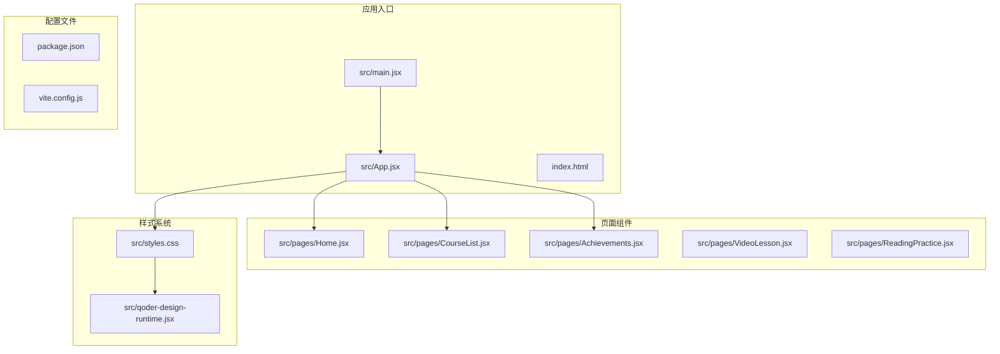
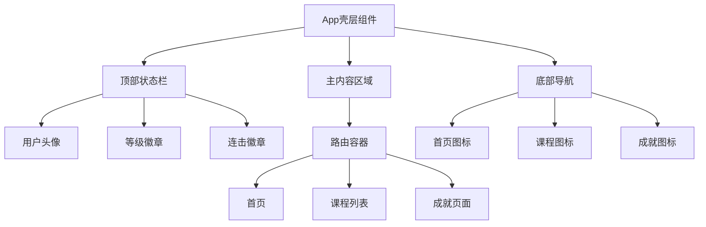
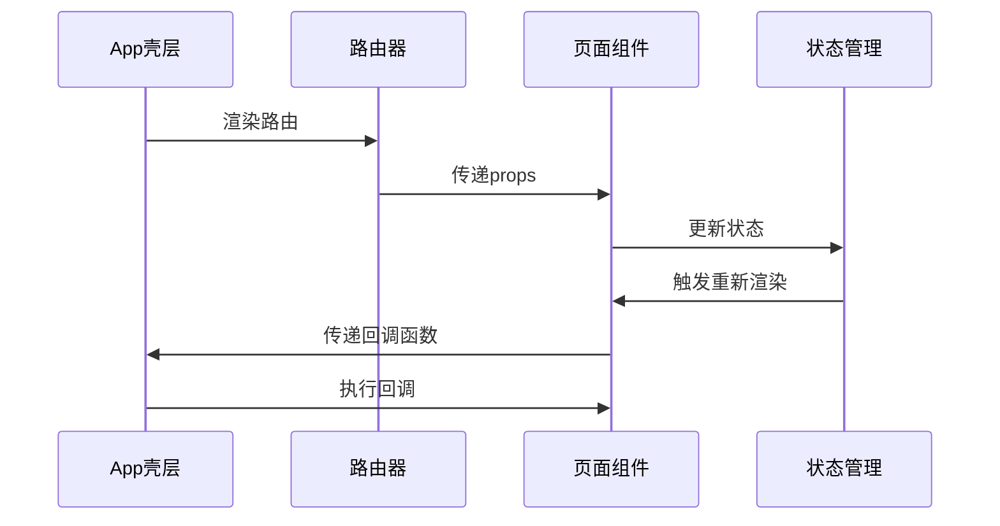
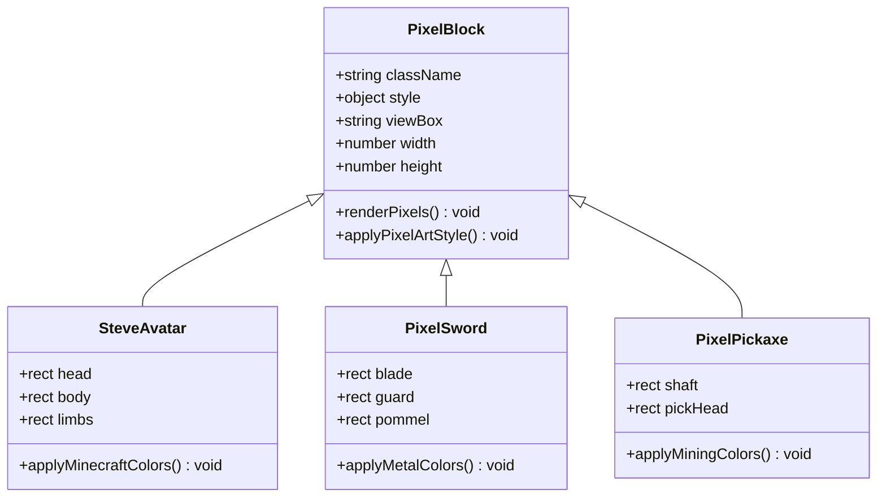
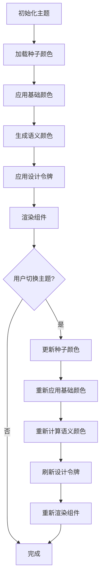
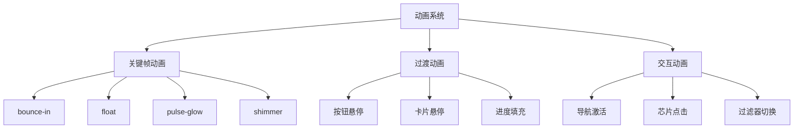

# UI组件开发

<cite>
**本文档引用的文件**
- [App.jsx](file://src/App.jsx)
- [main.jsx](file://src/main.jsx)
- [styles.css](file://src/styles.css)
- [Home.jsx](file://src/pages/Home.jsx)
- [CourseList.jsx](file://src/pages/CourseList.jsx)
- [Achievements.jsx](file://src/pages/Achievements.jsx)
- [index.html](file://index.html)
- [package.json](file://package.json)
- [vite.config.js](file://vite.config.js)
- [qoder-design-runtime.jsx](file://src/qoder-design-runtime.jsx)
</cite>

## 目录
1. [项目概述](#项目概述)
2. [项目结构](#项目结构)
3. [核心组件架构](#核心组件架构)
4. [像素艺术组件系统](#像素艺术组件系统)
5. [设计令牌与主题系统](#设计令牌与主题系统)
6. [组件类型详解](#组件类型详解)
7. [动画与交互系统](#动画与交互系统)
8. [可访问性与兼容性](#可访问性与兼容性)
9. [性能优化策略](#性能优化策略)
10. [最佳实践指南](#最佳实践指南)
11. [故障排除](#故障排除)
12. [总结](#总结)

## 项目概述

CraftWords是一个基于Minecraft主题的英语学习应用，采用React + Vite技术栈构建。项目专注于创建像素艺术风格的UI组件，为用户提供沉浸式的学习体验。

### 技术特性
- **像素艺术风格**：完全基于SVG像素块构建的视觉系统
- **响应式设计**：适配桌面端和移动端设备
- **主题化设计**：基于CSS变量的完整主题系统
- **组件化架构**：模块化的React组件设计
- **无障碍支持**：符合WCAG标准的可访问性设计

## 项目结构



**图表来源**
- [main.jsx:1-14](file://src/main.jsx#L1-L14)
- [App.jsx:47-112](file://src/App.jsx#L47-L112)

**章节来源**
- [main.jsx:1-14](file://src/main.jsx#L1-L14)
- [index.html:1-20](file://index.html#L1-L20)
- [package.json:1-22](file://package.json#L1-L22)

## 核心组件架构

### 应用壳层结构

应用采用分层架构设计，包含顶部状态栏、主内容区域和底部导航三个主要部分：



**图表来源**
- [App.jsx:56-110](file://src/App.jsx#L56-L110)

### 组件通信模式

项目采用props传递和状态提升的设计模式：



**图表来源**
- [App.jsx:47-112](file://src/App.jsx#L47-L112)
- [CourseList.jsx:163-314](file://src/pages/CourseList.jsx#L163-L314)

**章节来源**
- [App.jsx:47-112](file://src/App.jsx#L47-L112)

## 像素艺术组件系统

### SVG像素块基础

所有像素艺术组件都基于统一的SVG像素块系统，通过`pixel-block`类名实现像素化渲染：



**图表来源**
- [App.jsx:31-45](file://src/App.jsx#L31-L45)
- [Home.jsx:4-29](file://src/pages/Home.jsx#L4-L29)

### 像素艺术组件库

#### 头像组件
```javascript
// SteveAvatar - Minecraft风格头像
const SteveAvatar = (props) => (
  <svg width="28" height="28" viewBox="0 0 16 16" className={["pixel-block", props.className].filter(Boolean).join(" ")}>
    <rect x="3" y="0" width="10" height="4" fill="#6B4226"/>
    <rect x="2" y="4" width="12" height="4" fill="#C69C6D"/>
    // ... 更多像素块
  </svg>
)
```

#### 装饰性像素块
```javascript
// PixelSword - 剑武器装饰
const PixelSword = (props) => (
  <svg width="32" height="32" viewBox="0 0 16 16" className="pixel-block">
    <rect x="13" y="0" width="2" height="2" fill="#A0A0A0"/>
    <rect x="11" y="2" width="2" height="2" fill="#A0A0A0"/>
    // ... 剑身像素块
  </svg>
)

// PixelPickaxe - 挖掘工具装饰
const PixelPickaxe = (props) => (
  <svg width="32" height="32" viewBox="0 0 16 16" className="pixel-block">
    <rect x="10" y="0" width="2" height="2" fill="#4FC3F7"/>
    <rect x="12" y="0" width="2" height="2" fill="#4FC37"/>
    // ... 工具头部像素块
  </svg>
)
```

**章节来源**
- [App.jsx:31-45](file://src/App.jsx#L31-L45)
- [Home.jsx:4-29](file://src/pages/Home.jsx#L4-L29)

## 设计令牌与主题系统

### CSS变量系统

项目采用完整的CSS变量设计令牌系统，支持主题切换和样式定制：

```mermaid
graph LR
subgraph "种子令牌"
seed_bg[--seed-bg: #F8F8F0]
seed_fg[--seed-fg: #5C4A2E]
seed_primary[--seed-primary: #4CAF50]
seed_accent[--seed-accent: #FFAB00]
seed_surface[--seed-surface: #F7F3DF]
seed_radius[--seed-radius: 20px]
end
subgraph "基础颜色令牌"
base_colors[--color-* 变量]
base_colors --> cream[--color-cream: var(--seed-bg)]
base_colors --> surface[--color-surface: var(--seed-surface)]
base_colors --> title[--color-title: var(--seed-fg)]
end
subgraph "语义颜色令牌"
semantic_colors[--color-* 语义色]
semantic_colors --> grass[--color-grass: var(--seed-primary)]
semantic_colors --> gold[--color-gold: var(--seed-accent)]
semantic_colors --> success[--color-success: #6FBA2C]
end
subgraph "设计令牌"
design_tokens[--design-tokens]
design_tokens --> spacing[--space-* 间距]
design_tokens --> radius[--radius-* 圆角]
design_tokens --> typography[--font-* 字体]
design_tokens --> motion[--motion-* 动画]
end
seed_bg --> base_colors
seed_fg --> base_colors
seed_primary --> semantic_colors
seed_accent --> semantic_colors
seed_surface --> base_colors
seed_radius --> radius
```

**图表来源**
- [styles.css:7-87](file://src/styles.css#L7-L87)

### 主题切换机制



**图表来源**
- [styles.css:7-87](file://src/styles.css#L7-L87)

**章节来源**
- [styles.css:7-87](file://src/styles.css#L7-L87)

## 组件类型详解

### 按钮组件系统

#### 主要按钮变体
```css
/* 主要按钮 - 绿色草地方向按钮 */
.btn-primary {
    height: 48px;
    padding: 0 28px;
    font-size: 16px;
    background: var(--color-grass);
    color: white;
    border-radius: var(--radius-pill);
    box-shadow: var(--shadow-button);
}

/* 次要按钮 - 灰色表面按钮 */
.btn-secondary {
    height: 44px;
    padding: 0 20px;
    font-size: 14px;
    background: var(--color-surface);
    color: var(--color-title);
    border-radius: var(--radius-pill);
    border: 2px solid var(--color-disabled);
    box-shadow: 0 3px 0 0 var(--color-disabled);
}

/* 小按钮 - 紧凑型按钮 */
.btn-small {
    height: 36px;
    padding: 0 16px;
    font-size: 13px;
    background: var(--color-grass);
    color: white;
    border-radius: var(--radius-pill);
    box-shadow: 0 3px 0 0 var(--color-grass-active);
}
```

#### 按钮交互状态
```css
.btn-primary:hover { transform: translateY(-1px); box-shadow: var(--shadow-button-hover); }
.btn-primary:active { transform: translateY(2px); box-shadow: var(--shadow-button-active); }

.btn-secondary:hover { 
    border-color: var(--color-grass);
    transform: translateY(-1px);
    box-shadow: 0 4px 0 0 var(--color-disabled);
}
```

**章节来源**
- [styles.css:267-340](file://src/styles.css#L267-L340)

### 徽章组件系统

#### 等级徽章
```css
.level-badge {
    display: flex;
    align-items: center;
    gap: var(--space-sm);
    background: var(--color-grass-wash);
    padding: 6px 14px;
    border-radius: var(--radius-pill);
    font-weight: 700;
    font-size: 14px;
    color: var(--color-grass-active);
}

.xp-bar-mini {
    width: 80px;
    height: 8px;
    background: var(--color-surface-soft);
    border-radius: 4px;
    overflow: hidden;
}

.xp-bar-mini-fill {
    height: 100%;
    background: var(--color-grass);
    border-radius: 4px;
    transition: width var(--motion-base) var(--motion-ease);
}
```

#### 成就徽章
```css
.badge-card {
    display: flex;
    align-items: center;
    gap: var(--space-md);
    position: relative;
    overflow: hidden;
}

.badge-icon {
    width: 52px;
    height: 52px;
    border-radius: 50%;
    background: badge.color;
    display: flex;
    align-items: center;
    justify-content: center;
    flex-shrink: 0;
    box-shadow: `0 3px 0 0 color-mix(in srgb, ${badge.color} 80%, black 20%)`;
}
```

**章节来源**
- [App.jsx:190-215](file://src/App.jsx#L190-L215)
- [Achievements.jsx:206-249](file://src/pages/Achievements.jsx#L206-L249)

### 进度条组件系统

#### 主进度条
```css
.progress-bar {
    width: 100%;
    height: 12px;
    background: var(--color-surface-soft);
    border-radius: 6px;
    overflow: hidden;
    position: relative;
}

.progress-fill {
    height: 100%;
    border-radius: 6px;
    transition: width var(--motion-slow) var(--motion-ease);
    position: relative;
}

.progress-fill::after {
    content: '';
    position: absolute;
    top: 0;
    left: 0;
    right: 0;
    height: 50%;
    background: rgba(255,255,255,0.3);
    border-radius: 6px 6px 0 0;
}
```

#### 课程进度条
```javascript
// 课程卡片中的进度条
<div className="progress-bar" style={{ height: 6 }}>
    <div className="progress-fill" style={{
        width: `${course.progress}%`,
        background: course.progress === 100 ? 'var(--color-success)' : 'var(--color-grass)'
    }}/>
</div>
```

**章节来源**
- [styles.css:361-388](file://src/styles.css#L361-L388)
- [CourseList.jsx:258-267](file://src/pages/CourseList.jsx#L258-L267)

### 卡片组件系统

#### 标准卡片
```css
.card {
    background: var(--color-surface);
    border-radius: var(--radius-lg);
    padding: var(--space-lg);
    box-shadow: var(--shadow-card);
    transition: all var(--motion-base) var(--motion-ease);
}

.card:hover {
    transform: translateY(-3px);
    box-shadow: var(--shadow-card-hover);
}
```

#### 平面卡片
```css
.card-flat {
    background: var(--color-surface);
    border-radius: var(--radius-lg);
    padding: var(--space-lg);
}
```

**章节来源**
- [styles.css:341-360](file://src/styles.css#L341-L360)

## 动画与交互系统

### CSS动画系统

项目实现了完整的CSS动画系统，包含多种预定义动画效果：



**图表来源**
- [styles.css:457-499](file://src/styles.css#L457-L499)

### 动画实现细节

#### 弹跳进入动画
```css
@keyframes bounce-in {
    0% { transform: scale(0.8); opacity: 0; }
    60% { transform: scale(1.05); }
    100% { transform: scale(1); opacity: 1; }
}

.animate-bounce-in {
    animation: bounce-in 0.4s var(--motion-ease) forwards;
}
```

#### 浮动动画
```css
@keyframes float {
    0%, 100% { transform: translateY(0); }
    50% { transform: translateY(-6px); }
}

.animate-float {
    animation: float 3s ease-in-out infinite;
}
```

#### 减少动画偏好
```css
@media (prefers-reduced-motion: reduce) {
    *, *::before, *::after {
        animation-duration: 0.01ms !important;
        transition-duration: 0.01ms !important;
    }
}
```

**章节来源**
- [styles.css:458-498](file://src/styles.css#L458-L498)

## 可访问性与兼容性

### 键盘导航支持

```css
/* 焦点可见性 */
:focus-visible {
    outline: 3px solid var(--color-gold);
    outline-offset: 2px;
}

/* 导航焦点状态 */
.nav-item:focus-visible {
    outline: 3px solid var(--color-gold);
    outline-offset: 2px;
}
```

### 屏幕阅读器支持

所有交互元素都具备适当的ARIA属性和语义化标记：

```javascript
// 导航链接示例
<Link to="/" className={`nav-item ${isActive('/') ? 'active' : ''}`}>
    <span className="nav-icon">
        <HomeIcon />
    </span>
    <span>首页</span>
</Link>
```

### 跨浏览器兼容性

项目针对不同浏览器提供了兼容性处理：

```javascript
// 浏览器兼容性设置
html, body, #root {
    height: 100%;
    width: 100%;
    overflow: hidden;
}

body {
    font-family: var(--font-body);
    font-size: 16px;
    font-weight: 500;
    line-height: 1.5;
    color: var(--color-body);
    background-color: var(--color-cream);
    -webkit-font-smoothing: antialiased;
    -moz-osx-font-smoothing: grayscale;
}
```

**章节来源**
- [styles.css:96-111](file://src/styles.css#L96-L111)
- [styles.css:495-499](file://src/styles.css#L495-L499)

## 性能优化策略

### 图像渲染优化

```css
/* 像素化图像渲染 */
.pixel-block {
    image-rendering: pixelated;
    image-rendering: crisp-edges;
}
```

### CSS变量优化

项目使用CSS变量减少重复样式，提高维护效率：

```css
/* 使用CSS变量的统一样式 */
.top-bar {
    background: var(--color-surface);
    border-bottom: 2px solid rgba(139, 105, 20, 0.08);
}

.avatar {
    background: var(--color-grass);
    box-shadow: 0 3px 0 0 var(--color-grass-active);
}
```

### 组件懒加载

```javascript
// 路由级别的组件懒加载
const VideoLesson = React.lazy(() => import('./pages/VideoLesson'));
const ReadingPractice = React.lazy(() => import('./pages/ReadingPractice'));
```

**章节来源**
- [styles.css:451-456](file://src/styles.css#L451-L456)

## 最佳实践指南

### 组件Props设计原则

#### 统一的Props接口
```javascript
// 推荐的组件Props设计
const PixelComponent = ({ 
    className, 
    style, 
    children, 
    ...restProps 
}) => {
    return (
        <svg 
            className={["pixel-block", className].filter(Boolean).join(" ")}
            style={{ ...({ imageRendering: 'pixelated' }), ...(style) }}
            {...restProps}
        >
            {children}
        </svg>
    );
};
```

#### 类型安全的Props验证
```javascript
// Props类型定义
PixelComponent.propTypes = {
    className: PropTypes.string,
    style: PropTypes.object,
    children: PropTypes.node,
};

PixelComponent.defaultProps = {
    className: '',
    style: {},
    children: null,
};
```

### 状态管理策略

#### 简单状态提升
```javascript
// 在App组件中管理全局状态
export default function App(props) {
    const [activeTab, setActiveTab] = useState('badges');
    const [activeFilter, setActiveFilter] = useState('all');
    
    return (
        <div>
            <Achievements 
                activeTab={activeTab}
                onTabChange={setActiveTab}
            />
            <CourseList 
                activeFilter={activeFilter}
                onFilterChange={setActiveFilter}
            />
        </div>
    );
}
```

### 条件渲染模式

#### 动态内容显示
```javascript
// 条件渲染示例
{course.progress > 0 && !course.locked && (
    <div className="progress-bar" style={{ height: 6 }}>
        <div className="progress-fill" style={{
            width: `${course.progress}%`,
            background: course.progress === 100 ? 'var(--color-success)' : 'var(--color-grass)'
        }}/>
    </div>
)}
```

### 事件处理机制

#### 统一的事件处理
```javascript
// 事件处理函数
const handleFilterChange = (filterId) => {
    setActiveFilter(filterId);
};

const handleTabChange = (tabId) => {
    setActiveTab(tabId);
};
```

**章节来源**
- [CourseList.jsx:163-171](file://src/pages/CourseList.jsx#L163-L171)
- [Achievements.jsx:113-116](file://src/pages/Achievements.jsx#L113-L116)

## 故障排除

### 常见问题解决

#### 像素渲染问题
**问题**：SVG像素块显示模糊
**解决方案**：
```css
.pixel-block {
    image-rendering: pixelated;
    image-rendering: -moz-crisp-edges;
    image-rendering: -webkit-optimize-contrast;
}
```

#### 主题切换失效
**问题**：CSS变量主题切换不生效
**解决方案**：
```javascript
// 确保CSS变量正确更新
document.documentElement.style.setProperty('--seed-primary', newColor);
```

#### 性能问题
**问题**：大量SVG组件导致渲染缓慢
**解决方案**：
```javascript
// 使用React.memo优化
const MemoizedPixelComponent = React.memo(({ className, style }) => (
    <svg className={["pixel-block", className].filter(Boolean).join(" ")} style={style}>
        {/* 像素块内容 */}
    </svg>
));
```

### 调试工具

#### 开发者工具
- 使用浏览器开发者工具检查CSS变量值
- 利用React DevTools查看组件树
- 使用Performance面板分析渲染性能

#### 生产环境监控
```javascript
// 添加错误边界
class ErrorBoundary extends React.Component {
    constructor(props) {
        super(props);
        this.state = { hasError: false };
    }

    static getDerivedStateFromError(error) {
        return { hasError: true };
    }

    render() {
        if (this.state.hasError) {
            return <h1>Something went wrong.</h1>;
        }
        return this.props.children;
    }
}
```

## 总结

CraftWords项目展示了如何构建一个完整的像素艺术风格UI组件系统。通过精心设计的CSS变量系统、模块化的组件架构和丰富的动画效果，该项目为用户提供了独特的学习体验。

### 关键优势

1. **一致的视觉语言**：基于像素块的统一设计系统
2. **灵活的主题系统**：完整的CSS变量主题切换能力
3. **优秀的用户体验**：流畅的动画和交互反馈
4. **良好的可访问性**：符合无障碍标准的设计
5. **高性能架构**：优化的渲染和状态管理

### 未来发展方向

- 扩展更多像素艺术组件类型
- 增强主题自定义功能
- 优化移动端性能表现
- 添加更多动画效果和交互反馈

这个项目为其他类似的应用开发提供了宝贵的参考模板，特别是在像素艺术风格和主题化设计方面。