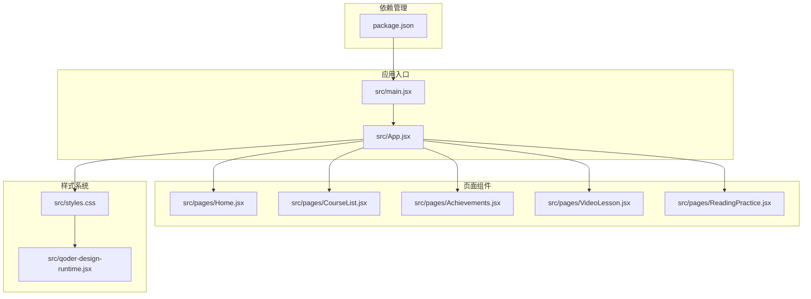
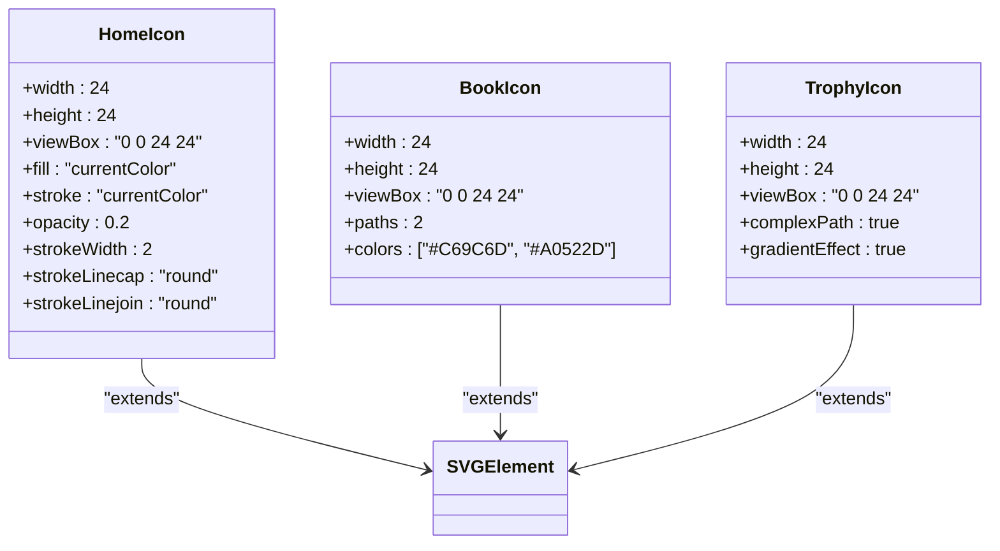
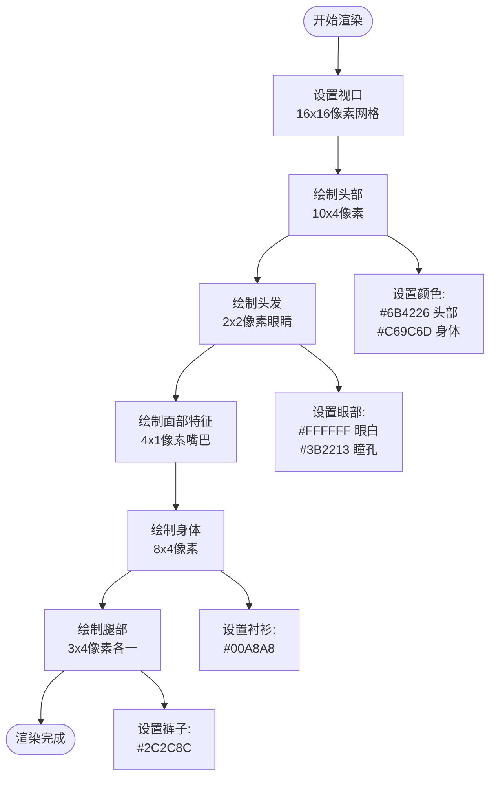
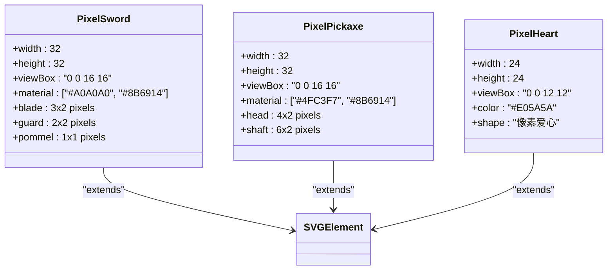
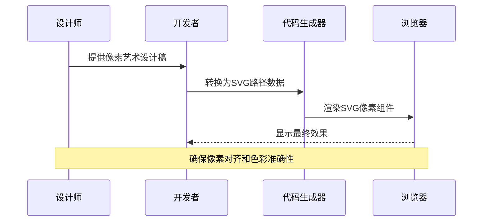
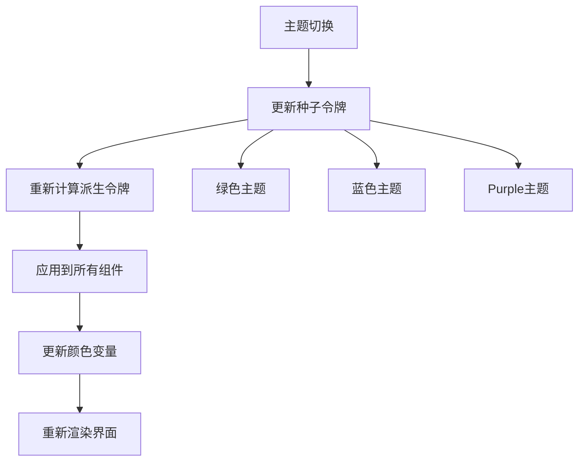
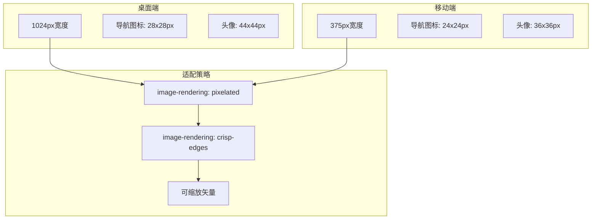
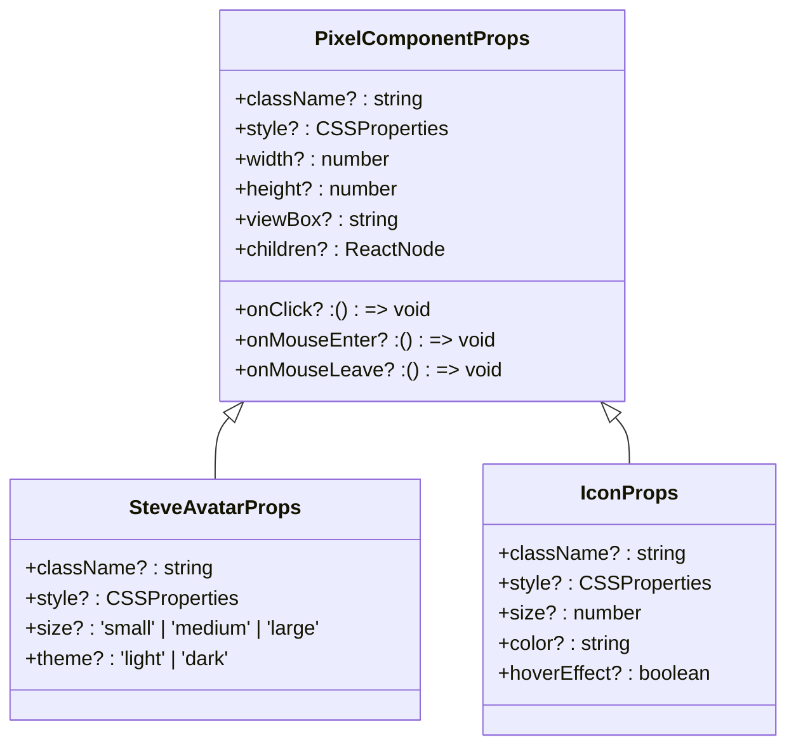
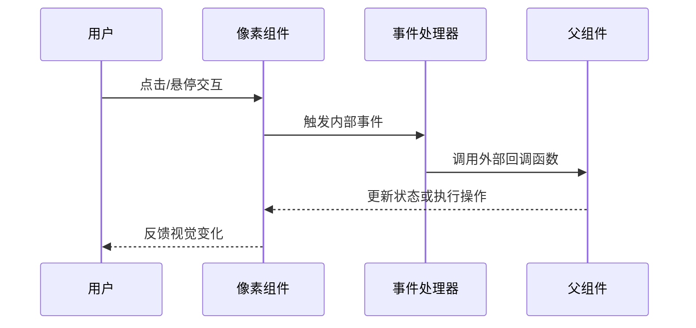

# 像素艺术组件开发

<cite>
**本文档引用的文件**
- [src/App.jsx](file://src/App.jsx)
- [src/main.jsx](file://src/main.jsx)
- [src/styles.css](file://src/styles.css)
- [src/pages/Home.jsx](file://src/pages/Home.jsx)
- [src/pages/CourseList.jsx](file://src/pages/CourseList.jsx)
- [src/pages/Achievements.jsx](file://src/pages/Achievements.jsx)
- [src/pages/VideoLesson.jsx](file://src/pages/VideoLesson.jsx)
- [src/pages/ReadingPractice.jsx](file://src/pages/ReadingPractice.jsx)
- [src/qoder-design-runtime.jsx](file://src/qoder-design-runtime.jsx)
- [package.json](file://package.json)
</cite>

## 目录
1. [项目概述](#项目概述)
2. [项目结构](#项目结构)
3. [像素艺术设计原则](#像素艺术设计原则)
4. [核心像素组件分析](#核心像素组件分析)
5. [SVG像素组件创建流程](#svg像素组件创建流程)
6. [颜色系统与主题应用](#颜色系统与主题应用)
7. [尺寸规范与响应式设计](#尺寸规范与响应式设计)
8. [React封装与Props设计](#react封装与props设计)
9. [清晰度与一致性保障](#清晰度与一致性保障)
10. [最佳实践与故障排除](#最佳实践与故障排除)

## 项目概述

这是一个基于React和Vite构建的Minecraft主题英语学习应用，专门展示了像素艺术风格的SVG组件实现。项目采用设计令牌系统，通过CSS变量实现了完整的主题切换功能，为像素艺术组件提供了统一的视觉语言。

该项目的核心特色是将像素艺术美学与现代Web技术相结合，创造出既具有复古游戏风格又符合现代用户体验的界面组件。

## 项目结构



**图表来源**
- [src/main.jsx:1-14](file://src/main.jsx#L1-L14)
- [src/App.jsx:1-112](file://src/App.jsx#L1-L112)
- [src/styles.css:1-499](file://src/styles.css#L1-L499)

**章节来源**
- [src/main.jsx:1-14](file://src/main.jsx#L1-L14)
- [src/App.jsx:1-112](file://src/App.jsx#L1-L112)

## 像素艺术设计原则

### 像素对齐原则
像素艺术的核心在于精确的像素对齐，所有图形元素都必须按照像素网格进行定位：

- **整数坐标**：所有SVG路径的x、y坐标必须为整数值
- **像素网格**：使用16x16或24x24的像素网格作为设计基准
- **边缘对齐**：矩形边框必须与像素边界完全对齐，避免半像素渲染

### 色彩限制策略
项目采用严格的色彩限制来保持像素艺术的一致性：

- **有限调色板**：每个组件使用预定义的颜色集合
- **Minecraft主题色彩**：绿色、棕色、蓝色等经典像素风格配色
- **透明度控制**：合理使用opacity创建层次感

### 几何形状运用
像素艺术强调简洁的几何形状：

- **矩形为主**：大量使用正方形和长方形构建基础形状
- **对称设计**：面部特征、装备等采用镜像对称布局
- **模块化组合**：复杂形状由简单几何体组合而成

## 核心像素组件分析

### 导航图标组件



**图表来源**
- [src/App.jsx:9-28](file://src/App.jsx#L9-L28)

这些导航图标展现了像素艺术的典型特征：
- 使用简单的几何形状构建复杂的图标
- 通过填充和描边创造立体感
- 保持一致的24x24像素尺寸规格

**章节来源**
- [src/App.jsx:9-28](file://src/App.jsx#L9-L28)

### Steve头像组件



**图表来源**
- [src/App.jsx:31-45](file://src/App.jsx#L31-L45)

Steve头像体现了像素艺术的完整人体结构：
- **头部**：使用深棕色(#6B4226)创建经典的Minecraft角色外观
- **身体**：浅棕色(#C69C6D)的上半身和深蓝色(#2C2C8C)的下半身
- **面部细节**：白色(#FFFFFF)的眼睛和深色(#3B2213)的瞳孔
- **服装**：青绿色(#00A8A8)的衬衫

**章节来源**
- [src/App.jsx:31-45](file://src/App.jsx#L31-L45)

### 装饰性像素组件



**图表来源**
- [src/pages/Home.jsx:4-46](file://src/pages/Home.jsx#L4-L46)

这些装饰性像素组件展示了像素艺术在UI中的多样化应用：
- **武器类**：剑和镐子使用金属质感的灰色和棕色
- **装饰类**：爱心使用鲜艳的红色(#E05A5A)
- **统一规格**：所有组件都遵循16x16像素的基础网格

**章节来源**
- [src/pages/Home.jsx:4-46](file://src/pages/Home.jsx#L4-L46)

## SVG像素组件创建流程

### 设计草图阶段
1. **确定主题**：选择Minecraft相关的像素艺术风格
2. **建立网格**：设计16x16或24x24像素的基础网格
3. **草图绘制**：在网格上绘制主要形状轮廓
4. **细节添加**：添加面部特征、纹理等细节元素

### 技术实现步骤



### 代码实现要点
- **精确坐标**：所有坐标值必须为整数
- **颜色管理**：使用CSS变量统一管理颜色
- **尺寸规范**：严格遵守指定的宽高比
- **性能优化**：最小化DOM节点数量

## 颜色系统与主题应用

### 设计令牌系统

```mermaid
graph LR
subgraph "种子令牌"
seedbg[--seed-bg: #F8F8F0]
seedfg[--seed-fg: #5C4A2E]
seedprimary[--seed-primary: #4CAF50]
seedaccent[--seed-accent: #FFAB00]
end
subgraph "派生令牌"
cream[--color-cream: var(--seed-bg)]
surface[--color-surface: var(--seed-surface)]
grass[--color-grass: var(--seed-primary)]
gold[--color-gold: var(--seed-accent)]
end
subgraph "语义令牌"
success[--color-success: #6FBA2C]
warning[--color-warning: #F5C31C]
danger[--color-danger: #E05A5A]
emerald[--color-emerald: #2E7D32]
end
seedbg --> cream
seedprimary --> grass
seedaccent --> gold
```

**图表来源**
- [src/styles.css:7-55](file://src/styles.css#L7-L55)

### 主题切换机制



**章节来源**
- [src/styles.css:7-87](file://src/styles.css#L7-L87)

### 像素组件颜色应用

像素组件通过以下方式应用颜色系统：

1. **继承系统**：使用`fill="currentColor"`继承父元素颜色
2. **CSS变量**：直接使用`var(--color-name)`变量
3. **主题适配**：组件自动适应当前主题颜色

## 尺寸规范与响应式设计

### 像素网格规范

| 组件类型 | 基础尺寸 | 视口大小 | 像素网格 |
|---------|---------|---------|---------|
| 导航图标 | 24x24px | 24x24 | 24x24像素 |
| 装饰图标 | 32x32px | 16x16 | 16x16像素 |
| 头像组件 | 28x28px | 16x16 | 16x16像素 |
| 课程缩略图 | 48x48px | 16x16 | 16x16像素 |

### 响应式适配策略



### 清晰度保障措施

1. **像素渲染**：使用`image-rendering: pixelated`确保像素对齐
2. **清晰边缘**：使用`image-rendering: crisp-edges`优化边缘显示
3. **缩放控制**：通过CSS变量控制整体缩放比例

**章节来源**
- [src/styles.css:452-455](file://src/styles.css#L452-L455)

## React封装与Props设计

### 组件Props接口设计



### 样式传递机制

像素组件通过以下方式处理样式传递：

1. **类名合并**：将传入的className与内置样式类合并
2. **内联样式**：支持style对象的深度合并
3. **CSS变量覆盖**：允许通过style属性覆盖CSS变量

### 事件处理封装



**章节来源**
- [src/App.jsx:31-45](file://src/App.jsx#L31-L45)
- [src/pages/Home.jsx:4-15](file://src/pages/Home.jsx#L4-L15)

## 清晰度与一致性保障

### 像素对齐验证

为了确保像素组件在不同设备上的清晰度，项目采用了以下验证机制：

1. **网格对齐检查**：所有SVG元素必须与1像素网格对齐
2. **颜色一致性测试**：使用相同的颜色变量确保主题一致性
3. **尺寸标准化**：严格遵守预定义的组件尺寸规格

### 性能优化策略

```mermaid
graph TB
subgraph "渲染优化"
pixelated[image-rendering: pixelated]
crispEdges[image-rendering: crisp-edges]
transform[transform: translateZ(0)]
end
subgraph "内存优化"
reuse[组件复用]
memo[Memo化处理]
lazy[Lazy加载]
end
subgraph "网络优化"
svgInline[SVG内联]
gzip[Gzip压缩]
cache[缓存策略]
end
pixelated --> crispEdges
crispEdges --> transform
transform --> reuse
reuse --> memo
memo --> lazy
lazy --> svgInline
svgInline --> gzip
gzip --> cache
```

### 兼容性保障

1. **浏览器兼容**：支持主流现代浏览器的SVG渲染
2. **主题兼容**：确保在深色和浅色主题下都能正常显示
3. **缩放兼容**：在不同DPI设置下保持清晰度

## 最佳实践与故障排除

### 开发最佳实践

1. **设计规范**：始终遵循1像素网格设计原则
2. **颜色管理**：使用CSS变量而非硬编码颜色值
3. **性能考虑**：避免过度复杂的SVG路径
4. **可访问性**：为像素组件提供适当的ARIA标签

### 常见问题解决

| 问题类型 | 症状描述 | 解决方案 |
|---------|---------|---------|
| 像素模糊 | 图形边缘出现锯齿 | 检查image-rendering属性设置 |
| 颜色不一致 | 同一组件颜色在不同主题下变化 | 确认使用CSS变量而非硬编码颜色 |
| 尺寸异常 | 组件显示比例不正确 | 验证viewBox和width/height设置 |
| 性能问题 | 页面渲染缓慢 | 检查SVG复杂度和DOM节点数量 |

### 调试工具建议

1. **浏览器开发者工具**：检查SVG元素的渲染属性
2. **像素测量工具**：验证像素对齐精度
3. **主题切换测试**：确保在所有主题下都能正常显示

通过遵循这些指导原则和最佳实践，可以创建出高质量、高性能的像素艺术SVG组件，为用户提供独特的视觉体验。