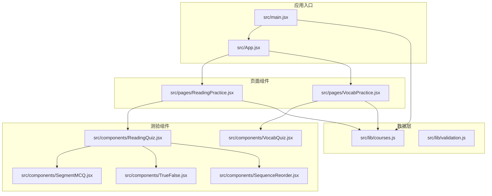
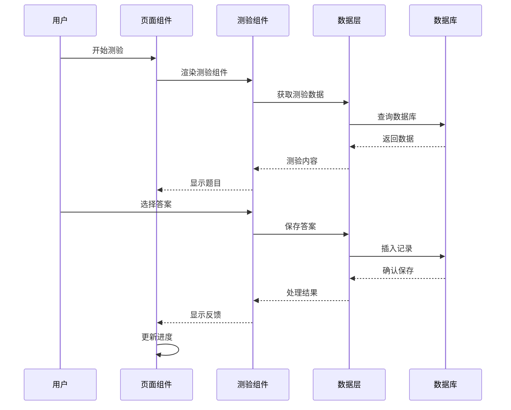
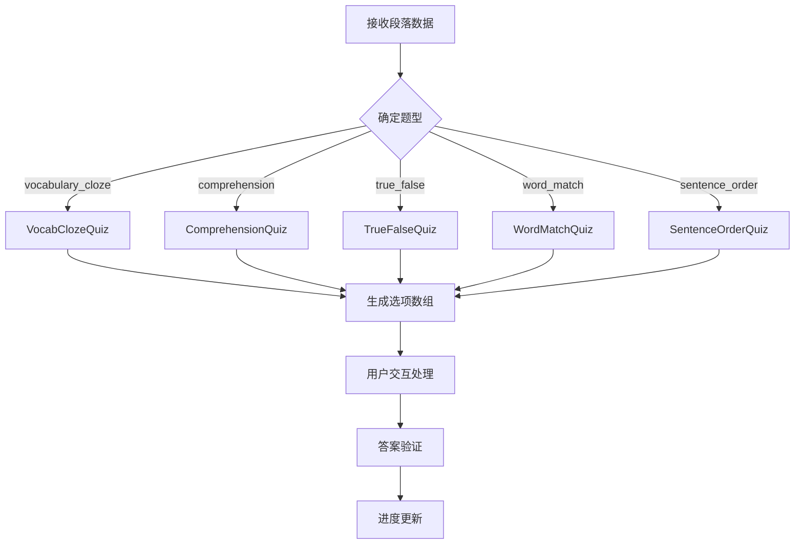
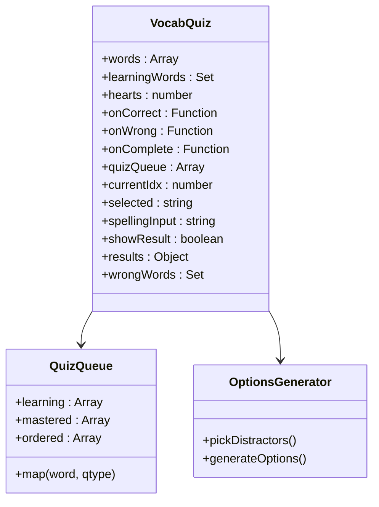
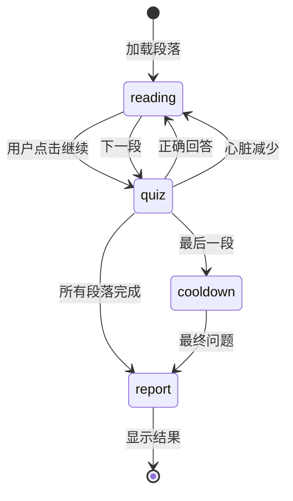
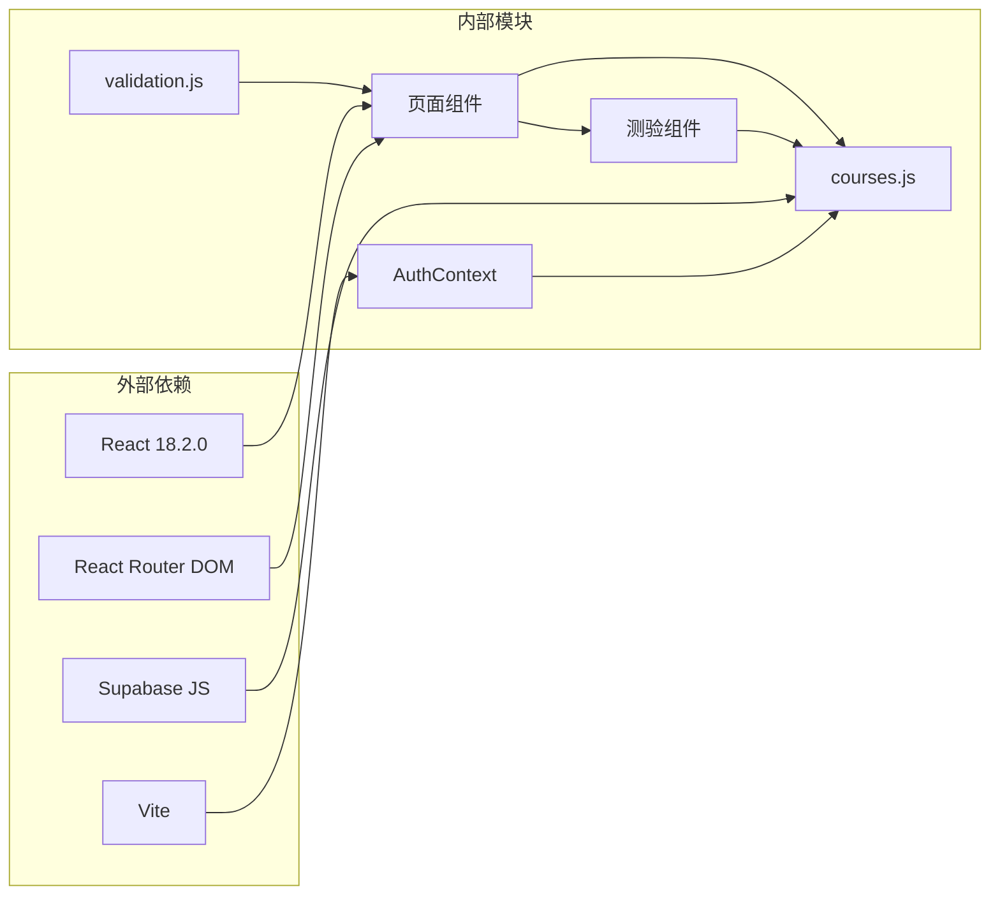
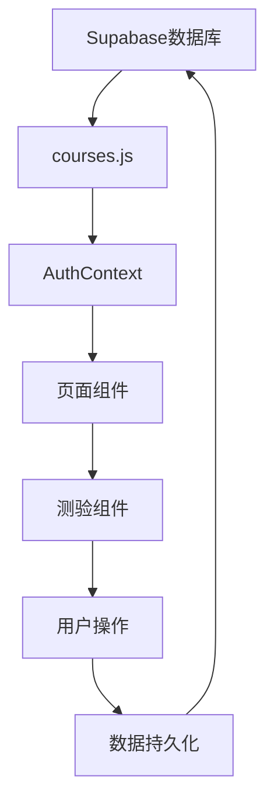

# 测验组件

<cite>
**本文档引用的文件**
- [package.json](file://package.json)
- [src/App.jsx](file://src/App.jsx)
- [src/main.jsx](file://src/main.jsx)
- [src/components/ReadingQuiz.jsx](file://src/components/ReadingQuiz.jsx)
- [src/components/VocabQuiz.jsx](file://src/components/VocabQuiz.jsx)
- [src/components/SegmentMCQ.jsx](file://src/components/SegmentMCQ.jsx)
- [src/components/TrueFalse.jsx](file://src/components/TrueFalse.jsx)
- [src/components/SequenceReorder.jsx](file://src/components/SequenceReorder.jsx)
- [src/pages/ReadingPractice.jsx](file://src/pages/ReadingPractice.jsx)
- [src/pages/VocabPractice.jsx](file://src/pages/VocabPractice.jsx)
- [src/lib/courses.js](file://src/lib/courses.js)
- [src/lib/validation.js](file://src/lib/validation.js)
</cite>

## 目录
1. [项目概述](#项目概述)
2. [项目结构](#项目结构)
3. [核心组件](#核心组件)
4. [架构概览](#架构概览)
5. [详细组件分析](#详细组件分析)
6. [依赖关系分析](#依赖关系分析)
7. [性能考虑](#性能考虑)
8. [故障排除指南](#故障排除指南)
9. [结论](#结论)

## 项目概述

这是一个基于React和Vite构建的英语学习应用，专注于通过多种测验形式帮助用户提高英语水平。应用提供了丰富的测验组件，包括阅读理解、词汇练习、听力训练等多种学习模式。

该应用采用模块化设计，将测验功能分解为多个独立的组件，每个组件负责特定类型的测验任务。系统支持渐进式学习模式，用户可以通过完成测验逐步解锁新内容，并获得即时反馈和奖励机制。

## 项目结构

**图表来源**
- [src/main.jsx:16-28](file://src/main.jsx#L16-L28)
- [src/App.jsx:92-103](file://src/App.jsx#L92-L103)

**章节来源**
- [package.json:1-24](file://package.json#L1-L24)
- [src/main.jsx:16-28](file://src/main.jsx#L16-L28)
- [src/App.jsx:92-103](file://src/App.jsx#L92-L103)

## 核心组件

### 测验组件体系

应用包含以下主要测验组件：

1. **ReadingQuiz** - 阅读理解测验，支持多种题型
2. **VocabQuiz** - 词汇练习测验，包含三种不同模式
3. **SegmentMCQ** - 段落级多项选择题
4. **TrueFalse** - 判断题组件
5. **SequenceReorder** - 序列重排练习

### 数据持久化

系统通过`courses.js`提供完整的数据访问层，包括：
- 课程列表管理
- 用户进度跟踪
- 测验结果记录
- 词汇数据管理

**章节来源**
- [src/components/ReadingQuiz.jsx:475-495](file://src/components/ReadingQuiz.jsx#L475-L495)
- [src/components/VocabQuiz.jsx:36-49](file://src/components/VocabQuiz.jsx#L36-L49)
- [src/lib/courses.js:174-205](file://src/lib/courses.js#L174-L205)

## 架构概览

**图表来源**
- [src/pages/ReadingPractice.jsx:224-265](file://src/pages/ReadingPractice.jsx#L224-L265)
- [src/lib/courses.js:247-275](file://src/lib/courses.js#L247-L275)

## 详细组件分析

### ReadingQuiz 组件

ReadingQuiz是阅读理解测验的核心组件，支持多种题型：

#### 支持的题型
- **VocabClozeQuiz**: 完形填空，测试词汇运用能力
- **ComprehensionQuiz**: 阅读理解，标准多项选择题
- **TrueFalseQuiz**: 判断题，测试对内容的理解
- **WordMatchQuiz**: 词汇匹配，测试词汇对应关系
- **SentenceOrderQuiz**: 句子排序，测试语序理解

#### 核心功能特性

**图表来源**
- [src/components/ReadingQuiz.jsx:475-495](file://src/components/ReadingQuiz.jsx#L475-L495)

**章节来源**
- [src/components/ReadingQuiz.jsx:72-139](file://src/components/ReadingQuiz.jsx#L72-L139)
- [src/components/ReadingQuiz.jsx:144-193](file://src/components/ReadingQuiz.jsx#L144-L193)
- [src/components/ReadingQuiz.jsx:198-263](file://src/components/ReadingQuiz.jsx#L198-L263)
- [src/components/ReadingQuiz.jsx:268-376](file://src/components/ReadingQuiz.jsx#L268-L376)
- [src/components/ReadingQuiz.jsx:381-470](file://src/components/ReadingQuiz.jsx#L381-L470)

### VocabQuiz 组件

VocabQuiz专门用于词汇练习，采用三阶段轮换模式：

#### 三阶段轮换机制
1. **en2zh模式**: 英语单词到中文释义的匹配
2. **zh2en模式**: 中文释义到英语单词的识别  
3. **spelling模式**: 根据中文释义拼写英文单词

#### 学习优先级
- **学习中的词汇优先**: 使用`Set`数据结构标记需要重点练习的词汇
- **随机排列**: 通过洗牌算法确保练习的随机性和公平性
- **错误追踪**: 记录错误词汇以便后续复习

**图表来源**
- [src/components/VocabQuiz.jsx:38-49](file://src/components/VocabQuiz.jsx#L38-L49)
- [src/components/VocabQuiz.jsx:63-83](file://src/components/VocabQuiz.jsx#L63-L83)

**章节来源**
- [src/components/VocabQuiz.jsx:38-380](file://src/components/VocabQuiz.jsx#L38-L380)

### 页面集成架构

#### ReadingPractice 页面
ReadingPractice页面实现了完整的渐进式学习流程：

**图表来源**
- [src/pages/ReadingPractice.jsx:156-157](file://src/pages/ReadingPractice.jsx#L156-L157)

#### VocabPractice 页面
VocabPractice页面采用三阶段学习模式：

1. **Learn阶段**: 闪卡学习，标记掌握程度
2. **Practice阶段**: 测验练习，检验学习效果  
3. **Report阶段**: 结果展示，保存学习进度

**章节来源**
- [src/pages/ReadingPractice.jsx:133-800](file://src/pages/ReadingPractice.jsx#L133-L800)
- [src/pages/VocabPractice.jsx:24-353](file://src/pages/VocabPractice.jsx#L24-L353)

## 依赖关系分析

**图表来源**
- [package.json:12-22](file://package.json#L12-L22)
- [src/main.jsx:5-6](file://src/main.jsx#L5-L6)

### 数据流依赖

**图表来源**
- [src/lib/courses.js:1-328](file://src/lib/courses.js#L1-L328)

**章节来源**
- [package.json:12-22](file://package.json#L12-L22)
- [src/lib/courses.js:1-328](file://src/lib/courses.js#L1-L328)

## 性能考虑

### 优化策略

1. **组件懒加载**: 使用React.memo和useMemo避免不必要的重新渲染
2. **数据缓存**: 词汇数据在内存中缓存，避免重复查询
3. **异步加载**: 使用Promise.all并行加载多个数据源
4. **条件渲染**: 根据用户状态动态渲染组件，减少DOM节点数量

### 内存管理

- 使用useRef避免在渲染过程中创建新的函数实例
- 合理使用Set数据结构进行去重操作
- 及时清理定时器和事件监听器

## 故障排除指南

### 常见问题及解决方案

#### 测验无响应
1. 检查网络连接状态
2. 验证用户认证状态
3. 确认数据库连接正常

#### 数据加载失败
1. 查看控制台错误信息
2. 验证Supabase配置
3. 检查用户权限设置

#### 性能问题
1. 检查组件重新渲染频率
2. 优化数据查询逻辑
3. 实施适当的缓存策略

**章节来源**
- [src/lib/courses.js:264-275](file://src/lib/courses.js#L264-L275)
- [src/lib/courses.js:300-310](file://src/lib/courses.js#L300-L310)

## 结论

该测验组件系统展现了良好的模块化设计和可扩展性。通过将不同类型的测验功能分解为独立的组件，系统实现了高度的代码复用和维护性。

### 主要优势

1. **模块化设计**: 每个测验组件职责单一，易于测试和维护
2. **灵活的数据驱动**: 通过配置化的题型支持，轻松扩展新的测验类型
3. **渐进式学习**: 完整的学习流程设计，符合语言学习规律
4. **实时反馈**: 即时的答案验证和进度跟踪机制
5. **数据持久化**: 完善的用户进度和结果记录系统

### 发展建议

1. **移动端优化**: 进一步优化触摸交互体验
2. **离线支持**: 考虑添加离线学习功能
3. **个性化推荐**: 基于用户表现提供个性化的学习路径
4. **多语言支持**: 扩展到其他语言学习场景

该系统为英语学习应用提供了一个坚实的技术基础，通过持续的迭代和优化，可以为用户提供更加丰富和有效的学习体验。