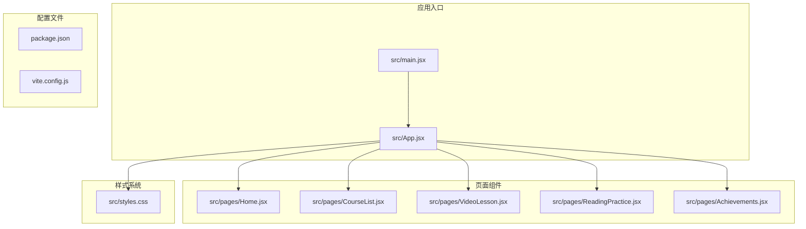
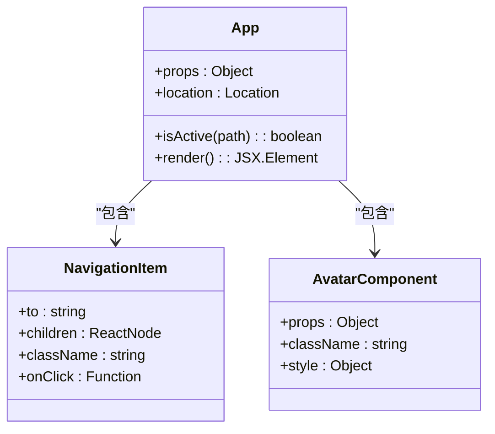
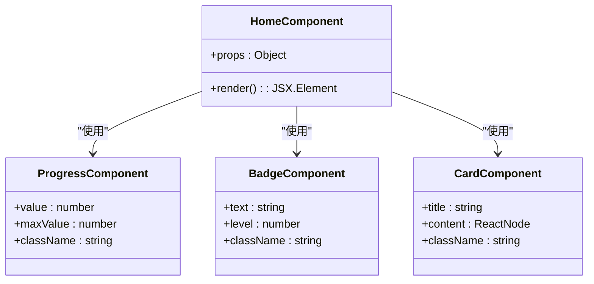
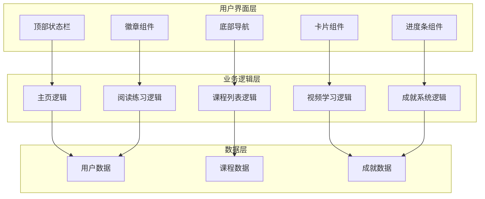
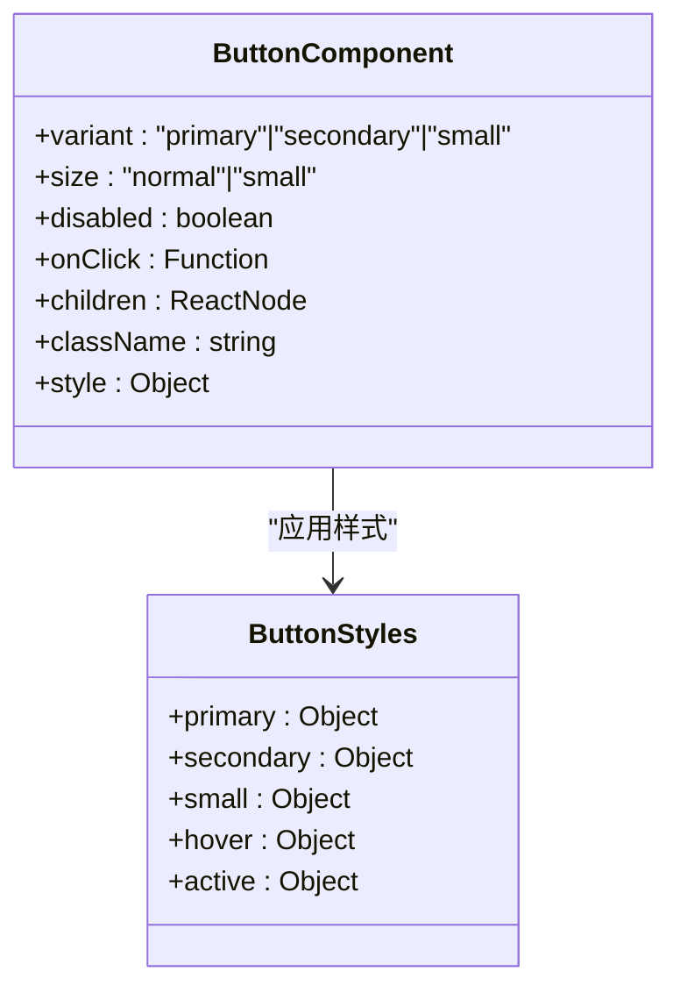
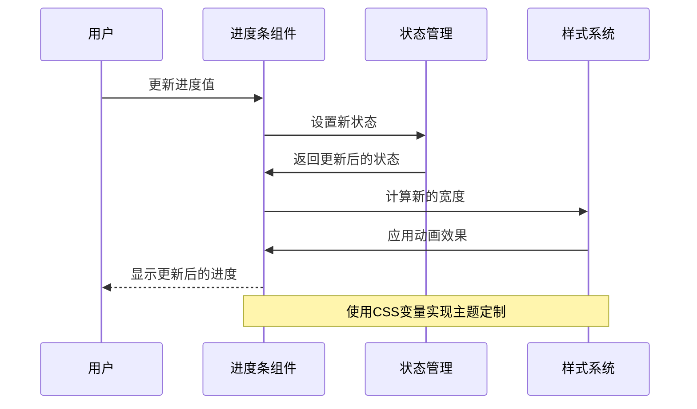
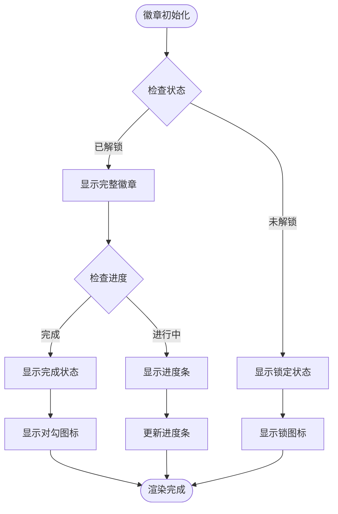
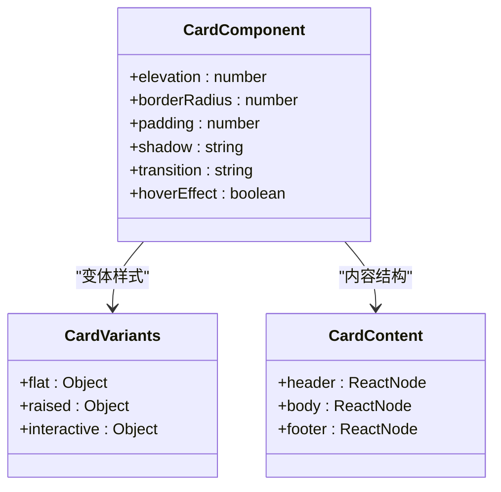
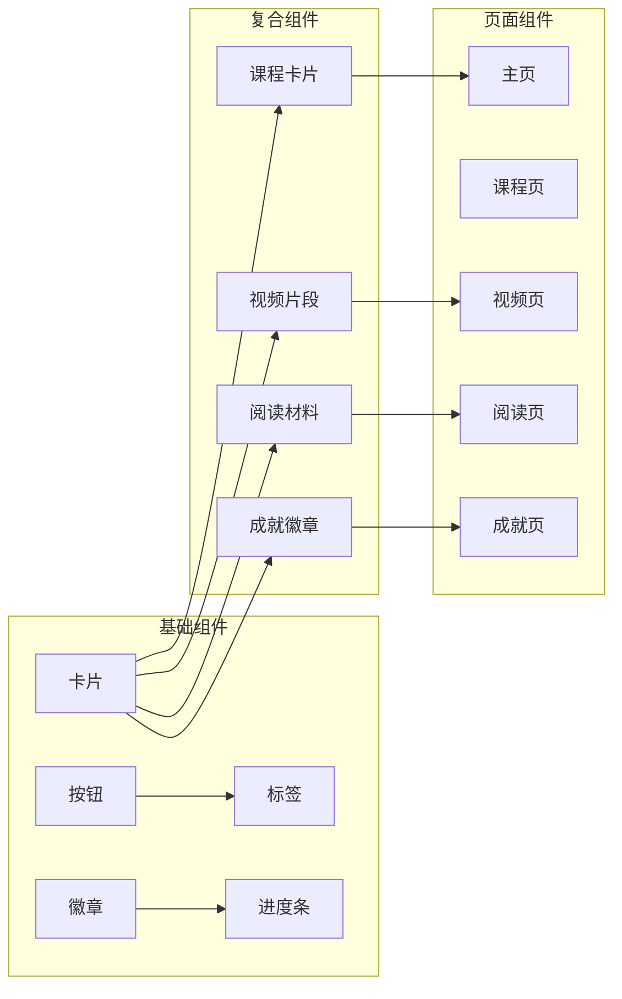

# 通用UI组件开发

<cite>
**本文档引用的文件**
- [App.jsx](file://src/App.jsx)
- [main.jsx](file://src/main.jsx)
- [styles.css](file://src/styles.css)
- [Home.jsx](file://src/pages/Home.jsx)
- [CourseList.jsx](file://src/pages/CourseList.jsx)
- [VideoLesson.jsx](file://src/pages/VideoLesson.jsx)
- [ReadingPractice.jsx](file://src/pages/ReadingPractice.jsx)
- [Achievements.jsx](file://src/pages/Achievements.jsx)
- [package.json](file://package.json)
- [vite.config.js](file://vite.config.js)
</cite>

## 目录
1. [简介](#简介)
2. [项目结构](#项目结构)
3. [核心组件](#核心组件)
4. [架构概览](#架构概览)
5. [详细组件分析](#详细组件分析)
6. [依赖关系分析](#依赖关系分析)
7. [性能考虑](#性能考虑)
8. [故障排除指南](#故障排除指南)
9. [结论](#结论)

## 简介

本项目是一个基于React的Minecraft主题英语学习应用，展示了现代Web应用的完整开发实践。项目采用Vite构建工具，使用CSS变量实现主题系统，通过组件化架构实现了可复用的UI组件设计。

该应用包含了完整的用户界面，从主页的课程推荐到视频学习页面，再到阅读练习和成就系统，展现了丰富的交互场景。所有组件都遵循了现代化的React开发最佳实践，包括函数式组件、Hooks状态管理、以及可访问性设计。

## 项目结构

项目采用模块化的文件组织方式，主要分为以下几个部分：



**图表来源**
- [main.jsx:1-14](file://src/main.jsx#L1-L14)
- [App.jsx:1-112](file://src/App.jsx#L1-L112)

**章节来源**
- [main.jsx:1-14](file://src/main.jsx#L1-L14)
- [package.json:1-22](file://package.json#L1-L22)
- [vite.config.js:1-11](file://vite.config.js#L1-L11)

## 核心组件

### 应用壳层组件

应用的主要容器组件提供了完整的应用布局和导航功能：



**图表来源**
- [App.jsx:47-112](file://src/App.jsx#L47-L112)

### 主页组件

主页组件展示了丰富的UI元素组合，包括进度条、徽章、卡片等：



**图表来源**
- [Home.jsx:48-293](file://src/pages/Home.jsx#L48-L293)

**章节来源**
- [App.jsx:1-112](file://src/App.jsx#L1-L112)
- [Home.jsx:1-293](file://src/pages/Home.jsx#L1-L293)

## 架构概览

应用采用了清晰的分层架构，每个页面都是一个独立的功能模块：



**图表来源**
- [styles.css:1-499](file://src/styles.css#L1-L499)
- [CourseList.jsx:163-314](file://src/pages/CourseList.jsx#L163-L314)

## 详细组件分析

### 按钮组件设计

项目中的按钮组件体现了现代UI设计的最佳实践：



**图表来源**
- [styles.css:266-340](file://src/styles.css#L266-L340)

### 进度条组件实现

进度条组件展示了状态管理和视觉反馈的设计理念：



**图表来源**
- [styles.css:361-388](file://src/styles.css#L361-L388)
- [Home.jsx:120-127](file://src/pages/Home.jsx#L120-L127)

### 徽章组件设计

徽章组件体现了响应式设计和状态指示的重要性：



**图表来源**
- [Achievements.jsx:206-249](file://src/pages/Achievements.jsx#L206-L249)

### 卡片组件系统

卡片组件是应用中最常用的容器组件：



**图表来源**
- [styles.css:341-360](file://src/styles.css#L341-L360)
- [Home.jsx:113-142](file://src/pages/Home.jsx#L113-L142)

**章节来源**
- [styles.css:1-499](file://src/styles.css#L1-L499)
- [CourseList.jsx:153-161](file://src/pages/CourseList.jsx#L153-L161)

### 组件组合模式

应用展示了多种组件组合模式：



**图表来源**
- [Home.jsx:154-257](file://src/pages/Home.jsx#L154-L257)
- [CourseList.jsx:206-310](file://src/pages/CourseList.jsx#L206-L310)

## 依赖关系分析

应用的依赖关系相对简单但结构清晰：

```mermaid
graph TD
subgraph "运行时依赖"
react[react ^18.2.0]
react_dom[react-dom ^18.2.0]
router[react-router-dom ^6.20.0]
end
subgraph "开发依赖"
vite[vite ^5.0.0]
react_plugin[@vitejs/plugin-react ^4.2.0]
end
subgraph "应用代码"
main_js[src/main.jsx]
app_jsx[src/App.jsx]
pages[页面组件]
styles[src/styles.css]
end
main_js --> react
main_js --> react_dom
main_js --> router
app_jsx --> react
pages --> react
styles --> react
vite --> react_plugin
react_plugin --> react
```

**图表来源**
- [package.json:12-21](file://package.json#L12-L21)

**章节来源**
- [package.json:1-22](file://package.json#L1-L22)
- [vite.config.js:1-11](file://vite.config.js#L1-L11)

## 性能考虑

### 样式系统优化

应用采用了CSS变量和原子化设计原则，实现了高效的样式管理：

- **主题系统**：通过`:root`变量定义设计令牌，支持主题切换
- **样式复用**：使用类名组合实现样式的模块化
- **动画优化**：使用CSS变量控制动画参数，减少JavaScript计算

### 组件性能优化

- **状态最小化**：只在必要时更新组件状态
- **渲染优化**：使用React.memo避免不必要的重渲染
- **懒加载**：路由级别的代码分割

## 故障排除指南

### 常见问题及解决方案

1. **样式不生效**
   - 检查CSS变量是否正确声明
   - 确认类名拼写和顺序
   - 验证样式文件导入路径

2. **组件状态异常**
   - 检查useState初始化值
   - 确认事件处理器绑定
   - 验证状态更新逻辑

3. **路由导航问题**
   - 检查路由配置
   - 确认Link组件使用
   - 验证路由参数传递

**章节来源**
- [styles.css:1-499](file://src/styles.css#L1-L499)
- [App.jsx:47-112](file://src/App.jsx#L47-L112)

## 结论

本项目展示了现代React应用开发的最佳实践，包括：

- **组件化架构**：清晰的组件层次和职责分离
- **样式系统设计**：基于CSS变量的主题系统
- **状态管理**：合理使用React Hooks
- **用户体验**：注重可访问性和交互反馈
- **性能优化**：关注渲染效率和资源管理

通过这个项目，开发者可以学习到如何构建可维护、可扩展的React应用，以及如何设计高质量的UI组件库。项目中的各种组件模式为实际开发提供了很好的参考和借鉴价值。