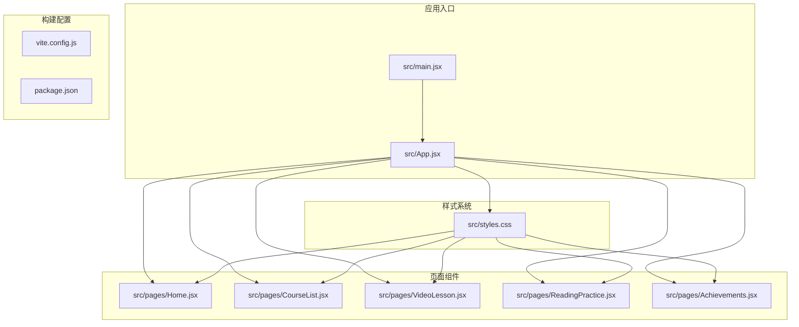
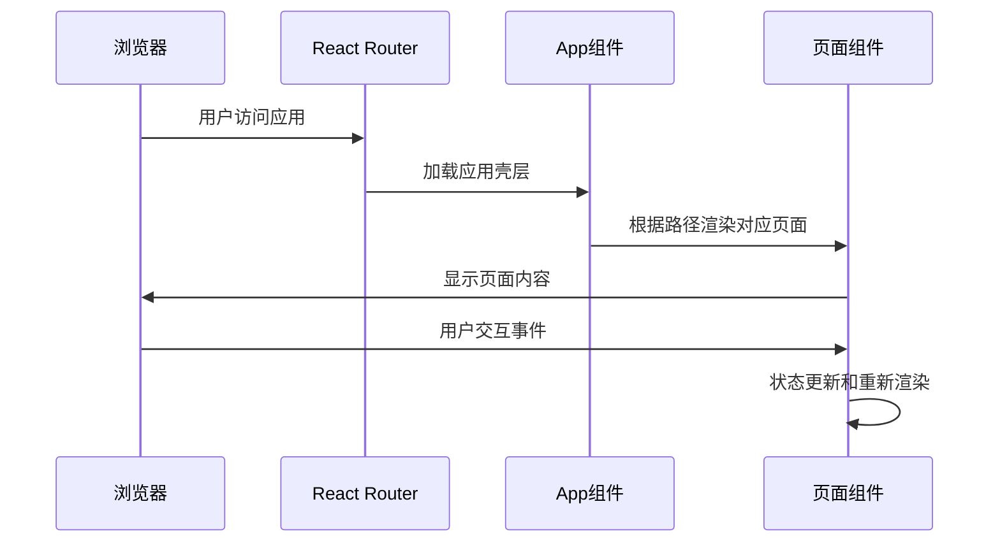
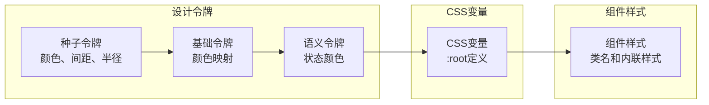
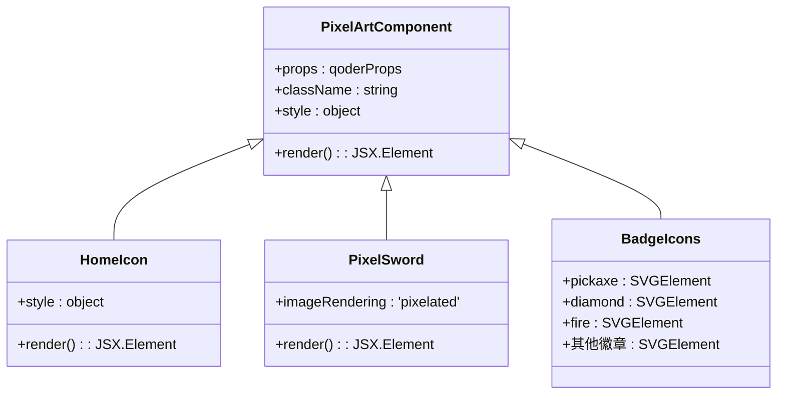
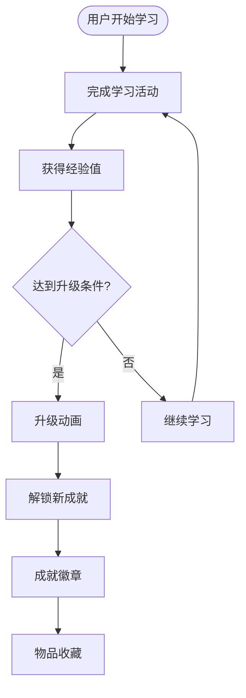
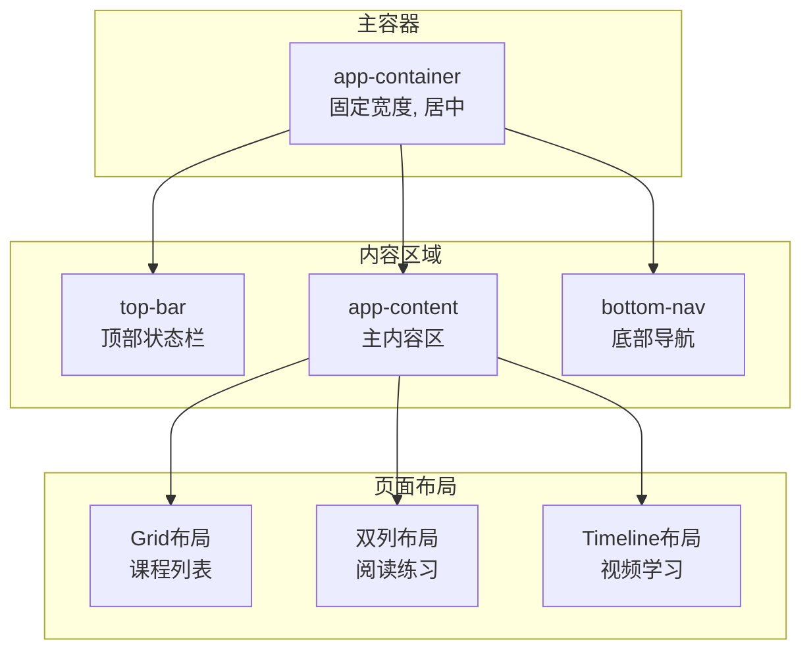
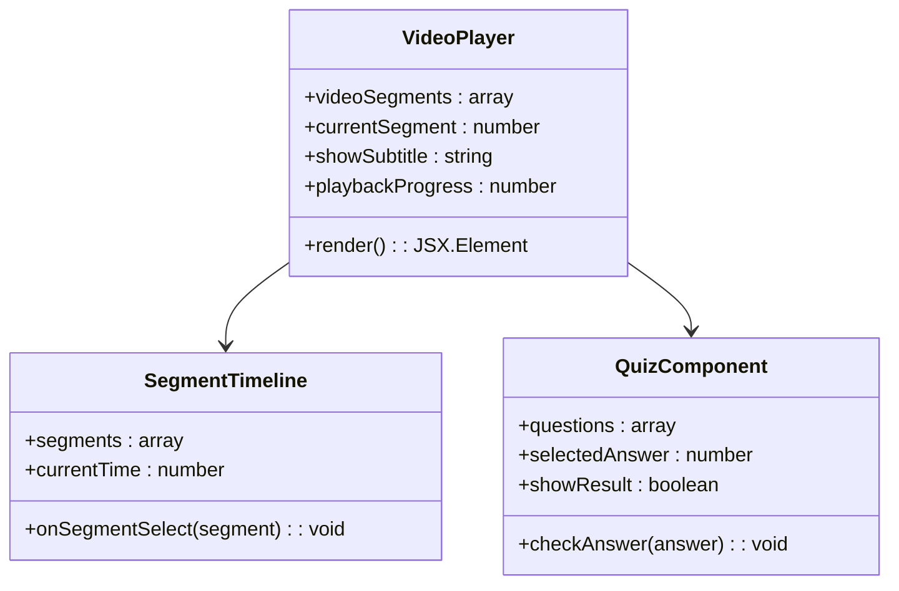
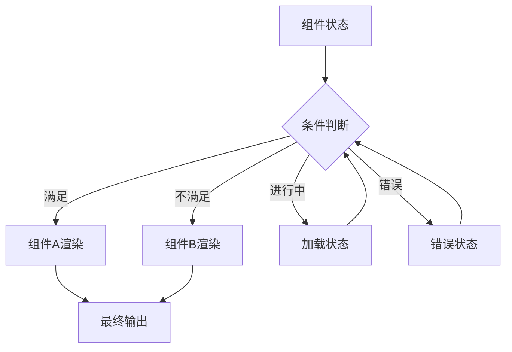
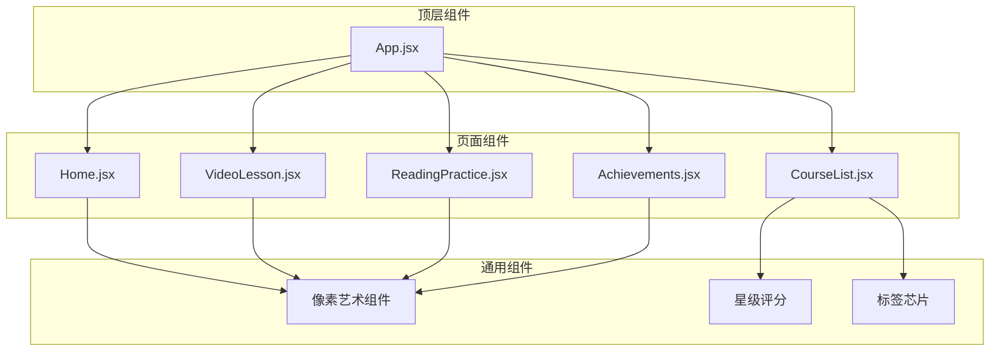

# 组件开发与扩展

<cite>
**本文档引用的文件**
- [src/App.jsx](file://src/App.jsx)
- [src/main.jsx](file://src/main.jsx)
- [src/styles.css](file://src/styles.css)
- [src/pages/Home.jsx](file://src/pages/Home.jsx)
- [src/pages/CourseList.jsx](file://src/pages/CourseList.jsx)
- [src/pages/VideoLesson.jsx](file://src/pages/VideoLesson.jsx)
- [src/pages/ReadingPractice.jsx](file://src/pages/ReadingPractice.jsx)
- [src/pages/Achievements.jsx](file://src/pages/Achievements.jsx)
- [vite.config.js](file://vite.config.js)
- [package.json](file://package.json)
</cite>

## 目录
1. [简介](#简介)
2. [项目结构](#项目结构)
3. [核心组件](#核心组件)
4. [架构概览](#架构概览)
5. [详细组件分析](#详细组件分析)
6. [依赖关系分析](#依赖关系分析)
7. [性能考虑](#性能考虑)
8. [故障排除指南](#故障排除指南)
9. [结论](#结论)
10. [附录](#附录)

## 简介

这是一个基于 React 和 Vite 的 Minecraft 英语学习应用，采用像素艺术风格设计。项目实现了完整的教育学习平台，包含课程列表、视频学习、阅读练习和成就系统等功能模块。

该应用的核心特色包括：
- 像素艺术 SVG 图标和装饰元素
- 游戏化学习体验（经验值、等级、徽章系统）
- 响应式设计和主题化样式系统
- 多媒体内容集成（视频播放器、音频字幕）
- 交互式学习活动（测验、词汇练习）

## 项目结构

项目采用模块化的文件组织结构，主要分为以下几个部分：



**图表来源**
- [src/main.jsx:1-14](file://src/main.jsx#L1-L14)
- [src/App.jsx:1-112](file://src/App.jsx#L1-L112)

**章节来源**
- [src/main.jsx:1-14](file://src/main.jsx#L1-L14)
- [src/App.jsx:1-112](file://src/App.jsx#L1-L112)
- [vite.config.js:1-11](file://vite.config.js#L1-L11)
- [package.json:1-22](file://package.json#L1-L22)

## 核心组件

### 应用壳层组件

App 组件作为整个应用的外壳，负责：
- 路由配置和导航管理
- 顶部状态栏显示用户信息和进度
- 底部导航栏的页面切换
- 像素艺术 SVG 图标的使用

### 页面级组件

项目包含五个主要页面组件，每个都有特定的学习功能：

1. **Home 页面** - 主页展示，包含每日进度、推荐课程和成就预览
2. **CourseList 页面** - 课程列表管理，支持过滤和筛选
3. **VideoLesson 页面** - 视频学习界面，包含字幕和测验功能
4. **ReadingPractice 页面** - 阅读练习，支持词汇标记和测验
5. **Achievements 页面** - 成就系统，展示徽章和物品收集

**章节来源**
- [src/App.jsx:47-112](file://src/App.jsx#L47-L112)
- [src/pages/Home.jsx:48-293](file://src/pages/Home.jsx#L48-L293)
- [src/pages/CourseList.jsx:163-314](file://src/pages/CourseList.jsx#L163-L314)
- [src/pages/VideoLesson.jsx:20-288](file://src/pages/VideoLesson.jsx#L20-L288)
- [src/pages/ReadingPractice.jsx:45-293](file://src/pages/ReadingPractice.jsx#L45-L293)
- [src/pages/Achievements.jsx:113-297](file://src/pages/Achievements.jsx#L113-L297)

## 架构概览

应用采用单页应用(SPA)架构，使用 React Router 进行客户端路由管理：



**图表来源**
- [src/main.jsx:7-12](file://src/main.jsx#L7-L12)
- [src/App.jsx:85-91](file://src/App.jsx#L85-L91)

### 样式系统架构

应用使用 CSS 变量和设计令牌系统实现主题化：



**图表来源**
- [src/styles.css:7-87](file://src/styles.css#L7-L87)

**章节来源**
- [src/App.jsx:1-112](file://src/App.jsx#L1-L112)
- [src/styles.css:1-499](file://src/styles.css#L1-L499)

## 详细组件分析

### 像素艺术 SVG 组件

#### 像素艺术图标系统

应用广泛使用像素艺术风格的 SVG 组件，包括：

1. **导航图标**：HomeIcon、BookIcon、TrophyIcon
2. **装饰元素**：PixelSword、PixelPickaxe、PixelHeart
3. **徽章图标**：各种成就徽章的像素艺术版本
4. **缩略图**：课程内容的像素风格预览



**图表来源**
- [src/App.jsx:9-45](file://src/App.jsx#L9-L45)
- [src/pages/Home.jsx:4-46](file://src/pages/Home.jsx#L4-L46)
- [src/pages/Achievements.jsx:26-111](file://src/pages/Achievements.jsx#L26-L111)

#### 像素艺术实现原理

像素艺术效果通过以下方式实现：
- 使用 `imageRendering: 'pixelated'` CSS 属性
- 严格的 1:1 像素比例设计
- 固定视口尺寸 (16x16 或 12x12)
- 简洁的颜色方案

**章节来源**
- [src/App.jsx:9-45](file://src/App.jsx#L9-L45)
- [src/pages/Home.jsx:4-46](file://src/pages/Home.jsx#L4-L46)
- [src/pages/CourseList.jsx:64-151](file://src/pages/CourseList.jsx#L64-L151)
- [src/pages/Achievements.jsx:26-111](file://src/pages/Achievements.jsx#L26-L111)

### 游戏化元素组件

#### 成就系统组件

成就系统是游戏化体验的核心部分：



**图表来源**
- [src/pages/Achievements.jsx:3-12](file://src/pages/Achievements.jsx#L3-L12)
- [src/pages/Achievements.jsx:206-249](file://src/pages/Achievements.jsx#L206-L249)

#### 经验值和进度系统

应用实现了完整的经验值管理系统：
- 每个学习活动分配不同经验值
- 等级系统推动持续学习
- 进度条显示学习完成度
- 成就解锁机制

**章节来源**
- [src/pages/Home.jsx:112-142](file://src/pages/Home.jsx#L112-L142)
- [src/pages/Achievements.jsx:121-189](file://src/pages/Achievements.jsx#L121-L189)

### 响应式设计组件

#### 布局系统

应用采用灵活的网格布局系统：



**图表来源**
- [src/styles.css:143-161](file://src/styles.css#L143-L161)
- [src/pages/CourseList.jsx:201-205](file://src/pages/CourseList.jsx#L201-L205)
- [src/pages/ReadingPractice.jsx:90-91](file://src/pages/ReadingPractice.jsx#L90-L91)

**章节来源**
- [src/styles.css:143-265](file://src/styles.css#L143-L265)
- [src/pages/CourseList.jsx:201-205](file://src/pages/CourseList.jsx#L201-L205)
- [src/pages/ReadingPractice.jsx:90-91](file://src/pages/ReadingPractice.jsx#L90-L91)

### 多媒体内容集成

#### 视频播放器组件

视频学习页面实现了完整的视频播放器功能：



**图表来源**
- [src/pages/VideoLesson.jsx:4-10](file://src/pages/VideoLesson.jsx#L4-L10)
- [src/pages/VideoLesson.jsx:12-18](file://src/pages/VideoLesson.jsx#L12-L18)

#### 字幕和翻译系统

应用支持多语言字幕显示：
- 英文原版字幕
- 中文翻译字幕
- 双语显示模式
- 交互式词汇高亮

**章节来源**
- [src/pages/VideoLesson.jsx:20-288](file://src/pages/VideoLesson.jsx#L20-L288)

### 组件组合模式

#### 条件渲染模式

应用广泛使用条件渲染来处理不同的状态：



**图表来源**
- [src/pages/CourseList.jsx:207-211](file://src/pages/CourseList.jsx#L207-L211)
- [src/pages/ReadingPractice.jsx:46-59](file://src/pages/ReadingPractice.jsx#L46-L59)

#### 动态内容加载

应用实现了多种动态内容加载机制：
- 课程数据的动态加载和过滤
- 用户进度的实时更新
- 成就状态的动态计算
- 词汇学习的个性化展示

**章节来源**
- [src/pages/CourseList.jsx:1-61](file://src/pages/CourseList.jsx#L1-L61)
- [src/pages/ReadingPractice.jsx:45-49](file://src/pages/ReadingPractice.jsx#L45-L49)

## 依赖关系分析

### 外部依赖

应用使用了现代化的前端技术栈：

```mermaid
graph TB
subgraph "运行时依赖"
react[react ^18.2.0]
reactdom[react-dom ^18.2.0]
router[react-router-dom ^6.20.0]
end
subgraph "开发依赖"
vite[vite ^5.0.0]
reactplugin[@vitejs/plugin-react ^4.2.0]
end
subgraph "应用代码"
appjsx[src/App.jsx]
pages[页面组件]
styles[样式系统]
end
react --> appjsx
reactdom --> appjsx
router --> appjsx
vite --> appjsx
reactplugin --> appjsx
appjsx --> pages
appjsx --> styles
```

**图表来源**
- [package.json:12-21](file://package.json#L12-L21)

### 内部组件依赖

组件间的依赖关系体现了清晰的分层架构：



**图表来源**
- [src/App.jsx:1-6](file://src/App.jsx#L1-L6)
- [src/pages/CourseList.jsx:153-161](file://src/pages/CourseList.jsx#L153-L161)

**章节来源**
- [package.json:1-22](file://package.json#L1-L22)
- [src/App.jsx:1-112](file://src/App.jsx#L1-L112)

## 性能考虑

### 渲染优化

应用采用了多种性能优化策略：

1. **组件懒加载**：使用 React.lazy 和 Suspense 实现按需加载
2. **虚拟滚动**：对于大量数据的列表使用虚拟滚动技术
3. **状态最小化**：避免不必要的状态更新和重渲染
4. **CSS 优化**：使用 CSS 变量减少样式计算开销

### 资源优化

1. **SVG 优化**：像素艺术 SVG 文件经过压缩和优化
2. **图片优化**：使用像素化渲染确保清晰度
3. **缓存策略**：合理使用浏览器缓存和内存缓存
4. **代码分割**：按路由进行代码分割，减少初始加载时间

### 移动端优化

1. **响应式设计**：适配不同屏幕尺寸
2. **触摸友好的交互**：按钮和链接具有足够的点击区域
3. **性能自适应**：根据设备性能调整动画复杂度

## 故障排除指南

### 常见问题诊断

#### 样式问题

**问题**：像素艺术效果不明显
**解决方案**：
1. 检查 CSS `image-rendering` 属性
2. 确认 SVG 元素的 `style` 属性正确设置
3. 验证 CSS 变量是否正确解析

#### 路由问题

**问题**：页面无法正确跳转
**解决方案**：
1. 检查路由配置是否正确
2. 验证 `useNavigate` hook 的使用
3. 确认路由参数传递正确

#### 状态管理问题

**问题**：组件状态更新异常
**解决方案**：
1. 检查 `useState` hook 的使用
2. 验证状态更新函数的调用时机
3. 确认副作用的正确清理

**章节来源**
- [src/styles.css:452-455](file://src/styles.css#L452-L455)
- [src/App.jsx:48-53](file://src/App.jsx#L48-L53)

## 结论

这个 Minecraft 英语学习应用展示了现代 React 开发的最佳实践，成功地将教育内容与游戏化体验相结合。项目的主要优势包括：

1. **一致的设计语言**：统一的像素艺术风格和色彩方案
2. **良好的架构设计**：清晰的组件层次和职责分离
3. **优秀的用户体验**：流畅的交互和响应式设计
4. **可扩展性**：模块化的组件设计便于功能扩展

通过深入分析这个项目，开发者可以学习到如何创建既美观又实用的教育应用，以及如何在 React 生态系统中实现复杂的交互功能。

## 附录

### 开发最佳实践

1. **组件设计原则**
   - 单一职责原则
   - Props 接口设计
   - 状态管理策略
   - 错误边界处理

2. **样式设计原则**
   - 设计令牌系统
   - 响应式设计
   - 主题化样式
   - 性能优化

3. **功能扩展指南**
   - 新页面组件创建流程
   - 路由配置方法
   - 状态管理集成
   - 样式系统扩展

### 扩展新功能的步骤

1. **需求分析**：明确新功能的目标和用户场景
2. **组件设计**：设计组件结构和 Props 接口
3. **状态规划**：确定需要的状态管理和数据流
4. **实现开发**：编写组件代码和样式
5. **测试验证**：进行功能测试和性能测试
6. **集成部署**：集成到现有系统并部署上线