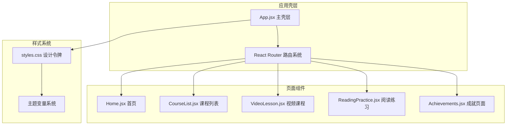
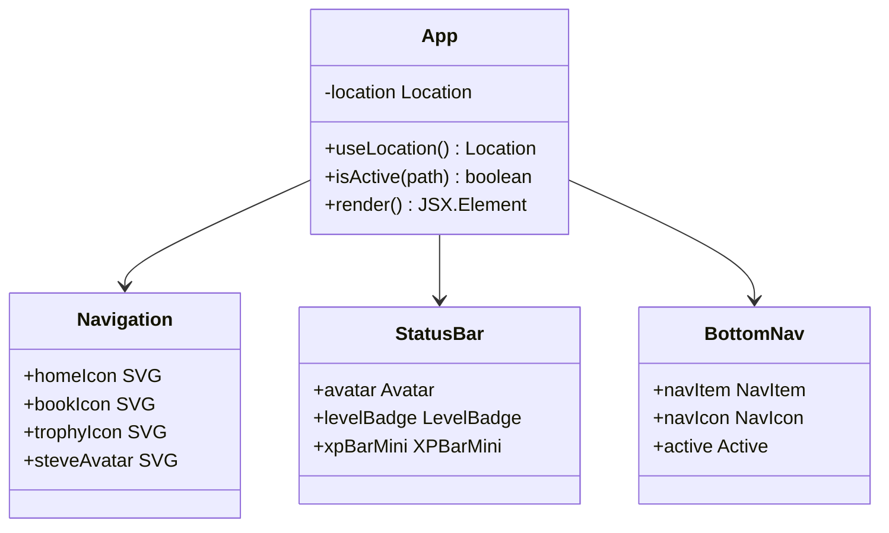
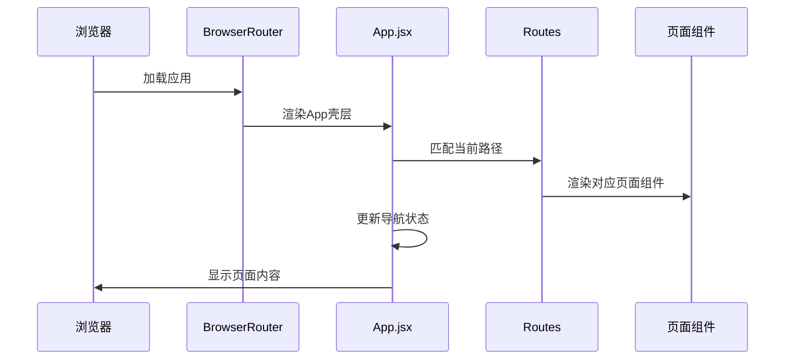
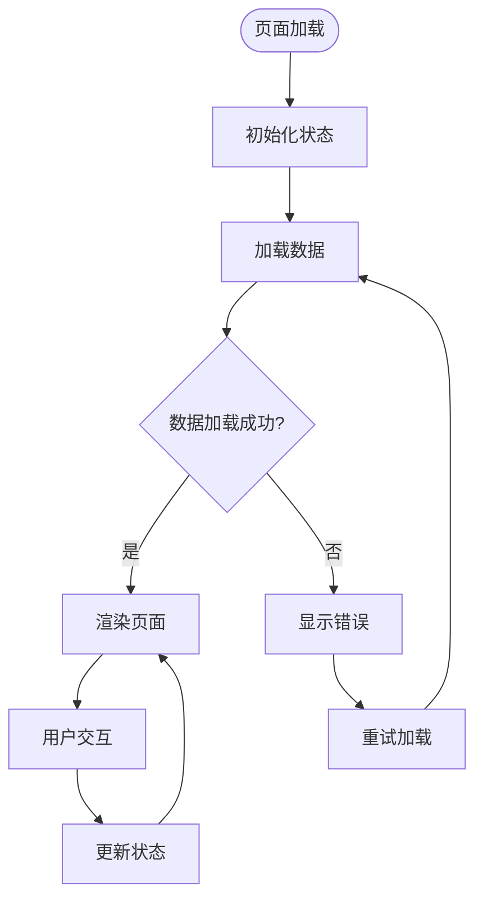

# 页面组件开发

<cite>
**本文档引用的文件**
- [App.jsx](file://src/App.jsx)
- [main.jsx](file://src/main.jsx)
- [Home.jsx](file://src/pages/Home.jsx)
- [CourseList.jsx](file://src/pages/CourseList.jsx)
- [VideoLesson.jsx](file://src/pages/VideoLesson.jsx)
- [ReadingPractice.jsx](file://src/pages/ReadingPractice.jsx)
- [Achievements.jsx](file://src/pages/Achievements.jsx)
- [styles.css](file://src/styles.css)
</cite>

## 目录
1. [项目概述](#项目概述)
2. [项目结构分析](#项目结构分析)
3. [核心组件架构](#核心组件架构)
4. [路由系统设计](#路由系统设计)
5. [页面组件开发流程](#页面组件开发流程)
6. [状态管理与数据流](#状态管理与数据流)
7. [条件渲染与动态内容](#条件渲染与动态内容)
8. [样式系统与响应式设计](#样式系统与响应式设计)
9. [页面间通信与数据传递](#页面间通信与数据传递)
10. [最佳实践与性能优化](#最佳实践与性能优化)
11. [故障排除指南](#故障排除指南)
12. [总结](#总结)

## 项目概述

这是一个基于React Vite构建的Minecraft主题英语学习应用，采用像素艺术风格设计。项目实现了完整的页面组件开发体系，包括主页、课程列表、视频课程、阅读练习和成就页面等核心功能模块。

## 项目结构分析

### 整体架构设计



**图表来源**
- [App.jsx:1-112](file://src/App.jsx#L1-L112)
- [main.jsx:1-14](file://src/main.jsx#L1-L14)

**章节来源**
- [App.jsx:1-112](file://src/App.jsx#L1-L112)
- [main.jsx:1-14](file://src/main.jsx#L1-L14)

## 核心组件架构

### 应用壳层设计模式

App.jsx采用了经典的"壳层-内容"架构模式，将导航、状态栏和主要内容区域清晰分离：



**图表来源**
- [App.jsx:47-112](file://src/App.jsx#L47-L112)

### 页面组件通用结构

所有页面组件都遵循统一的结构模式：

| 组件要素 | 描述 | 实现方式 |
|---------|------|----------|
| **头部区域** | 页面标题和描述 | 使用语义化HTML标签 |
| **内容网格** | 响应式布局容器 | CSS Grid系统 |
| **卡片组件** | 内容容器样式 | .card 和 .card-flat 类 |
| **交互元素** | 按钮、输入框等 | 基于CSS变量的主题系统 |

**章节来源**
- [Home.jsx:48-293](file://src/pages/Home.jsx#L48-L293)
- [CourseList.jsx:163-314](file://src/pages/CourseList.jsx#L163-L314)
- [VideoLesson.jsx:20-288](file://src/pages/VideoLesson.jsx#L20-L288)
- [ReadingPractice.jsx:45-293](file://src/pages/ReadingPractice.jsx#L45-L293)
- [Achievements.jsx:113-297](file://src/pages/Achievements.jsx#L113-L297)

## 路由系统设计

### 路由配置模式

项目采用React Router v6的声明式路由配置，所有页面路由都在App.jsx中集中管理：



**图表来源**
- [App.jsx:85-91](file://src/App.jsx#L85-L91)
- [main.jsx:7-13](file://src/main.jsx#L7-L13)

### 路由参数处理

不同类型的页面使用不同的路由参数模式：

| 页面类型 | 路由模式 | 参数用途 | 示例 |
|---------|----------|----------|------|
| 视频课程 | `/video/:id` | 课程ID标识 | `/video/1` |
| 阅读练习 | `/reading/:id` | 课程ID标识 | `/reading/1` |
| 课程列表 | `/courses` | 无参数 | `/courses` |
| 首页 | `/` | 根路径 | `/` |
| 成就页面 | `/achievements` | 无参数 | `/achievements` |

**章节来源**
- [App.jsx:86-90](file://src/App.jsx#L86-L90)
- [CourseList.jsx:209-210](file://src/pages/CourseList.jsx#L209-L210)

## 页面组件开发流程

### 第一步：创建页面组件文件

创建新的页面组件文件，遵循现有命名规范：

```javascript
// 新页面组件模板
import { useState } from 'react'

export default function NewPage(qoderProps) {
  // 状态管理
  const [state, setState] = useState(initialValue)
  
  return (
    <div data-component="new-page" style={{ ...({ display: 'flex', flexDirection: 'column', gap: 'var(--space-lg)' }), ...(qoderProps?.style) }} className={qoderProps?.className}>
      {/* 页面内容 */}
    </div>
  )
}
```

### 第二步：添加路由配置

在App.jsx中添加新的路由配置：

```javascript
<Route path="/newpage" element={<NewPage />} />
```

### 第三步：集成底部导航

为新页面添加底部导航项：

```javascript
<NavLink to="/newpage" className={`nav-item ${isActive('/newpage') ? 'active' : ''}`}>
  <span className="nav-icon">
    <CustomIcon />
  </span>
  <span>新页面</span>
</NavLink>
```

### 第四步：实现状态管理

根据页面需求实现相应的状态管理逻辑：

```javascript
const [data, setData] = useState([])
const [loading, setLoading] = useState(false)
const [error, setError] = useState(null)
```

### 第五步：样式集成

使用现有的CSS类和设计令牌：

```css
.card { /* 卡片样式 */ }
.card-flat { /* 平面卡片样式 */ }
.btn { /* 按钮基础样式 */ }
.chip { /* 标签样式 */ }
.progress-bar { /* 进度条样式 */ }
```

**章节来源**
- [App.jsx:85-108](file://src/App.jsx#L85-L108)
- [styles.css:341-436](file://src/styles.css#L341-L436)

## 状态管理与数据流

### 状态管理模式

项目采用React Hooks进行状态管理，不同页面使用不同的状态管理模式：



**图表来源**
- [VideoLesson.jsx:20-24](file://src/pages/VideoLesson.jsx#L20-L24)
- [ReadingPractice.jsx:45-50](file://src/pages/ReadingPractice.jsx#L45-L50)

### 数据流处理模式

不同类型的页面采用不同的数据流处理模式：

| 页面类型 | 数据流模式 | 状态管理 | 用户交互 |
|---------|------------|----------|----------|
| 首页 | 静态数据 | 无状态 | 导航跳转 |
| 课程列表 | 静态数据过滤 | useState | 过滤器切换 |
| 视频课程 | 动态交互 | useState | 字幕切换、测验 |
| 阅读练习 | 表单数据 | useState | 答案提交 |
| 成就页面 | 组合数据 | useState | 标签切换 |

**章节来源**
- [Home.jsx:48-293](file://src/pages/Home.jsx#L48-L293)
- [CourseList.jsx:163-314](file://src/pages/CourseList.jsx#L163-L314)
- [VideoLesson.jsx:20-288](file://src/pages/VideoLesson.jsx#L20-L288)
- [ReadingPractice.jsx:45-293](file://src/pages/ReadingPractice.jsx#L45-L293)
- [Achievements.jsx:113-297](file://src/pages/Achievements.jsx#L113-L297)

## 条件渲染与动态内容

### 条件渲染模式

项目广泛使用条件渲染来实现动态内容展示：

```javascript
// 基于状态的条件渲染
{condition && <Component />}
{value === 'option' && <OtherComponent />}

// 基于属性的对象渲染
{items.map(item => (
  <div key={item.id} className={item.active ? 'active' : ''}>
    {item.content}
  </div>
))}
```

### 动态内容加载

不同页面采用不同的动态内容加载策略：

| 页面类型 | 动态加载方式 | 数据源 | 更新机制 |
|---------|-------------|--------|----------|
| 首页 | 静态数据 | 组件内硬编码 | 无 |
| 课程列表 | 过滤器驱动 | 数组过滤 | useState |
| 视频课程 | 用户交互驱动 | 状态切换 | useState |
| 阅读练习 | 表单交互驱动 | 用户输入 | useState |
| 成就页面 | 标签切换驱动 | 多个数据集 | useState |

**章节来源**
- [CourseList.jsx:173-176](file://src/pages/CourseList.jsx#L173-L176)
- [VideoLesson.jsx:122-136](file://src/pages/VideoLesson.jsx#L122-L136)
- [ReadingPractice.jsx:209-266](file://src/pages/ReadingPractice.jsx#L209-L266)

## 样式系统与响应式设计

### 设计令牌系统

项目采用CSS自定义属性作为设计令牌，实现主题化样式：

```css
:root {
  --color-grass: #4CAF50;
  --color-grass-wash: #E8F5E9;
  --color-success: #6FBA2C;
  --space-lg: 24px;
  --radius-lg: 24px;
  --font-display: 'Nunito', sans-serif;
}
```

### 响应式布局模式

采用CSS Grid和Flexbox实现响应式布局：

```css
/* 课程网格布局 */
.course-grid {
  display: grid;
  grid-template-columns: repeat(2, 1fr);
  gap: var(--space-md);
}

/* 阅读练习双列布局 */
.reading-layout {
  display: grid;
  grid-template-columns: 1.2fr 1fr;
  gap: var(--space-lg);
}
```

### 组件样式模式

每个页面组件都有统一的样式结构：

```javascript
<div data-component="page-name" style={{
  display: 'flex', 
  flexDirection: 'column', 
  gap: 'var(--space-lg)'
}}>
  <section data-component="section-name" className="card">
    {/* 内容 */}
  </section>
</div>
```

**章节来源**
- [styles.css:6-87](file://src/styles.css#L6-L87)
- [styles.css:142-161](file://src/styles.css#L142-L161)
- [styles.css:341-360](file://src/styles.css#L341-L360)

## 页面间通信与数据传递

### Props传递模式

页面组件通过props接收数据和事件处理函数：

```javascript
// 父组件传递数据
<ChildComponent 
  data={parentData}
  onAction={handleAction}
  className="custom-class"
  style={{ custom: 'style' }}
/>

// 子组件接收和使用
export default function ChildComponent({ data, onAction, className, style }) {
  return (
    <div className={className} style={style}>
      {data.map(item => (
        <button key={item.id} onClick={() => onAction(item)}>
          {item.name}
        </button>
      ))}
    </div>
  )
}
```

### 事件处理模式

统一的事件处理模式确保组件间的良好通信：

```javascript
const handleNavigation = (targetPath) => {
  // 导航逻辑
}

const handleStateChange = (newValue) => {
  // 状态更新逻辑
}

const handleSubmit = (event) => {
  event.preventDefault()
  // 提交逻辑
}
```

### 数据传递最佳实践

| 传递类型 | 方式 | 适用场景 | 注意事项 |
|---------|------|----------|----------|
| 简单数据 | props | 标题、描述、静态文本 | 避免传递复杂对象 |
| 函数回调 | props | 事件处理、状态更新 | 确保函数绑定正确 |
| 样式定制 | props | 自定义样式覆盖 | 使用CSS变量 |
| 组件扩展 | children | 动态内容插入 | 保持组件解耦 |

**章节来源**
- [App.jsx:47-112](file://src/App.jsx#L47-L112)
- [Home.jsx:48-293](file://src/pages/Home.jsx#L48-L293)

## 最佳实践与性能优化

### 性能优化策略

1. **组件拆分**：将大组件拆分为多个小组件，提高复用性
2. **状态局部化**：只在需要的组件中维护状态
3. **条件渲染**：避免不必要的组件重新渲染
4. **样式优化**：使用CSS变量减少样式计算

### 代码组织最佳实践

```javascript
// 推荐：模块化导入
import { useState, useEffect } from 'react'
import { Link } from 'react-router-dom'

// 推荐：组件导出
export default function MyComponent(props) {
  // 组件逻辑
}

// 推荐：常量定义
const MAX_ITEMS = 100
const DEFAULT_CONFIG = {}

// 推荐：函数封装
const formatDate = (date) => date.toLocaleDateString()
```

### 错误处理模式

```javascript
const [error, setError] = useState(null)
const [loading, setLoading] = useState(false)

const fetchData = async () => {
  try {
    setLoading(true)
    const data = await api.getData()
    setData(data)
  } catch (err) {
    setError(err.message)
  } finally {
    setLoading(false)
  }
}
```

## 故障排除指南

### 常见问题诊断

| 问题类型 | 症状 | 解决方案 |
|---------|------|----------|
| 路由不生效 | 页面空白或404 | 检查路由路径和组件导入 |
| 样式不显示 | 组件无样式 | 确认CSS文件导入和类名正确 |
| 状态不更新 | UI不刷新 | 检查useState使用和状态更新函数 |
| 导航失效 | 点击无反应 | 验证Link组件和to属性 |

### 调试技巧

1. **使用React DevTools**：检查组件树和状态变化
2. **控制台日志**：在关键位置添加console.log
3. **浏览器开发者工具**：检查网络请求和样式应用
4. **组件测试**：编写单元测试验证组件行为

### 性能监控

```javascript
// 使用React Profiler监控性能
import { Profiler } from 'react'

<Profiler id="MyComponent" onRender={callback}>
  <MyComponent />
</Profiler>
```

## 总结

本项目展示了如何基于现有的页面组件结构创建新的学习功能页面。通过统一的架构模式、完善的路由系统、灵活的状态管理和丰富的样式系统，开发者可以快速构建高质量的教育应用页面。

关键要点包括：
- 遵循既定的组件结构和命名约定
- 利用现有的路由和导航系统
- 采用React Hooks进行状态管理
- 使用设计令牌系统确保视觉一致性
- 实现响应式布局适配不同设备

这些模式和实践为后续的功能扩展和页面开发提供了坚实的基础。