# 快速开始

<cite>
**本文档引用的文件**
- [package.json](file://package.json)
- [vite.config.js](file://vite.config.js)
- [index.html](file://index.html)
- [src/main.jsx](file://src/main.jsx)
- [src/App.jsx](file://src/App.jsx)
- [src/styles.css](file://src/styles.css)
- [src/pages/Home.jsx](file://src/pages/Home.jsx)
- [src/pages/CourseList.jsx](file://src/pages/CourseList.jsx)
- [src/pages/VideoLesson.jsx](file://src/pages/VideoLesson.jsx)
- [src/pages/ReadingPractice.jsx](file://src/pages/ReadingPractice.jsx)
- [src/pages/Achievements.jsx](file://src/pages/Achievements.jsx)
- [public/canvas-selection-bridge.js](file://public/canvas-selection-bridge.js)
- [canvas-design.html](file://canvas-design.html)
- [AGENTS.md](file://AGENTS.md)
</cite>

## 目录
1. [简介](#简介)
2. [项目结构](#项目结构)
3. [核心组件](#核心组件)
4. [架构概览](#架构概览)
5. [详细组件分析](#详细组件分析)
6. [依赖分析](#依赖分析)
7. [性能考虑](#性能考虑)
8. [故障排除指南](#故障排除指南)
9. [结论](#结论)
10. [附录](#附录)

## 简介

CraftWords 是一个基于 Minecraft 主题的英语学习应用，采用 React + Vite 技术栈构建。该项目通过游戏化的学习体验，帮助用户在熟悉的 Minecraft 世界中提升英语水平。

本快速开始指南旨在帮助开发者在30分钟内完成项目的搭建、运行和基本理解。项目使用现代前端技术栈，具有良好的开发体验和扩展性。

## 项目结构

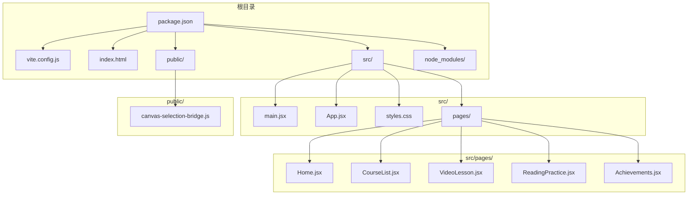

**图表来源**
- [package.json:1-22](file://package.json#L1-L22)
- [src/main.jsx:1-14](file://src/main.jsx#L1-L14)
- [src/App.jsx:1-112](file://src/App.jsx#L1-L112)

### 目录结构说明

- **根目录**: 包含项目配置文件和入口文件
- **src/**: 源代码目录，包含所有 React 组件和样式
- **src/pages/**: 页面级组件，每个页面对应一个功能模块
- **public/**: 静态资源文件，包含 Canvas 集成脚本

**章节来源**
- [package.json:1-22](file://package.json#L1-L22)
- [index.html:1-20](file://index.html#L1-L20)

## 核心组件

### 应用入口与路由系统

应用采用 React Router 进行页面导航，主应用组件负责整体布局和导航栏管理。

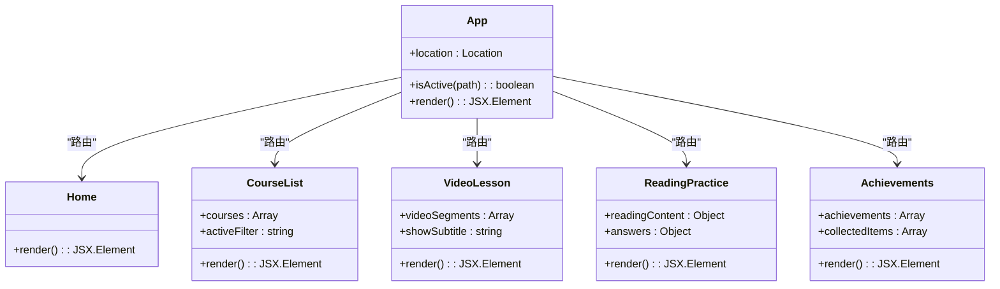

**图表来源**
- [src/App.jsx:47-112](file://src/App.jsx#L47-L112)
- [src/pages/Home.jsx:48-293](file://src/pages/Home.jsx#L48-L293)
- [src/pages/CourseList.jsx:163-314](file://src/pages/CourseList.jsx#L163-L314)

### 设计系统与主题

项目采用基于 CSS 变量的设计令牌系统，实现统一的主题管理和响应式设计。

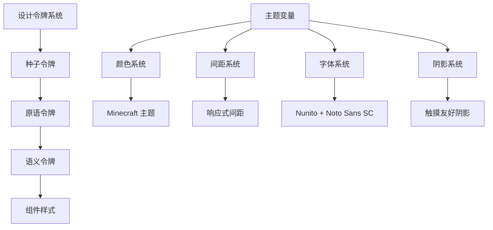

**图表来源**
- [src/styles.css:7-87](file://src/styles.css#L7-L87)
- [src/styles.css:143-161](file://src/styles.css#L143-L161)

**章节来源**
- [src/App.jsx:1-112](file://src/App.jsx#L1-L112)
- [src/styles.css:1-499](file://src/styles.css#L1-L499)

## 架构概览

### 技术栈架构

```mermaid
graph LR
subgraph "前端层"
A[React 18.2.0] --> B[React Router DOM 6.20.0]
A --> C[CSS 变量系统]
end
subgraph "构建工具层"
D[Vite 5.0.0] --> E[开发服务器]
D --> F[生产构建]
D --> G[热重载]
end
subgraph "插件生态"
H[@vitejs/plugin-react 4.2.0] --> I[React Fast Refresh]
J[Canvas 集成] --> K[选择桥接]
end
subgraph "运行时"
L[浏览器] --> M[移动端适配]
L --> N[桌面端优化]
end
A -.-> D
H -.-> D
J -.-> O[public/canvas-selection-bridge.js]
```

**图表来源**
- [package.json:12-20](file://package.json#L12-L20)
- [vite.config.js:1-11](file://vite.config.js#L1-L11)

### 开发服务器工作原理

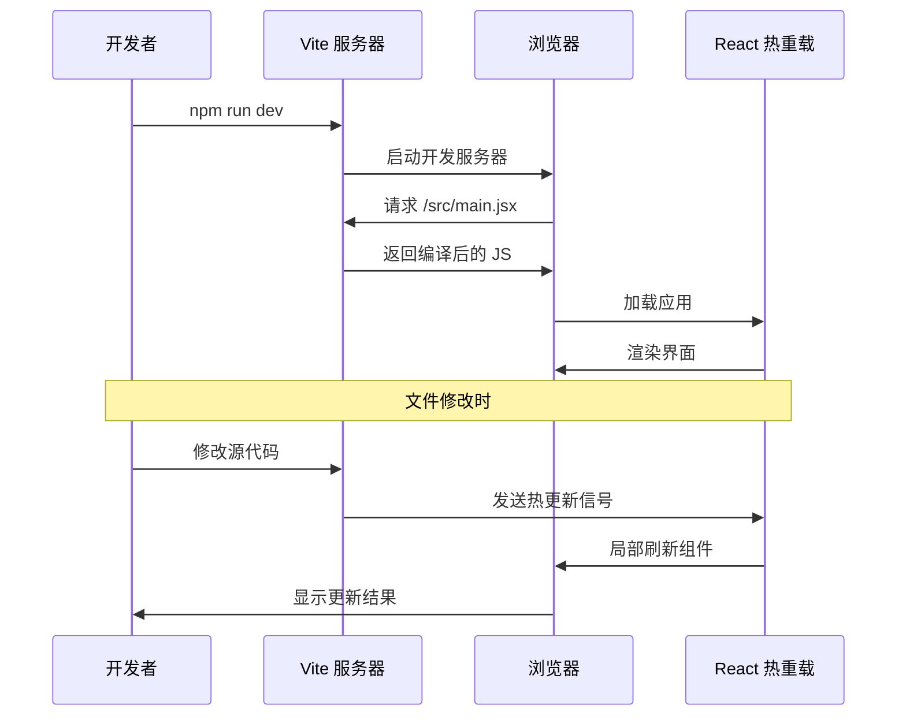

**图表来源**
- [vite.config.js:6-9](file://vite.config.js#L6-L9)
- [src/main.jsx:1-14](file://src/main.jsx#L1-L14)

**章节来源**
- [package.json:1-22](file://package.json#L1-L22)
- [vite.config.js:1-11](file://vite.config.js#L1-L11)

## 详细组件分析

### 主应用组件 (App.jsx)

App 组件是整个应用的核心容器，负责：

- **顶部状态栏**: 显示用户头像、等级、经验值和连续学习天数
- **主内容区域**: 使用 React Router 管理页面切换
- **底部导航**: 提供四个主要功能模块的快捷访问

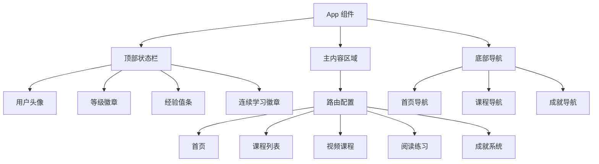

**图表来源**
- [src/App.jsx:56-111](file://src/App.jsx#L56-L111)

### 首页组件 (Home.jsx)

首页作为用户的主要入口，提供：

- **欢迎横幅**: Minecraft 风格的欢迎界面
- **每日进度**: 显示经验值和连续学习天数
- **今日任务**: 推荐的学习任务卡片
- **最近成就**: 展示用户的最新成就

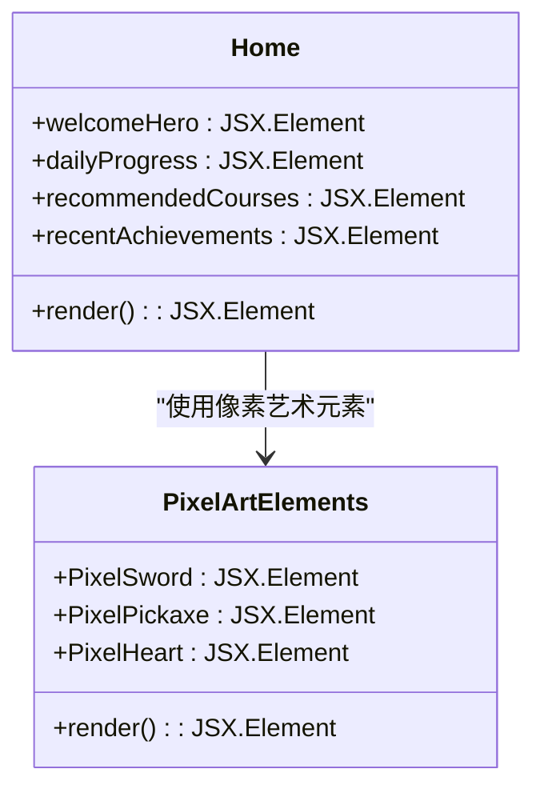

**图表来源**
- [src/pages/Home.jsx:48-293](file://src/pages/Home.jsx#L48-L293)

**章节来源**
- [src/pages/Home.jsx:1-293](file://src/pages/Home.jsx#L1-L293)

### 课程列表组件 (CourseList.jsx)

课程列表组件提供：

- **课程分类筛选**: 支持听力、阅读、词汇三类课程
- **课程卡片**: 展示课程标题、难度、进度和奖励
- **进度跟踪**: 显示已完成的课程和解锁状态

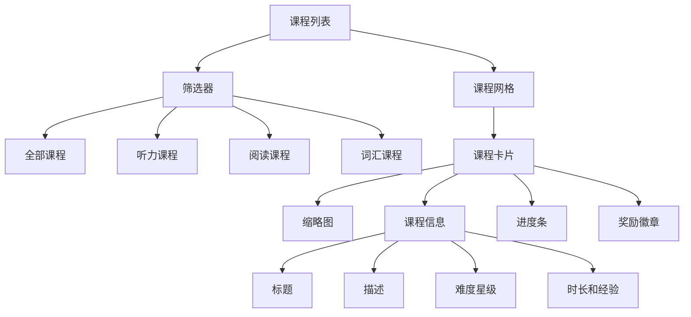

**图表来源**
- [src/pages/CourseList.jsx:163-314](file://src/pages/CourseList.jsx#L163-L314)

**章节来源**
- [src/pages/CourseList.jsx:1-314](file://src/pages/CourseList.jsx#L1-L314)

### 视频课程组件 (VideoLesson.jsx)

视频课程组件实现：

- **视频播放器**: 模拟 Minecraft 风格的视频播放界面
- **字幕系统**: 支持英文和中英对照显示
- **学习进度**: 时间轴标记和段落划分
- **听力测试**: 互动式问答练习

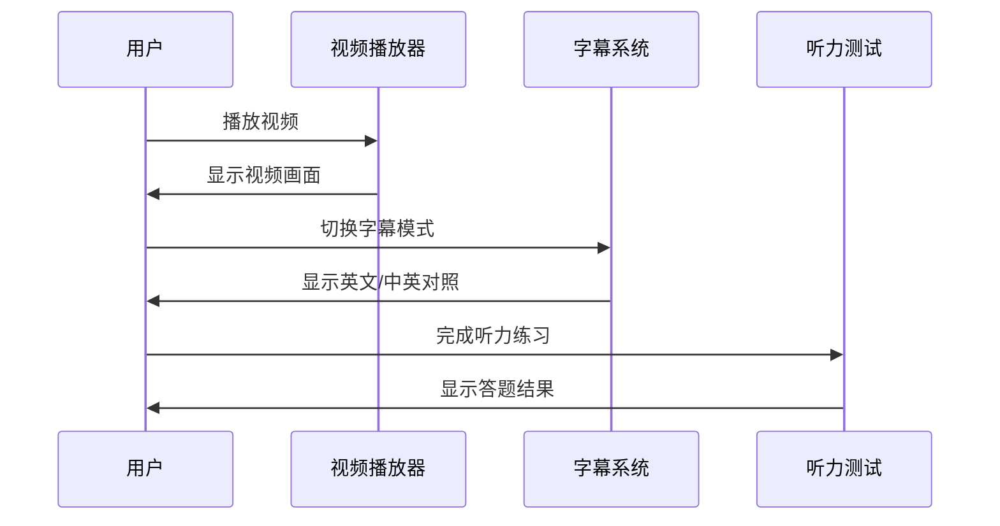

**图表来源**
- [src/pages/VideoLesson.jsx:20-288](file://src/pages/VideoLesson.jsx#L20-L288)

**章节来源**
- [src/pages/VideoLesson.jsx:1-288](file://src/pages/VideoLesson.jsx#L1-L288)

### 阅读练习组件 (ReadingPractice.jsx)

阅读练习组件包含：

- **阅读材料**: Minecraft 相关的英语文章
- **词汇学习**: 可点击保存的词汇卡片
- **理解测试**: 多种题型的阅读理解练习
- **进度反馈**: 实时的答案检查和结果展示

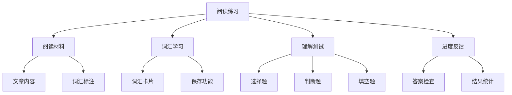

**图表来源**
- [src/pages/ReadingPractice.jsx:45-293](file://src/pages/ReadingPractice.jsx#L45-L293)

**章节来源**
- [src/pages/ReadingPractice.jsx:1-293](file://src/pages/ReadingPractice.jsx#L1-L293)

### 成就系统组件 (Achievements.jsx)

成就系统组件提供：

- **等级概览**: 显示用户当前等级和经验值
- **成就徽章**: 展示已获得和未获得的成就
- **物品收藏**: Minecraft 风格的虚拟物品收集
- **统计数据**: 学习进度和成果统计

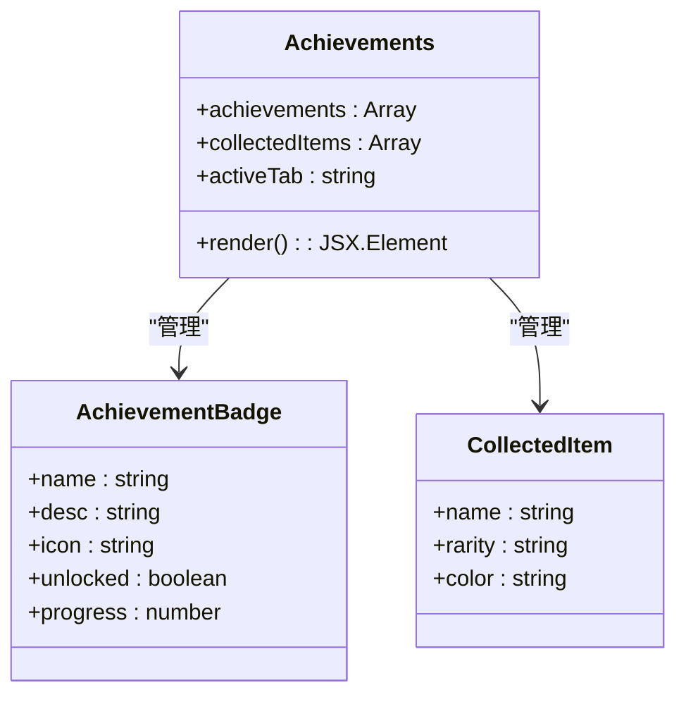

**图表来源**
- [src/pages/Achievements.jsx:113-297](file://src/pages/Achievements.jsx#L113-L297)

**章节来源**
- [src/pages/Achievements.jsx:1-297](file://src/pages/Achievements.jsx#L1-L297)

## 依赖分析

### 核心依赖关系

```mermaid
graph TB
subgraph "运行时依赖"
A[react ^18.2.0] --> B[react-dom ^18.2.0]
C[react-router-dom ^6.20.0] --> A
end
subgraph "开发依赖"
D[vite ^5.0.0] --> E[@vitejs/plugin-react ^4.2.0]
F[react-refresh] --> E
end
subgraph "项目配置"
G[package.json] --> A
G --> D
G --> H[vite.config.js]
H --> E
end
```

**图表来源**
- [package.json:12-20](file://package.json#L12-L20)
- [vite.config.js:1-11](file://vite.config.js#L1-L11)

### 项目启动流程

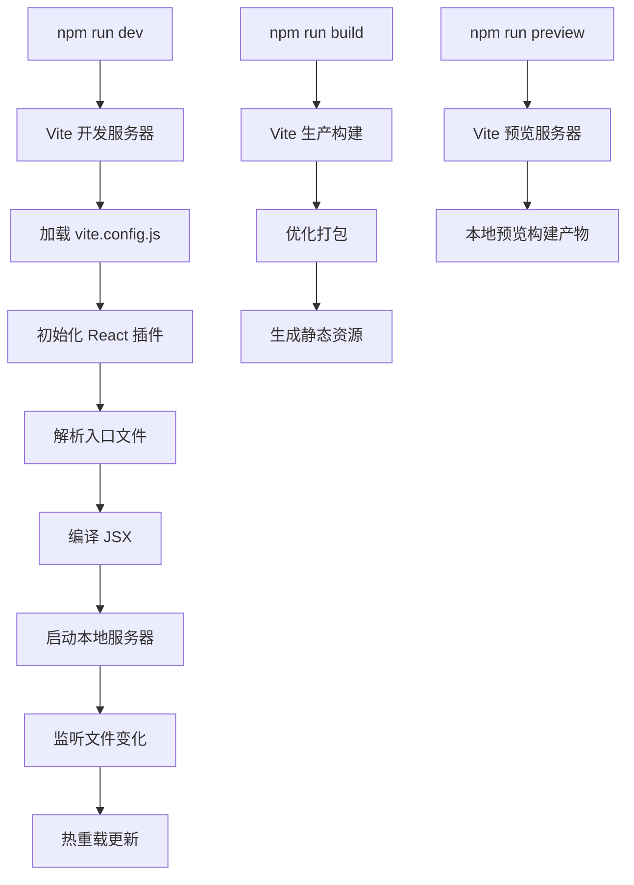

**图表来源**
- [package.json:6-11](file://package.json#L6-L11)
- [vite.config.js:1-11](file://vite.config.js#L1-L11)

**章节来源**
- [package.json:1-22](file://package.json#L1-L22)
- [vite.config.js:1-11](file://vite.config.js#L1-L11)

## 性能考虑

### 代码分割与懒加载

项目采用 React Router 的动态导入实现代码分割，确保首屏加载性能：

- **路由级别的代码分割**: 每个页面组件独立打包
- **按需加载**: 用户访问特定页面时才加载对应代码
- **缓存策略**: Vite 自动生成的哈希文件名支持长期缓存

### 样式优化

- **CSS 变量系统**: 减少重复样式定义，提高维护效率
- **原子化设计**: 使用预定义的样式类，减少 CSS 体积
- **响应式设计**: 针对不同屏幕尺寸优化布局

### 图片和媒体优化

- **像素艺术风格**: 使用 SVG 实现清晰的像素效果
- **内联图标**: 小图标直接嵌入组件，减少 HTTP 请求
- **媒体资源**: 合理的图片尺寸和格式选择

## 故障排除指南

### 常见启动问题

**问题**: 启动时出现端口占用错误
- **解决方法**: 修改 `vite.config.js` 中的端口号，默认为 5173
- **参考**: [vite.config.js:6-9](file://vite.config.js#L6-L9)

**问题**: 依赖安装失败
- **解决方法**: 清理缓存后重新安装
```bash
npm cache clean --force
rm -rf node_modules package-lock.json
npm install
```

**问题**: 热重载不生效
- **解决方法**: 检查文件保存和网络连接
- **参考**: [src/main.jsx:1-14](file://src/main.jsx#L1-L14)

### 开发工具集成

**Canvas 设计集成**:
- 项目包含 Canvas 集成脚本，支持可视化设计工具
- 通过 `canvas-design.html` 访问设计预览
- 参考: [public/canvas-selection-bridge.js:1-800](file://public/canvas-selection-bridge.js#L1-L800)

**开发命令差异**:
- 标准开发: `npm run dev`
- Canvas 开发: `npm run dev:design`
- 参考: [AGENTS.md:20-21](file://AGENTS.md#L20-L21)

**章节来源**
- [vite.config.js:6-9](file://vite.config.js#L6-L9)
- [src/main.jsx:1-14](file://src/main.jsx#L1-L14)
- [AGENTS.md:1-45](file://AGENTS.md#L1-L45)

## 结论

CraftWords 项目展示了如何将游戏化元素与教育内容有效结合，通过现代化的技术栈提供了优秀的开发和用户体验。项目结构清晰，组件职责明确，具有良好的可扩展性和维护性。

通过本快速开始指南，开发者应该能够：
- 成功搭建和运行项目
- 理解项目的基本架构和组件关系
- 掌握开发服务器的工作原理
- 解决常见的开发问题
- 为后续的功能扩展做好准备

## 附录

### 快速命令参考

```bash
# 安装依赖
npm install

# 开发模式
npm run dev

# 生产构建
npm run build

# 预览构建结果
npm run preview

# Canvas 设计模式
npm run dev:design
```

### 关键配置文件说明

- **package.json**: 项目配置和依赖管理
- **vite.config.js**: Vite 构建工具配置
- **index.html**: 应用入口 HTML 模板
- **src/styles.css**: 全局样式和设计令牌

### 技术特性总结

- **React 18**: 最新版本的 React 特性支持
- **Vite 5**: 快速的开发体验和构建工具
- **CSS 变量系统**: 灵活的主题定制能力
- **响应式设计**: 适配多种设备和屏幕尺寸
- **游戏化学习**: Minecraft 主题的沉浸式学习体验