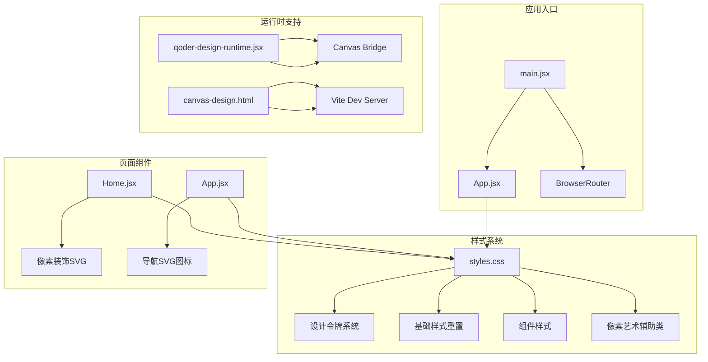
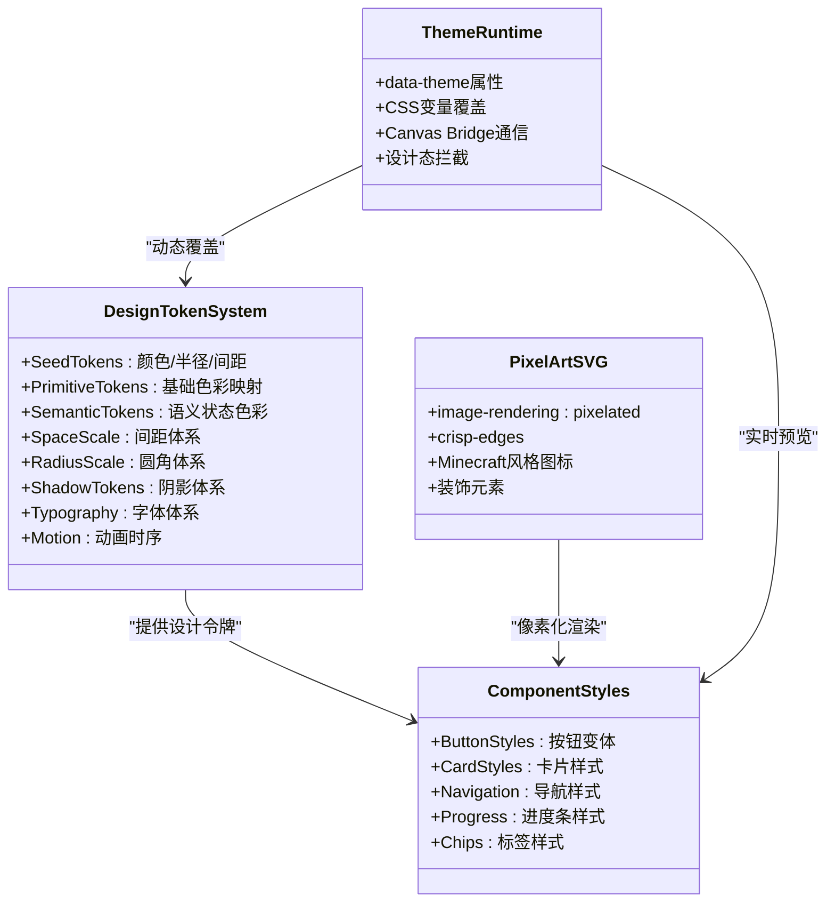
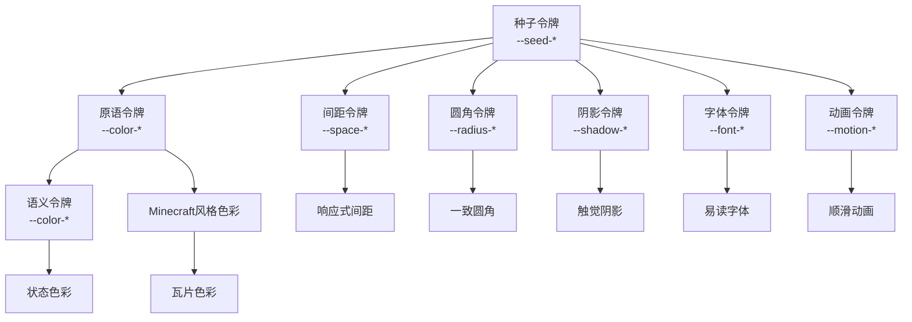
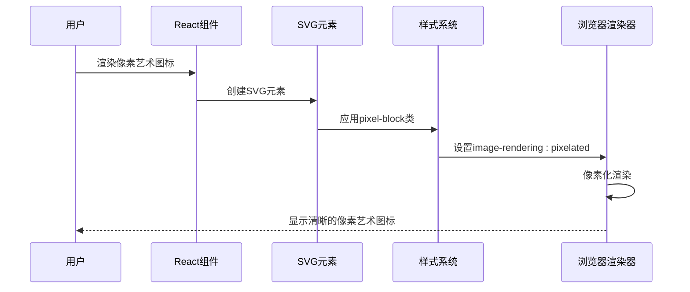
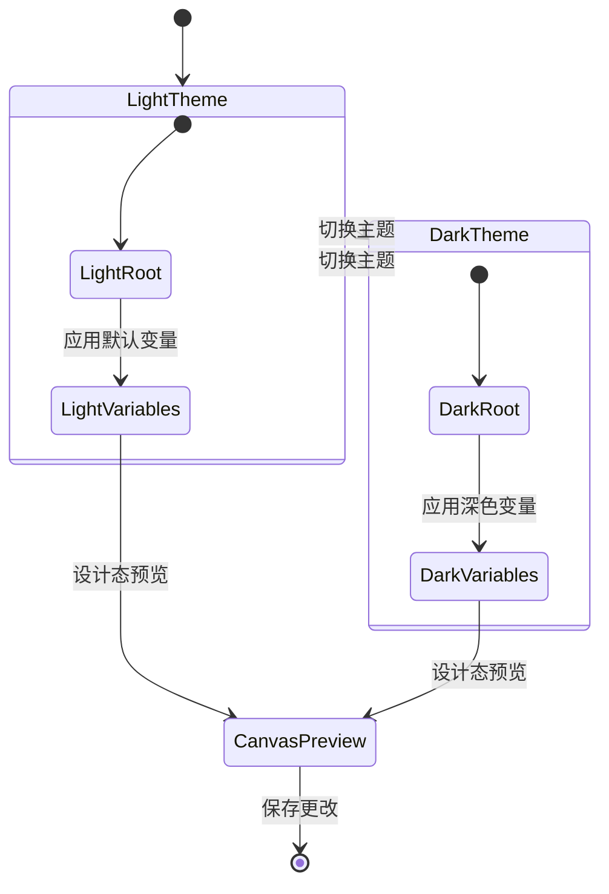
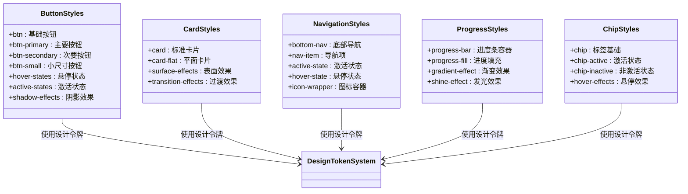
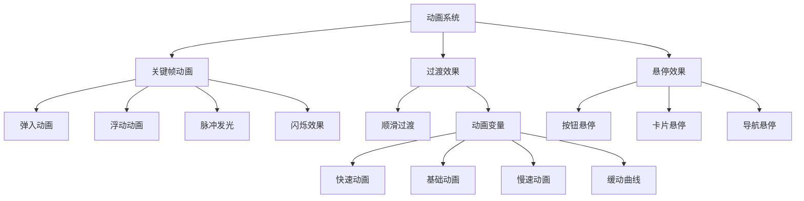
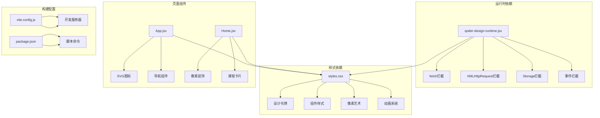

# 样式与主题

<cite>
**本文档引用的文件**
- [styles.css](file://src/styles.css)
- [qoder-design-runtime.jsx](file://src/qoder-design-runtime.jsx)
- [main.jsx](file://src/main.jsx)
- [App.jsx](file://src/App.jsx)
- [Home.jsx](file://src/pages/Home.jsx)
- [canvas-design.html](file://canvas-design.html)
- [package.json](file://package.json)
- [vite.config.js](file://vite.config.js)
- [canvas-selection-bridge.js](file://public/canvas-selection-bridge.js)
</cite>

## 目录
1. [简介](#简介)
2. [项目结构](#项目结构)
3. [核心组件](#核心组件)
4. [架构总览](#架构总览)
5. [详细组件分析](#详细组件分析)
6. [依赖关系分析](#依赖关系分析)
7. [性能考虑](#性能考虑)
8. [故障排除指南](#故障排除指南)
9. [结论](#结论)
10. [附录](#附录)

## 简介
本项目是一个以Minecraft为主题的英语学习应用，采用设计令牌系统（Design Token System）构建样式体系，结合像素艺术风格的SVG图标与装饰元素，实现了统一、可维护且具备良好可扩展性的前端样式架构。系统通过CSS自定义属性（CSS Variables）实现主题切换与设计令牌管理，并在Qoder Design Runtime的支持下，提供可视化设计预览与实时样式调整能力。

## 项目结构
项目采用React + Vite技术栈，样式系统集中于全局CSS文件，配合运行时脚本实现设计态与开发态的无缝衔接。

**图表来源**
- [main.jsx:1-14](file://src/main.jsx#L1-L14)
- [styles.css:1-499](file://src/styles.css#L1-L499)
- [qoder-design-runtime.jsx:1-101](file://src/qoder-design-runtime.jsx#L1-L101)
- [canvas-design.html:1-20](file://canvas-design.html#L1-L20)

**章节来源**
- [main.jsx:1-14](file://src/main.jsx#L1-L14)
- [styles.css:1-499](file://src/styles.css#L1-L499)
- [qoder-design-runtime.jsx:1-101](file://src/qoder-design-runtime.jsx#L1-L101)
- [canvas-design.html:1-20](file://canvas-design.html#L1-L20)

## 核心组件
本项目的样式系统围绕以下核心组件构建：
- 设计令牌系统：基于CSS自定义属性的分层设计令牌，包括种子令牌、原语令牌、语义令牌等
- 像素艺术SVG：通过image-rendering属性实现像素化渲染的SVG图标与装饰元素
- 主题切换机制：通过数据属性与CSS变量实现主题状态管理
- 组件样式库：按钮、卡片、导航、进度条等UI组件的样式规范
- 动画与过渡：基于CSS变量的动画时序与缓动函数控制

**章节来源**
- [styles.css:6-87](file://src/styles.css#L6-L87)
- [styles.css:451-455](file://src/styles.css#L451-L455)
- [App.jsx:8-45](file://src/App.jsx#L8-L45)
- [Home.jsx:4-46](file://src/pages/Home.jsx#L4-L46)

## 架构总览
系统采用"设计令牌驱动 + 运行时增强"的架构模式，通过CSS变量实现设计令牌的集中管理，通过Qoder Design Runtime提供可视化设计预览与实时样式调整能力。

**图表来源**
- [styles.css:6-87](file://src/styles.css#L6-L87)
- [styles.css:451-455](file://src/styles.css#L451-L455)
- [qoder-design-runtime.jsx:6-101](file://src/qoder-design-runtime.jsx#L6-L101)

## 详细组件分析

### 设计令牌系统
设计令牌系统采用分层架构，从种子令牌到语义令牌逐层抽象，确保设计一致性与可维护性。

**图表来源**
- [styles.css:6-87](file://src/styles.css#L6-L87)

设计令牌系统的关键特性：
- **种子令牌**：定义基础色彩（背景、前景、主色、强调色、表面色）和基础半径
- **原语令牌**：将种子令牌映射为基础色彩（奶油色、表面色、标题色、正文色等）
- **语义令牌**：定义业务相关的状态色彩（成功、警告、危险、经验值等）
- **Minecraft风格色彩**：专为游戏主题设计的绿色系、大地色调、宝石色
- **瓦片色彩**：用于课程分类的8种鲜艳色彩

**章节来源**
- [styles.css:6-87](file://src/styles.css#L6-L87)

### 像素艺术SVG系统
像素艺术SVG通过专门的CSS类实现像素化渲染，确保图标在高分辨率屏幕上的清晰度。

**图表来源**
- [styles.css:451-455](file://src/styles.css#L451-L455)
- [App.jsx:31-45](file://src/App.jsx#L31-L45)
- [Home.jsx:4-46](file://src/pages/Home.jsx#L4-L46)

像素艺术系统的核心实现：
- **pixel-block类**：设置image-rendering属性，确保像素化渲染
- **Minecraft风格图标**：HomeIcon、BookIcon、TrophyIcon等SVG路径
- **装饰元素**：剑、镐、心形等像素化图标组件
- **视口适配**：使用16x16或12x12的视口确保比例一致

**章节来源**
- [styles.css:451-455](file://src/styles.css#L451-L455)
- [App.jsx:8-45](file://src/App.jsx#L8-L45)
- [Home.jsx:4-46](file://src/pages/Home.jsx#L4-L46)

### 主题切换机制
系统通过数据属性与CSS变量实现主题状态管理，支持设计态与开发态的无缝切换。

**图表来源**
- [canvas-selection-bridge.js:802-811](file://public/canvas-selection-bridge.js#L802-L811)

主题切换的关键实现：
- **data-theme属性**：在HTML和body元素上设置主题状态
- **CSS变量覆盖**：通过JavaScript动态修改:root中的CSS变量
- **设计态拦截**：Qoder Design Runtime拦截网络请求，提供设计态环境
- **实时预览**：Canvas Bridge实现设计工具与应用的双向通信

**章节来源**
- [canvas-selection-bridge.js:802-811](file://public/canvas-selection-bridge.js#L802-L811)
- [qoder-design-runtime.jsx:6-101](file://src/qoder-design-runtime.jsx#L6-L101)

### 组件样式库
系统提供完整的UI组件样式库，涵盖按钮、卡片、导航、进度条等常用组件。

**图表来源**
- [styles.css:267-340](file://src/styles.css#L267-L340)
- [styles.css:341-359](file://src/styles.css#L341-L359)
- [styles.css:217-266](file://src/styles.css#L217-L266)
- [styles.css:361-387](file://src/styles.css#L361-L387)
- [styles.css:389-417](file://src/styles.css#L389-L417)

组件样式的模块化组织：
- **按钮系统**：支持多种尺寸和状态，使用CSS变量统一管理色彩和阴影
- **卡片系统**：提供标准卡片和平面卡片两种样式，支持悬停提升效果
- **导航系统**：底部导航采用Minecraft风格的像素化设计
- **进度系统**：进度条支持渐变填充和发光效果
- **标签系统**：标签组件支持激活和非激活状态

**章节来源**
- [styles.css:267-417](file://src/styles.css#L267-L417)

### 动画与过渡系统
系统提供丰富的动画效果，通过CSS变量控制动画时序和缓动函数。

**图表来源**
- [styles.css:457-485](file://src/styles.css#L457-L485)
- [styles.css:82-86](file://src/styles.css#L82-L86)

动画系统的关键实现：
- **动画变量**：通过--motion-*变量统一控制动画时序
- **关键帧动画**：提供弹入、浮动、脉冲、闪烁等动画效果
- **悬停效果**：按钮、卡片、导航等组件的悬停状态
- **无障碍支持**：支持减少动画的用户偏好设置

**章节来源**
- [styles.css:457-498](file://src/styles.css#L457-L498)

## 依赖关系分析

**图表来源**
- [qoder-design-runtime.jsx:6-101](file://src/qoder-design-runtime.jsx#L6-L101)
- [styles.css:1-499](file://src/styles.css#L1-L499)
- [App.jsx:47-112](file://src/App.jsx#L47-L112)
- [Home.jsx:48-293](file://src/pages/Home.jsx#L48-L293)
- [vite.config.js:1-11](file://vite.config.js#L1-L11)
- [package.json:1-22](file://package.json#L1-L22)

依赖关系的关键点：
- **运行时拦截**：Qoder Design Runtime通过拦截浏览器API提供设计态环境
- **样式集中管理**：所有组件共享同一套设计令牌和样式规范
- **组件复用**：SVG图标和像素装饰在多个页面中重复使用
- **构建工具链**：Vite提供开发服务器和热重载功能

**章节来源**
- [qoder-design-runtime.jsx:6-101](file://src/qoder-design-runtime.jsx#L6-L101)
- [styles.css:1-499](file://src/styles.css#L1-L499)
- [vite.config.js:1-11](file://vite.config.js#L1-L11)
- [package.json:1-22](file://package.json#L1-L22)

## 性能考虑
系统在性能方面采用了多项优化策略：

### 样式性能优化
- **CSS变量缓存**：通过CSS变量避免重复计算，提高渲染性能
- **硬件加速**：使用transform和opacity属性触发GPU加速
- **最小化重排**：合理使用布局属性，减少强制同步布局
- **媒体查询优化**：针对不同设备使用合适的图片渲染策略

### 运行时性能优化
- **请求拦截**：Qoder Design Runtime拦截不必要的网络请求
- **存储隔离**：模拟存储API，避免真实存储操作影响性能
- **事件节流**：通过事件拦截减少不必要的DOM操作

### 像素艺术性能
- **图像渲染优化**：使用image-rendering: pixelated确保清晰度的同时保持性能
- **SVG优化**：精简SVG路径，减少DOM节点数量
- **缓存策略**：利用浏览器缓存机制提升SVG加载速度

## 故障排除指南

### 常见问题诊断
1. **主题切换失效**
   - 检查data-theme属性是否正确设置
   - 验证CSS变量覆盖是否生效
   - 确认Canvas Bridge通信正常

2. **像素艺术模糊**
   - 确认pixel-block类已正确应用
   - 检查image-rendering属性设置
   - 验证SVG视口尺寸是否合适

3. **动画异常**
   - 检查CSS变量是否正确配置
   - 确认动画时序和缓动函数设置
   - 验证无障碍模式下的动画禁用

### 调试技巧
- **开发者工具**：使用浏览器开发者工具检查CSS变量值
- **实时预览**：通过Qoder Design Runtime实时查看样式变化
- **断点调试**：在JavaScript中设置断点观察变量覆盖过程
- **性能分析**：使用性能面板分析渲染性能瓶颈

**章节来源**
- [qoder-design-runtime.jsx:6-101](file://src/qoder-design-runtime.jsx#L6-L101)
- [canvas-selection-bridge.js:765-811](file://public/canvas-selection-bridge.js#L765-L811)

## 结论
本项目的样式系统通过设计令牌驱动的方式，实现了Minecraft主题应用的统一视觉语言。系统不仅提供了完整的组件样式库，还通过Qoder Design Runtime实现了可视化设计预览与实时样式调整能力。像素艺术SVG的集成确保了在现代Web环境中的清晰显示，而基于CSS变量的主题切换机制则为未来的主题扩展奠定了坚实基础。

该系统在设计一致性、可维护性和扩展性方面表现出色，为类似教育类应用的样式架构提供了优秀的参考模板。

## 附录

### 设计系统最佳实践
- **一致性**：通过设计令牌确保所有组件使用相同的色彩、间距和字体
- **可访问性**：提供高对比度选项和减少动画的用户偏好支持
- **响应式设计**：使用CSS变量和媒体查询适配不同设备
- **性能优化**：合理使用硬件加速和缓存策略

### 扩展建议
- **主题系统增强**：可以添加更多预设主题和自定义主题功能
- **动画库**：扩展动画系统，提供更多预设动画效果
- **组件库**：基于现有样式系统开发更丰富的UI组件
- **国际化支持**：扩展字体系统以支持更多语言字符集