# 成就徽章系统

<cite>
**本文档引用的文件**
- [Achievements.jsx](file://src/pages/Achievements.jsx)
- [achievements.js](file://src/lib/achievements.js)
- [rewards.js](file://src/lib/rewards.js)
- [courses.js](file://src/lib/courses.js)
- [streak.js](file://src/lib/streak.js)
- [AuthContext.jsx](file://src/auth/AuthContext.jsx)
- [Profile.jsx](file://src/pages/Profile.jsx)
- [styles.css](file://src/styles.css)
- [08_seed_achievements.sql](file://supabase-migration/08_seed_achievements.sql)
</cite>

## 更新摘要
**变更内容**
- 新增徽章收集系统和物品收藏功能
- 增强经验值追踪和等级提升机制
- 完善进度型成就的实时计算
- 扩展徽章图标和像素艺术设计
- 增加等级里程碑和稀有度系统

## 目录
1. [项目概述](#项目概述)
2. [系统架构](#系统架构)
3. [核心组件分析](#核心组件分析)
4. [徽章数据结构](#徽章数据结构)
5. [徽章解锁机制](#徽章解锁机制)
6. [经验值追踪系统](#经验值追踪系统)
7. [物品收藏与稀有度](#物品收藏与稀有度)
8. [像素艺术徽章图标](#像素艺术徽章图标)
9. [界面布局与交互](#界面布局与交互)
10. [扩展性设计](#扩展性设计)
11. [性能优化建议](#性能优化建议)
12. [故障排除指南](#故障排除指南)
13. [总结](#总结)

## 项目概述

成就徽章系统是基于React Vite构建的Minecraft主题英语学习应用中的核心游戏化激励机制。该系统通过可视化的徽章展示用户的学习进度和成就，结合物品收藏、经验值追踪等多重游戏化元素，为用户提供沉浸式的学习体验和持续的学习动力。

### 系统特点
- **完整的游戏化生态**：徽章收集、物品收藏、经验值追踪、等级提升
- **多层次激励机制**：一次性成就和进度型成就相结合
- **像素艺术风格**：完全采用像素化视觉元素，营造Minecraft游戏体验
- **实时反馈系统**：提供XP奖励、进度追踪和等级提升通知
- **社交竞争元素**：通过徽章展示学习成果和进步轨迹

## 系统架构

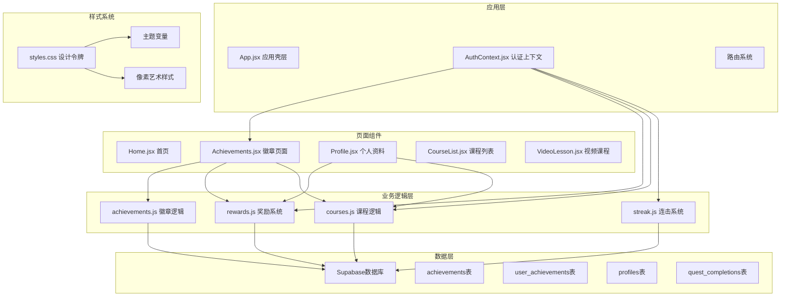

**图表来源**
- [Achievements.jsx:115-602](file://src/pages/Achievements.jsx#L115-L602)
- [AuthContext.jsx:72-708](file://src/auth/AuthContext.jsx#L72-L708)
- [achievements.js:41-130](file://src/lib/achievements.js#L41-L130)
- [rewards.js:66-101](file://src/lib/rewards.js#L66-L101)

**章节来源**
- [Achievements.jsx:1-630](file://src/pages/Achievements.jsx#L1-L630)
- [AuthContext.jsx:1-715](file://src/auth/AuthContext.jsx#L1-L715)

## 核心组件分析

### Achievements 页面组件

Achievements页面是整个徽章系统的核心，负责展示用户的成就进度、经验值追踪和物品收藏。

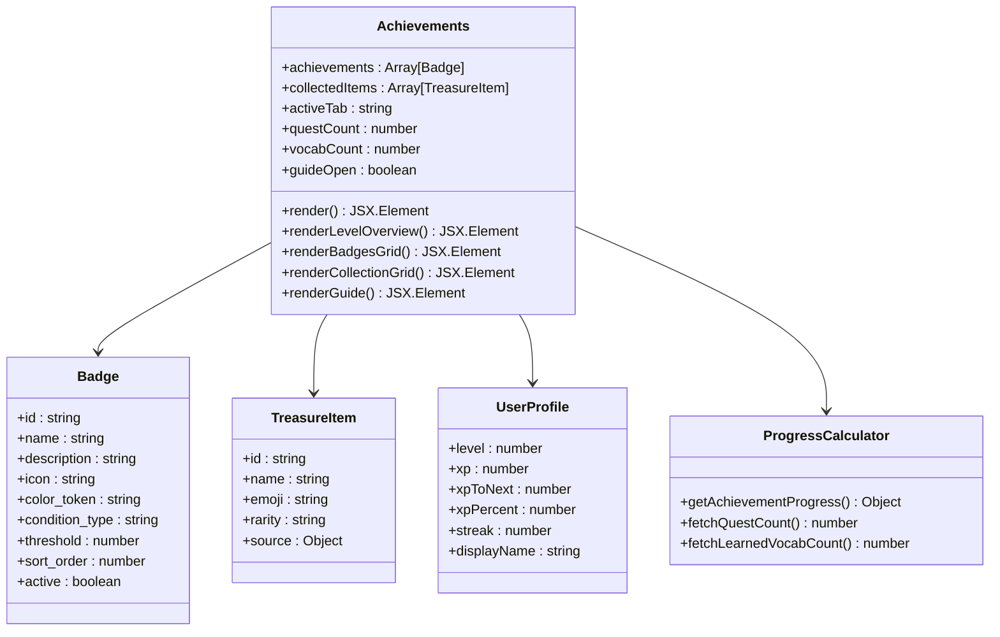

**图表来源**
- [Achievements.jsx:115-602](file://src/pages/Achievements.jsx#L115-L602)
- [rewards.js:24-38](file://src/lib/rewards.js#L24-L38)
- [courses.js:132-147](file://src/lib/courses.js#L132-L147)

### 数据流架构

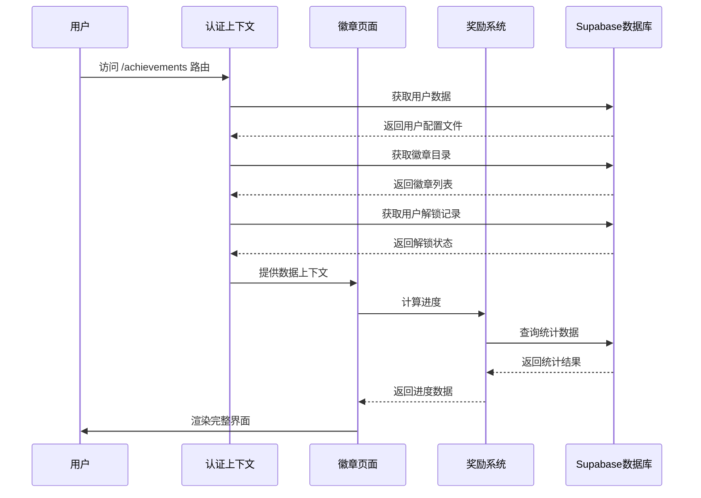

**图表来源**
- [AuthContext.jsx:207-231](file://src/auth/AuthContext.jsx#L207-L231)
- [achievements.js:41-130](file://src/lib/achievements.js#L41-L130)
- [rewards.js:24-38](file://src/lib/rewards.js#L24-L38)

**章节来源**
- [Achievements.jsx:1-630](file://src/pages/Achievements.jsx#L1-L630)

## 徽章数据结构

### 基础徽章数据模型

每个徽章都遵循统一的数据结构，确保系统的一致性和可扩展性：

| 字段名 | 类型 | 必需 | 描述 | 示例值 |
|--------|------|------|------|--------|
| id | string | 是 | 徽章唯一标识符 | "first-steps", "word-miner" |
| name | string | 是 | 徽章名称（本地化支持） | "First Steps" |
| description | string | 是 | 徽章描述说明 | "Complete your first quest" |
| icon | string | 是 | 图标类型标识符 | "pickaxe", "diamond" |
| color_token | string | 是 | 主题颜色变量标识 | "tile-teal", "tile-blue" |
| condition_type | string | 是 | 解锁条件类型 | "quest_count", "streak", "level", "vocab_count" |
| threshold | number | 是 | 解锁阈值 | 1, 7, 50, 200 |
| sort_order | number | 是 | 排序顺序 | 1, 2, 3... |
| active | boolean | 是 | 是否激活状态 | true, false |

### 徽章分类体系

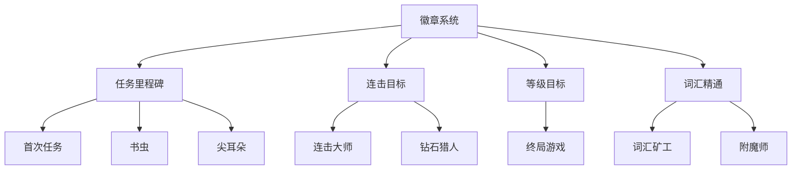

**图表来源**
- [08_seed_achievements.sql:8-27](file://supabase-migration/08_seed_achievements.sql#L8-L27)

**章节来源**
- [08_seed_achievements.sql:1-28](file://supabase-migration/08_seed_achievements.sql#L1-L28)

## 徽章解锁机制

### 解锁条件设计

徽章系统采用智能的实时解锁机制，确保用户体验的流畅性和准确性：

#### 实时进度计算

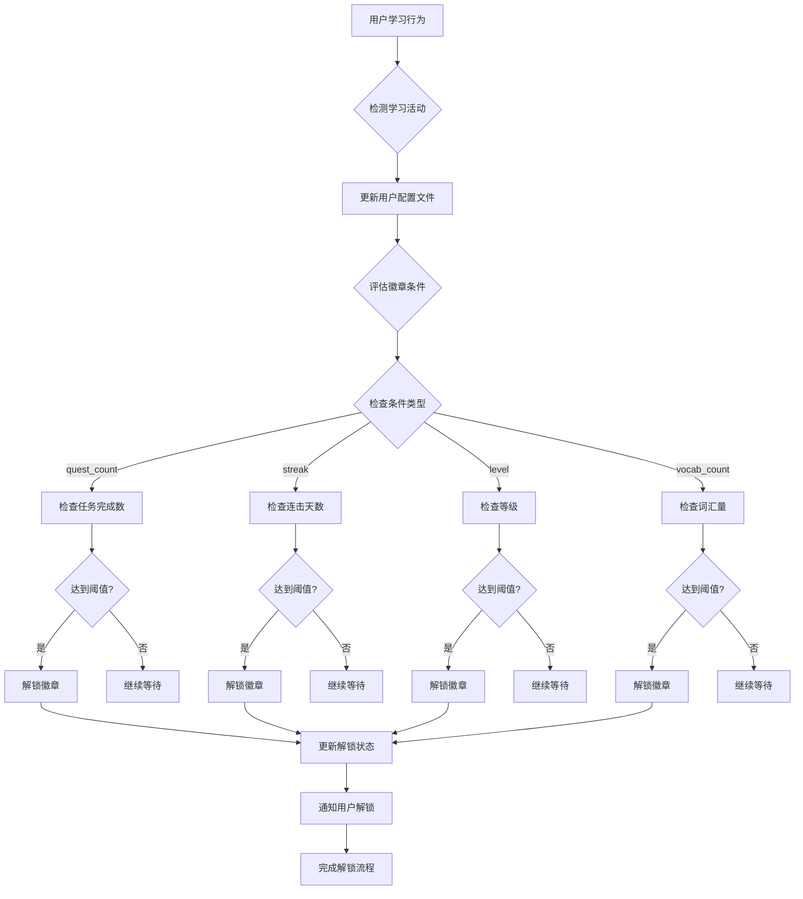

#### 进度型成就解锁逻辑

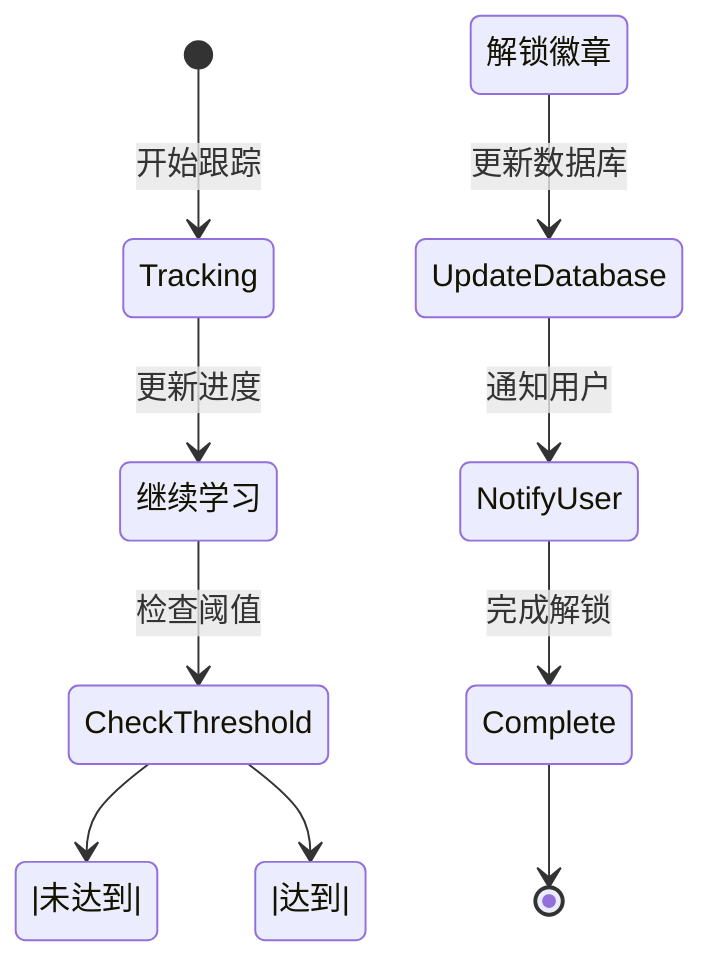

**图表来源**
- [achievements.js:99-129](file://src/lib/achievements.js#L99-L129)
- [rewards.js:24-38](file://src/lib/rewards.js#L24-L38)

### XP奖励系统

徽章解锁提供多层次的XP奖励机制：

- **一次性成就**：直接给予固定XP奖励
- **进度型成就**：完成阶段性目标获得相应XP
- **等级提升**：累计XP达到阈值时提升等级
- **连击奖励**：额外的连击天数奖励

**章节来源**
- [achievements.js:27-41](file://src/lib/achievements.js#L27-L41)

## 经验值追踪系统

### XP计算和等级提升

经验值系统采用递增式的等级提升机制，确保学习过程的持续挑战性：

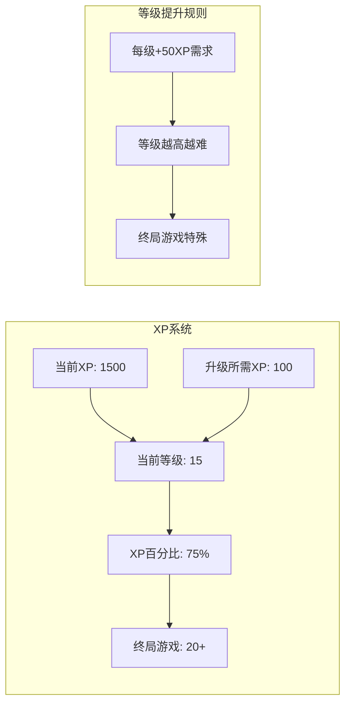

**图表来源**
- [AuthContext.jsx:448-470](file://src/auth/AuthContext.jsx#L448-L470)
- [rewards.js:6-18](file://src/lib/rewards.js#L6-L18)

### 等级标题系统

系统根据用户等级提供相应的Minecraft主题称谓：

| 等级范围 | 称谓 | 颜色主题 |
|----------|------|----------|
| 1-3级 | 石矿工 | 石灰色 |
| 4-6级 | 铁匠 | 银灰色 |
| 7-9级 | 金矿工 | 金色 |
| 10-14级 | 钻石学徒 | 蓝色 |
| 15-19级 | 绿宝石大师 | 绿色 |
| 20+级 | 下界合金传奇 | 紫色 |

**章节来源**
- [rewards.js:6-18](file://src/lib/rewards.js#L6-L18)

## 物品收藏与稀有度

### 稀有度系统

物品收藏系统采用四层级稀有度设计，每种稀有度都有独特的视觉表现：

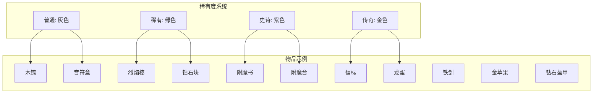

**图表来源**
- [rewards.js:66-101](file://src/lib/rewards.js#L66-L101)

### 物品解锁机制

物品收藏分为两类解锁方式：

#### 成就解锁物品

| 成就徽章 | 解锁物品 | 稀有度 |
|----------|----------|--------|
| 首次任务 | 木镐 | 普通 |
| 词汇矿工 | 钻石块 | 稀有 |
| 连击大师 | 烈焰棒 | 稀有 |
| 书虫 | 附魔书 | 史诗 |
| 尖耳朵 | 音符盒 | 普通 |
| 钻石猎人 | 信标 | 传奇 |
| 附魔师 | 附魔台 | 史诗 |
| 终界龙 | 龙蛋 | 传奇 |

#### 等级里程碑物品

| 等级 | 解锁物品 | 稀有度 |
|------|----------|--------|
| 5级 | 铁剑 | 普通 |
| 10级 | 金苹果 | 稀有 |
| 15级 | 钻石盔甲 | 史诗 |

**章节来源**
- [rewards.js:66-101](file://src/lib/rewards.js#L66-L101)

## 像素艺术徽章图标

### SVG像素风格实现

徽章图标采用纯SVG实现，确保在任何缩放级别下都保持清晰的像素效果：

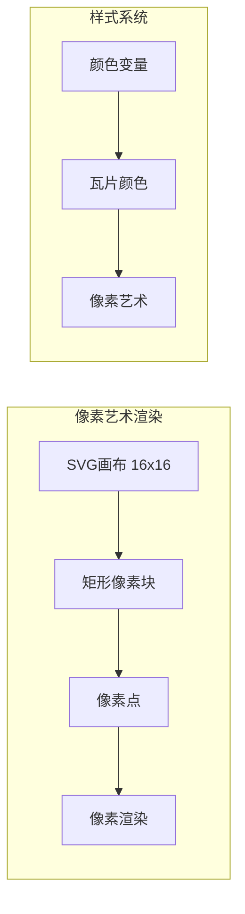

**图表来源**
- [Achievements.jsx:17-102](file://src/pages/Achievements.jsx#L17-L102)
- [styles.css:47-54](file://src/styles.css#L47-L54)

### 图标设计规范

每个徽章图标都遵循统一的设计规范，使用16x16的像素网格：

| 图标类型 | 形状特征 | 颜色方案 | 尺寸规格 |
|----------|----------|----------|----------|
| pickaxe | 工具形状，带镐头 | 土色系 | 24x24像素 |
| diamond | 几何形状，多面体 | 蓝色调渐变 | 24x24像素 |
| fire | 火焰形状，向上扩散 | 橙红色系 | 24x24像素 |
| book | 书籍形状，封面纹理 | 棕色调 | 24x24像素 |
| headphones | 耳机形状，听筒设计 | 灰色调 | 24x24像素 |
| gem | 宝石形状，圆形切割 | 蓝青色系 | 24x24像素 |
| star | 星形，五角星 | 黄色调 | 24x24像素 |
| dragon | 龙形，抽象设计 | 紫色调 | 24x24像素 |

### 像素渲染技术

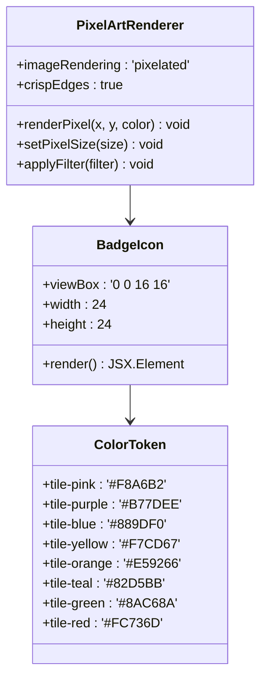

**图表来源**
- [Achievements.jsx:105-113](file://src/pages/Achievements.jsx#L105-L113)
- [styles.css:47-54](file://src/styles.css#L47-L54)

**章节来源**
- [Achievements.jsx:17-102](file://src/pages/Achievements.jsx#L17-L102)
- [styles.css:47-54](file://src/styles.css#L47-L54)

## 界面布局与交互

### 响应式网格系统

徽章系统采用CSS Grid实现响应式布局，确保在不同设备上都有良好的显示效果：

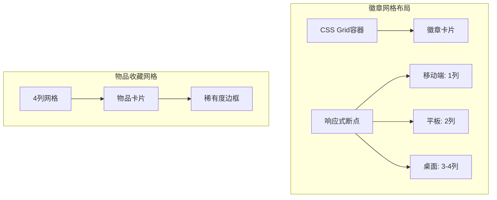

**图表来源**
- [Achievements.jsx:419-520](file://src/pages/Achievements.jsx#L419-L520)
- [Achievements.jsx:523-599](file://src/pages/Achievements.jsx#L523-L599)

### 交互反馈机制

系统提供了多层次的用户交互反馈：

#### 状态指示器

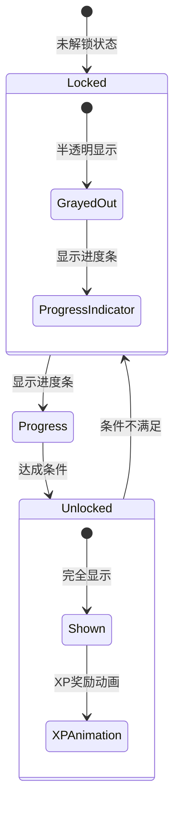

#### 动画效果

系统使用CSS动画增强用户体验：

- **徽章解锁动画**：徽章出现时的弹跳效果
- **进度条动画**：进度更新时的平滑过渡
- **标签切换动画**：页面内容的淡入淡出效果
- **物品解锁动画**：稀有度边框的渐变效果

**章节来源**
- [Achievements.jsx:419-602](file://src/pages/Achievements.jsx#L419-L602)

## 扩展性设计

### 新徽章添加指南

要向系统添加新的徽章，需要遵循以下步骤：

#### 1. 数据库配置

在Supabase数据库中添加新的徽章记录：

```sql
INSERT INTO public.achievements
  (id, name, description, icon, color_token, condition_type, threshold, sort_order, active)
VALUES
  ('new-achievement', 'New Achievement', 'Description of achievement', 'star', 'tile-yellow', 'level', 25, 9, true);
```

#### 2. 前端组件扩展

在Achievements.jsx中添加对应的SVG图标：

```javascript
star: (
  <svg width="24" height="24" viewBox="0 0 16 16" style={{ imageRendering: 'pixelated' }}>
    <rect x="7" y="1" width="2" height="2" fill="#FFEB3B"/>
    <rect x="6" y="3" width="4" height="2" fill="#FFEB3B"/>
    <rect x="2" y="5" width="12" height="2" fill="#FFC107"/>
    <rect x="4" y="7" width="8" height="2" fill="#FFC107"/>
    <rect x="3" y="9" width="4" height="2" fill="#FF9800"/>
    <rect x="9" y="9" width="4" height="2" fill="#FF9800"/>
    <rect x="2" y="11" width="3" height="2" fill="#FF9800"/>
    <rect x="11" y="11" width="3" height="2" fill="#FF9800"/>
  </svg>
)
```

#### 3. 样式配置

在CSS变量中添加新的颜色变量：

```css
--tile-yellow: #F7CD67;
```

### 最佳实践建议

#### 数据管理
- 使用统一的数据格式确保一致性
- 为每个徽章分配唯一的ID
- 合理设置XP奖励值以维持平衡
- 实现条件类型的枚举验证

#### 性能优化
- 避免在渲染函数中创建新的SVG组件
- 使用memoization缓存复杂的计算结果
- 实现虚拟滚动处理大量徽章数据
- 优化数据库查询以减少网络往返

#### 可访问性
- 确保足够的颜色对比度
- 提供适当的ARIA标签
- 支持键盘导航
- 实现屏幕阅读器友好的描述

**章节来源**
- [08_seed_achievements.sql:8-27](file://supabase-migration/08_seed_achievements.sql#L8-L27)
- [Achievements.jsx:17-102](file://src/pages/Achievements.jsx#L17-L102)

## 性能优化建议

### 渲染性能优化

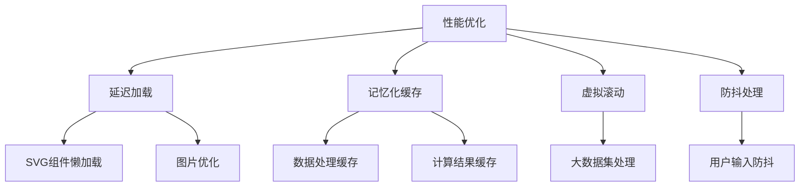

### 内存管理

- **组件卸载清理**：确保组件卸载时清理定时器和事件监听器
- **状态管理优化**：避免不必要的状态更新触发重渲染
- **资源释放**：及时释放不再使用的DOM节点和SVG元素
- **数据库连接池**：合理管理Supabase连接

## 故障排除指南

### 常见问题及解决方案

#### 徽章图标显示异常

**问题症状**：徽章图标模糊或变形

**可能原因**：
- SVG尺寸设置不当
- CSS渲染属性缺失
- 像素密度不匹配

**解决方法**：
1. 确保SVG使用16x16的viewBox
2. 添加 `imageRendering: 'pixelated'` 样式
3. 设置合适的width和height属性

#### 进度显示错误

**问题症状**：进度条显示不正确或百分比计算错误

**解决方法**：
1. 检查progress和total字段的数值
2. 确保进度值不超过总数
3. 实现边界检查防止负值

#### 响应式布局问题

**问题症状**：在移动设备上布局错乱

**解决方法**：
1. 检查CSS媒体查询断点
2. 确保网格列数适应屏幕宽度
3. 测试不同屏幕尺寸下的显示效果

#### 数据同步问题

**问题症状**：徽章解锁状态不同步

**解决方法**：
1. 检查evaluateAndUnlock函数的调用时机
2. 确保数据库事务的原子性
3. 实现错误重试机制

**章节来源**
- [Achievements.jsx:17-102](file://src/pages/Achievements.jsx#L17-L102)
- [achievements.js:99-129](file://src/lib/achievements.js#L99-L129)

## 总结

成就徽章系统通过精心设计的像素艺术风格、完整的游戏化生态和智能化的实时计算机制，为用户提供了沉浸式且富有成就感的学习体验。系统的核心优势包括：

### 技术优势
- **模块化架构**：清晰的组件分离和数据管理
- **实时计算**：智能的进度追踪和自动解锁机制
- **响应式设计**：适配多种设备和屏幕尺寸
- **性能优化**：合理的渲染策略和内存管理

### 用户体验优势
- **直观的视觉反馈**：像素艺术风格增强游戏感
- **多层次激励**：从简单到复杂的成就体系
- **实时进度追踪**：帮助用户了解学习进展
- **社交展示**：通过徽章展示学习成果

### 扩展性优势
- **灵活的数据结构**：易于添加新的徽章类型
- **标准化的开发流程**：降低维护成本
- **可访问性设计**：确保所有用户都能享受系统功能
- **稀有度系统**：提供长期学习目标和成就感

该系统为教育类应用的游戏化设计提供了优秀的参考模板，其设计理念和技术实现都值得在类似项目中借鉴和应用。通过持续的功能扩展和优化，系统能够为用户创造更加丰富和持久的学习体验。