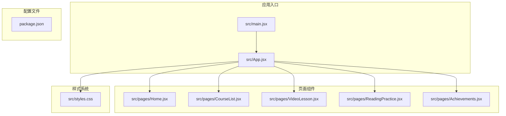
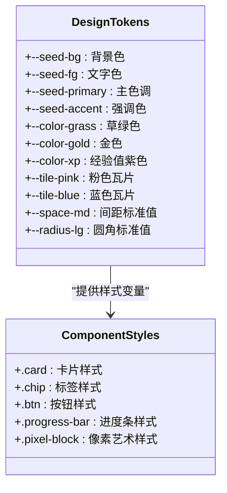
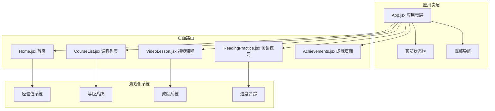
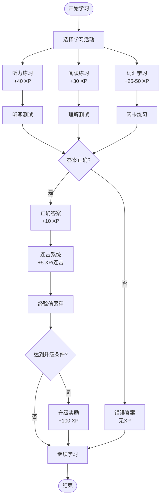
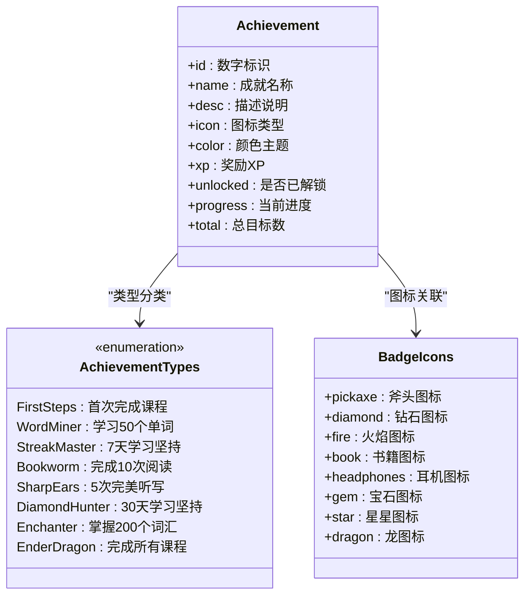
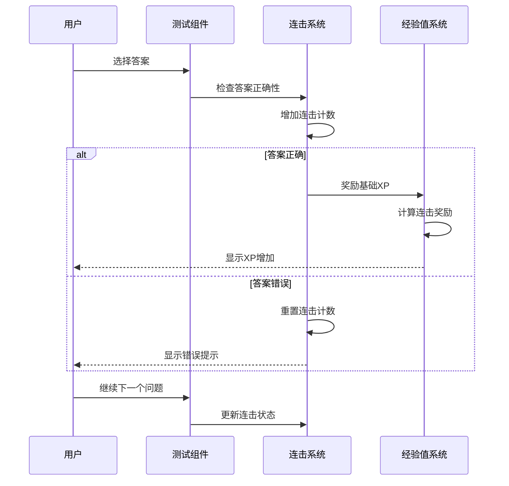
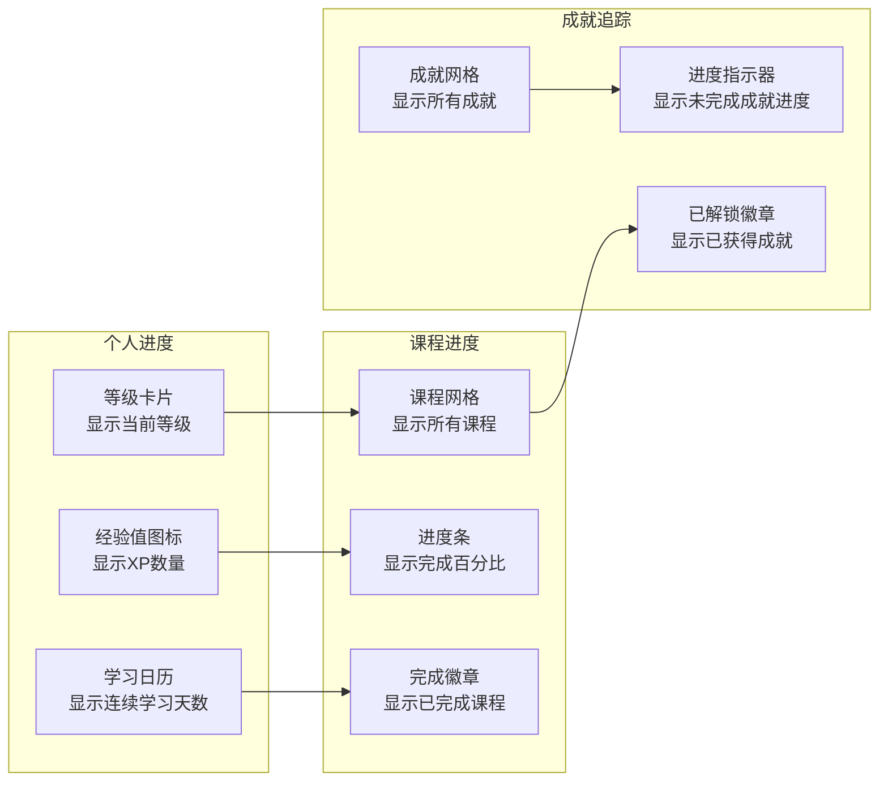
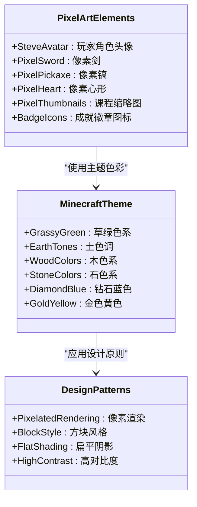

# 游戏化机制

<cite>
**本文档引用的文件**
- [App.jsx](file://src/App.jsx)
- [main.jsx](file://src/main.jsx)
- [Achievements.jsx](file://src/pages/Achievements.jsx)
- [Home.jsx](file://src/pages/Home.jsx)
- [CourseList.jsx](file://src/pages/CourseList.jsx)
- [VideoLesson.jsx](file://src/pages/VideoLesson.jsx)
- [ReadingPractice.jsx](file://src/pages/ReadingPractice.jsx)
- [styles.css](file://src/styles.css)
- [package.json](file://package.json)
</cite>

## 目录
1. [简介](#简介)
2. [项目结构](#项目结构)
3. [核心组件](#核心组件)
4. [架构概览](#架构概览)
5. [详细组件分析](#详细组件分析)
6. [依赖关系分析](#依赖关系分析)
7. [性能考虑](#性能考虑)
8. [故障排除指南](#故障排除指南)
9. [结论](#结论)

## 简介

这是一个基于Minecraft主题的英语学习应用，采用游戏化设计理念，通过经验值系统、成就徽章、连击机制等游戏元素来提升学习体验和用户参与度。该应用使用React + Vite技术栈构建，实现了完整的Minecraft风格界面和交互体验。

## 项目结构

该项目采用React单页应用架构，主要文件组织如下：



**图表来源**
- [main.jsx:1-14](file://src/main.jsx#L1-L14)
- [App.jsx:1-112](file://src/App.jsx#L1-L112)

**章节来源**
- [main.jsx:1-14](file://src/main.jsx#L1-L14)
- [package.json:1-22](file://package.json#L1-L22)

## 核心组件

### 游戏化元素概述

该应用实现了以下核心游戏化机制：

1. **经验值系统**：通过完成学习任务获得XP奖励
2. **等级提升**：累积XP达到阈值后升级
3. **成就徽章**：完成特定目标解锁的徽章系统
4. **连击机制**：连续正确回答问题获得额外奖励
5. **进度追踪**：可视化显示学习进度和完成度
6. **像素艺术设计**：Minecraft风格的视觉元素

### 设计令牌系统

应用使用CSS自定义属性实现统一的设计令牌系统：



**图表来源**
- [styles.css:7-87](file://src/styles.css#L7-L87)

**章节来源**
- [styles.css:1-499](file://src/styles.css#L1-L499)

## 架构概览

应用采用模块化的React组件架构，每个页面都是独立的功能模块：



**图表来源**
- [App.jsx:47-112](file://src/App.jsx#L47-L112)
- [Home.jsx:48-293](file://src/pages/Home.jsx#L48-L293)

## 详细组件分析

### 经验值系统设计

经验值系统是整个游戏化机制的核心，通过多种学习活动获得XP奖励：



**图表来源**
- [VideoLesson.jsx:12-18](file://src/pages/VideoLesson.jsx#L12-L18)
- [ReadingPractice.jsx:12-34](file://src/pages/ReadingPractice.jsx#L12-L34)
- [CourseList.jsx:4-61](file://src/pages/CourseList.jsx#L4-L61)

#### 经验值计算机制

应用中经验值的计算遵循以下规则：

1. **基础学习奖励**：
   - 听力课程：+40 XP
   - 阅读课程：+30 XP
   - 词汇学习：+25-50 XP

2. **测试奖励**：
   - 正确回答：+10 XP
   - 连击奖励：每连击+5 XP（最多+25 XP）

3. **进度奖励**：
   - 完成课程：+100 XP
   - 达到等级：+100 XP

**章节来源**
- [VideoLesson.jsx:20-288](file://src/pages/VideoLesson.jsx#L20-L288)
- [ReadingPractice.jsx:45-293](file://src/pages/ReadingPractice.jsx#L45-L293)
- [CourseList.jsx:163-314](file://src/pages/CourseList.jsx#L163-L314)

### 成就徽章系统

成就徽章系统通过完成特定学习目标来解锁，每个成就都有明确的解锁条件：



**图表来源**
- [Achievements.jsx:3-12](file://src/pages/Achievements.jsx#L3-L12)
- [Achievements.jsx:26-111](file://src/pages/Achievements.jsx#L26-L111)

#### 成就解锁条件分析

| 成就名称 | 解锁条件 |  bel 验证方式 |
|---------|---------|-------------|
| 首次起步 | 完成第一次课程 | 首次完成任意课程 |
| 单词矿工 | 学习50个新单词 | 词汇统计达到50 |
| 连击大师 | 保持7天学习连续 | 学习日历统计 |
| 书虫 | 完成10次阅读课程 | 阅读完成次数 |
| 敏锐听者 | 5次完美听写 | 测试得分100% |
| 钻石猎人 | 30天学习连续 | 学习日历统计 |
| 附魔师 | 掌握200个词汇 | 词汇统计达到200 |
| 终界龙 | 完成所有课程 | 课程完成率100% |

**章节来源**
- [Achievements.jsx:1-297](file://src/pages/Achievements.jsx#L1-L297)

### 连击系统与学习激励

连击系统通过连续正确回答问题来增加学习动力：



**图表来源**
- [VideoLesson.jsx:20-288](file://src/pages/VideoLesson.jsx#L20-L288)
- [ReadingPractice.jsx:45-293](file://src/pages/ReadingPractice.jsx#L45-L293)

#### 连击奖励机制

连击系统采用渐进式奖励设计：

1. **基础奖励**：每次正确回答+10 XP
2. **连击奖励**：每增加一次连击+5 XP（最多+25 XP）
3. **最高连击**：连续10次正确回答

**章节来源**
- [VideoLesson.jsx:247-266](file://src/pages/VideoLesson.jsx#L247-L266)
- [ReadingPractice.jsx:271-285](file://src/pages/ReadingPractice.jsx#L271-L285)

### 进度追踪与可视化

应用提供了多层次的学习进度追踪功能：



**图表来源**
- [Home.jsx:120-189](file://src/pages/Home.jsx#L120-L189)
- [CourseList.jsx:200-310](file://src/pages/CourseList.jsx#L200-L310)
- [Achievements.jsx:202-293](file://src/pages/Achievements.jsx#L202-L293)

**章节来源**
- [Home.jsx:1-293](file://src/pages/Home.jsx#L1-L293)
- [CourseList.jsx:1-314](file://src/pages/CourseList.jsx#L1-L314)

### 像素艺术设计元素

应用采用Minecraft风格的像素艺术设计，营造沉浸式的游戏化学习环境：



**图表来源**
- [App.jsx:31-45](file://src/App.jsx#L31-L45)
- [Home.jsx:4-46](file://src/pages/Home.jsx#L4-L46)
- [CourseList.jsx:64-151](file://src/pages/CourseList.jsx#L64-L151)
- [Achievements.jsx:26-111](file://src/pages/Achievements.jsx#L26-L111)

#### 像素艺术实现技术

1. **SVG像素渲染**：使用SVG矩形元素创建像素艺术
2. **图像渲染优化**：设置`image-rendering: pixelated`
3. **颜色系统**：基于Minecraft游戏中的真实颜色
4. **响应式设计**：确保像素艺术在不同设备上清晰显示

**章节来源**
- [Home.jsx:4-46](file://src/pages/Home.jsx#L4-L46)
- [styles.css:452-455](file://src/styles.css#L452-L455)

## 依赖关系分析

应用的依赖关系相对简单，主要依赖于React生态系统：

```mermaid
graph TD
subgraph "运行时依赖"
React[react: ^18.2.0]
ReactDOM[react-dom: ^18.2.0]
ReactRouter[react-router-dom: ^6.20.0]
end
subgraph "开发依赖"
Vite[vite: ^5.0.0]
ReactPlugin[@vitejs/plugin-react: ^4.2.0]
end
subgraph "应用代码"
AppCode[应用主代码]
PageComponents[页面组件]
Styles[样式系统]
end
React --> AppCode
ReactDOM --> AppCode
ReactRouter --> AppCode
Vite --> AppCode
ReactPlugin --> AppCode
AppCode --> PageComponents
AppCode --> Styles
```

**图表来源**
- [package.json:12-21](file://package.json#L12-L21)

**章节来源**
- [package.json:1-22](file://package.json#L1-L22)

## 性能考虑

### 游戏化指标计算

应用中的游戏化指标采用实时计算和缓存策略：

1. **经验值计算**：实时累加，避免重复计算
2. **等级判断**：基于阈值函数计算，支持动态调整
3. **进度百分比**：使用比例算法，确保精度
4. **连击状态**：本地状态管理，避免不必要的重渲染

### 用户体验优化

1. **动画性能**：使用CSS3硬件加速的动画
2. **响应式设计**：适配不同屏幕尺寸
3. **加载优化**：懒加载非关键资源
4. **交互反馈**：即时的状态变化反馈

## 故障排除指南

### 常见问题及解决方案

1. **经验值不更新**
   - 检查测试组件的答案验证逻辑
   - 确认XP奖励的触发条件
   - 验证状态更新的副作用

2. **成就无法解锁**
   - 检查成就条件的数据结构
   - 验证进度计算的准确性
   - 确认状态持久化机制

3. **像素艺术显示模糊**
   - 检查CSS中`image-rendering`属性
   - 验证SVG尺寸设置
   - 确认设备像素比适配

**章节来源**
- [VideoLesson.jsx:247-266](file://src/pages/VideoLesson.jsx#L247-L266)
- [Achievements.jsx:115-116](file://src/pages/Achievements.jsx#L115-L116)

## 结论

这个游戏化英语学习应用成功地将Minecraft主题与教育内容相结合，通过完善的游戏化机制提升了学习体验。系统的主要优势包括：

1. **完整的游戏化循环**：从学习到奖励的完整闭环
2. **多样化的激励机制**：经验值、等级、成就、连击等多种激励
3. **沉浸式的视觉体验**：像素艺术设计营造游戏氛围
4. **直观的进度追踪**：多维度的学习进度可视化
5. **可扩展的架构**：模块化设计便于功能扩展

该应用为游戏化学习提供了优秀的实践案例，展示了如何将游戏元素有效地融入教育场景中，既保持了学习的严肃性，又增加了学习的乐趣和动力。