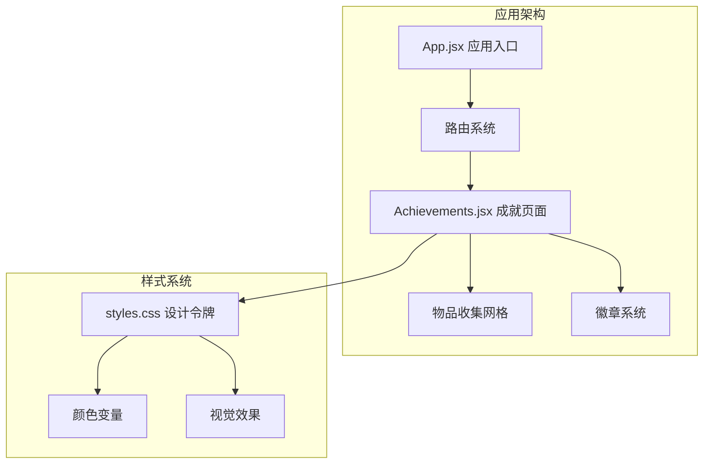
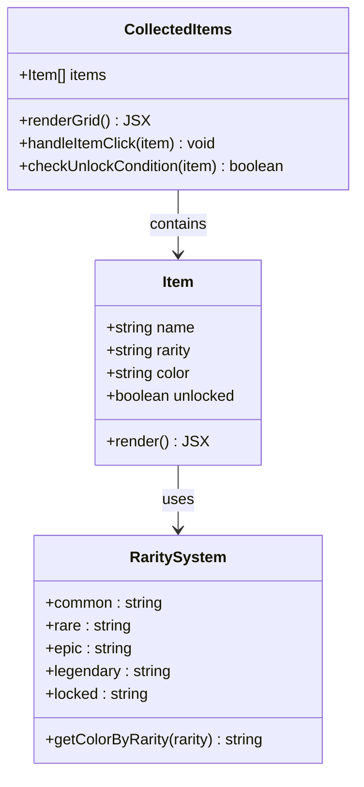
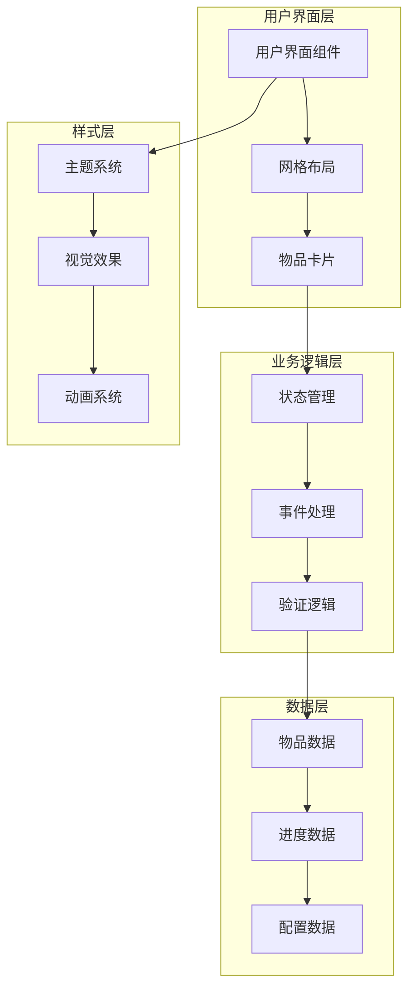
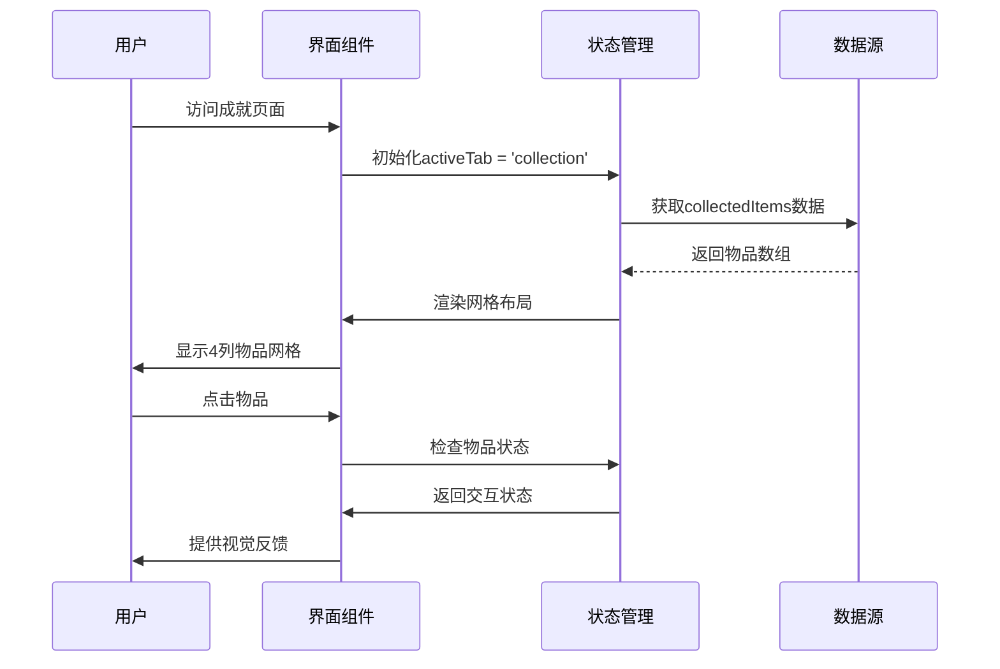
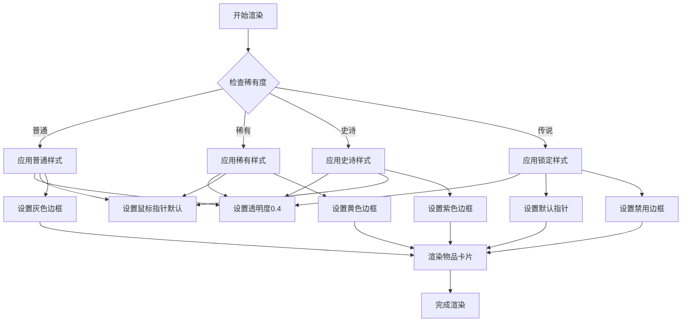
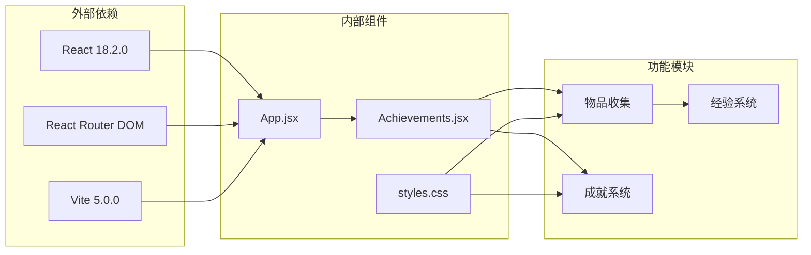

# 物品收集系统

<cite>
**本文档引用的文件**
- [Achievements.jsx](file://src/pages/Achievements.jsx)
- [App.jsx](file://src/App.jsx)
- [styles.css](file://src/styles.css)
</cite>

## 目录
1. [简介](#简介)
2. [项目结构](#项目结构)
3. [核心组件](#核心组件)
4. [架构概览](#架构概览)
5. [详细组件分析](#详细组件分析)
6. [依赖关系分析](#依赖关系分析)
7. [性能考虑](#性能考虑)
8. [故障排除指南](#故障排除指南)
9. [结论](#结论)

## 简介

物品收集系统是CraftWords应用中一个重要的游戏化功能模块，基于Minecraft主题设计，为用户提供可收集的虚拟物品奖励。该系统通过网格布局展示各种稀有度的物品，结合经验值系统提供完整的成就体验。

系统采用React构建，使用CSS变量和像素艺术风格，实现了从普通到传说级别的完整稀有度分级体系。每个物品都具有独特的颜色系统、边框样式和视觉反馈机制。

## 项目结构

应用程序采用模块化的React架构，物品收集功能主要集成在成就页面中：



**图表来源**
- [App.jsx:1-112](file://src/App.jsx#L1-L112)
- [Achievements.jsx:113-296](file://src/pages/Achievements.jsx#L113-L296)

**章节来源**
- [App.jsx:1-112](file://src/App.jsx#L1-L112)
- [Achievements.jsx:113-296](file://src/pages/Achievements.jsx#L113-L296)

## 核心组件

### 物品收集网格系统

物品收集系统的核心是一个响应式的网格布局，支持4列显示模式：



**图表来源**
- [Achievements.jsx:14-23](file://src/pages/Achievements.jsx#L14-L23)
- [Achievements.jsx:252-293](file://src/pages/Achievements.jsx#L252-L293)

系统支持四种稀有度级别：

| 稀有度 | 颜色代码 | 视觉特征 | 获取条件 |
|--------|----------|----------|----------|
| 普通 (Common) | #8D6E63, #B0BEC5 | 灰色调基础外观 | 默认解锁 |
| 稀有 (Rare) | #FFD54F, #66BB6A | 明亮黄色/绿色 | 完成特定课程 |
| 史诗 (Epic) | #4FC3F7, #AB47BC | 蓝色/紫色渐变 | 达到特定等级 |
| 传说 (Legendary) | 锁定状态 | 无法获取 | 完成所有课程 |

**章节来源**
- [Achievements.jsx:14-23](file://src/pages/Achievements.jsx#L14-L23)
- [Achievements.jsx:252-293](file://src/pages/Achievements.jsx#L252-L293)

## 架构概览

物品收集系统采用分层架构设计，确保功能模块化和可维护性：



**图表来源**
- [Achievements.jsx:113-296](file://src/pages/Achievements.jsx#L113-L296)
- [styles.css:1-499](file://src/styles.css#L1-L499)

## 详细组件分析

### 物品收集界面

物品收集界面采用响应式网格布局，支持4列显示：



**图表来源**
- [Achievements.jsx:252-293](file://src/pages/Achievements.jsx#L252-L293)

### 视觉设计系统

系统采用统一的颜色和样式设计：



**图表来源**
- [Achievements.jsx:258-290](file://src/pages/Achievements.jsx#L258-L290)

### 稀有度分级系统

稀有度系统通过颜色和视觉元素区分不同品质的物品：

| 稀有度级别 | 颜色系统 | 边框样式 | 锁定状态 | 视觉反馈 |
|------------|----------|----------|----------|----------|
| 普通 | 使用基础色调 | 细边框 | 不适用 | 正常不透明度 |
| 稀有 | 金色调 (#FFD54F) | 黄色边框 | 不适用 | 正常不透明度 |
| 史诗 | 蓝紫色调 | 紫色边框 | 不适用 | 正常不透明度 |
| 传说 | 锁定状态 | 禁用边框 | 锁定 | 低透明度 (0.4) |

**章节来源**
- [Achievements.jsx:258-290](file://src/pages/Achievements.jsx#L258-L290)
- [styles.css:47-54](file://src/styles.css#L47-L54)

### 交互设计

系统提供多种交互反馈机制：

```mermaid
stateDiagram-v2
[*] --> Idle : 初始状态
Idle --> Hover : 鼠标悬停
Hover --> Click : 点击物品
Click --> Locked : 物品锁定
Click --> Unlocked : 物品可获取
Locked --> Idle : 无操作
Unlocked --> DetailView : 查看详情
DetailView --> Idle : 关闭详情
state Hover {
[*] --> NormalHover : 普通物品
[*] --> LockedHover : 锁定物品
NormalHover --> Enlarge : 放大效果
LockedHover --> Shake : 抖动效果
}
```

**图表来源**
- [Achievements.jsx:258-262](file://src/pages/Achievements.jsx#L258-L262)

## 依赖关系分析

物品收集系统与其他应用组件的依赖关系：



**图表来源**
- [package.json:12-21](file://package.json#L12-L21)
- [App.jsx:1-6](file://src/App.jsx#L1-L6)

**章节来源**
- [package.json:12-21](file://package.json#L12-L21)
- [App.jsx:1-6](file://src/App.jsx#L1-L6)

## 性能考虑

系统在性能优化方面采用了多项策略：

### 渲染优化
- 使用CSS Grid进行高效的网格布局
- 条件渲染减少不必要的DOM节点
- 状态提升避免重复计算

### 内存管理
- 合理的数据结构设计
- 事件处理器的正确绑定
- 组件卸载时的状态清理

### 用户体验优化
- 响应式设计适配不同屏幕尺寸
- 平滑的过渡动画效果
- 即时的视觉反馈机制

## 故障排除指南

### 常见问题及解决方案

| 问题类型 | 症状描述 | 解决方案 |
|----------|----------|----------|
| 物品不显示 | 网格中空白或错误渲染 | 检查collectedItems数据格式 |
| 稀有度颜色异常 | 物品颜色不符合预期 | 验证CSS变量定义 |
| 交互无响应 | 点击物品无反应 | 检查事件处理器绑定 |
| 布局错乱 | 网格布局不正确 | 确认CSS Grid属性设置 |

### 调试技巧

1. **开发者工具检查**
   - 使用浏览器开发者工具检查元素渲染
   - 验证CSS变量的实际值
   - 监控组件状态变化

2. **控制台日志**
   - 添加必要的console.log语句
   - 检查数据流和状态更新
   - 追踪用户交互事件

**章节来源**
- [Achievements.jsx:252-293](file://src/pages/Achievements.jsx#L252-L293)

## 结论

物品收集系统成功地将游戏化元素与教育内容相结合，为用户提供了丰富的学习体验。系统通过清晰的稀有度分级、直观的视觉设计和流畅的交互体验，有效提升了用户的学习动机和成就感。

系统的主要优势包括：
- 完整的稀有度分级体系
- 统一的视觉设计语言
- 响应式的网格布局
- 丰富的交互反馈机制

未来可以考虑的功能扩展包括：
- 动态物品生成机制
- 更详细的进度追踪功能
- 社交分享功能
- 个性化定制选项