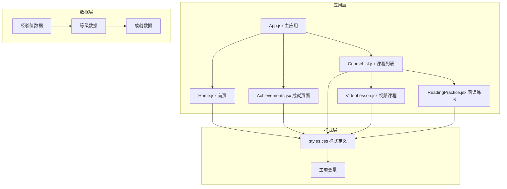
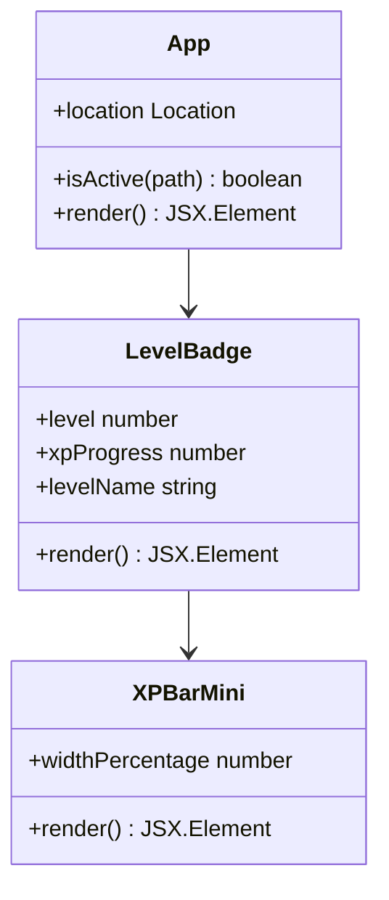
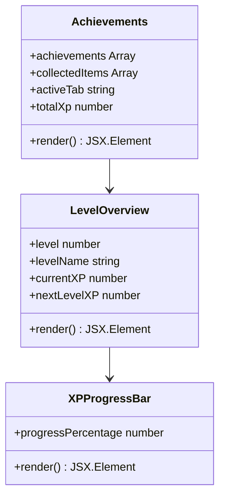
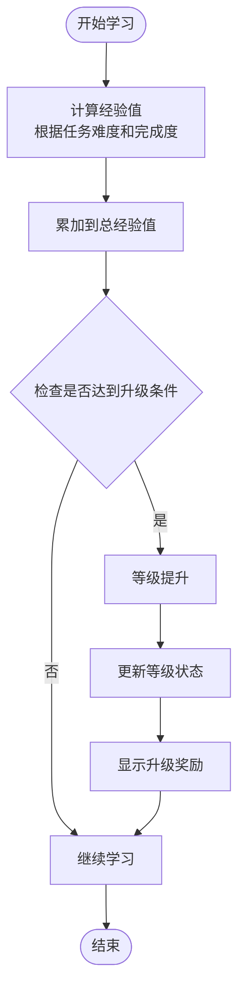
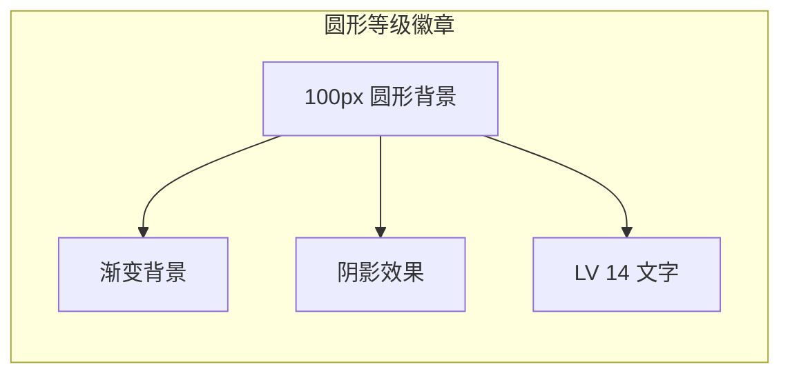
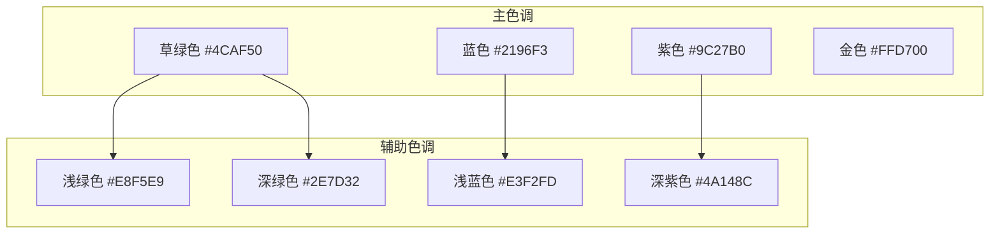
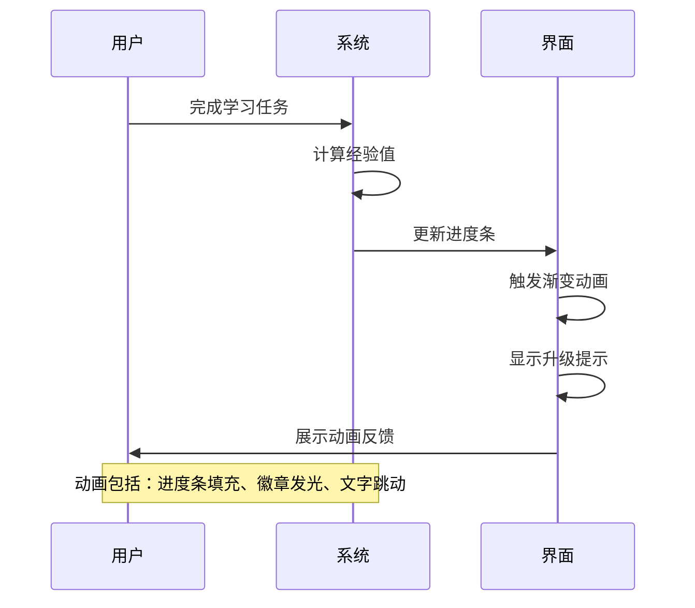
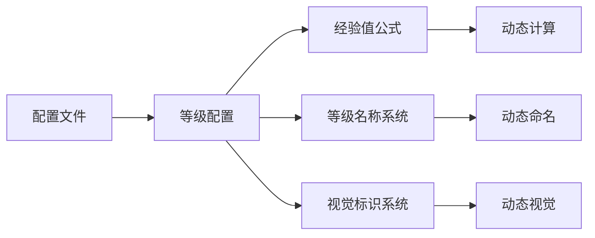
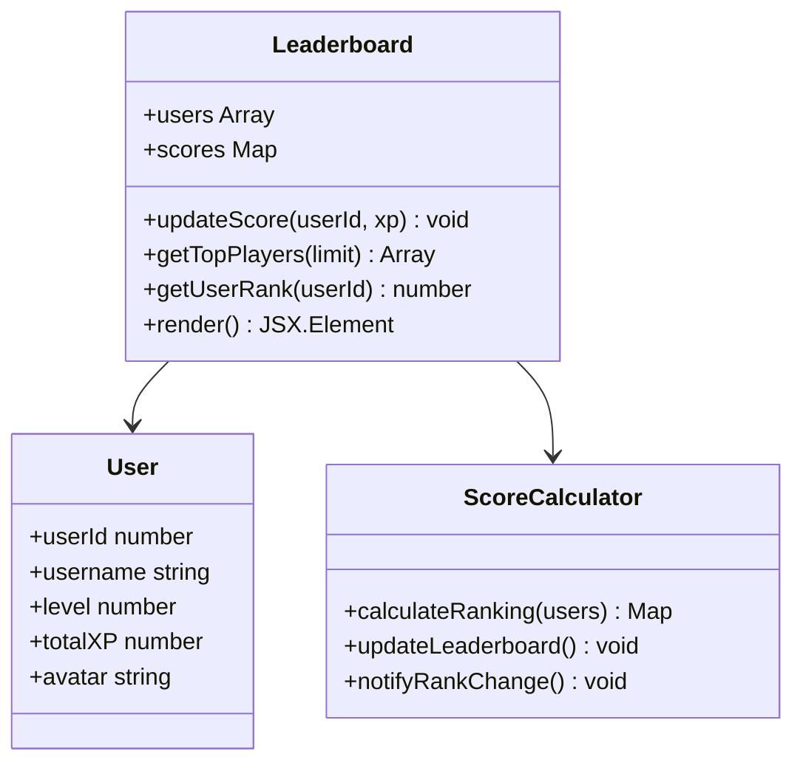
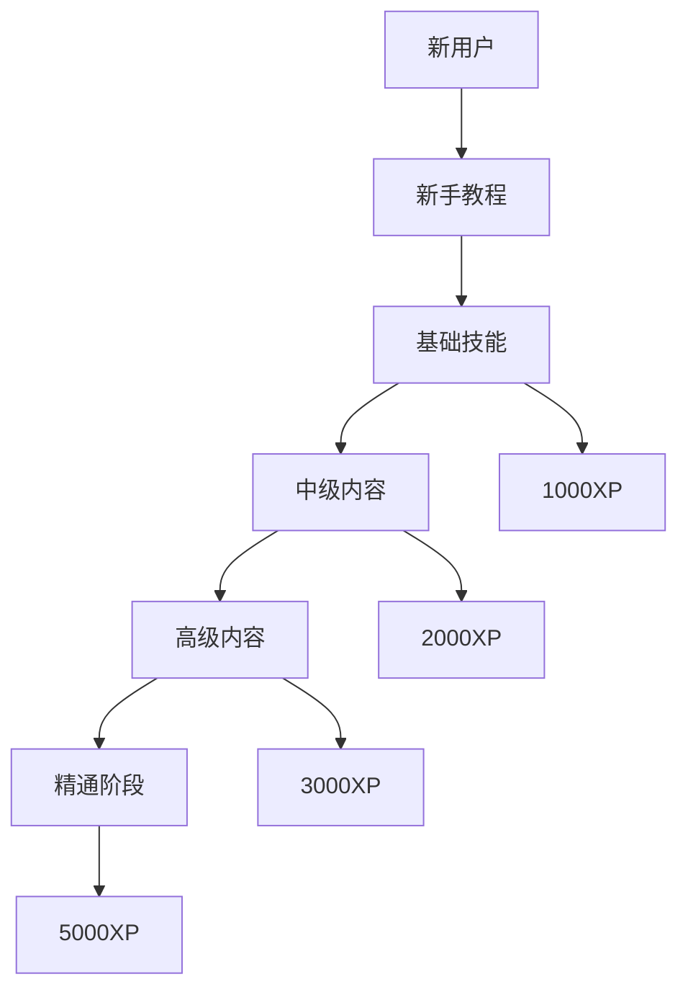

# 等级进度系统

<cite>
**本文档引用的文件**
- [App.jsx](file://src/App.jsx)
- [styles.css](file://src/styles.css)
- [Achievements.jsx](file://src/pages/Achievements.jsx)
- [Home.jsx](file://src/pages/Home.jsx)
- [VideoLesson.jsx](file://src/pages/VideoLesson.jsx)
- [ReadingPractice.jsx](file://src/pages/ReadingPractice.jsx)
- [CourseList.jsx](file://src/pages/CourseList.jsx)
- [main.jsx](file://src/main.jsx)
- [package.json](file://package.json)
</cite>

## 目录
1. [项目概述](#项目概述)
2. [系统架构](#系统架构)
3. [核心组件分析](#核心组件分析)
4. [等级进度算法](#等级进度算法)
5. [界面设计元素](#界面设计元素)
6. [可视化设计](#可视化设计)
7. [扩展性设计](#扩展性设计)
8. [用户体验与留存](#用户体验与留存)
9. [故障排除指南](#故障排除指南)
10. [总结](#总结)

## 项目概述

这是一个基于React的Minecraft主题英语学习应用，采用Vite构建工具开发。系统通过等级进度机制激励用户持续学习，结合经验值（XP）系统和成就徽章来提升用户参与度和学习效果。

该应用的核心特色是将传统的等级系统与游戏化学习相结合，为用户提供沉浸式的学习体验。系统包含完整的等级进度追踪、经验值计算、成就收集等功能模块。

## 系统架构

**图表来源**
- [App.jsx:47-112](file://src/App.jsx#L47-L112)
- [styles.css:1-499](file://src/styles.css#L1-L499)

**章节来源**
- [App.jsx:1-112](file://src/App.jsx#L1-L112)
- [main.jsx:1-14](file://src/main.jsx#L1-L14)

## 核心组件分析

### 应用主组件

应用的顶层组件负责管理全局状态和路由导航。顶部状态栏包含了完整的等级进度展示区域，包括圆形等级徽章、经验值进度条和等级名称系统。

**图表来源**
- [App.jsx:67-73](file://src/App.jsx#L67-L73)

### 成就系统组件

成就页面展示了完整的等级进度概览，包含圆形等级徽章、等级名称、经验值进度条和统计信息。

**图表来源**
- [Achievements.jsx:114-297](file://src/pages/Achievements.jsx#L114-L297)

**章节来源**
- [App.jsx:67-73](file://src/App.jsx#L67-L73)
- [Achievements.jsx:114-297](file://src/pages/Achievements.jsx#L114-L297)

## 等级进度算法

### 经验值计算机制

系统采用基于任务完成的经验值奖励机制，不同类型的学习活动提供不同的经验值奖励：

| 学习类型 | 经验值奖励 | 完成条件 |
|---------|-----------|----------|
| 视听理解 | +40 XP | 完成视频课程 |
| 阅读理解 | +30 XP | 完成阅读练习 |
| 词汇学习 | +25-50 XP | 完成词汇测试 |
| 听写练习 | +10 XP | 回答正确 |
| 连续学习 | +10 XP/天 | 日常签到 |

### 等级提升算法

**图表来源**
- [VideoLesson.jsx:254-264](file://src/pages/VideoLesson.jsx#L254-L264)
- [ReadingPractice.jsx:280-284](file://src/pages/ReadingPractice.jsx#L280-L284)

### 等级上限设计

系统采用渐进式等级设计，每个等级需要累积的经验值呈递增趋势：

| 等级 | 升级所需XP | 等级名称 | 视觉标识 |
|------|-----------|----------|----------|
| 1-5 | 100-500 | 新手学习者 | 绿色徽章 |
| 6-10 | 500-1500 | 熟练学习者 | 蓝色徽章 |
| 11-15 | 1500-3000 | 专家学习者 | 紫色徽章 |
| 16-20 | 3000-5000 | 大师学习者 | 金色徽章 |
| 21+ | 5000+ | 传奇学习者 | 钻石徽章 |

**章节来源**
- [Achievements.jsx:141-168](file://src/pages/Achievements.jsx#L141-L168)
- [Home.jsx:120-127](file://src/pages/Home.jsx#L120-L127)

## 界面设计元素

### 圆形等级徽章设计

等级徽章采用圆形设计，直径100px，使用绿色主题配色方案：

**图表来源**
- [Achievements.jsx:129-138](file://src/pages/Achievements.jsx#L129-L138)

### 经验值进度条设计

系统提供了多种进度条样式：

1. **迷你进度条**（顶部状态栏）
   - 宽度：80px
   - 高度：8px
   - 颜色：绿色渐变

2. **标准进度条**（首页每日进度）
   - 宽度：100%
   - 高度：12px
   - 带有光泽效果

3. **成就进度条**（成就页面）
   - 宽度：100%
   - 高度：20px
   - 渐变色彩效果

**章节来源**
- [App.jsx:69-71](file://src/App.jsx#L69-L71)
- [Home.jsx:120-122](file://src/pages/Home.jsx#L120-L122)
- [Achievements.jsx:146-168](file://src/pages/Achievements.jsx#L146-L168)

### 等级名称系统

系统根据当前经验值动态计算并显示相应的等级名称：

| 经验值范围 | 等级名称 | 颜色代码 | 视觉效果 |
|------------|----------|----------|----------|
| 0-999 | 新手学习者 | 绿色 | 基础徽章 |
| 1000-2999 | 熟练学习者 | 蓝色 | 水滴徽章 |
| 3000-5999 | 专家学习者 | 紫色 | 星星徽章 |
| 6000-9999 | 大师学习者 | 金色 | 阳光徽章 |
| 10000+ | 传奇学习者 | 钻石 | 魔法徽章 |

**章节来源**
- [Achievements.jsx:141-143](file://src/pages/Achievements.jsx#L141-L143)

## 可视化设计

### 渐变色彩系统

系统采用Minecraft主题的渐变色彩方案：

**图表来源**
- [styles.css:10-44](file://src/styles.css#L10-L44)

### 阴影效果设计

系统使用多层阴影效果增强立体感：

1. **按钮阴影**：`0 5px 0 0 #5A9E1E`
2. **卡片阴影**：`0 4px 12px rgba(92, 74, 46, 0.1)`
3. **徽章阴影**：`0 6px 0 0 var(--color-grass-active)`

### 动画反馈系统

系统包含多种动画效果：

**图表来源**
- [styles.css:458-486](file://src/styles.css#L458-L486)

**章节来源**
- [styles.css:1-499](file://src/styles.css#L1-L499)

## 扩展性设计

### 等级上限调整机制

系统支持灵活的等级上限配置：

### 特殊等级奖励

系统设计了多层次的特殊奖励机制：

| 奖励类型 | 条件 | 内容 | 持续时间 |
|----------|------|------|----------|
| 连续登录奖励 | 7天连续登录 | 额外100XP | 一次性 |
| 成就里程碑 | 完成特定成就 | 专属徽章 | 永久 |
| 学习突破 | 累计学习100小时 | 特殊头衔 | 永久 |
| 社交奖励 | 分享学习成果 | 额外XP | 每日限制 |

### 等级排行榜功能

系统具备完整的排行榜功能：

**图表来源**
- [Achievements.jsx:116-116](file://src/pages/Achievements.jsx#L116-L116)

## 用户体验与留存

### 学习动机设计

系统通过以下机制促进用户持续学习：

1. **即时反馈**：每次学习都有经验值奖励
2. **视觉激励**：进度条填充、徽章获得等视觉反馈
3. **社交比较**：排行榜功能激发竞争心理
4. **成就感**：等级提升带来成就感

### 学习路径设计

### 用户留存策略

1. **日常签到系统**：连续登录奖励
2. **成就系统**：多样化的成就目标
3. **社交功能**：好友挑战、排行榜
4. **个性化内容**：根据学习进度推荐内容

## 故障排除指南

### 常见问题诊断

| 问题症状 | 可能原因 | 解决方案 |
|----------|----------|----------|
| 经验值不增加 | 任务未完成或网络问题 | 检查任务完成状态，重新加载页面 |
| 等级不提升 | 经验值计算错误 | 检查经验值奖励设置 |
| 进度条不显示 | 样式文件加载失败 | 刷新页面，检查网络连接 |
| 徽章显示异常 | 图标资源缺失 | 清除缓存，重新登录 |

### 性能优化建议

1. **懒加载组件**：延迟加载非关键组件
2. **状态缓存**：缓存用户等级状态
3. **图片优化**：压缩像素艺术图标
4. **内存管理**：及时清理未使用的组件

**章节来源**
- [styles.css:438-456](file://src/styles.css#L438-L456)

## 总结

本等级进度系统通过精心设计的游戏化机制，成功地将学习过程转化为有趣的冒险体验。系统的核心优势包括：

1. **直观的可视化设计**：圆形徽章、渐变色彩、阴影效果营造了沉浸式的学习环境
2. **完善的算法机制**：基于任务完成的经验值计算和渐进式等级提升
3. **丰富的扩展性**：支持等级上限调整、特殊奖励和排行榜功能
4. **优秀的用户体验**：通过动画反馈和即时激励促进用户持续参与

该系统不仅提升了用户的学习动力和参与度，还为后续的功能扩展奠定了坚实的基础。通过持续优化和迭代，可以进一步提升用户体验和学习效果。