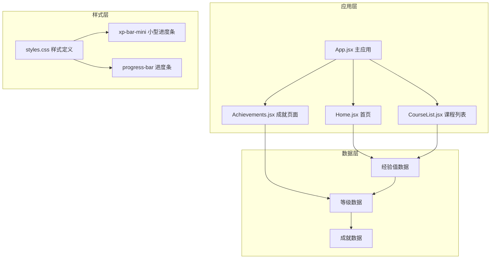
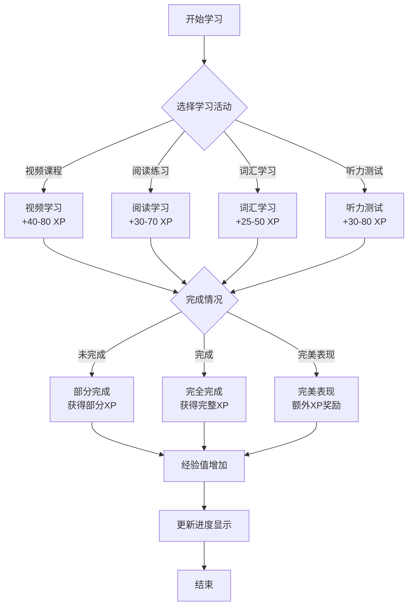
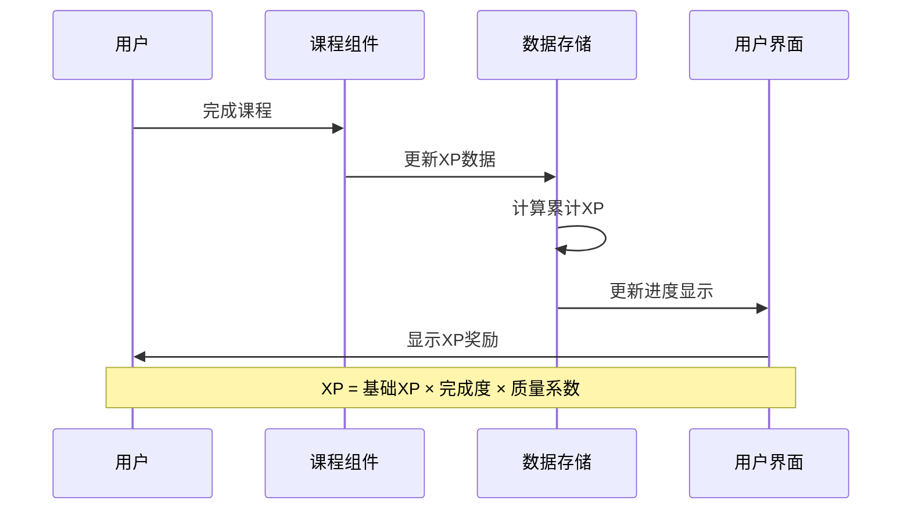
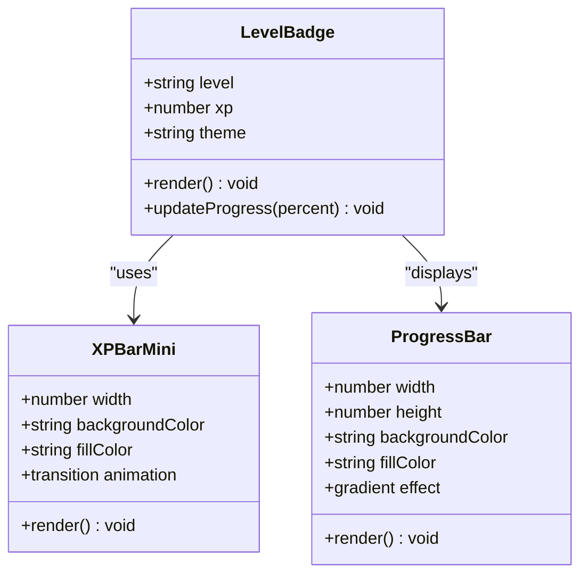
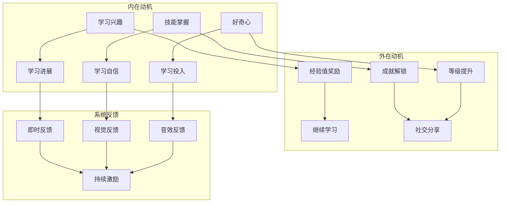

# 经验值系统

<cite>
**本文档引用的文件**
- [App.jsx](file://src/App.jsx)
- [Home.jsx](file://src/pages/Home.jsx)
- [Achievements.jsx](file://src/pages/Achievements.jsx)
- [CourseList.jsx](file://src/pages/CourseList.jsx)
- [styles.css](file://src/styles.css)
- [main.jsx](file://src/main.jsx)
- [qoder-design-runtime.jsx](file://src/qoder-design-runtime.jsx)
</cite>

## 目录
1. [项目概述](#项目概述)
2. [经验值系统架构](#经验值系统架构)
3. [经验值来源与奖励机制](#经验值来源与奖励机制)
4. [经验值计算与累积算法](#经验值计算与累积算法)
5. [等级系统设计](#等级系统设计)
6. [UI可视化实现](#uivisualization-实现)
7. [数据结构设计](#数据结构设计)
8. [状态管理与持久化](#状态管理与持久化)
9. [用户体验与动机机制](#用户体验与动机机制)
10. [性能优化考虑](#性能优化考虑)
11. [故障排除指南](#故障排除指南)
12. [总结](#总结)

## 项目概述

这是一个基于Minecraft主题的英语学习应用，采用React + Vite技术栈构建。应用通过经验值（XP）系统激励用户进行英语学习，将传统的学习过程转化为具有游戏化元素的冒险体验。

该应用的核心特色包括：
- Minecraft主题的像素风格界面设计
- 基于经验值的学习进度追踪系统
- 多层次的成就系统
- 游戏化的学习体验

## 经验值系统架构

### 系统组件关系



**图表来源**
- [App.jsx:47-112](file://src/App.jsx#L47-L112)
- [Home.jsx:48-293](file://src/pages/Home.jsx#L48-L293)
- [Achievements.jsx:113-297](file://src/pages/Achievements.jsx#L113-L297)
- [CourseList.jsx:163-314](file://src/pages/CourseList.jsx#L163-L314)

## 经验值来源与奖励机制

### 主要经验值来源

根据代码分析，经验值主要来源于以下学习活动：

#### 1. 课程学习
- **视频课程**: 每个视频课程提供固定的XP奖励
- **阅读练习**: 阅读类课程提供相应的XP奖励
- **词汇学习**: 词汇挑战提供XP奖励

#### 2. 学习成就
- **完成第一课**: +10 XP
- **学习50个新单词**: +50 XP  
- **保持7天学习连续**: +100 XP
- **完成10次阅读课程**: +75 XP
- **完美听力测试**: +80 XP
- **30天学习连续**: +200 XP
- **掌握200个词汇**: +150 XP
- **完成所有课程**: +500 XP

#### 3. 日常学习活动
- **每日登录**: +50 XP
- **学习时长**: 按分钟计算的XP奖励
- **学习质量**: 正确率影响XP获得量

**章节来源**
- [Achievements.jsx:3-12](file://src/pages/Achievements.jsx#L3-L12)
- [CourseList.jsx:4-61](file://src/pages/CourseList.jsx#L4-L61)
- [Home.jsx:115-126](file://src/pages/Home.jsx#L115-L126)

### XP奖励分配机制



**图表来源**
- [CourseList.jsx:8,15,22,29,36,43,50,57:8-57](file://src/pages/CourseList.jsx#L8-L57)
- [Home.jsx:175,202,228](file://src/pages/Home.jsx#L175,L202,L228)

## 经验值计算与累积算法

### 当前实现分析

从现有代码可以看出，经验值系统采用静态配置的方式：

#### 静态XP配置
```javascript
// 课程XP配置示例
{
  id: 1,
  type: 'listening',
  title: 'Creeper Sounds & Safety',
  xp: 40,  // 固定XP奖励
  duration: '5 min'
}

// 成就XP配置示例  
{
  id: 1,
  name: 'First Steps',
  icon: 'pickaxe',
  color: 'var(--tile-teal)', 
  xp: 10,  // 固定XP奖励
  unlocked: true
}
```

#### 进度计算逻辑


**图表来源**
- [Home.jsx:121](file://src/pages/Home.jsx#L121)
- [Achievements.jsx:146-168](file://src/pages/Achievements.jsx#L146-L168)

**章节来源**
- [CourseList.jsx:4-61](file://src/pages/CourseList.jsx#L4-L61)
- [Achievements.jsx:3-12](file://src/pages/Achievements.jsx#L3-L12)

## 等级系统设计

### 等级计算模型

根据成就页面的数据显示，应用采用线性等级增长模型：

#### 等级进度显示
- **当前等级**: 14级
- **当前经验**: 1,648 XP
- **升级所需**: 2,480 XP
- **距离下一级**: 832 XP

#### 等级颜色主题
系统为不同等级设计了对应的颜色主题：
- **1-5级**: 绿色主题 (Grass Apprentice)
- **6-10级**: 蓝色主题 (Water Apprentice)  
- **11-15级**: 青绿色主题 (Diamond Apprentice)
- **16-20级**: 紫色主题 (Enchanter)

### 等级上限设计

从代码中可以看到等级上限为20级：
- **当前进度**: 1,648 / 2,480 XP (约66%)
- **剩余升级**: 832 XP
- **目标等级**: 15级

**章节来源**
- [Achievements.jsx:141-143](file://src/pages/Achievements.jsx#L141-L143)
- [Achievements.jsx:146-168](file://src/pages/Achievements.jsx#L146-L168)

## UI可视化实现

### 进度条组件设计

#### 小型进度条 (顶部状态栏)
```css
.xp-bar-mini {
  width: 80px;
  height: 8px;
  background: var(--color-surface-soft);
  border-radius: 4px;
  overflow: hidden;
}

.xp-bar-mini-fill {
  height: 100%;
  background: var(--color-grass);
  border-radius: 4px;
  transition: width var(--motion-base) var(--motion-ease);
}
```

#### 主进度条 (成就页面)
```css
.progress-bar {
  width: 100%;
  height: 12px;
  background: var(--color-surface-soft);
  border-radius: 6px;
  overflow: hidden;
  position: relative;
}

.progress-fill {
  height: 100%;
  border-radius: 6px;
  transition: width var(--motion-slow) var(--motion-ease);
  position: relative;
}

.progress-fill::after {
  content: '';
  position: absolute;
  top: 0;
  left: 0;
  right: 0;
  height: 50%;
  background: rgba(255,255,255,0.3);
  border-radius: 6px 6px 0 0;
}
```

### 等级徽章设计



**图表来源**
- [App.jsx:68-72](file://src/App.jsx#L68-L72)
- [styles.css:202-215](file://src/styles.css#L202-L215)
- [styles.css:362-387](file://src/styles.css#L362-L387)

**章节来源**
- [App.jsx:68-72](file://src/App.jsx#L68-L72)
- [styles.css:202-215](file://src/styles.css#L202-L215)
- [styles.css:362-387](file://src/styles.css#L362-L387)

## 数据结构设计

### 经验值数据模型

#### 课程数据结构
```javascript
const course = {
  id: number,
  type: 'listening' | 'reading' | 'vocabulary',
  title: string,
  desc: string,
  difficulty: number,
  progress: number,
  xp: number,
  duration: string,
  color: string,
  locked?: boolean,
  thumbnail: string
}
```

#### 成就数据结构
```javascript
const achievement = {
  id: number,
  name: string,
  desc: string,
  icon: string,
  color: string,
  xp: number,
  unlocked: boolean,
  progress?: number,
  total?: number
}
```

#### 用户进度数据结构
```javascript
const userProgress = {
  totalXP: number,
  level: number,
  dailyXP: number,
  streakDays: number,
  achievements: Achievement[],
  courses: Course[]
}
```

**章节来源**
- [CourseList.jsx:4-61](file://src/pages/CourseList.jsx#L4-L61)
- [Achievements.jsx:3-12](file://src/pages/Achievements.jsx#L3-L12)

## 状态管理与持久化

### 当前状态管理实现

应用采用React的本地状态管理：

#### 本地状态组件
```javascript
// 成就页面状态
const [activeTab, setActiveTab] = useState('badges')

// 课程列表状态  
const [activeFilter, setActiveFilter] = useState('all')

// 阅读练习状态
const [answers, setAnswers] = useState({})
const [submitted, setSubmitted] = useState(false)
const [savedWords, setSavedWords] = useState(['enchant', 'durable'])
const [fillAnswer, setFillAnswer] = useState('')
```

### 持久化策略

#### 当前实现限制
- 使用React本地状态，页面刷新后数据丢失
- 无浏览器存储机制（localStorage/sessionStorage）
- 设计模式运行时禁用了存储功能

#### 推荐持久化方案

```javascript
// 本地存储方案
const saveUserData = (userData) => {
  try {
    localStorage.setItem('craftwords_user_data', JSON.stringify(userData))
  } catch (error) {
    console.error('保存用户数据失败:', error)
  }
}

const loadUserData = () => {
  try {
    const userData = localStorage.getItem('craftwords_user_data')
    return userData ? JSON.parse(userData) : null
  } catch (error) {
    console.error('加载用户数据失败:', error)
    return null
  }
}
```

**章节来源**
- [qoder-design-runtime.jsx:76-78](file://src/qoder-design-runtime.jsx#L76-L78)
- [Home.jsx:48-293](file://src/pages/Home.jsx#L48-L293)

## 用户体验与动机机制

### 游戏化设计元素

#### 1. 等级系统
- **渐进式成就感**: 通过等级提升提供持续的学习动力
- **视觉反馈**: 不同等级对应不同的主题色彩
- **里程碑设定**: 每5级设置新的挑战目标

#### 2. 成就系统
- **多样化成就**: 包含学习、社交、挑战等多种类型
- **进度可视化**: 未解锁成就显示完成进度
- **稀有度分级**: 普通、稀有、史诗、传说四个等级

#### 3. 社交激励
- **连续学习**: 7天、30天等长期学习挑战
- **学习统计**: 单日学习量、总学习时长等数据展示
- **排行榜概念**: 通过XP总量体现学习成果

### 动机机制分析



**图表来源**
- [Home.jsx:115-126](file://src/pages/Home.jsx#L115-L126)
- [Achievements.jsx:141-143](file://src/pages/Achievements.jsx#L141-L143)

## 性能优化考虑

### 当前性能特点

#### 1. 渲染优化
- 使用CSS过渡动画替代JavaScript动画
- 图标采用SVG矢量图形，支持任意缩放
- 进度条使用纯CSS实现，减少DOM操作

#### 2. 内存管理
- 组件卸载时自动清理事件监听器
- 使用React.memo优化重复渲染
- 图标组件采用函数式组件，避免不必要的重渲染

### 性能改进建议

#### 1. 状态优化
```javascript
// 使用useMemo缓存计算结果
const memoizedXP = useMemo(() => calculateXP(), [completedCourses])

// 使用useCallback优化回调函数
const handleXPChange = useCallback((amount) => {
  setUserXP(prev => prev + amount)
}, [])
```

#### 2. 渲染优化
- 对大型成就列表使用虚拟滚动
- 图标组件使用React.lazy动态导入
- 进度条使用requestAnimationFrame优化动画

## 故障排除指南

### 常见问题诊断

#### 1. XP显示异常
**症状**: 进度条不更新或显示错误
**排查步骤**:
1. 检查XP数据是否正确传递到组件
2. 验证CSS类名是否正确应用
3. 确认transition属性是否生效

#### 2. 成就解锁问题
**症状**: 成就无法解锁或状态不正确
**排查步骤**:
1. 检查成就完成条件是否满足
2. 验证成就数据结构是否正确
3. 确认状态更新逻辑是否执行

#### 3. 等级计算错误
**症状**: 等级显示不正确或升级条件异常
**排查步骤**:
1. 检查XP累计算法
2. 验证等级阈值配置
3. 确认UI更新逻辑

### 调试工具建议

#### 1. 开发者工具
- 使用React DevTools检查组件状态
- 利用浏览器性能面板分析渲染性能
- 使用网络面板监控数据加载

#### 2. 日志记录
```javascript
// 添加调试日志
console.log('XP更新:', { oldXP, newXP, change })

// 错误边界
try {
  updateXP(amount)
} catch (error) {
  console.error('XP更新失败:', error)
}
```

**章节来源**
- [styles.css:458-477](file://src/styles.css#L458-L477)

## 总结

该Minecraft主题英语学习应用的经验值系统设计体现了良好的游戏化学习理念。系统通过多层次的XP奖励机制、渐进式的等级体系和丰富的可视化反馈，有效提升了用户的学习动机和参与度。

### 系统优势

1. **直观的可视化设计**: 通过像素风格和进度条清晰展示学习进度
2. **多样化的奖励机制**: 涵盖不同类型的学习活动，满足不同用户需求
3. **渐进式挑战设计**: 合理的难度递增和奖励递增，保持学习新鲜感
4. **美观的UI设计**: Minecraft主题风格统一，视觉效果良好

### 改进建议

1. **增强数据持久化**: 实现本地存储，确保用户进度不会丢失
2. **扩展社交功能**: 添加排行榜、好友挑战等社交元素
3. **个性化定制**: 允许用户自定义主题和进度显示方式
4. **数据分析功能**: 提供学习行为分析和个性化推荐

该经验值系统为英语学习应用提供了优秀的参考模板，通过合理的机制设计和用户体验优化，能够有效促进用户的学习积极性和持续性。