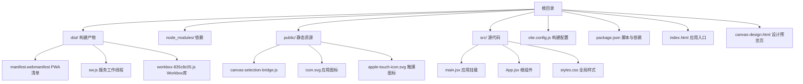
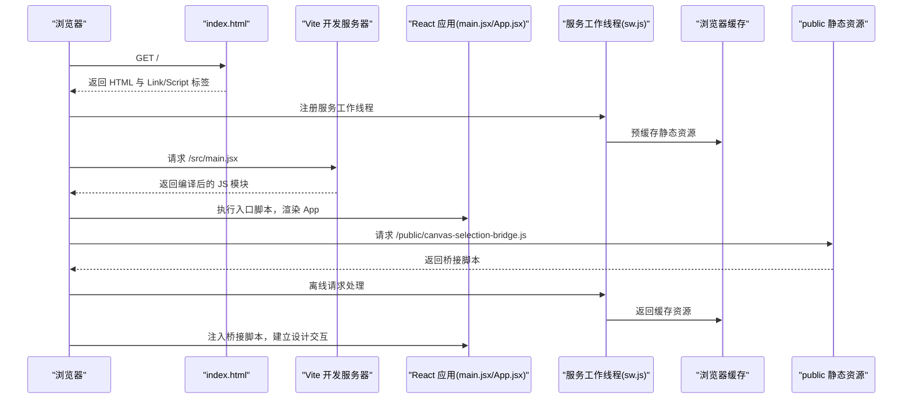
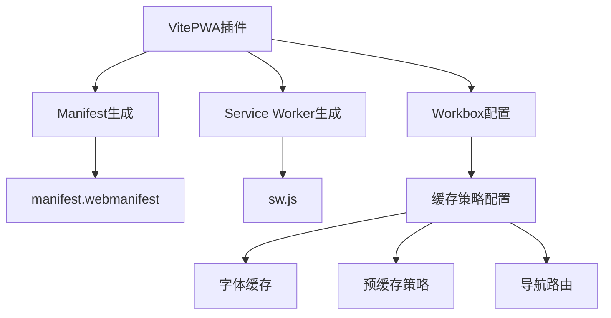
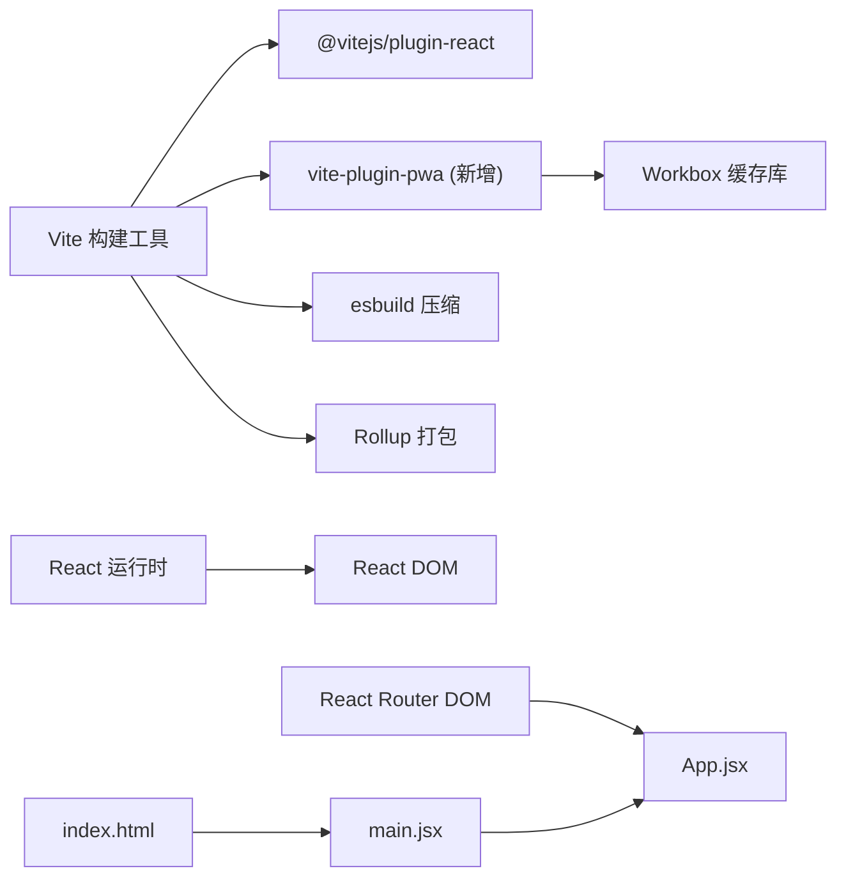

# 构建配置

<cite>
**本文引用的文件**
- [vite.config.js](file://vite.config.js)
- [package.json](file://package.json)
- [index.html](file://index.html)
- [canvas-design.html](file://canvas-design.html)
- [src/main.jsx](file://src/main.jsx)
- [src/App.jsx](file://src/App.jsx)
- [src/styles.css](file://src/styles.css)
- [public/canvas-selection-bridge.js](file://public/canvas-selection-bridge.js)
- [public/icon.svg](file://public/icon.svg)
- [public/apple-touch-icon.svg](file://public/apple-touch-icon.svg)
- [dist/manifest.webmanifest](file://dist/manifest.webmanifest)
- [dist/sw.js](file://dist/sw.js)
</cite>

## 更新摘要
**变更内容**
- 新增PWA（渐进式Web应用）支持章节
- 添加服务工作线程配置与缓存策略说明
- 更新构建配置以反映PWA相关设置
- 新增Manifest文件生成与配置说明
- 补充字体缓存与离线支持策略

## 目录
1. [简介](#简介)
2. [项目结构](#项目结构)
3. [核心组件](#核心组件)
4. [架构总览](#架构总览)
5. [详细组件分析](#详细组件分析)
6. [PWA支持与服务工作线程](#pwa支持与服务工作线程)
7. [依赖关系分析](#依赖关系分析)
8. [性能考量](#性能考量)
9. [故障排查指南](#故障排查指南)
10. [结论](#结论)
11. [附录](#附录)

## 简介
本文件面向构建工程师与前端开发者，系统性梳理该 React + Vite 项目的构建配置与运行机制，重点覆盖：
- 开发服务器配置、代理与热重载机制
- 生产构建优化策略（代码分割、Tree Shaking、压缩、资源优化）
- 静态资源与字体/图片处理策略
- 构建产物目录结构、命名规则与版本控制建议
- **PWA支持与服务工作线程配置**
- **离线缓存策略与Manifest生成**
- 性能调优实践（Bundle 分析、缓存策略、CDN 集成）
- 常见构建问题诊断与解决

## 项目结构
该项目采用 Vite 默认工程布局，核心入口为 HTML 与 React 应用入口脚本，样式与页面组件位于 src 目录，公共资源位于 public 目录，构建配置集中在 vite.config.js 中。**新增的PWA功能**使得项目具备了渐进式Web应用能力，包括服务工作线程、应用清单和离线缓存支持。

**图表来源**
- [vite.config.js:1-70](file://vite.config.js#L1-L70)
- [package.json:1-24](file://package.json#L1-L24)
- [index.html:1-20](file://index.html#L1-L20)
- [canvas-design.html:1-20](file://canvas-design.html#L1-L20)
- [src/main.jsx:1-14](file://src/main.jsx#L1-L14)
- [src/App.jsx:1-112](file://src/App.jsx#L1-L112)
- [src/styles.css:1-499](file://src/styles.css#L1-L499)
- [public/canvas-selection-bridge.js:1-930](file://public/canvas-selection-bridge.js#L1-L930)
- [public/icon.svg](file://public/icon.svg)
- [public/apple-touch-icon.svg](file://public/apple-touch-icon.svg)
- [dist/manifest.webmanifest:1-2](file://dist/manifest.webmanifest#L1-L2)
- [dist/sw.js:1-2](file://dist/sw.js#L1-L2)

**章节来源**
- [vite.config.js:1-70](file://vite.config.js#L1-L70)
- [package.json:1-24](file://package.json#L1-L24)
- [index.html:1-20](file://index.html#L1-L20)
- [canvas-design.html:1-20](file://canvas-design.html#L1-L20)
- [src/main.jsx:1-14](file://src/main.jsx#L1-L14)
- [src/App.jsx:1-112](file://src/App.jsx#L1-L112)
- [src/styles.css:1-499](file://src/styles.css#L1-L499)
- [public/canvas-selection-bridge.js:1-930](file://public/canvas-selection-bridge.js#L1-L930)

## 核心组件
- **构建配置中心**：vite.config.js
  - 插件：@vitejs/plugin-react、**VitePWA（新增）**
  - 开发服务器：host、port
  - **PWA配置**：注册类型、资源包含、Manifest配置、Workbox设置
- **应用入口**：index.html
  - 引入全局样式与应用入口脚本
- **应用挂载**：src/main.jsx
  - 使用 ReactDOM 渲染根组件 App，并包裹 BrowserRouter
- **根组件**：src/App.jsx
  - 路由定义与底部导航
- **全局样式**：src/styles.css
  - 设计令牌、排版、布局、组件样式与动画
- **静态资源**：public/canvas-selection-bridge.js
  - 设计桥接脚本，用于可视化设计工具与页面交互
- **应用图标**：public/icon.svg、public/apple-touch-icon.svg
  - **PWA应用图标与触摸图标**
- **设计预览页**：canvas-design.html
  - 重定向至本地开发服务器，便于设计工具预览

**章节来源**
- [vite.config.js:1-70](file://vite.config.js#L1-L70)
- [index.html:1-20](file://index.html#L1-L20)
- [src/main.jsx:1-14](file://src/main.jsx#L1-L14)
- [src/App.jsx:1-112](file://src/App.jsx#L1-L112)
- [src/styles.css:1-499](file://src/styles.css#L1-L499)
- [public/canvas-selection-bridge.js:1-930](file://public/canvas-selection-bridge.js#L1-L930)
- [public/icon.svg](file://public/icon.svg)
- [public/apple-touch-icon.svg](file://public/apple-touch-icon.svg)
- [canvas-design.html:1-20](file://canvas-design.html#L1-L20)

## 架构总览
下图展示从浏览器请求到应用渲染的关键流程，以及开发服务器、静态资源与PWA服务工作线程的关系。

**图表来源**
- [index.html:1-20](file://index.html#L1-L20)
- [src/main.jsx:1-14](file://src/main.jsx#L1-L14)
- [public/canvas-selection-bridge.js:1-930](file://public/canvas-selection-bridge.js#L1-L930)
- [dist/sw.js:1-2](file://dist/sw.js#L1-L2)

## 详细组件分析

### 开发服务器与热重载
- **配置要点**
  - 主机与端口：通过 server.host 与 server.port 控制本地访问地址与端口
  - 插件：@vitejs/plugin-react 提供 JSX 转换与 HMR 支持
- **热重载机制**
  - Vite 基于 ES 模块的原生 HMR 协议，模块变更后自动刷新或局部替换
  - React Fast Refresh 在 React 组件更新时保持状态
- **代理与跨域**
  - 当需要代理后端 API 或跨域资源时，可在 server.proxy 中配置
  - 本项目未配置代理，若后续接入后端接口，建议在此处添加

**章节来源**
- [vite.config.js:1-70](file://vite.config.js#L1-L70)
- [package.json:1-24](file://package.json#L1-L24)

### 构建产物与目录结构
- **输出目录**
  - 默认输出到 dist/，包含编译后的 JS/CSS 与静态资源
  - **新增PWA相关产物**：manifest.webmanifest、sw.js、workbox-835c8c05.js
- **文件命名与版本控制**
  - JS/CSS 会生成带哈希的文件名，便于浏览器缓存与长缓存策略
  - 图片与字体等资源按体积与类型进行分包与缓存
  - **PWA资源**：图标文件包含版本哈希，Manifest文件包含资源修订信息
- **版本控制建议**
  - 将 dist/ 加入 .gitignore，使用 CI/CD 生成并发布
  - 如需内嵌资源，可通过构建配置调整资源内联阈值

**章节来源**
- [vite.config.js:1-70](file://vite.config.js#L1-L70)
- [package.json:1-24](file://package.json#L1-L24)
- [dist/manifest.webmanifest:1-2](file://dist/manifest.webmanifest#L1-L2)
- [dist/sw.js:1-2](file://dist/sw.js#L1-L2)

### 生产构建优化策略
- **代码分割**
  - 基于动态导入与路由懒加载实现按需加载
  - React Router v6 支持在路由层进行懒加载，减少首屏体积
- **Tree Shaking**
  - 使用 ES Module 导出，确保未使用的导出被摇树优化
  - 避免副作用模块或使用构建配置排除无用依赖
- **压缩与最小化**
  - Vite 默认使用 esbuild 进行 JS 压缩；CSS 由 Lightning CSS 或 PostCSS 处理
  - 可在构建配置中开启更多压缩选项以进一步减小体积
- **资源优化**
  - 图片与字体：自动内联小资源，大资源生成独立文件并带哈希
  - CSS：提取公共样式，去除未使用规则（需配合工具）
  - **PWA资源优化**：服务工作线程自动管理缓存策略，字体资源预缓存

**章节来源**
- [src/App.jsx:1-112](file://src/App.jsx#L1-L112)
- [src/main.jsx:1-14](file://src/main.jsx#L1-L14)

### 静态资源处理与字体/图片策略
- **字体资源**
  - index.html 中通过 Google Fonts 链接引入，适合 CDN 缓存与跨域复用
  - **PWA缓存策略**：通过Workbox配置对Google Fonts进行CacheFirst缓存，提高离线可用性
  - 若需离线可用，可将字体资源放入 public 并通过 @font-face 引入
- **图片与 SVG**
  - 项目中存在大量 SVG 组件，建议作为内联资源或按需导入，减少网络请求数
  - 对于大图，建议使用现代格式（WebP/JPEG2000）并提供回退
- **应用图标**
  - **icon.svg**：192x192和512x512尺寸，用于标准应用图标
  - **apple-touch-icon.svg**：512x512尺寸，用于iOS设备触摸图标
  - **PWA图标策略**：支持any和maskable用途，适配不同平台需求
- **设计桥接脚本**
  - public/canvas-selection-bridge.js 用于设计工具与页面交互，应保持稳定版本并纳入构建产物

**章节来源**
- [index.html:1-20](file://index.html#L1-L20)
- [public/canvas-selection-bridge.js:1-930](file://public/canvas-selection-bridge.js#L1-L930)
- [public/icon.svg](file://public/icon.svg)
- [public/apple-touch-icon.svg](file://public/apple-touch-icon.svg)

### 构建脚本与命令
- **开发命令**
  - npm run dev：启动 Vite 开发服务器
  - npm run dev:design：打开 canvas-design.html，跳转到本地开发服务器
- **构建命令**
  - npm run build：生成生产构建产物（**包含PWA相关文件**）
  - npm run preview：本地预览生产构建

**章节来源**
- [package.json:1-24](file://package.json#L1-L24)
- [canvas-design.html:1-20](file://canvas-design.html#L1-L20)

### 应用入口与路由
- **入口脚本**
  - main.jsx 使用 ReactDOM.createRoot 渲染 App，并包裹 BrowserRouter
- **根组件**
  - App.jsx 定义路由与底部导航，使用 SVG 图标与像素风格元素
- **全局样式**
  - styles.css 提供设计令牌、排版、布局与动画，保证一致的视觉与交互体验

**章节来源**
- [src/main.jsx:1-14](file://src/main.jsx#L1-L14)
- [src/App.jsx:1-112](file://src/App.jsx#L1-L112)
- [src/styles.css:1-499](file://src/styles.css#L1-L499)

## PWA支持与服务工作线程

### PWA配置概述
项目通过 `vite-plugin-pwa` 插件实现了完整的PWA支持，包括应用清单生成、服务工作线程注册和离线缓存策略。

**图表来源**
- [vite.config.js:8-63](file://vite.config.js#L8-L63)
- [dist/manifest.webmanifest:1-2](file://dist/manifest.webmanifest#L1-L2)
- [dist/sw.js:1-2](file://dist/sw.js#L1-L2)

### Manifest配置详解
- **应用元数据**
  - name：完整应用名称
  - short_name：短名称，用于应用启动器
  - description：应用描述
  - categories：应用分类（教育、游戏）
- **显示配置**
  - display：standalone（独立窗口模式）
  - orientation：portrait（纵向）
  - scope：应用作用域
  - start_url：启动URL
- **主题配置**
  - theme_color：主题颜色
  - background_color：背景颜色
  - lang：语言设置
- **图标配置**
  - 支持any和maskable用途
  - 多尺寸支持（192x192、512x512）

### 服务工作线程与缓存策略
- **自注册机制**
  - registerType: 'autoUpdate' 自动更新模式
  - 服务工作线程自动注册和更新
- **预缓存策略**
  - 预缓存HTML、JavaScript、CSS、图标等关键资源
  - 使用修订号确保资源更新检测
- **字体缓存策略**
  - Google Fonts：CacheFirst策略，长期缓存
  - gstatic字体：CacheFirst策略，长期缓存
  - 配置过期时间：365天，最大条目数：10
- **导航路由**
  - 使用NavigationRoute处理SPA导航
  - 排除API路由，避免缓存后端请求

### Workbox配置细节
- **RuntimeCaching**
  - 字体资源缓存：google-fonts-cache、gstatic-fonts-cache
  - 缓存响应：状态码200和0
- **导航回退**
  - navigateFallback: 'index.html'
  - navigateFallbackDenylist: [/^\/api/] 排除API路径
- **缓存清理**
  - cleanupOutdatedCaches：激活时清理过时缓存
  - clientsClaim：立即接管所有客户端

**章节来源**
- [vite.config.js:8-63](file://vite.config.js#L8-L63)
- [dist/manifest.webmanifest:1-2](file://dist/manifest.webmanifest#L1-L2)
- [dist/sw.js:1-2](file://dist/sw.js#L1-L2)

## 依赖关系分析
- **构建工具链**
  - Vite 作为构建核心，@vitejs/plugin-react 提供 React 开发体验
  - **新增**：vite-plugin-pwa 提供PWA功能支持
  - esbuild 用于 JS 压缩，Rollup 用于打包
- **运行时依赖**
  - React、React DOM、React Router DOM
- **开发依赖**
  - Vite、@vitejs/plugin-react、**vite-plugin-pwa**

**图表来源**
- [vite.config.js:1-70](file://vite.config.js#L1-L70)
- [package.json:1-24](file://package.json#L1-L24)
- [src/main.jsx:1-14](file://src/main.jsx#L1-L14)
- [src/App.jsx:1-112](file://src/App.jsx#L1-L112)

**章节来源**
- [vite.config.js:1-70](file://vite.config.js#L1-L70)
- [package.json:1-24](file://package.json#L1-L24)

## 性能考量
- **Bundle 分析**
  - 使用 Vite 内置分析工具或第三方插件（如 rollup-plugin-visualizer）查看包体构成
  - 关注第三方库体积与重复依赖，必要时进行拆分或替换
  - **PWA相关分析**：关注Workbox库大小和服务工作线程影响
- **缓存策略**
  - 为静态资源与构建产物设置合适的缓存头（Cache-Control）
  - 使用内容哈希文件名，结合长期缓存与失效策略
  - **PWA缓存优化**：利用服务工作线程实现智能缓存和离线访问
- **CDN 集成**
  - 将字体、图片等静态资源托管至 CDN，提升首屏加载速度
  - 对于第三方库，考虑使用 CDN 以减少主包体积
  - **字体CDN优化**：Google Fonts通过Workbox缓存提升离线可用性
- **代码分割与懒加载**
  - 路由级懒加载与动态导入，减少首屏 JS 体积
  - 图片与 SVG 按需加载，避免一次性加载过多资源
- **压缩与最小化**
  - 启用 JS 压缩与 CSS 优化，合理配置压缩级别与目标浏览器
- **PWA性能优化**
  - 服务工作线程预缓存关键资源
  - 智能缓存策略减少网络请求
  - 离线模式提升用户体验

## 故障排查指南
- **开发服务器无法访问**
  - 检查 server.host 与 server.port 设置是否冲突
  - 确认防火墙与端口占用情况
- **热重载不生效**
  - 确保使用 ES Module 导入导出
  - 检查插件配置与浏览器控制台错误
- **路由跳转异常**
  - 确认 BrowserRouter 的基础路径与部署路径一致
  - 检查路由定义与组件导入是否正确
- **字体加载失败**
  - 检查网络连通性与跨域设置
  - 如需离线可用，将字体资源放入 public 并通过 @font-face 引入
  - **PWA相关**：检查服务工作线程缓存状态
- **静态资源 404**
  - 确认资源放置在 public 目录且路径正确
  - 检查构建配置中的 base 与 publicDir 设置
- **PWA相关问题**
  - **服务工作线程未注册**：检查浏览器控制台错误，确认HTTPS环境
  - **缓存问题**：清除浏览器缓存，检查sw.js文件是否正确生成
  - **Manifest无效**：验证manifest.webmanifest文件格式和路径
  - **离线功能异常**：检查Workbox配置和缓存策略

**章节来源**
- [vite.config.js:1-70](file://vite.config.js#L1-L70)
- [index.html:1-20](file://index.html#L1-L20)
- [src/App.jsx:1-112](file://src/App.jsx#L1-L112)

## 结论
本项目基于 Vite 提供了简洁高效的开发与构建体验，并通过新增的PWA支持进一步提升了应用的可用性和用户体验。通过合理的插件配置、路由懒加载、资源优化策略以及完整的PWA功能（服务工作线程、Manifest生成、离线缓存），项目不仅具备了现代Web应用的标准特性，还提供了类似原生应用的离线访问能力。

建议在后续迭代中：
- 持续监控PWA性能指标和用户反馈
- 根据实际使用情况调整缓存策略
- 定期更新服务工作线程和缓存内容
- 考虑添加推送通知等高级PWA功能
- 持续进行 Bundle 分析与性能监控，维持长期的构建质量与用户体验

## 附录
- **常用构建配置扩展方向**
  - 代理：server.proxy
  - 资源内联阈值：build.assetsInlineLimit
  - 输出目录与命名：build.outDir、build.rollupOptions.output
  - CDN 与 base：base、assetsDir
  - 压缩与最小化：build.rollupOptions.plugins（如 terser）
  - **PWA配置**：VitePWA插件选项、Workbox配置、缓存策略
- **PWA相关文件**
  - Manifest文件：dist/manifest.webmanifest
  - 服务工作线程：dist/sw.js
  - Workbox库：dist/workbox-835c8c05.js
  - 应用图标：public/icon.svg、public/apple-touch-icon.svg
- **参考文件路径**
  - [vite.config.js](file://vite.config.js)
  - [package.json](file://package.json)
  - [index.html](file://index.html)
  - [canvas-design.html](file://canvas-design.html)
  - [src/main.jsx](file://src/main.jsx)
  - [src/App.jsx](file://src/App.jsx)
  - [src/styles.css](file://src/styles.css)
  - [public/canvas-selection-bridge.js](file://public/canvas-selection-bridge.js)
  - [public/icon.svg](file://public/icon.svg)
  - [public/apple-touch-icon.svg](file://public/apple-touch-icon.svg)
  - [dist/manifest.webmanifest](file://dist/manifest.webmanifest)
  - [dist/sw.js](file://dist/sw.js)