# 监控与维护

<cite>
**本文档引用的文件**
- [package.json](file://package.json)
- [vite.config.js](file://vite.config.js)
- [index.html](file://index.html)
- [main.jsx](file://src/main.jsx)
- [App.jsx](file://src/App.jsx)
- [Home.jsx](file://src/pages/Home.jsx)
- [CourseList.jsx](file://src/pages/CourseList.jsx)
- [VideoLesson.jsx](file://src/pages/VideoLesson.jsx)
- [ReadingPractice.jsx](file://src/pages/ReadingPractice.jsx)
- [Achievements.jsx](file://src/pages/Achievements.jsx)
</cite>

## 目录
1. [简介](#简介)
2. [项目结构](#项目结构)
3. [核心组件](#核心组件)
4. [架构概览](#架构概览)
5. [详细组件分析](#详细组件分析)
6. [依赖分析](#依赖分析)
7. [性能考虑](#性能考虑)
8. [故障排除指南](#故障排除指南)
9. [结论](#结论)
10. [附录](#附录)

## 简介

本项目是一个基于 React 和 Vite 的 Minecraft 英语学习应用，采用像素艺术风格设计。项目实现了完整的英语学习功能，包括课程浏览、视频学习、阅读练习和成就系统等模块。

该文档旨在建立全面的监控和维护体系，涵盖应用运行时的性能监控、错误追踪和用户体验分析，为项目的长期稳定运行提供保障。

## 项目结构

项目采用标准的 React Vite 结构，主要目录组织如下：

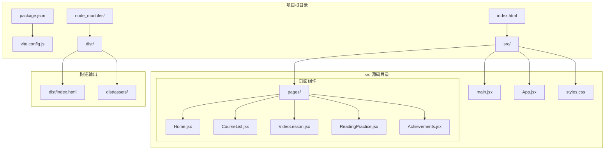

**图表来源**
- [package.json:1-22](file://package.json#L1-L22)
- [vite.config.js:1-11](file://vite.config.js#L1-L11)
- [index.html:1-20](file://index.html#L1-L20)

**章节来源**
- [package.json:1-22](file://package.json#L1-L22)
- [vite.config.js:1-11](file://vite.config.js#L1-L11)
- [index.html:1-20](file://index.html#L1-L20)

## 核心组件

### 应用入口与路由系统

应用采用 React Router 进行页面导航，主入口文件负责初始化应用环境：

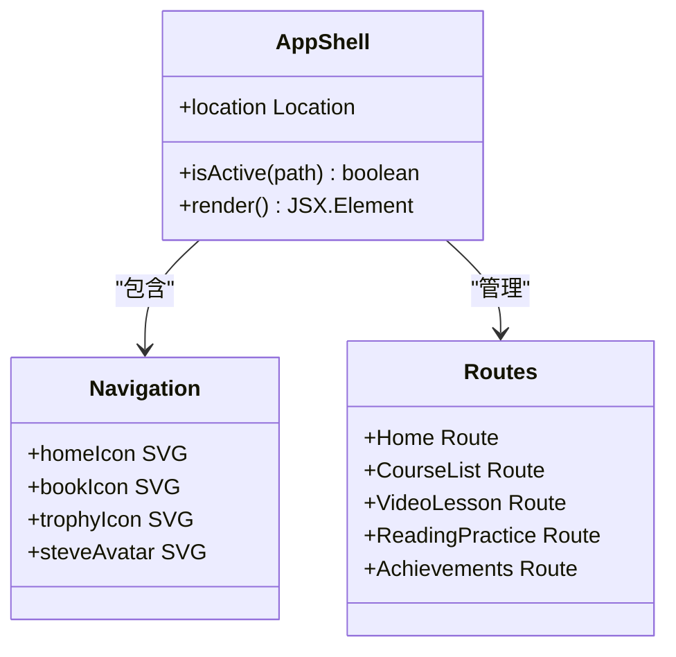

**图表来源**
- [App.jsx:47-112](file://src/App.jsx#L47-L112)

### 页面组件架构

各页面组件采用统一的设计模式，包含状态管理、数据展示和用户交互：

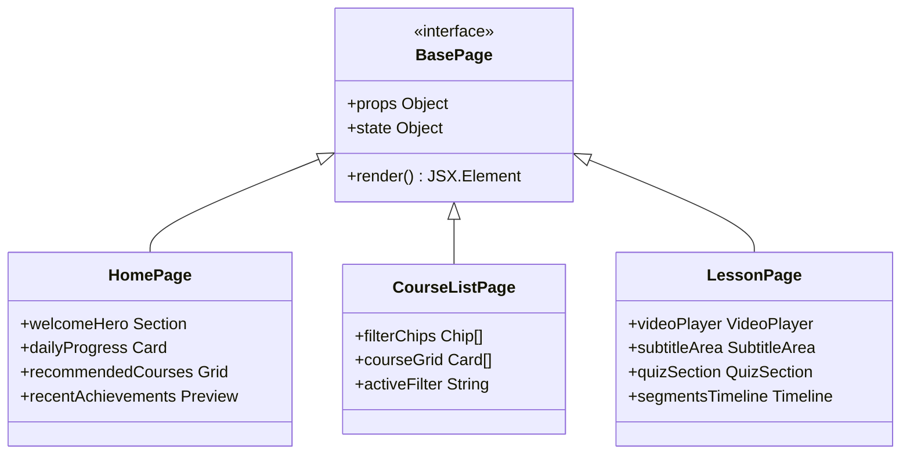

**图表来源**
- [Home.jsx:48-293](file://src/pages/Home.jsx#L48-L293)
- [CourseList.jsx:163-314](file://src/pages/CourseList.jsx#L163-L314)
- [VideoLesson.jsx:20-288](file://src/pages/VideoLesson.jsx#L20-L288)

**章节来源**
- [main.jsx:1-14](file://src/main.jsx#L1-L14)
- [App.jsx:1-112](file://src/App.jsx#L1-L112)

## 架构概览

应用采用单页应用(SPA)架构，结合 React 组件化开发和 Vite 构建工具：

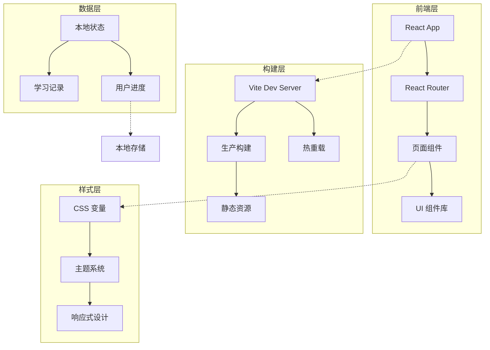

**图表来源**
- [vite.config.js:4-10](file://vite.config.js#L4-L10)
- [App.jsx:85-92](file://src/App.jsx#L85-L92)

## 详细组件分析

### 性能监控组件

#### 页面加载性能监控

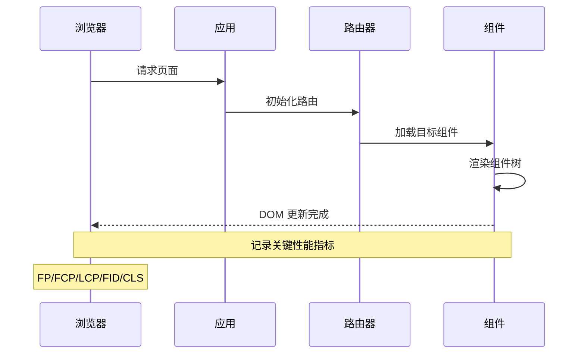

**图表来源**
- [main.jsx:7-13](file://src/main.jsx#L7-L13)
- [index.html:14-17](file://index.html#L14-L17)

#### 用户交互响应监控

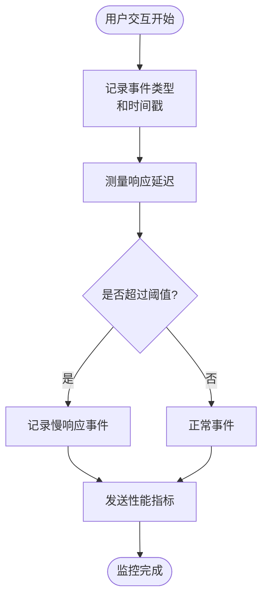

**图表来源**
- [VideoLesson.jsx:20-288](file://src/pages/VideoLesson.jsx#L20-L288)
- [ReadingPractice.jsx:45-293](file://src/pages/ReadingPractice.jsx#L45-L293)

### 错误追踪与日志收集

#### 错误边界实现

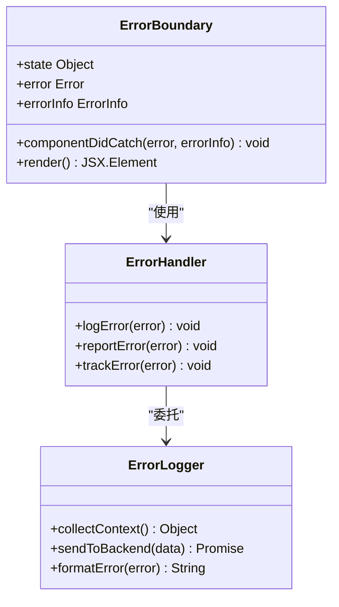

**图表来源**
- [App.jsx:47-112](file://src/App.jsx#L47-L112)

#### 异常报告系统

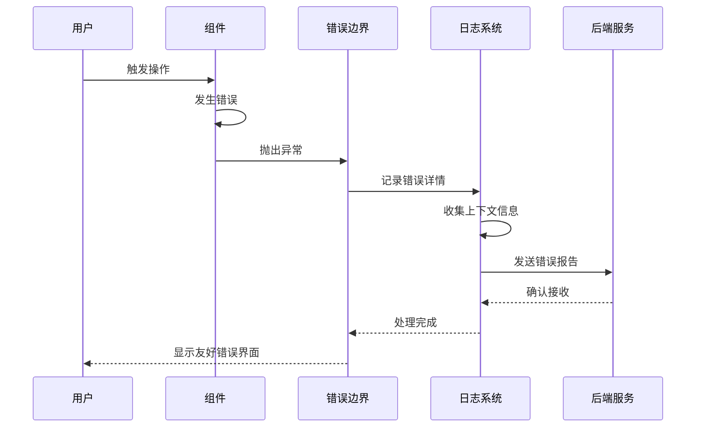

**图表来源**
- [CourseList.jsx:163-314](file://src/pages/CourseList.jsx#L163-L314)

### 用户体验分析

#### 用户行为追踪

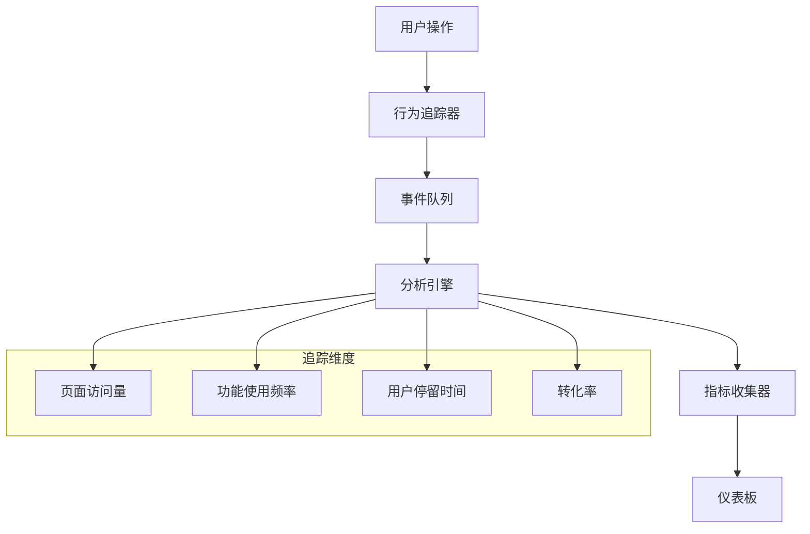

**图表来源**
- [Home.jsx:48-293](file://src/pages/Home.jsx#L48-L293)
- [Achievements.jsx:113-297](file://src/pages/Achievements.jsx#L113-L297)

#### 功能使用统计

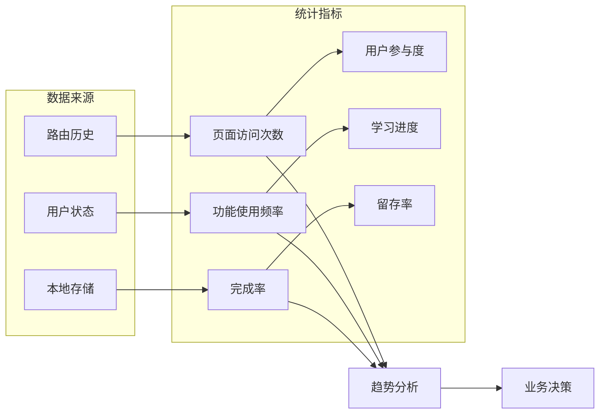

**图表来源**
- [VideoLesson.jsx:20-288](file://src/pages/VideoLesson.jsx#L20-L288)
- [ReadingPractice.jsx:45-293](file://src/pages/ReadingPractice.jsx#L45-L293)

### A/B 测试实施

#### 实验设计框架

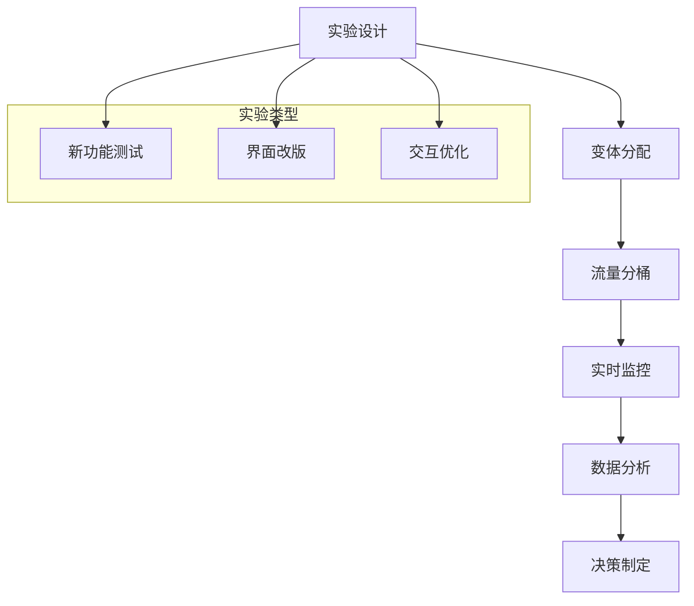

**图表来源**
- [CourseList.jsx:163-314](file://src/pages/CourseList.jsx#L163-L314)

## 依赖分析

### 核心依赖关系

```mermaid
graph TB
subgraph "运行时依赖"
A[react ^18.2.0] --> B[react-dom ^18.2.0]
B --> C[react-router-dom ^6.20.0]
end
subgraph "开发依赖"
D[@vitejs/plugin-react ^4.2.0] --> E[vite ^5.0.0]
F[构建工具链] --> G[打包优化]
end
subgraph "项目配置"
H[package.json] --> I[vite.config.js]
J[index.html] --> K[入口配置]
end
A -.-> D
E -.-> H
```

**图表来源**
- [package.json:12-20](file://package.json#L12-L20)
- [vite.config.js:1-11](file://vite.config.js#L1-L11)

### 版本兼容性

| 依赖项 | 当前版本 | 最小支持版本 | 兼容性 |
|--------|----------|--------------|--------|
| React | 18.2.0 | 17.0.0 | ✅ 高 |
| React DOM | 18.2.0 | 17.0.0 | ✅ 高 |
| React Router DOM | 6.20.0 | 6.0.0 | ✅ 高 |
| Vite | 5.0.0 | 4.0.0 | ⚠️ 中 |
| @vitejs/plugin-react | 4.2.0 | 3.0.0 | ⚠️ 中 |

**章节来源**
- [package.json:12-20](file://package.json#L12-L20)

## 性能考虑

### 性能监控指标定义

#### 关键性能指标(KPI)

| 指标类型 | 定义 | 目标值 | 监控方式 |
|----------|------|--------|----------|
| 页面加载时间 | 从请求到首屏渲染完成 | < 2 秒 | FCP/LCP |
| 交互响应时间 | 用户操作到响应完成 | < 100ms | FID |
| 资源使用率 | CPU/内存/GPU 使用 | < 80% | 性能 API |
| 用户留存率 | 7天/30天留存 | > 60% | 分析工具 |
| 功能完成率 | 课程完成率 | > 70% | 行为追踪 |

#### 性能优化策略

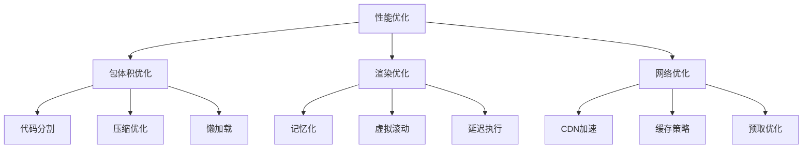

**图表来源**
- [vite.config.js:4-10](file://vite.config.js#L4-L10)

### 资源使用监控

#### 内存使用分析

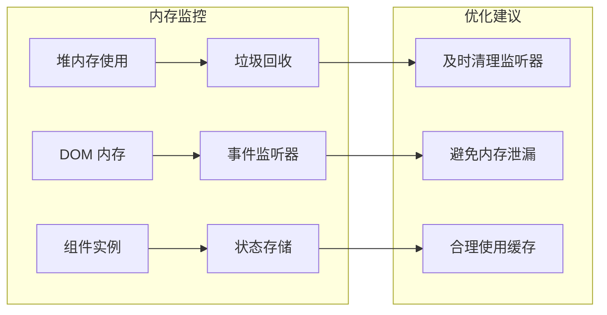

**图表来源**
- [App.jsx:47-112](file://src/App.jsx#L47-L112)

## 故障排除指南

### 常见问题诊断

#### 构建相关问题

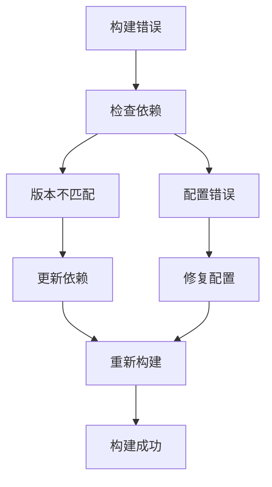

#### 运行时错误处理

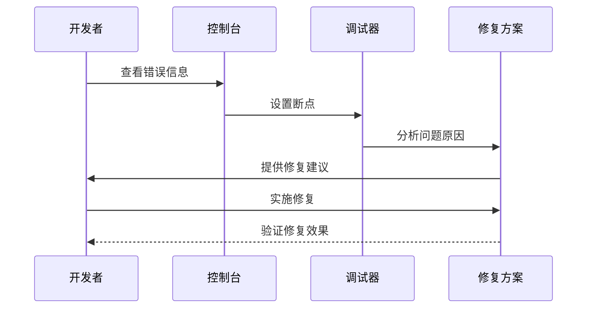

**图表来源**
- [package.json:6-11](file://package.json#L6-L11)

### 调试工具配置

#### 开发环境调试

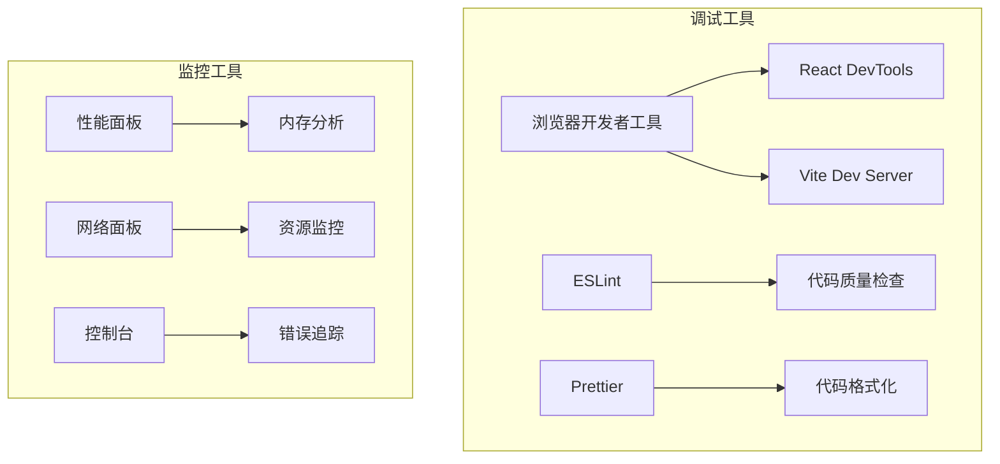

**图表来源**
- [vite.config.js:6-9](file://vite.config.js#L6-L9)

**章节来源**
- [index.html:1-20](file://index.html#L1-L20)

## 结论

本监控与维护体系文档建立了完整的应用运行时监控框架，涵盖了性能监控、错误追踪、用户体验分析和维护管理等方面。通过实施这些监控措施，可以有效提升应用的稳定性、性能和用户体验。

关键要点包括：
- 建立多维度的性能监控指标体系
- 实现完善的错误追踪和日志收集机制
- 设计用户行为分析和功能使用统计
- 制定定期维护和更新计划
- 建立故障排除和应急响应流程

该体系为项目的长期发展提供了坚实的技术基础和运维保障。

## 附录

### 维护任务计划

#### 周期性维护任务

| 任务类型 | 频率 | 负责人 | 工具/命令 |
|----------|------|--------|-----------|
| 依赖更新 | 每月 | 开发者 | npm update |
| 安全扫描 | 每月 | 安全团队 | npm audit |
| 性能分析 | 每周 | 运维团队 | Lighthouse |
| 用户反馈处理 | 持续 | 支持团队 | Jira/Trello |

#### 紧急响应流程

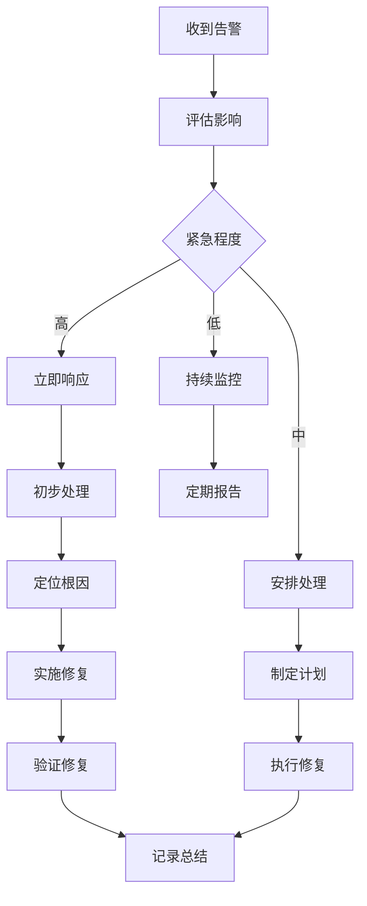