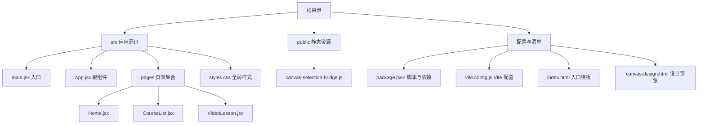
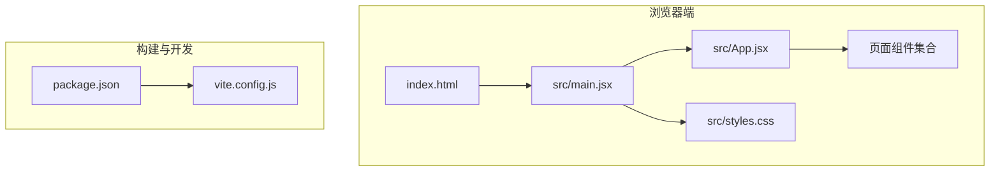
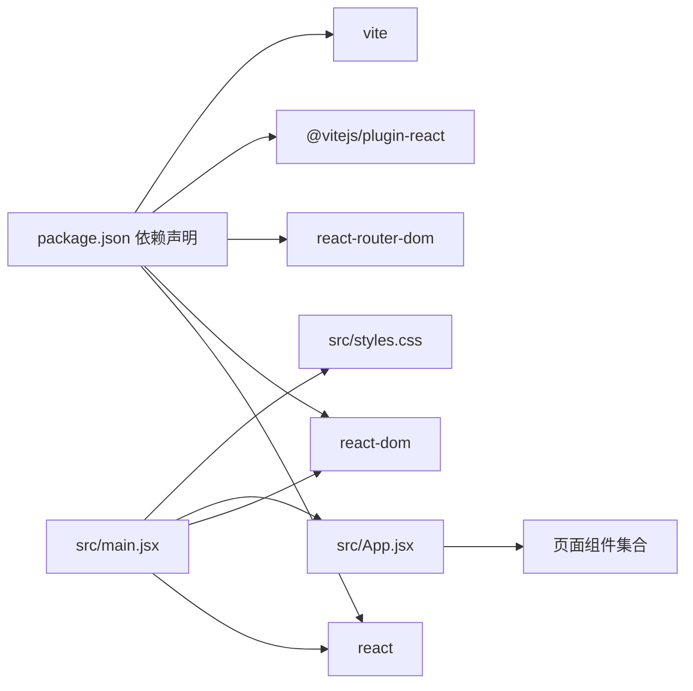

# 部署与维护

<cite>
**本文档引用的文件**
- [package.json](file://package.json)
- [vite.config.js](file://vite.config.js)
- [index.html](file://index.html)
- [src/main.jsx](file://src/main.jsx)
- [src/App.jsx](file://src/App.jsx)
- [src/styles.css](file://src/styles.css)
- [public/canvas-selection-bridge.js](file://public/canvas-selection-bridge.js)
- [canvas-design.html](file://canvas-design.html)
- [AGENTS.md](file://AGENTS.md)
- [src/pages/Home.jsx](file://src/pages/Home.jsx)
- [src/pages/CourseList.jsx](file://src/pages/CourseList.jsx)
- [src/pages/VideoLesson.jsx](file://src/pages/VideoLesson.jsx)
</cite>

## 目录
1. [简介](#简介)
2. [项目结构](#项目结构)
3. [核心组件](#核心组件)
4. [架构总览](#架构总览)
5. [详细组件分析](#详细组件分析)
6. [依赖关系分析](#依赖关系分析)
7. [性能考虑](#性能考虑)
8. [故障排查指南](#故障排查指南)
9. [结论](#结论)
10. [附录](#附录)

## 简介
本文件面向从开发到生产的全流程部署与维护，结合当前 React + Vite 项目现状，系统性阐述：
- Vite 构建配置的优化选项、打包策略与性能调优
- 开发、测试、生产环境差异与部署流程
- 静态资源优化、CDN 集成与缓存策略
- 监控指标、错误追踪与性能分析方法
- 自动化部署脚本、CI/CD 流水线与版本发布流程
- 安全配置、HTTPS 与内容安全策略
- 用户反馈收集、Bug 修复流程与功能迭代管理
- 维护成本控制、技术债务管理与长期演进规划

## 项目结构
该项目采用 React + Vite 的现代前端工程结构，核心目录与文件如下：
- 根目录包含构建与运行脚本、配置文件与入口 HTML
- src 目录包含应用入口、路由页面与样式
- public 目录包含静态资源桥接脚本
- canvas-design.html 提供设计预览跳转

图表来源
- [package.json](file://package.json)
- [vite.config.js](file://vite.config.js)
- [index.html](file://index.html)
- [src/main.jsx](file://src/main.jsx)
- [src/App.jsx](file://src/App.jsx)
- [src/styles.css](file://src/styles.css)
- [public/canvas-selection-bridge.js](file://public/canvas-selection-bridge.js)
- [canvas-design.html](file://canvas-design.html)

章节来源
- [package.json](file://package.json)
- [vite.config.js](file://vite.config.js)
- [index.html](file://index.html)
- [src/main.jsx](file://src/main.jsx)
- [src/App.jsx](file://src/App.jsx)
- [src/styles.css](file://src/styles.css)
- [public/canvas-selection-bridge.js](file://public/canvas-selection-bridge.js)
- [canvas-design.html](file://canvas-design.html)

## 核心组件
- 应用入口与路由
  - 入口文件负责挂载 React 应用并引入全局样式
  - App.jsx 定义导航与路由规则，组织页面组件
- 页面组件
  - Home.jsx：主页内容与推荐课程卡片
  - CourseList.jsx：课程列表筛选与进度展示
  - VideoLesson.jsx：视频播放模拟与听写练习
- 全局样式与主题
  - styles.css 使用设计令牌系统，定义颜色、间距、阴影与动画
- 静态资源桥接
  - canvas-selection-bridge.js 为设计工具提供元素选择与样式编辑桥接能力

章节来源
- [src/main.jsx](file://src/main.jsx)
- [src/App.jsx](file://src/App.jsx)
- [src/pages/Home.jsx](file://src/pages/Home.jsx)
- [src/pages/CourseList.jsx](file://src/pages/CourseList.jsx)
- [src/pages/VideoLesson.jsx](file://src/pages/VideoLesson.jsx)
- [src/styles.css](file://src/styles.css)
- [public/canvas-selection-bridge.js](file://public/canvas-selection-bridge.js)

## 架构总览
应用采用单页应用（SPA）架构，基于 React Router 进行客户端路由；Vite 提供开发服务器与构建打包能力。入口 HTML 中通过模块脚本加载应用入口，全局样式在入口处导入。

图表来源
- [index.html](file://index.html)
- [src/main.jsx](file://src/main.jsx)
- [src/App.jsx](file://src/App.jsx)
- [src/styles.css](file://src/styles.css)
- [vite.config.js](file://vite.config.js)
- [package.json](file://package.json)

## 详细组件分析

### Vite 构建配置与优化
- 当前配置要点
  - 插件：使用 @vitejs/plugin-react
  - 开发服务器：host 与 port 设置
- 可扩展优化项（建议）
  - 构建产物优化：rollupOptions 输出重命名、外部依赖拆分、最小化与压缩
  - 资源处理：静态资源内联阈值、图片优化、字体子集化
  - 缓存策略：输出文件名带哈希、HTML 注入带版本号的资源链接
  - CDN 集成：公共资源（字体、图标）指向 CDN，减少主包体积
  - 分包策略：按路由或组件拆分包，提升首屏加载速度
  - 预加载与预取：关键资源预加载，非关键资源预取
  - Source Map：生产环境关闭或降级，开发环境开启便于调试
  - 环境变量：区分开发/测试/生产环境变量，避免敏感信息泄露

章节来源
- [vite.config.js](file://vite.config.js)
- [package.json](file://package.json)

### 开发、测试、生产环境差异
- 开发环境
  - 使用 Vite 开发服务器，热更新与快速启动
  - 可开启严格模式与 React DevTools
  - 本地代理与跨域处理（如有后端接口）
- 测试环境
  - 使用构建产物进行本地预览验证
  - 集成 E2E 与单元测试
- 生产环境
  - 构建产物最小化与压缩
  - CDN 加速与缓存策略生效
  - HTTPS 与安全头配置
  - 性能监控与错误追踪接入

章节来源
- [AGENTS.md](file://AGENTS.md)
- [canvas-design.html](file://canvas-design.html)

### 部署流程
- 本地构建
  - 执行构建命令生成 dist 目录
  - 验证构建产物与资源完整性
- 静态托管
  - 将 dist 目录部署至静态托管平台（如 GitHub Pages、Vercel、Netlify）
  - 或部署至 CDN 与反向代理（Nginx/Apache）
- 预览与验证
  - 在预览环境中验证路由、资源加载与交互
- 发布
  - 切换线上域名与证书，确保 HTTPS
  - 更新 DNS 与 CDN 缓存

章节来源
- [package.json](file://package.json)
- [index.html](file://index.html)

### 静态资源优化、CDN 与缓存
- 资源优化
  - 图片与图标：矢量化或使用 WebP/JPEG2000，按需懒加载
  - 字体：使用子集化字体，预加载关键字形
  - 样式：CSS 压缩与去重，关键 CSS 内联
- CDN 集成
  - 将第三方字体与公共资源指向 CDN
  - 主包资源通过 CDN 分发，缩短首字节时间
- 缓存策略
  - 静态资源带强缓存（immutable）
  - HTML 与动态资源短缓存或不缓存
  - 服务端设置合适的 Cache-Control 与 ETag

章节来源
- [src/styles.css](file://src/styles.css)
- [public/canvas-selection-bridge.js](file://public/canvas-selection-bridge.js)

### 监控指标、错误追踪与性能分析
- 指标采集
  - 首屏时间（FCP/LCP/INP）、路由切换时间、资源加载耗时
  - 错误率与崩溃率、用户行为路径
- 错误追踪
  - 前端错误上报（如 Sentry、Bugsnag）
  - 与构建版本关联，便于回溯
- 性能分析
  - 使用浏览器性能面板与 Lighthouse
  - 关键渲染路径优化与资源瀑布分析

[本节为通用实践指导，无需特定文件引用]

### 自动化部署脚本与 CI/CD 流水线
- 脚本建议
  - npm run build：执行 Vite 构建
  - npm run preview：本地预览构建产物
  - npm run dev：启动开发服务器
- CI/CD 流程
  - 触发条件：分支保护、PR 合并、标签推送
  - 步骤：安装依赖、代码检查、单元测试、构建、上传制品、部署预览/生产
  - 回滚：支持一键回滚至上一版本
- 版本发布
  - 语义化版本号管理，变更日志与发布说明
  - 自动化打 Tag 与发布制品

章节来源
- [package.json](file://package.json)

### 安全配置、HTTPS 与内容安全策略
- HTTPS
  - 强制 HTTPS 重定向，HSTS 头
  - TLS 最低版本与加密套件升级
- 内容安全策略（CSP）
  - 限制脚本执行来源、内联脚本与 eval
  - 对 CDN 资源白名单放行
- 其他安全头
  - X-Frame-Options、X-Content-Type-Options、Referrer-Policy
- 环境变量与密钥
  - 不将任何密钥或敏感信息提交到仓库
  - 使用 CI/CD 的机密变量管理

[本节为通用实践指导，无需特定文件引用]

### 用户反馈、Bug 修复与功能迭代
- 反馈渠道
  - 内嵌反馈按钮、邮件与工单系统
- Bug 修复流程
  - 复现步骤记录、日志与截图
  - 分支修复、回归测试、灰度发布
- 功能迭代
  - 敏捷迭代计划，A/B 测试与数据驱动决策
  - 版本发布节奏与回滚预案

[本节为通用实践指导，无需特定文件引用]

## 依赖关系分析
React 生态与 Vite 配置之间的耦合关系如下：

图表来源
- [package.json](file://package.json)
- [src/main.jsx](file://src/main.jsx)
- [src/App.jsx](file://src/App.jsx)
- [src/styles.css](file://src/styles.css)

章节来源
- [package.json](file://package.json)
- [src/main.jsx](file://src/main.jsx)
- [src/App.jsx](file://src/App.jsx)

## 性能考虑
- 构建性能
  - 并行编译、缓存与增量构建
  - 减少不必要的依赖与无用代码
- 运行时性能
  - 组件懒加载与路由级分割
  - 图片与字体懒加载、骨架屏与占位符
  - CSS 与 JS 按需加载，避免阻塞渲染
- 资源体积
  - Tree-shaking、按需引入第三方库
  - 图片压缩与格式优化、字体子集化

[本节为通用实践指导，无需特定文件引用]

## 故障排查指南
- 构建失败
  - 检查依赖安装与 Node 版本兼容性
  - 清理缓存后重试
- 开发服务器问题
  - 端口占用与 host 配置
  - 热更新失效时重启开发服务器
- 预览与部署异常
  - 校验构建产物与入口 HTML
  - 检查静态资源路径与 CDN 配置
- 性能问题
  - 使用性能分析工具定位瓶颈
  - 优化关键渲染路径与资源加载

章节来源
- [vite.config.js](file://vite.config.js)
- [canvas-design.html](file://canvas-design.html)

## 结论
本项目具备清晰的前端工程结构与良好的可维护性。建议在现有基础上完善 Vite 构建优化、CDN 与缓存策略、监控与安全配置，并建立标准化的 CI/CD 流水线与版本发布流程，以支撑从开发到生产的全生命周期管理。

[本节为总结性内容，无需特定文件引用]

## 附录

### 开发与预览命令
- 开发：npm run dev
- 设计预览：npm run dev:design
- 构建：npm run build
- 预览构建：npm run preview

章节来源
- [package.json](file://package.json)

### 入口与路由概览
- 入口 HTML：index.html
- 应用入口：src/main.jsx
- 根组件与路由：src/App.jsx
- 页面组件：Home、CourseList、VideoLesson

章节来源
- [index.html](file://index.html)
- [src/main.jsx](file://src/main.jsx)
- [src/App.jsx](file://src/App.jsx)
- [src/pages/Home.jsx](file://src/pages/Home.jsx)
- [src/pages/CourseList.jsx](file://src/pages/CourseList.jsx)
- [src/pages/VideoLesson.jsx](file://src/pages/VideoLesson.jsx)