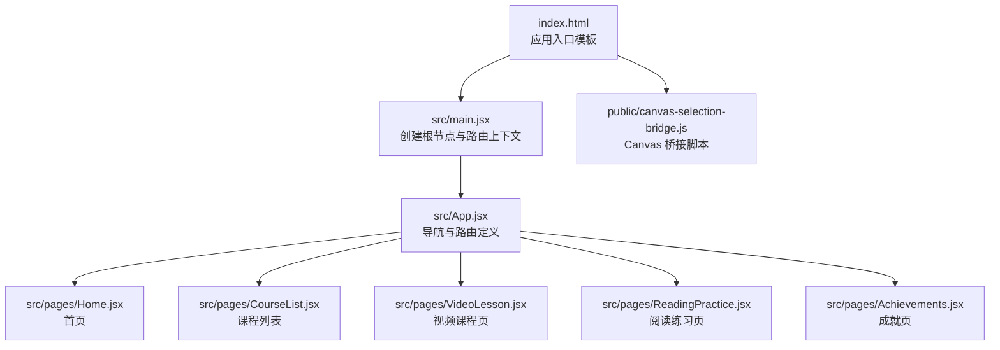
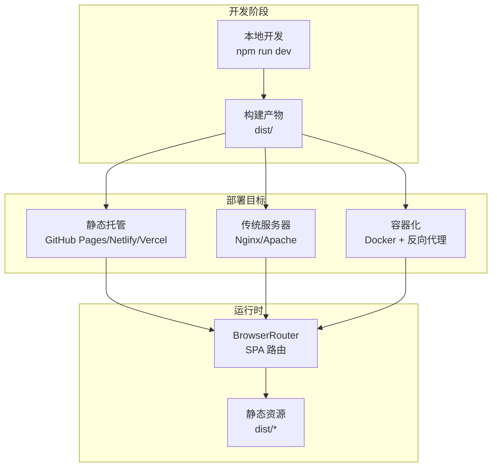
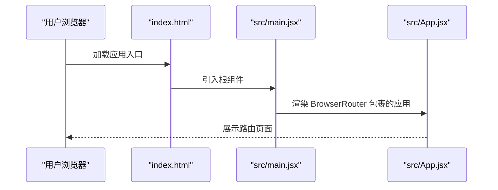
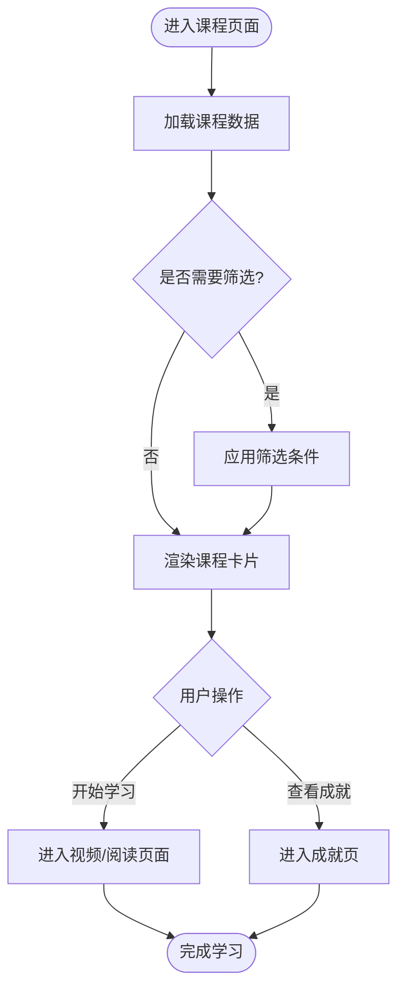
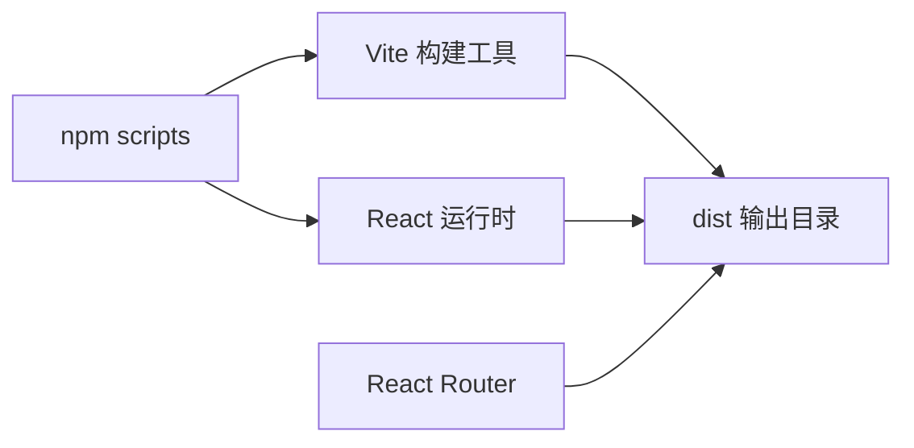

# 部署流程

<cite>
**本文档引用的文件**
- [package.json](file://package.json)
- [vite.config.js](file://vite.config.js)
- [index.html](file://index.html)
- [src/main.jsx](file://src/main.jsx)
- [src/App.jsx](file://src/App.jsx)
- [src/pages/Home.jsx](file://src/pages/Home.jsx)
- [src/pages/CourseList.jsx](file://src/pages/CourseList.jsx)
- [src/pages/VideoLesson.jsx](file://src/pages/VideoLesson.jsx)
- [src/pages/ReadingPractice.jsx](file://src/pages/ReadingPractice.jsx)
- [src/pages/Achievements.jsx](file://src/pages/Achievements.jsx)
- [public/canvas-selection-bridge.js](file://public/canvas-selection-bridge.js)
- [AGENTS.md](file://AGENTS.md)
</cite>

## 目录
1. [简介](#简介)
2. [项目结构](#项目结构)
3. [核心组件](#核心组件)
4. [架构总览](#架构总览)
5. [详细组件分析](#详细组件分析)
6. [依赖关系分析](#依赖关系分析)
7. [性能考量](#性能考量)
8. [故障排查指南](#故障排查指南)
9. [结论](#结论)
10. [附录](#附录)

## 简介
本文件为该 React Vite 项目的部署流程与运维指南，覆盖从本地开发到生产环境的全流程管理，包括：
- 部署目标选择（静态托管、服务器、容器化）
- 平台部署（GitHub Pages、Netlify、Vercel）步骤与注意事项
- 手动部署与自动化部署（CI/CD）配置要点
- 域名绑定、HTTPS 证书与 SSL 设置
- 部署前检查清单、回滚策略与应急处理
- 多环境部署（开发、测试、生产）配置差异与管理策略

## 项目结构
该项目基于 Vite 构建，采用 React + React Router 的前端单页应用（SPA）。核心入口为 HTML 模板与 React 根组件，页面路由通过 BrowserRouter 管理。

图表来源
- [index.html:1-20](file://index.html#L1-L20)
- [src/main.jsx:1-14](file://src/main.jsx#L1-L14)
- [src/App.jsx:1-112](file://src/App.jsx#L1-L112)
- [src/pages/Home.jsx:1-293](file://src/pages/Home.jsx#L1-L293)
- [src/pages/CourseList.jsx:1-314](file://src/pages/CourseList.jsx#L1-L314)
- [src/pages/VideoLesson.jsx:1-288](file://src/pages/VideoLesson.jsx#L1-L288)
- [src/pages/ReadingPractice.jsx:1-293](file://src/pages/ReadingPractice.jsx#L1-L293)
- [src/pages/Achievements.jsx:1-297](file://src/pages/Achievements.jsx#L1-L297)
- [public/canvas-selection-bridge.js:1-930](file://public/canvas-selection-bridge.js#L1-L930)

章节来源
- [index.html:1-20](file://index.html#L1-L20)
- [src/main.jsx:1-14](file://src/main.jsx#L1-L14)
- [src/App.jsx:1-112](file://src/App.jsx#L1-L112)

## 核心组件
- 应用入口与构建脚本
  - 构建命令：使用 Vite 提供的构建脚本生成静态资源目录 dist
  - 开发服务器：默认监听 127.0.0.1:5173，可通过参数调整端口
- 路由与页面
  - 使用 React Router 的 BrowserRouter，支持 SPA 路由跳转
  - 页面组件按功能模块划分，便于独立维护与测试
- 静态资源与桥接脚本
  - public 目录下的脚本用于特定设计工具集成场景

章节来源
- [package.json:6-11](file://package.json#L6-L11)
- [vite.config.js:1-11](file://vite.config.js#L1-L11)
- [src/main.jsx:1-14](file://src/main.jsx#L1-L14)
- [src/App.jsx:1-112](file://src/App.jsx#L1-L112)
- [public/canvas-selection-bridge.js:1-930](file://public/canvas-selection-bridge.js#L1-L930)

## 架构总览
下图展示从开发到部署的关键环节与产物：

## 详细组件分析

### 组件 A 分析：应用入口与路由
- 入口模板负责加载根组件与样式
- 根组件包裹 BrowserRouter，确保路由能力
- 页面组件通过路由注册，形成多页面体验

图表来源
- [index.html:1-20](file://index.html#L1-L20)
- [src/main.jsx:1-14](file://src/main.jsx#L1-L14)
- [src/App.jsx:1-112](file://src/App.jsx#L1-L112)

章节来源
- [index.html:1-20](file://index.html#L1-L20)
- [src/main.jsx:1-14](file://src/main.jsx#L1-L14)
- [src/App.jsx:1-112](file://src/App.jsx#L1-L112)

### 组件 B 分析：课程与学习页面
- 课程列表页提供筛选与进度展示
- 视频课程页包含字幕切换与测验
- 阅读练习页包含词汇保存与答题反馈
- 成就页展示等级与徽章进度

图表来源
- [src/pages/CourseList.jsx:1-314](file://src/pages/CourseList.jsx#L1-L314)
- [src/pages/VideoLesson.jsx:1-288](file://src/pages/VideoLesson.jsx#L1-L288)
- [src/pages/ReadingPractice.jsx:1-293](file://src/pages/ReadingPractice.jsx#L1-L293)
- [src/pages/Achievements.jsx:1-297](file://src/pages/Achievements.jsx#L1-L297)

章节来源
- [src/pages/CourseList.jsx:1-314](file://src/pages/CourseList.jsx#L1-L314)
- [src/pages/VideoLesson.jsx:1-288](file://src/pages/VideoLesson.jsx#L1-L288)
- [src/pages/ReadingPractice.jsx:1-293](file://src/pages/ReadingPractice.jsx#L1-L293)
- [src/pages/Achievements.jsx:1-297](file://src/pages/Achievements.jsx#L1-L297)

### 组件 C 分析：静态资源与桥接脚本
- public 下的脚本用于设计工具桥接，不影响运行时路由
- 构建后 dist 中的静态资源需正确部署以保证页面正常显示

章节来源
- [public/canvas-selection-bridge.js:1-930](file://public/canvas-selection-bridge.js#L1-L930)

## 依赖关系分析
- 构建工具：Vite（提供开发服务器与打包）
- 运行时框架：React + React Router（SPA 路由）
- 依赖管理：npm scripts 定义开发、构建、预览命令

图表来源
- [package.json:6-11](file://package.json#L6-L11)
- [vite.config.js:1-11](file://vite.config.js#L1-L11)
- [src/main.jsx:1-14](file://src/main.jsx#L1-L14)

章节来源
- [package.json:6-11](file://package.json#L6-L11)
- [vite.config.js:1-11](file://vite.config.js#L1-L11)

## 性能考量
- 构建优化：利用 Vite 的原生 ESM 与按需编译特性，减少冷启动时间
- 资源体积：拆分页面组件，结合路由懒加载（建议在路由层实现）
- 预加载策略：对首屏关键路由进行预加载，提升用户体验
- 缓存策略：静态资源采用长缓存，构建产物版本化命名，避免缓存污染

## 故障排查指南
- 构建失败
  - 检查 Node 版本与依赖安装
  - 确认 package.json 中脚本与依赖版本匹配
- 路由 404
  - 静态托管需配置“回退到 index.html”，确保 SPA 路由生效
- 开发服务器无法访问
  - 检查 host/port 配置与防火墙
- 设计工具桥接异常
  - 确认 public 脚本未被构建工具处理，必要时置于 public 目录

章节来源
- [package.json:6-11](file://package.json#L6-L11)
- [vite.config.js:1-11](file://vite.config.js#L1-L11)
- [AGENTS.md:18-22](file://AGENTS.md#L18-L22)

## 结论
本项目具备良好的前端工程化基础，适合多种部署形态。建议优先采用静态托管平台进行快速上线，配合 CI/CD 自动化发布；在需要服务端逻辑或动态内容时再考虑服务器或容器化部署。同时，务必重视路由回退、域名与 HTTPS 配置，确保生产环境稳定可用。

## 附录

### 部署目标与配置要点
- 静态托管（推荐）
  - GitHub Pages：启用 Pages 功能，选择构建产物目录为 dist
  - Netlify/Vercel：配置构建命令与输出目录为 dist，开启函数/边缘计算可选
- 传统服务器
  - Nginx/Apache：将 dist 目录作为站点根目录，配置 404 回退至 index.html
- 容器化
  - Docker：使用 Nginx 镜像挂载 dist，暴露 80 端口
  - 反向代理：在网关层统一处理 HTTPS 与路由转发

### 平台部署步骤与注意事项
- GitHub Pages
  - 在仓库 Settings 中启用 Pages，选择分支与根目录
  - 注意：若项目位于子目录，需调整构建输出路径或使用子路径部署
- Netlify
  - 选择仓库并配置 Build Command 与 Publish Directory
  - 可配置环境变量与重定向规则
- Vercel
  - 导入仓库，自动识别框架与构建命令
  - 支持边缘函数与自定义域名

### 手动部署与自动化部署
- 手动部署
  - 本地执行构建命令生成 dist
  - 将 dist 文件上传至目标平台或服务器
- 自动化部署（CI/CD）
  - 推送代码触发流水线，执行安装依赖、构建、测试与部署
  - 建议在流水线中加入构建产物校验与缓存优化

### 域名绑定、HTTPS 证书与 SSL 设置
- 域名绑定
  - 在平台控制台添加自定义域名并配置 DNS 记录
- HTTPS 证书
  - 平台通常自动签发与续期证书
  - 若使用自定义证书，需在服务器或平台侧导入并启用
- SSL 设置
  - 强制 HTTPS 重定向
  - 配置安全响应头（HSTS、CSP 等）

### 部署前检查清单
- 本地构建成功且无错误
- 路由回退配置正确（静态托管）
- 域名解析与证书状态正常
- CI/CD 流水线可稳定运行
- 备份与回滚策略已准备

### 回滚策略与应急处理
- 回滚策略
  - 保留最近几个版本的构建产物，支持一键回滚
  - 在 CDN/反向代理层切换版本
- 应急处理
  - 快速定位问题（日志、监控、错误率）
  - 临时降级（关闭新功能、回退到上一稳定版本）
  - 通知与预案演练

### 多环境部署（开发、测试、生产）
- 环境差异
  - 开发：本地调试，热更新，禁用生产优化
  - 测试：模拟生产环境，启用缓存与压缩
  - 生产：最小化构建，严格缓存与安全策略
- 管理策略
  - 使用环境变量区分配置
  - 不同分支对应不同环境，权限隔离
  - 发布前在测试环境进行端到端验证