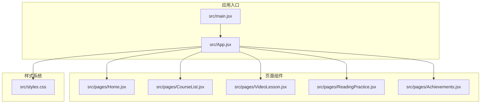
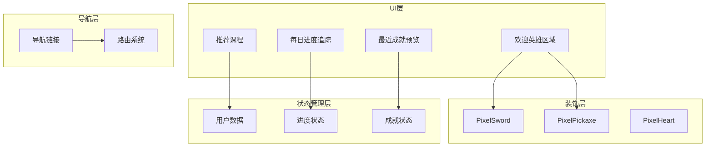
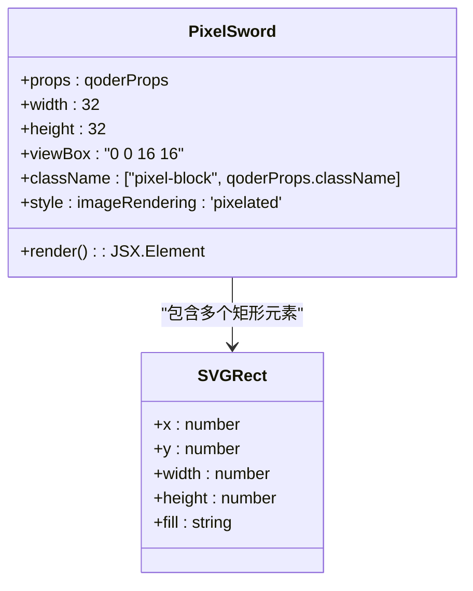
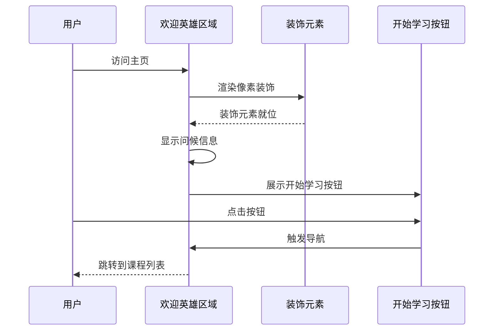
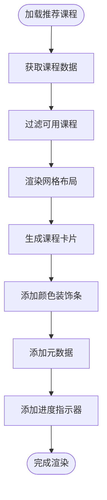
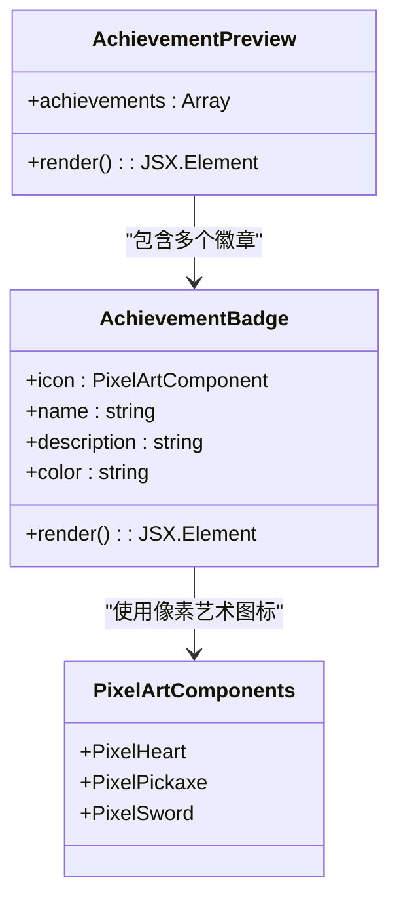
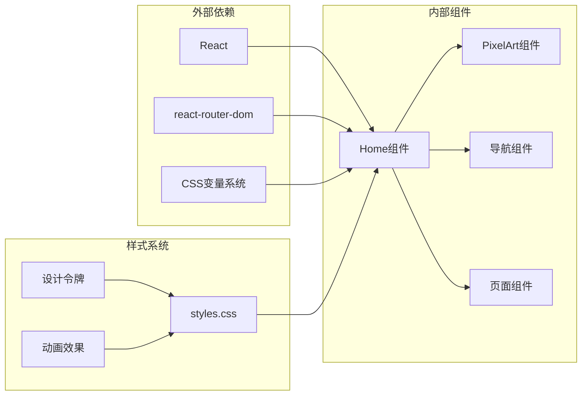

# 主页组件

<cite>
**本文档引用的文件**
- [Home.jsx](file://src/pages/Home.jsx)
- [App.jsx](file://src/App.jsx)
- [main.jsx](file://src/main.jsx)
- [styles.css](file://src/styles.css)
- [CourseList.jsx](file://src/pages/CourseList.jsx)
- [Achievements.jsx](file://src/pages/Achievements.jsx)
- [VideoLesson.jsx](file://src/pages/VideoLesson.jsx)
- [ReadingPractice.jsx](file://src/pages/ReadingPractice.jsx)
</cite>

## 目录
1. [简介](#简介)
2. [项目结构](#项目结构)
3. [核心组件](#核心组件)
4. [架构概览](#架构概览)
5. [详细组件分析](#详细组件分析)
6. [依赖分析](#依赖分析)
7. [性能考虑](#性能考虑)
8. [故障排除指南](#故障排除指南)
9. [结论](#结论)

## 简介

主页组件是CraftWords应用的核心入口页面，采用Minecraft主题设计风格，为用户提供沉浸式英语学习体验。该组件实现了完整的学习仪表板功能，包括欢迎英雄区域、每日进度追踪、推荐课程、最近成就预览等核心功能模块。

该主页组件展现了现代化React开发的最佳实践，通过像素艺术装饰元素、响应式布局设计和流畅的用户体验，为学习者提供了一个既有趣又高效的学习环境。

## 项目结构

CraftWords应用采用模块化架构设计，主要文件组织如下：

**图表来源**
- [main.jsx:1-14](file://src/main.jsx#L1-L14)
- [App.jsx:1-112](file://src/App.jsx#L1-L112)

**章节来源**
- [main.jsx:1-14](file://src/main.jsx#L1-L14)
- [App.jsx:1-112](file://src/App.jsx#L1-L112)

## 核心组件

主页组件包含以下主要功能模块：

### 欢迎英雄区域
- **用户问候**：动态显示用户姓名和学习状态
- **引导按钮**：提供快速开始学习的入口
- **像素艺术装饰**：使用SVG组件创造Minecraft风格的装饰元素

### 每日进度追踪
- **XP进度条**：可视化显示当日经验值获取进度
- **等级显示**：实时更新用户当前等级
- **连击天数**：展示学习连续性指标

### 推荐课程模块
- **网格布局**：响应式课程卡片网格
- **快捷入口**：直接跳转到相关学习内容
- **进度指示**：显示每门课程的完成状态

### 最近成就预览
- **徽章展示**：以像素艺术形式展示已获得的成就
- **进度追踪**：显示未完成成就的完成进度

**章节来源**
- [Home.jsx:48-293](file://src/pages/Home.jsx#L48-L293)

## 架构概览

主页组件采用分层架构设计，确保代码的可维护性和扩展性：

**图表来源**
- [Home.jsx:48-293](file://src/pages/Home.jsx#L48-L293)
- [App.jsx:47-112](file://src/App.jsx#L47-L112)

## 详细组件分析

### PixelArt装饰组件

主页实现了三个独特的像素艺术SVG组件，用于增强Minecraft主题风格：

#### PixelSword组件

**图表来源**
- [Home.jsx:4-15](file://src/pages/Home.jsx#L4-L15)

#### PixelPickaxe组件
- **蓝色工具造型**：使用浅蓝色(#4FC3F7)和棕色(#8B6914)渐变
- **多层结构**：包含斧头头部和手柄的复杂像素艺术
- **细节丰富**：精确的像素级几何形状组合

#### PixelHeart组件
- **爱心形状**：使用红色(#E05A5A)像素块构建
- **对称设计**：左右对称的心形轮廓
- **紧凑布局**：在24x24像素范围内实现完整爱心

**章节来源**
- [Home.jsx:4-46](file://src/pages/Home.jsx#L4-L46)

### 欢迎英雄区域实现

欢迎英雄区域是主页的核心视觉焦点，采用渐变背景和绝对定位实现：

**图表来源**
- [Home.jsx:48-108](file://src/pages/Home.jsx#L48-L108)

关键特性：
- **渐变背景**：使用`linear-gradient(135deg, var(--color-grass-wash) 0%, var(--color-surface) 100%)`
- **绝对定位装饰**：剑和镐子图标以半透明方式装饰
- **字符插画**：自定义的像素风格角色形象
- **响应式设计**：适配不同屏幕尺寸

**章节来源**
- [Home.jsx:52-108](file://src/pages/Home.jsx#L52-L108)

### 每日进度追踪系统

进度追踪模块包含两个主要部分：

#### XP进度条
- **视觉设计**：使用渐变绿色背景(#4CAF50到#5DBF60)
- **数值显示**：实时显示当前XP值和目标值
- **等级标识**：显示用户当前等级(14级)

#### 连击天数显示
- **黄金配色**：使用`var(--color-gold)`突出显示
- **进度可视化**：7个圆点表示7天学习连击
- **状态指示**：已完成的天数显示为金色，未完成的为灰色

**章节来源**
- [Home.jsx:110-142](file://src/pages/Home.jsx#L110-L142)

### 推荐课程网格系统

推荐课程模块采用响应式网格布局：

**图表来源**
- [Home.jsx:144-258](file://src/pages/Home.jsx#L144-L258)

课程类型支持：
- **听力课程**：蓝色装饰条(#889DF0)
- **阅读课程**：绿色装饰条(#8AC68A)
- **词汇课程**：黄色装饰条(#F7CD67)
- **奖励课程**：紫色装饰条(#B77DEE)，带锁定效果

**章节来源**
- [Home.jsx:153-258](file://src/pages/Home.jsx#L153-L258)

### 最近成就预览

成就预览模块展示了用户的最新成就：

**图表来源**
- [Home.jsx:260-289](file://src/pages/Home.jsx#L260-L289)

成就徽章设计：
- **圆形背景**：使用对应的颜色主题
- **像素艺术图标**：每个成就都有独特的像素风格图标
- **半透明效果**：未解锁的成就显示为半透明

**章节来源**
- [Home.jsx:267-288](file://src/pages/Home.jsx#L267-L288)

## 依赖分析

主页组件的依赖关系展现了清晰的层次结构：

**图表来源**
- [Home.jsx:1](file://src/pages/Home.jsx#L1)
- [styles.css:1-87](file://src/styles.css#L1-L87)

**章节来源**
- [Home.jsx:1-293](file://src/pages/Home.jsx#L1-L293)
- [styles.css:1-499](file://src/styles.css#L1-L499)

## 性能考虑

主页组件在设计时充分考虑了性能优化：

### 像素渲染优化
- **image-rendering: 'pixelated'**：确保像素艺术在缩放时保持清晰
- **SVG优先**：使用矢量图形避免位图缩放失真
- **最小化重绘**：装饰元素使用绝对定位减少布局影响

### 渲染性能
- **无状态组件**：主要使用函数组件，减少不必要的状态管理
- **条件渲染**：根据用户状态动态显示内容
- **CSS变量**：使用CSS自定义属性提高样式更新效率

### 内存管理
- **组件卸载**：确保路由切换时正确清理资源
- **事件监听**：避免内存泄漏的事件绑定

## 故障排除指南

### 常见问题及解决方案

#### 像素艺术显示模糊
**问题描述**：像素艺术在某些设备上显示模糊
**解决方案**：
1. 确保CSS中包含`.pixel-block`类定义
2. 检查`image-rendering: 'pixelated'`样式是否正确应用
3. 验证SVG viewBox属性设置

#### 导航链接失效
**问题描述**：点击课程卡片无法跳转
**解决方案**：
1. 检查`react-router-dom`版本兼容性
2. 确认路由配置正确
3. 验证Link组件的to属性

#### 样式不生效
**问题描述**：主页样式显示异常
**解决方案**：
1. 检查CSS变量定义
2. 确认`:root`选择器中的设计令牌
3. 验证样式文件加载顺序

**章节来源**
- [styles.css:451-456](file://src/styles.css#L451-L456)
- [Home.jsx:1-293](file://src/pages/Home.jsx#L1-L293)

## 结论

主页组件成功实现了Minecraft主题的英语学习仪表板，展现了现代Web应用开发的最佳实践。通过精心设计的像素艺术装饰、响应式布局和流畅的用户体验，为学习者创造了一个既有趣又高效的学习环境。

该组件的主要优势包括：
- **主题一致性**：完整的Minecraft风格设计语言
- **功能完整性**：涵盖学习进度、课程推荐、成就展示等核心功能
- **性能优化**：合理的渲染策略和资源管理
- **可扩展性**：清晰的架构设计便于后续功能扩展

未来可以考虑的功能增强：
- 实时进度同步
- 个性化学习路径推荐
- 更丰富的交互效果
- 多语言支持扩展