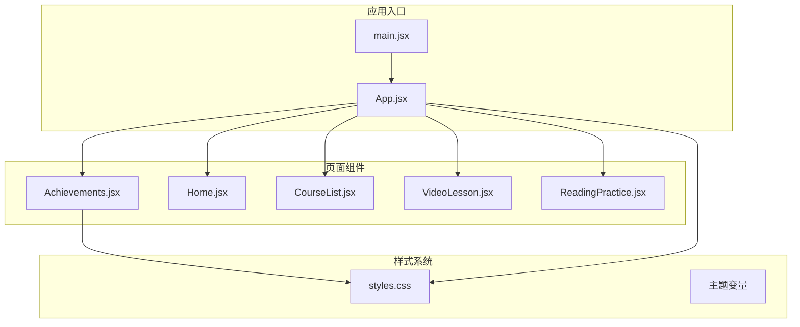
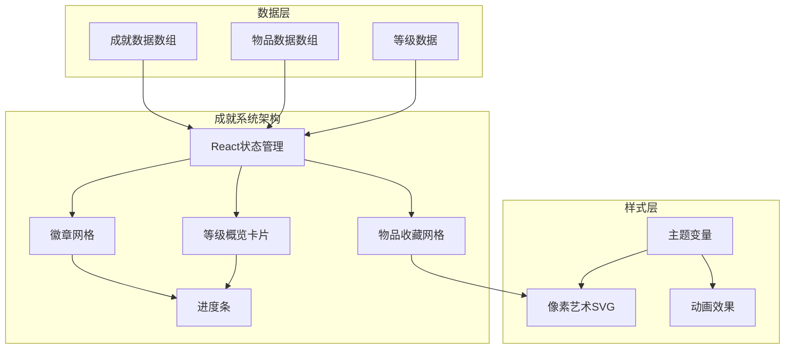
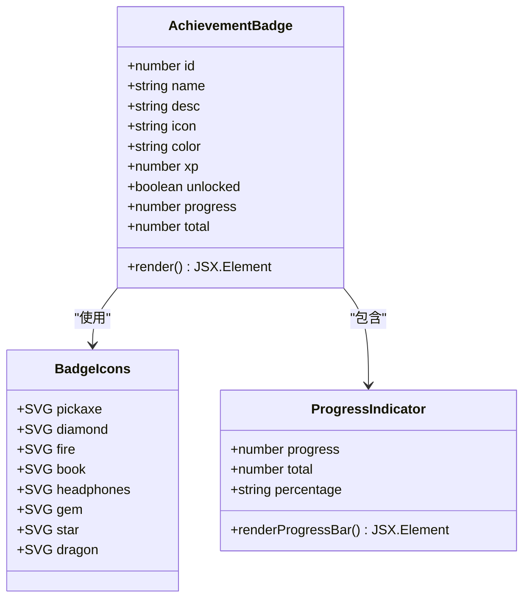
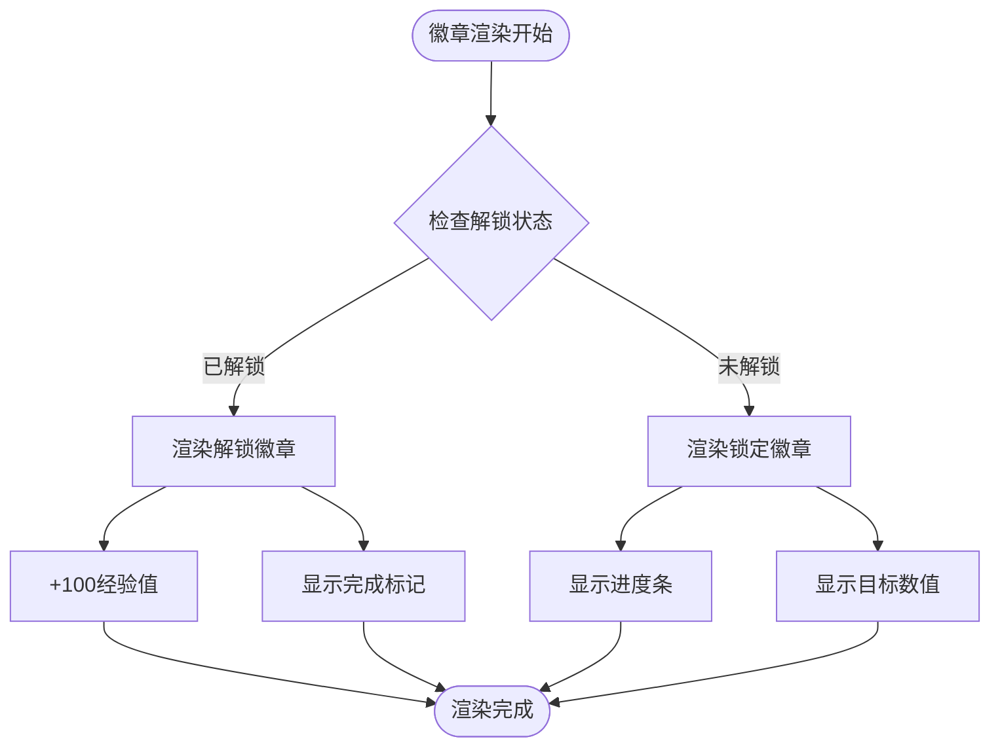
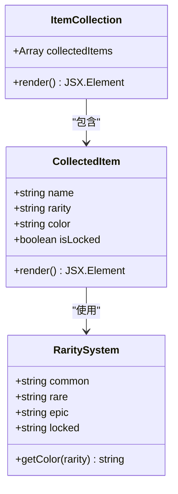
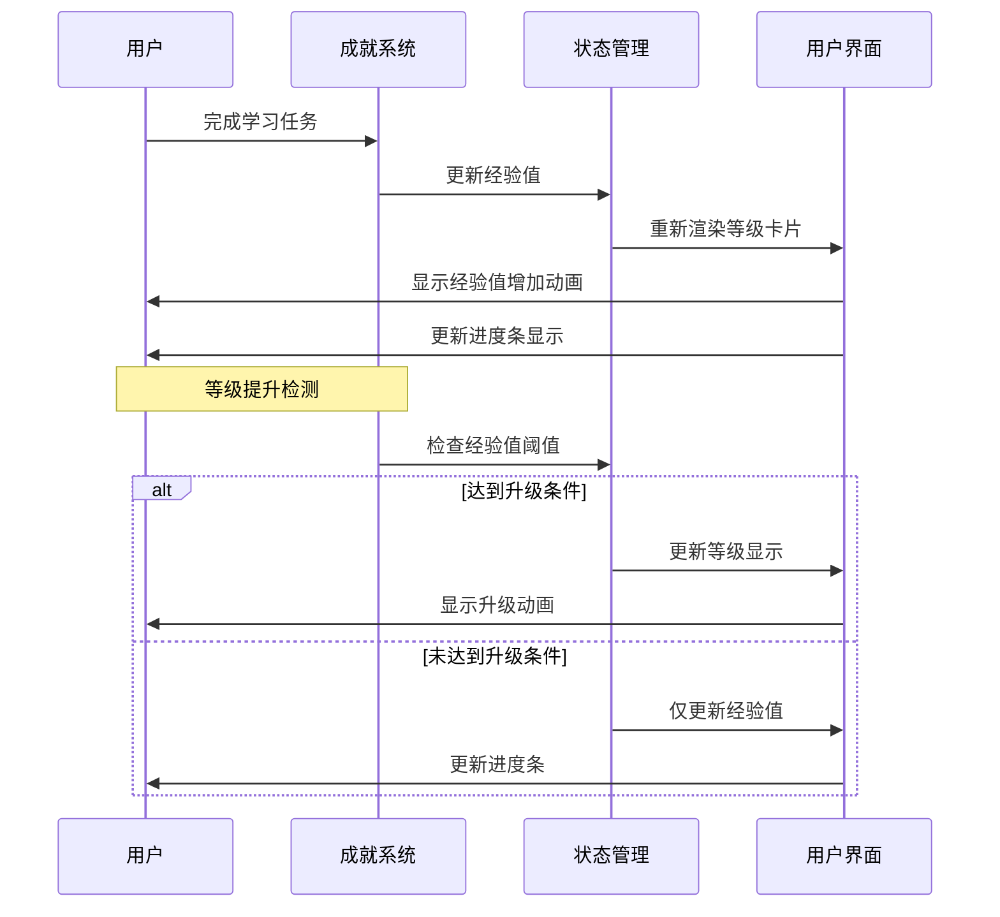
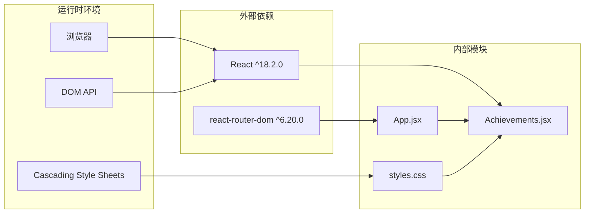

# 成就系统组件

<cite>
**本文档引用的文件**
- [Achievements.jsx](file://src/pages/Achievements.jsx)
- [App.jsx](file://src/App.jsx)
- [main.jsx](file://src/main.jsx)
- [styles.css](file://src/styles.css)
- [package.json](file://package.json)
</cite>

## 目录
1. [简介](#简介)
2. [项目结构](#项目结构)
3. [核心组件](#核心组件)
4. [架构概览](#架构概览)
5. [详细组件分析](#详细组件分析)
6. [依赖分析](#依赖分析)
7. [性能考虑](#性能考虑)
8. [故障排除指南](#故障排除指南)
9. [结论](#结论)

## 简介

成就系统组件是CraftWords应用中的一个核心游戏化模块，旨在通过徽章收集、等级提升、经验值累积和物品收藏等功能来增强用户的学习体验。该系统采用Minecraft主题风格，结合像素艺术元素，为语言学习过程添加了丰富的激励机制。

本系统实现了完整的成就管理功能，包括：
- 徽章收集系统：8个不同类型的成就徽章
- 等级提升算法：基于经验值的等级计算
- 连击计数：学习连续性追踪
- 经验值累积：学习行为的量化奖励
- 物品收藏：稀有物品的收集和展示
- 可视化进度追踪：多种进度条和状态指示器

## 项目结构

CraftWords应用采用React + Vite技术栈构建，成就系统作为独立页面组件集成在应用中。

**图表来源**
- [main.jsx:1-14](file://src/main.jsx#L1-L14)
- [App.jsx:1-112](file://src/App.jsx#L1-L112)
- [Achievements.jsx:1-297](file://src/pages/Achievements.jsx#L1-L297)

**章节来源**
- [main.jsx:1-14](file://src/main.jsx#L1-L14)
- [App.jsx:1-112](file://src/App.jsx#L1-L112)
- [package.json:1-22](file://package.json#L1-L22)

## 核心组件

成就系统由三个主要部分组成：

### 1. 成就徽章系统
系统包含8个预定义的成就徽章，每个徽章都有独特的像素艺术图标和颜色主题：

| 成就ID | 名称 | 描述 | 类型 | 经验值 |
|--------|------|------|------|--------|
| 1 | First Steps | 完成第一节课 | 基础 | 10 |
| 2 | Word Miner | 学习50个新单词 | 知识 | 50 |
| 3 | Streak Master | 保持7天学习连击 | 连续性 | 100 |
| 4 | Bookworm | 完成10节阅读课程 | 学习量 | 75 |
| 5 | Sharp Ears | 听力测验完美得分5次 | 技能 | 80 |
| 6 | Diamond Hunter | 30天学习连击 | 耐力 | 200 |
| 7 | Enchanter | 掌握200个词汇 | 专家级 | 150 |
| 8 | Ender Dragon | 完成所有课程 | 全成就 | 500 |

### 2. 物品收藏系统
玩家可以收集各种稀有物品，按稀有度分为：
- **普通物品**：Wooden Pickaxe, Iron Sword
- **稀有物品**：Gold Helmet, Emerald  
- **史诗物品**：Diamond Block, Enchanted Book
- **隐藏物品**：??? (锁定状态)

### 3. 等级管理系统
系统实现了完整的等级提升机制：
- 当前等级：14级
- 总经验值：1,648
- 下一级所需：2,480经验值
- 进度百分比：66%

**章节来源**
- [Achievements.jsx:3-12](file://src/pages/Achievements.jsx#L3-L12)
- [Achievements.jsx:14-23](file://src/pages/Achievements.jsx#L14-L23)
- [Achievements.jsx:113-117](file://src/pages/Achievements.jsx#L113-L117)

## 架构概览

成就系统的整体架构采用组件化设计，通过React状态管理和CSS自定义属性实现动态渲染。

**图表来源**
- [Achievements.jsx:113-297](file://src/pages/Achievements.jsx#L113-L297)
- [styles.css:6-87](file://src/styles.css#L6-L87)

## 详细组件分析

### 成就徽章组件分析

徽章系统采用响应式网格布局，支持两种显示模式：已解锁和未解锁状态。

**图表来源**
- [Achievements.jsx:26-111](file://src/pages/Achievements.jsx#L26-L111)
- [Achievements.jsx:206-249](file://src/pages/Achievements.jsx#L206-L249)

#### 徽章状态管理流程

**图表来源**
- [Achievements.jsx:227-245](file://src/pages/Achievements.jsx#L227-L245)

### 物品收藏组件分析

物品收藏系统提供了稀有物品的展示和交互功能：

**图表来源**
- [Achievements.jsx:14-23](file://src/pages/Achievements.jsx#L14-L23)
- [Achievements.jsx:257-292](file://src/pages/Achievements.jsx#L257-L292)

### 等级管理系统

等级系统实现了完整的经验值追踪和等级提升机制：

**图表来源**
- [Achievements.jsx:115-117](file://src/pages/Achievements.jsx#L115-L117)
- [Achievements.jsx:121-189](file://src/pages/Achievements.jsx#L121-L189)

**章节来源**
- [Achievements.jsx:113-297](file://src/pages/Achievements.jsx#L113-L297)

## 依赖分析

成就系统的核心依赖关系如下：

**图表来源**
- [package.json:12-16](file://package.json#L12-L16)
- [main.jsx:1-5](file://src/main.jsx#L1-L5)

### 样式系统依赖

成就系统深度依赖于全局样式系统，特别是主题变量和动画效果：

| 样式类别 | 关键变量 | 功能用途 |
|----------|----------|----------|
| 主题色彩 | --color-grass, --color-diamond | 徽章颜色和进度条配色 |
| 字体系统 | --font-display, --font-body | 文本排版和可读性 |
| 间距系统 | --space-md, --space-lg | 布局和视觉层次 |
| 圆角系统 | --radius-md, --radius-lg | 现代化外观 |
| 动画系统 | @keyframes, --motion-base | 交互反馈和用户体验 |

**章节来源**
- [styles.css:6-87](file://src/styles.css#L6-L87)
- [styles.css:451-456](file://src/styles.css#L451-L456)

## 性能考虑

### 渲染优化策略

1. **状态最小化**：仅在必要时更新徽章状态
2. **条件渲染**：根据tab切换动态加载内容
3. **CSS变量缓存**：利用CSS自定义属性减少重绘
4. **像素艺术优化**：使用image-rendering属性确保清晰度

### 内存管理

- 使用React的useState进行局部状态管理
- 避免不必要的组件重新渲染
- 合理的事件处理绑定

## 故障排除指南

### 常见问题及解决方案

1. **徽章图标不显示**
   - 检查SVG组件是否正确导入
   - 验证image-rendering属性设置
   - 确认CSS类名正确应用

2. **进度条显示异常**
   - 验证progress和total数值范围
   - 检查CSS过渡动画配置
   - 确认百分比计算逻辑

3. **等级显示错误**
   - 检查经验值累计逻辑
   - 验证等级阈值配置
   - 确认进度条宽度计算

4. **响应式布局问题**
   - 检查CSS媒体查询配置
   - 验证断点设置
   - 确认Flexbox和Grid布局

**章节来源**
- [Achievements.jsx:206-249](file://src/pages/Achievements.jsx#L206-L249)
- [styles.css:361-387](file://src/styles.css#L361-L387)

## 结论

成就系统组件成功实现了Minecraft主题的语言学习激励机制。通过精心设计的徽章系统、等级管理和物品收藏功能，为用户提供了丰富的游戏化体验。

### 主要优势

1. **完整的功能覆盖**：从基础成就到专家级挑战的多层次设计
2. **优秀的视觉设计**：像素艺术风格与现代UI设计的完美结合
3. **良好的扩展性**：模块化的组件设计便于功能扩展
4. **响应式布局**：适配不同设备尺寸的用户体验

### 改进建议

1. **数据持久化**：实现本地存储以保存用户进度
2. **实时更新**：添加WebSocket支持实现实时成就更新
3. **社交功能**：集成排行榜和分享功能
4. **个性化定制**：允许用户自定义徽章主题和显示偏好

该成就系统为CraftWords应用提供了坚实的游戏化基础，通过持续优化和功能扩展，能够进一步提升用户的学习动力和参与度。