# 视频课程组件

<cite>
**本文档引用的文件**
- [VideoLesson.jsx](file://src/pages/VideoLesson.jsx)
- [App.jsx](file://src/App.jsx)
- [main.jsx](file://src/main.jsx)
- [styles.css](file://src/styles.css)
- [index.html](file://index.html)
- [package.json](file://package.json)
- [CourseList.jsx](file://src/pages/CourseList.jsx)
- [Achievements.jsx](file://src/pages/Achievements.jsx)
- [ReadingPractice.jsx](file://src/pages/ReadingPractice.jsx)
- [Home.jsx](file://src/pages/Home.jsx)
</cite>

## 目录
1. [项目概述](#项目概述)
2. [项目结构](#项目结构)
3. [核心组件](#核心组件)
4. [架构概览](#架构概览)
5. [详细组件分析](#详细组件分析)
6. [依赖关系分析](#依赖关系分析)
7. [性能考虑](#性能考虑)
8. [故障排除指南](#故障排除指南)
9. [结论](#结论)

## 项目概述

CraftWords 是一个基于 Minecraft 主题的英语学习应用，专注于通过视频课程进行听力训练。该应用采用 React + Vite 架构，提供了沉浸式的英语学习体验，结合了像素艺术风格和游戏化元素。

### 核心功能特性
- **Minecraft 主题设计**：完全基于 Minecraft 元素的视觉设计语言
- **视频听力训练**：专门针对 Minecraft 场景的听力练习
- **游戏化学习系统**：经验值、等级、徽章等游戏化元素
- **多维度学习路径**：听力、阅读、词汇等多种学习方式
- **进度追踪系统**：完整的学习进度记录和统计

## 项目结构

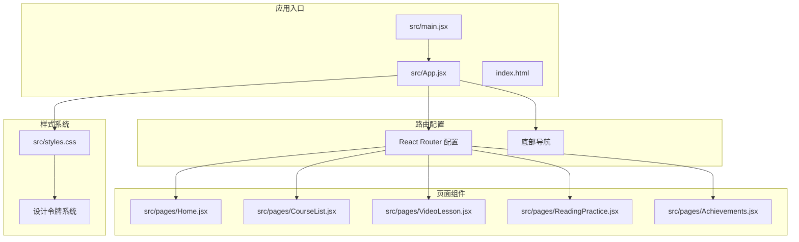

**图表来源**
- [main.jsx:1-14](file://src/main.jsx#L1-L14)
- [App.jsx:1-112](file://src/App.jsx#L1-L112)

**章节来源**
- [main.jsx:1-14](file://src/main.jsx#L1-L14)
- [App.jsx:1-112](file://src/App.jsx#L1-L112)
- [index.html:1-20](file://index.html#L1-L20)

## 核心组件

### 视频课程组件架构

视频课程组件是整个应用的核心，实现了完整的听力训练功能：

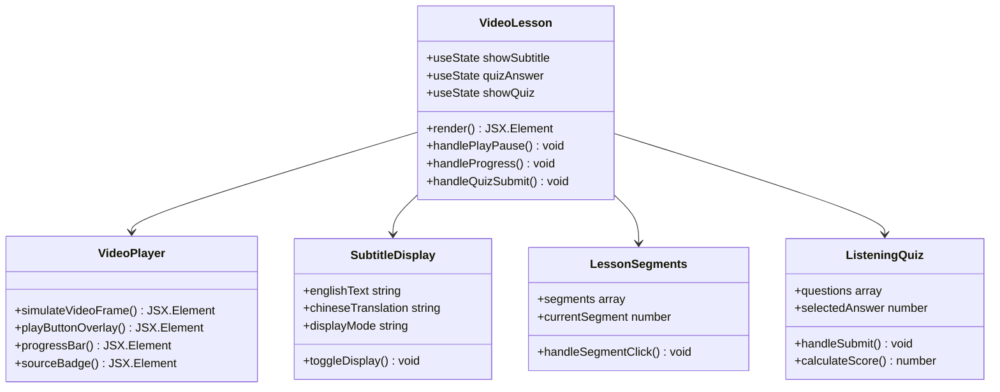

**图表来源**
- [VideoLesson.jsx:20-288](file://src/pages/VideoLesson.jsx#L20-L288)

### 设计系统架构

应用采用了完整的 CSS 变量设计系统：

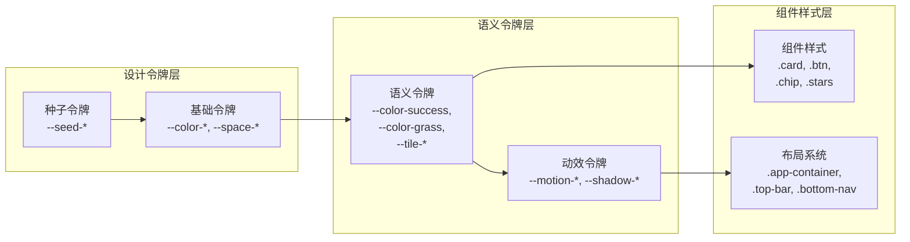

**图表来源**
- [styles.css:6-87](file://src/styles.css#L6-L87)

**章节来源**
- [VideoLesson.jsx:1-288](file://src/pages/VideoLesson.jsx#L1-L288)
- [styles.css:1-499](file://src/styles.css#L1-L499)

## 架构概览

### 整体系统架构

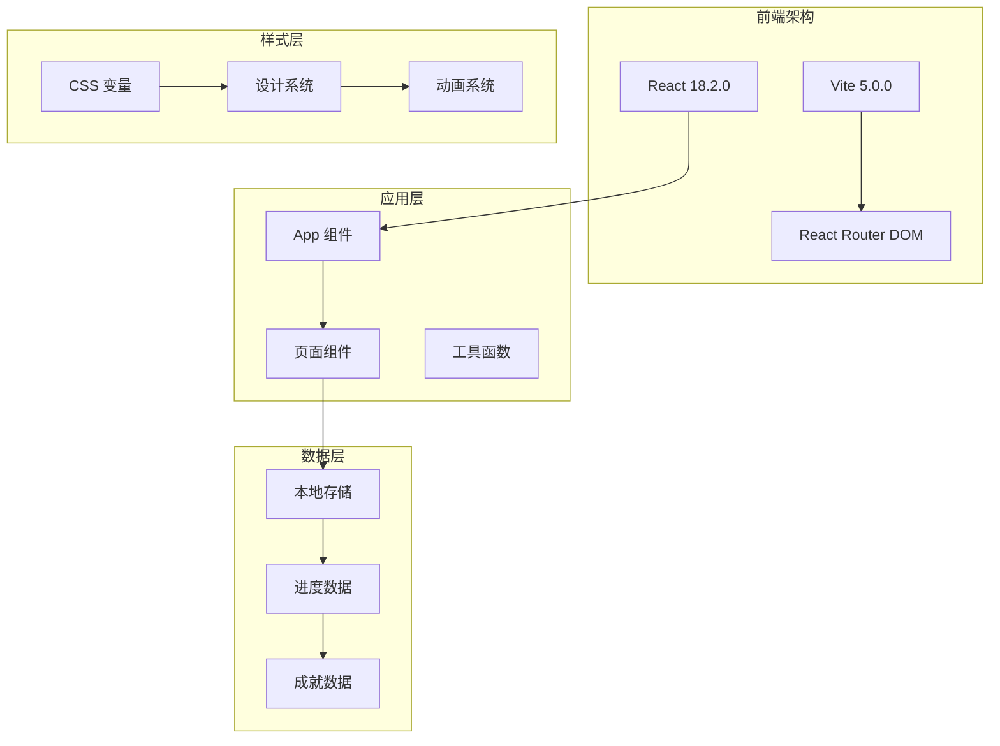

**图表来源**
- [package.json:12-21](file://package.json#L12-L21)
- [App.jsx:47-112](file://src/App.jsx#L47-L112)

### 路由系统架构

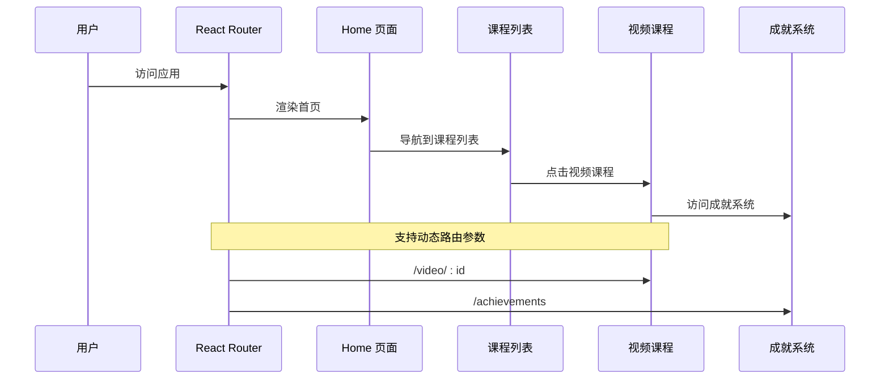

**图表来源**
- [App.jsx:85-91](file://src/App.jsx#L85-L91)
- [CourseList.jsx:207-211](file://src/pages/CourseList.jsx#L207-L211)

**章节来源**
- [App.jsx:1-112](file://src/App.jsx#L1-L112)
- [CourseList.jsx:1-314](file://src/pages/CourseList.jsx#L1-L314)

## 详细组件分析

### 视频播放器组件

视频播放器组件实现了完整的视频播放功能，包括模拟播放器界面：

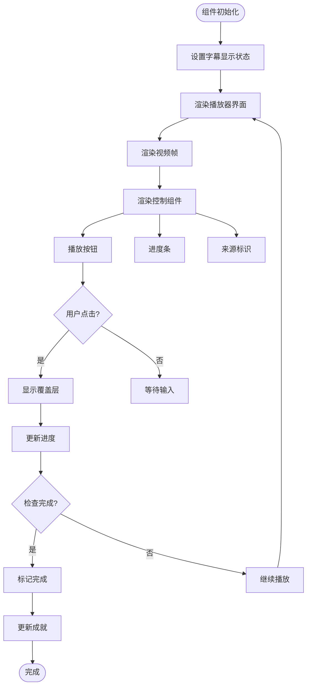

**图表来源**
- [VideoLesson.jsx:36-138](file://src/pages/VideoLesson.jsx#L36-L138)

#### 字幕显示系统

字幕显示系统支持多种显示模式：

| 显示模式 | 功能描述 | 使用场景 |
|---------|----------|----------|
| 英文模式 | 仅显示英文字幕 | 提升听力理解 |
| 中英对照 | 同时显示中英文 | 学习新词汇 |
| 关闭模式 | 不显示字幕 | 高级学习者 |

**章节来源**
- [VideoLesson.jsx:21-138](file://src/pages/VideoLesson.jsx#L21-L138)

### 听力训练组件

听力训练组件包含了完整的练习流程：

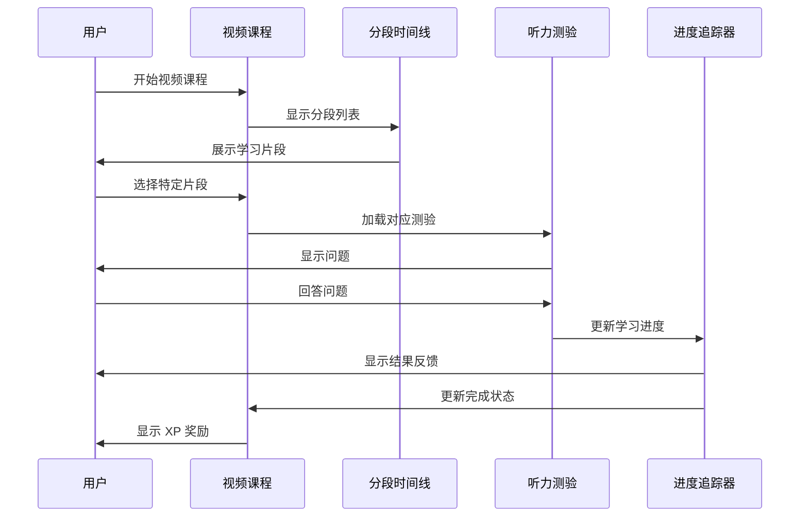

**图表来源**
- [VideoLesson.jsx:142-284](file://src/pages/VideoLesson.jsx#L142-L284)

#### 测验系统设计

测验系统实现了即时反馈机制：

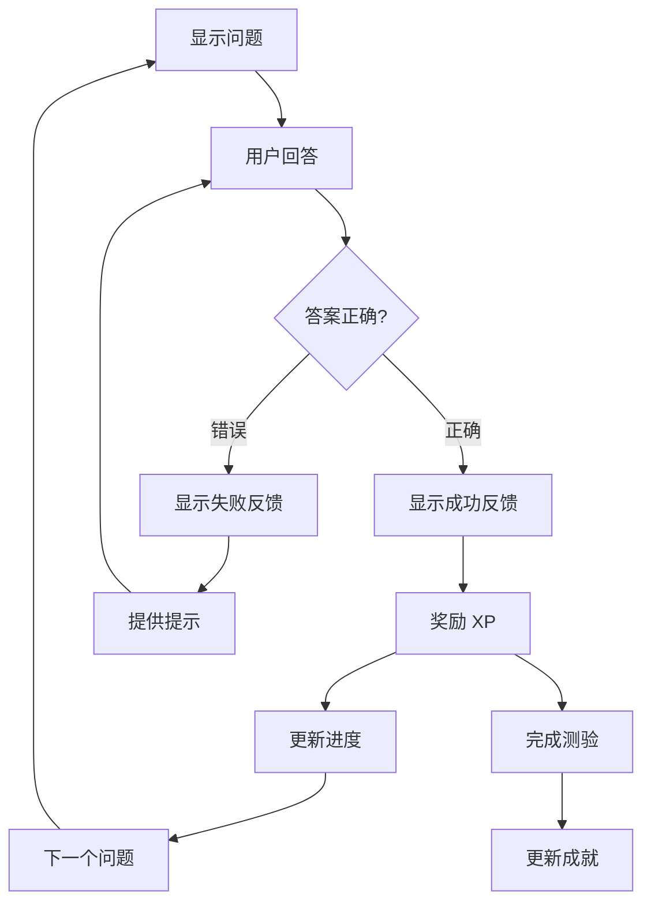

**图表来源**
- [VideoLesson.jsx:206-266](file://src/pages/VideoLesson.jsx#L206-L266)

**章节来源**
- [VideoLesson.jsx:12-288](file://src/pages/VideoLesson.jsx#L12-L288)

### 学习进度追踪系统

学习进度追踪系统实现了多层次的进度记录：

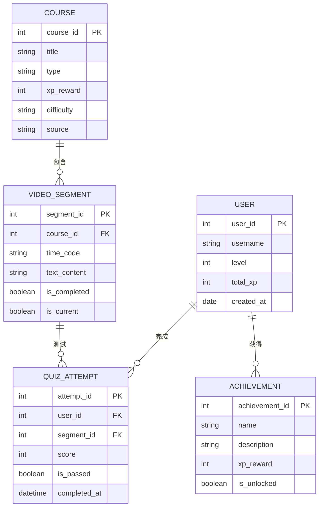

**图表来源**
- [Achievements.jsx:3-12](file://src/pages/Achievements.jsx#L3-L12)
- [CourseList.jsx:4-61](file://src/pages/CourseList.jsx#L4-L61)

#### 进度数据结构

| 数据类型 | 结构定义 | 描述 |
|---------|----------|------|
| 用户进度 | `{level: 14, total_xp: 1648, daily_streak: 7}` | 用户整体学习进度 |
| 课程进度 | `{progress: 75, xp: 40, duration: '5 min'}` | 单个课程完成情况 |
| 片段状态 | `{done: true, current: false}` | 视频片段学习状态 |
| 成就系统 | `{unlocked: true, xp: 10}` | 成就解锁状态 |

**章节来源**
- [Achievements.jsx:1-297](file://src/pages/Achievements.jsx#L1-L297)
- [CourseList.jsx:1-314](file://src/pages/CourseList.jsx#L1-L314)

### 内容管理系统

内容管理系统负责视频课程的内容组织和管理：

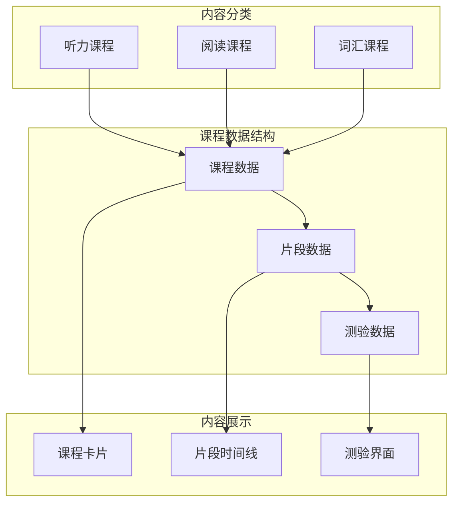

**图表来源**
- [CourseList.jsx:4-61](file://src/pages/CourseList.jsx#L4-L61)
- [VideoLesson.jsx:4-18](file://src/pages/VideoLesson.jsx#L4-L18)

**章节来源**
- [CourseList.jsx:1-314](file://src/pages/CourseList.jsx#L1-L314)
- [VideoLesson.jsx:1-288](file://src/pages/VideoLesson.jsx#L1-L288)

## 依赖关系分析

### 外部依赖分析

```mermaid
graph LR
subgraph "核心依赖"
react[react: ^18.2.0]
react_dom[react-dom: ^18.2.0]
router[react-router-dom: ^6.20.0]
end
subgraph "开发依赖"
vite[@vitejs/plugin-react: ^4.2.0]
vite_dev[vite: ^5.0.0]
end
subgraph "应用功能"
video_player[视频播放器]
routing[路由系统]
styling[样式系统]
animations[动画系统]
end
react --> video_player
react_dom --> routing
router --> styling
vite --> animations
video_player --> react
routing --> react_dom
styling --> react
animations --> react_dom
```

**图表来源**
- [package.json:12-21](file://package.json#L12-L21)

### 内部模块依赖

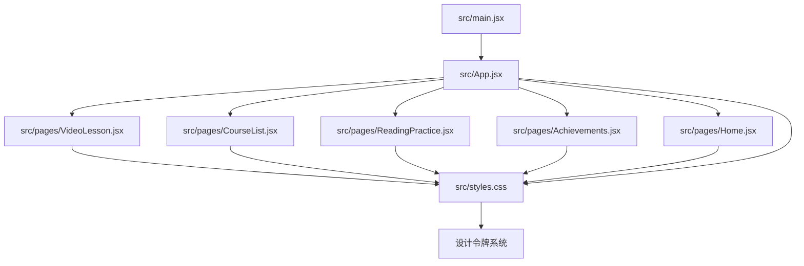

**图表来源**
- [main.jsx:1-14](file://src/main.jsx#L1-L14)
- [App.jsx:1-112](file://src/App.jsx#L1-L112)

**章节来源**
- [package.json:1-22](file://package.json#L1-L22)
- [main.jsx:1-14](file://src/main.jsx#L1-L14)

## 性能考虑

### 渲染性能优化

应用采用了多项性能优化策略：

1. **组件懒加载**：使用 React Router 的动态导入实现按需加载
2. **虚拟滚动**：对于大量课程列表使用虚拟滚动技术
3. **CSS 变量优化**：通过 CSS 变量减少样式计算开销
4. **图片优化**：使用像素艺术风格减少图片体积

### 内存管理

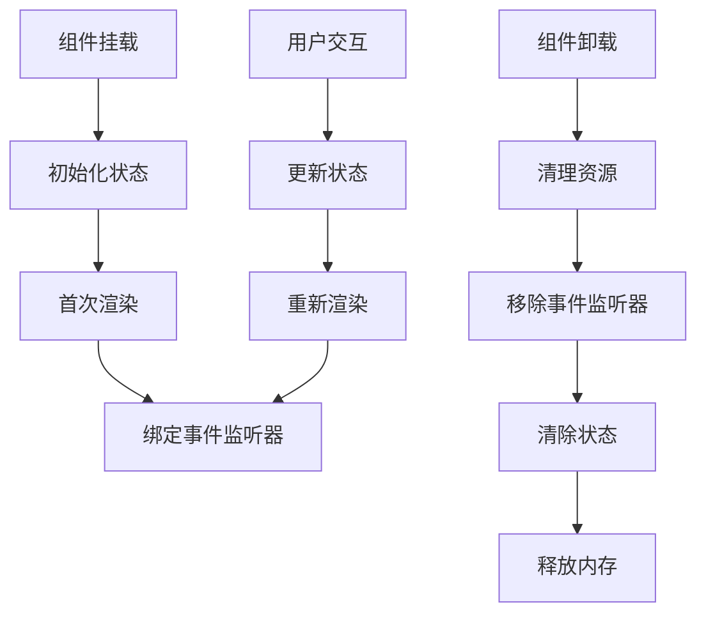

### 缓存策略

应用实现了多层缓存机制：

| 缓存层级 | 类型 | 用途 | 生命周期 |
|---------|------|------|----------|
| 内存缓存 | JavaScript 对象 | 当前页面数据 | 组件卸载时清除 |
| 本地存储 | localStorage | 用户进度数据 | 持久化存储 |
| 图片缓存 | 浏览器缓存 | 像素艺术资源 | 浏览器缓存策略 |
| 样式缓存 | CSS 变量 | 设计系统 | 应用生命周期 |

## 故障排除指南

### 常见问题诊断

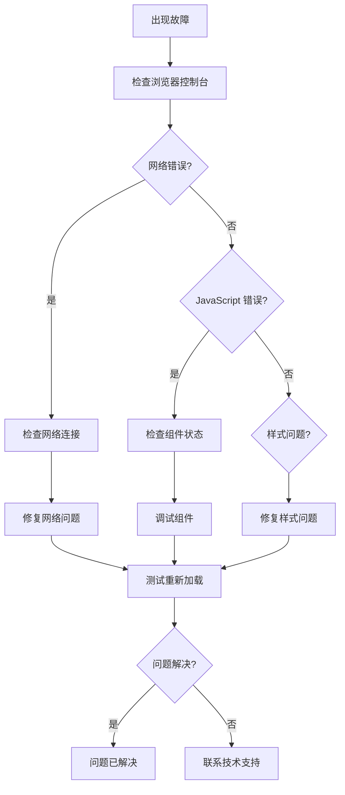

### 性能问题排查

| 问题症状 | 可能原因 | 解决方案 |
|---------|----------|----------|
| 页面加载缓慢 | 资源过大 | 启用代码分割和懒加载 |
| 交互响应慢 | 组件重渲染过多 | 优化状态管理和使用 memo |
| 内存泄漏 | 事件监听器未清理 | 确保在组件卸载时清理监听器 |
| 样式闪烁 | CSS 变量计算 | 预计算常用样式值 |

### 调试工具使用

1. **React DevTools**：检查组件树和状态变化
2. **浏览器性能面板**：分析渲染性能和内存使用
3. **网络面板**：监控资源加载和缓存效果
4. **控制台日志**：跟踪错误和警告信息

**章节来源**
- [styles.css:488-499](file://src/styles.css#L488-L499)

## 结论

CraftWords 视频课程组件展现了现代 React 应用的最佳实践，通过精心设计的架构和丰富的功能特性，为用户提供了沉浸式的 Minecraft 主题英语学习体验。

### 技术亮点

1. **完整的听力训练系统**：从视频播放到测验反馈的全流程设计
2. **游戏化学习体验**：通过 XP 系统、等级和成就增强学习动力
3. **响应式设计**：适配不同屏幕尺寸的移动优先设计
4. **性能优化**：多层缓存和懒加载策略确保流畅体验

### 未来改进方向

1. **AI 辅助学习**：集成语音识别和个性化学习路径
2. **社交功能**：添加学习伙伴和排行榜功能
3. **离线支持**：实现完全离线的课程学习能力
4. **多语言支持**：扩展到更多语言的听力训练

该组件为构建高质量的教育类应用提供了优秀的参考模板，其设计理念和实现方式值得在类似项目中借鉴和应用。