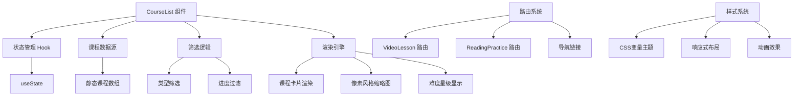
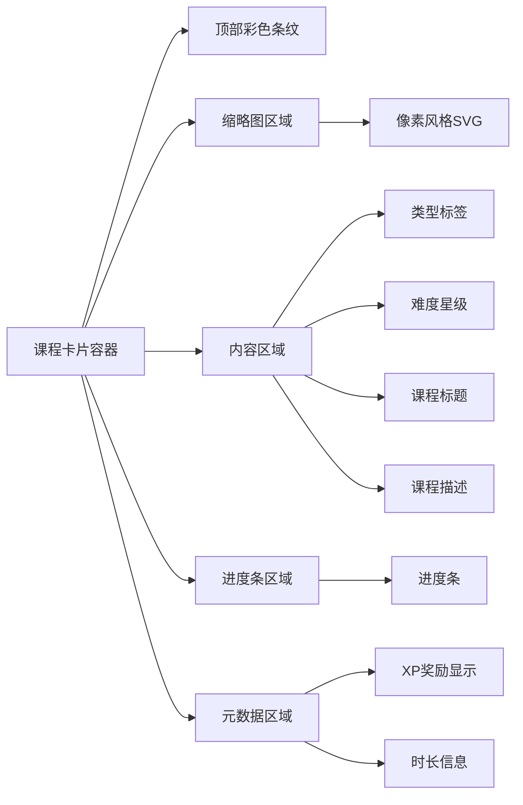
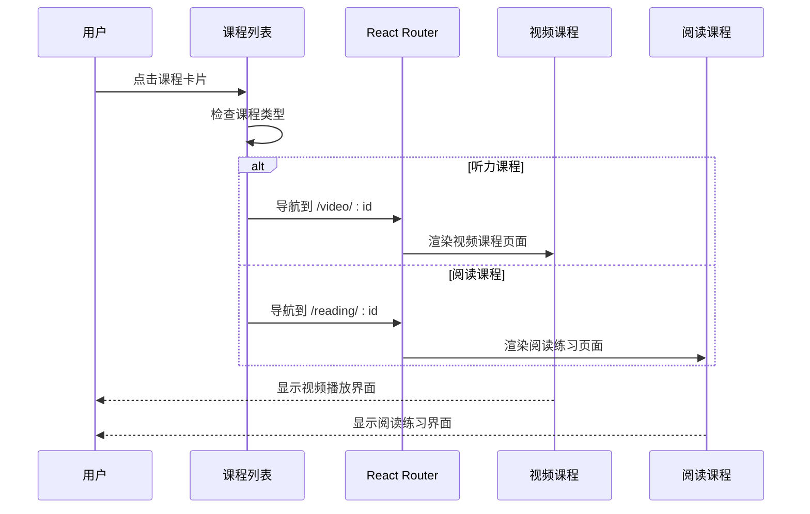
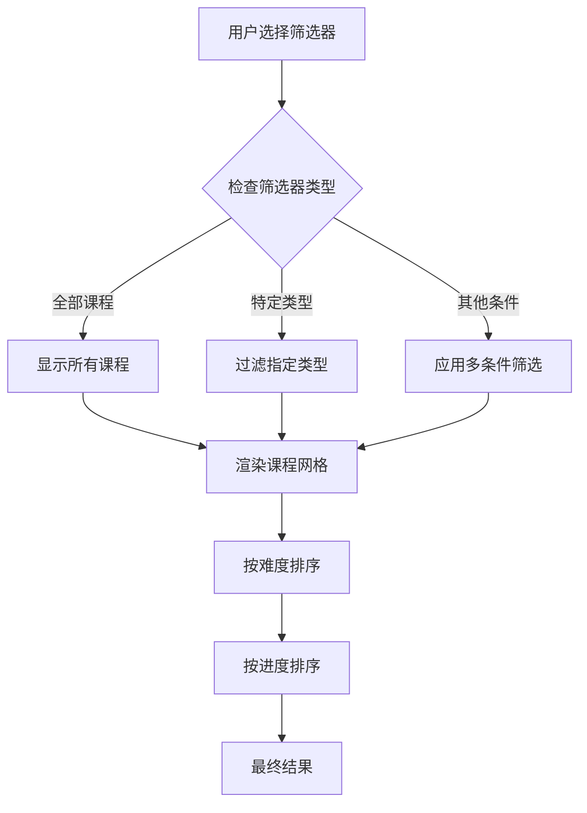
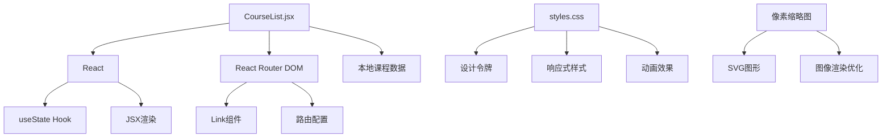

# 课程列表组件

<cite>
**本文档引用的文件**
- [CourseList.jsx](file://src/pages/CourseList.jsx)
- [App.jsx](file://src/App.jsx)
- [main.jsx](file://src/main.jsx)
- [VideoLesson.jsx](file://src/pages/VideoLesson.jsx)
- [ReadingPractice.jsx](file://src/pages/ReadingPractice.jsx)
- [styles.css](file://src/styles.css)
</cite>

## 目录
1. [简介](#简介)
2. [项目结构](#项目结构)
3. [核心组件](#核心组件)
4. [架构概览](#架构概览)
5. [详细组件分析](#详细组件分析)
6. [依赖关系分析](#依赖关系分析)
7. [性能考虑](#性能考虑)
8. [故障排除指南](#故障排除指南)
9. [结论](#结论)

## 简介

课程列表组件是CraftWords应用的核心功能模块，基于Minecraft主题设计，为用户提供英语学习课程的浏览、筛选和导航功能。该组件实现了完整的课程展示系统，包括课程卡片设计、难度等级标识、XP奖励显示、时长信息展示以及完整的导航流程。

本组件采用React Hooks进行状态管理，使用CSS变量实现主题化设计，并通过React Router实现页面间的无缝导航。所有课程数据均以本地静态数据形式存储，便于演示和开发测试。

## 项目结构

课程列表组件位于React Vite应用的页面层中，与应用的整体架构紧密集成：

```mermaid
graph TB
subgraph "应用根目录"
A[main.jsx] --> B[App.jsx]
B --> C[CourseList.jsx]
B --> D[VideoLesson.jsx]
B --> E[ReadingPractice.jsx]
B --> F[Achievements.jsx]
G[styles.css] --> B
end
subgraph "路由配置"
H[BrowserRouter] --> I[Routes]
I --> J[/courses]
I --> K[/video/:id]
I --> L[/reading/:id]
end
C --> M[课程数据]
C --> N[筛选器]
C --> O[课程卡片]
```

**图表来源**
- [main.jsx:1-14](file://src/main.jsx#L1-L14)
- [App.jsx:85-91](file://src/App.jsx#L85-L91)

**章节来源**
- [main.jsx:1-14](file://src/main.jsx#L1-L14)
- [App.jsx:85-91](file://src/App.jsx#L85-L91)

## 核心组件

### 课程数据模型

课程列表组件使用统一的数据模型来表示所有课程信息：

| 字段名 | 类型 | 描述 | 示例值 |
|--------|------|------|--------|
| id | Number | 课程唯一标识符 | 1, 2, 3 |
| type | String | 课程类型 | 'listening', 'reading', 'vocabulary' |
| title | String | 课程标题 | 'Creeper Sounds & Safety' |
| desc | String | 课程描述 | 'Learn warning words...' |
| difficulty | Number | 难度等级（1-3星） | 1, 2, 3 |
| progress | Number | 学习进度百分比 | 0-100 |
| xp | Number | 完成奖励XP | 25-80 |
| duration | String | 课程时长 | '3 min', '5 min', '10 min' |
| color | String | 主题颜色变量 | 'var(--tile-blue)' |
| source | String | 来源说明 | 'Minecraft Wiki' |
| thumbnail | String | 缩略图标识符 | 'creeper', 'sword' |
| locked | Boolean | 是否锁定（可选） | true, false |

### 筛选器系统

组件内置了四种筛选器类型，支持用户按课程类型进行快速筛选：

- **全部课程**：显示所有可用课程
- **听力练习**：仅显示listening类型的课程
- **阅读练习**：仅显示reading类型的课程  
- **词汇学习**：仅显示vocabulary类型的课程

**章节来源**
- [CourseList.jsx:4-61](file://src/pages/CourseList.jsx#L4-L61)
- [CourseList.jsx:166-171](file://src/pages/CourseList.jsx#L166-L171)

## 架构概览

课程列表组件采用分层架构设计，确保代码的可维护性和扩展性：



**图表来源**
- [CourseList.jsx:163-314](file://src/pages/CourseList.jsx#L163-L314)
- [App.jsx:85-91](file://src/App.jsx#L85-L91)

## 详细组件分析

### 课程卡片设计系统

每个课程卡片都遵循统一的设计规范，包含以下关键元素：

#### 基础布局结构



**图表来源**
- [CourseList.jsx:212-310](file://src/pages/CourseList.jsx#L212-L310)

#### 难度等级标识系统

难度等级通过星级系统直观展示，使用不同颜色和样式区分：

- **1星难度**：绿色主题
- **2星难度**：绿色主题  
- **3星难度**：金色主题

星级组件支持动态渲染，根据课程难度自动调整填充状态。

#### 进度管理系统

进度条系统提供三种状态显示：
- **未开始**：不显示进度条
- **进行中**：灰色进度条，绿色填充
- **已完成**：绿色进度条，带有完成徽章

#### 锁定状态处理

对于未解锁的课程，系统通过以下方式处理：
- 降低透明度（55%）
- 禁用点击交互
- 显示锁图标
- 使用灰色主题色

**章节来源**
- [CourseList.jsx:153-161](file://src/pages/CourseList.jsx#L153-L161)
- [CourseList.jsx:258-281](file://src/pages/CourseList.jsx#L258-L281)
- [CourseList.jsx:284-306](file://src/pages/CourseList.jsx#L284-L306)

### 导航系统实现

课程列表组件集成了完整的导航功能，支持多种导航方式：

#### 路由跳转机制



**图表来源**
- [CourseList.jsx:209](file://src/pages/CourseList.jsx#L209)
- [App.jsx:88-89](file://src/App.jsx#L88-L89)

#### 参数传递机制

导航过程中，课程ID作为URL参数传递：
- **视频课程**：`/video/1`, `/video/2`
- **阅读课程**：`/reading/1`, `/reading/2`

#### 页面状态保持

组件设计确保在导航过程中：
- 不丢失当前筛选状态
- 保持滚动位置
- 维持用户交互状态

**章节来源**
- [CourseList.jsx:207-211](file://src/pages/CourseList.jsx#L207-L211)
- [App.jsx:87-90](file://src/App.jsx#L87-L90)

### 筛选和排序逻辑

课程列表实现了灵活的筛选和排序功能：

#### 筛选算法流程



**图表来源**
- [CourseList.jsx:173-175](file://src/pages/CourseList.jsx#L173-L175)

#### 排序策略

当前实现主要支持按难度等级排序，未来可扩展支持：
- 按进度完成度排序
- 按XP奖励数量排序
- 按课程时长排序
- 按字母顺序排序

**章节来源**
- [CourseList.jsx:173-175](file://src/pages/CourseList.jsx#L173-L175)

### 样式设计原则

课程列表组件遵循统一的设计系统，确保视觉一致性和用户体验：

#### 设计令牌系统

组件使用CSS变量定义设计令牌，支持主题切换：

| 分类 | 变量名 | 值示例 | 用途 |
|------|--------|--------|------|
| 颜色 | --color-grass | #4CAF50 | 主要品牌色 |
| 颜色 | --color-xp | #7B1FA2 | XP奖励色 |
| 颜色 | --tile-blue | #889DF0 | 蓝色主题色 |
| 尺寸 | --space-md | 16px | 中等间距 |
| 圆角 | --radius-lg | 20px | 大圆角半径 |
| 字体 | --font-display | Nunito | 标题字体 |

#### 响应式布局

组件采用网格布局系统，支持不同屏幕尺寸：
- **移动端**：单列显示，适合触摸操作
- **平板端**：双列显示，平衡信息密度
- **桌面端**：最多三列显示，最大化信息密度

#### 动画和交互

系统包含丰富的微交互效果：
- 卡片悬停提升效果
- 进度条平滑过渡
- 筛选器状态切换动画
- 加载时的骨架屏效果

**章节来源**
- [styles.css:6-87](file://src/styles.css#L6-L87)
- [styles.css:200-215](file://src/styles.css#L200-L215)
- [styles.css:419-435](file://src/styles.css#L419-L435)

## 依赖关系分析

课程列表组件的依赖关系相对简单，主要依赖于React生态系统和自定义样式系统：



**图表来源**
- [CourseList.jsx:1-3](file://src/pages/CourseList.jsx#L1-L3)
- [styles.css:1-87](file://src/styles.css#L1-L87)

### 外部依赖

组件使用的外部库和工具：
- **React**：核心框架，提供组件生命周期和状态管理
- **React Router DOM**：客户端路由，实现页面间导航
- **CSS变量**：全局样式系统，支持主题定制

### 内部依赖

组件内部的模块依赖关系：
- **课程数据**：静态数组，包含所有课程信息
- **像素缩略图**：SVG组件，用于课程图标显示
- **星级评分**：独立组件，用于难度显示
- **样式系统**：全局CSS，提供统一的视觉风格

**章节来源**
- [CourseList.jsx:1-3](file://src/pages/CourseList.jsx#L1-L3)
- [styles.css:1-87](file://src/styles.css#L1-L87)

## 性能考虑

课程列表组件在设计时充分考虑了性能优化：

### 渲染优化

- **虚拟化支持**：对于大量课程数据，可考虑实现虚拟滚动
- **懒加载**：图片和SVG可实现懒加载，减少初始渲染时间
- **记忆化**：筛选和排序逻辑可使用memoization优化

### 内存管理

- **状态最小化**：只保存必要的状态数据
- **事件解绑**：组件卸载时清理事件监听器
- **垃圾回收**：避免创建不必要的DOM节点

### 网络优化

由于课程数据为本地静态数据，无需网络请求，天然具备良好的性能表现。

## 故障排除指南

### 常见问题及解决方案

#### 课程无法点击跳转

**问题症状**：点击课程卡片无反应

**可能原因**：
- 课程被锁定（locked: true）
- 路由配置错误
- Link组件属性设置问题

**解决方法**：
1. 检查课程对象的locked属性
2. 验证路由配置是否正确
3. 确认Link组件的to属性格式

#### 筛选器不生效

**问题症状**：选择筛选器后课程列表不变

**可能原因**：
- 状态管理问题
- 筛选逻辑错误
- 数据源访问问题

**解决方法**：
1. 检查useState hook的状态更新
2. 验证filter函数的实现
3. 确认课程数据结构的一致性

#### 样式显示异常

**问题症状**：组件样式错乱或不显示

**可能原因**：
- CSS变量未正确加载
- 样式优先级冲突
- 媒体查询问题

**解决方法**：
1. 检查styles.css文件的导入
2. 验证CSS变量的定义
3. 确认媒体查询的断点设置

**章节来源**
- [CourseList.jsx:209](file://src/pages/CourseList.jsx#L209)
- [CourseList.jsx:164](file://src/pages/CourseList.jsx#L164)

## 结论

课程列表组件成功实现了Minecraft主题的英语学习课程展示系统。该组件具有以下优势：

### 技术优势

- **模块化设计**：清晰的组件分离和职责划分
- **状态管理**：简洁有效的React Hooks使用
- **样式系统**：基于CSS变量的主题化设计
- **导航集成**：与React Router的无缝集成

### 用户体验优势

- **直观的筛选系统**：帮助用户快速找到合适的课程
- **视觉反馈丰富**：提供良好的交互体验
- **响应式设计**：适配多种设备和屏幕尺寸
- **无障碍支持**：考虑了可访问性需求

### 扩展性考虑

组件设计为未来的功能扩展预留了空间：
- 支持更多的筛选条件
- 可扩展的排序选项
- 更丰富的课程状态管理
- 集成后端API的能力

该组件为整个CraftWords应用奠定了坚实的基础，为用户提供了优秀的英语学习体验。