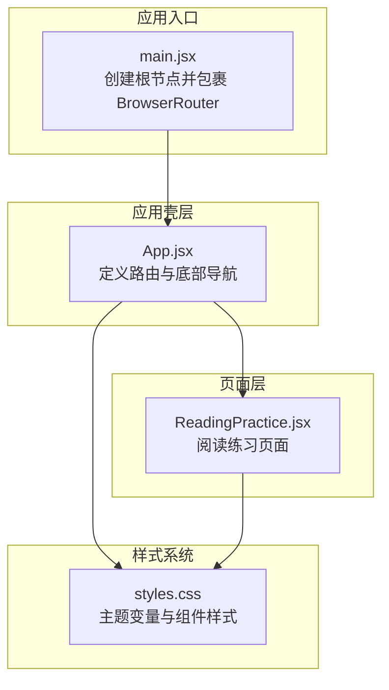
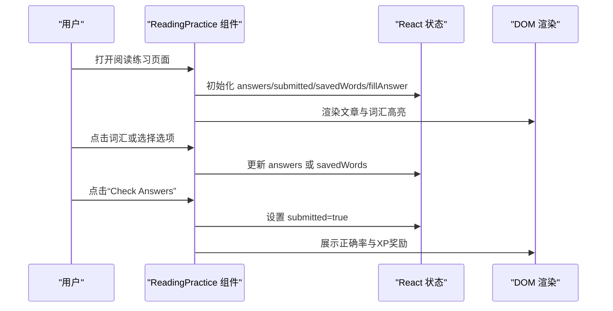
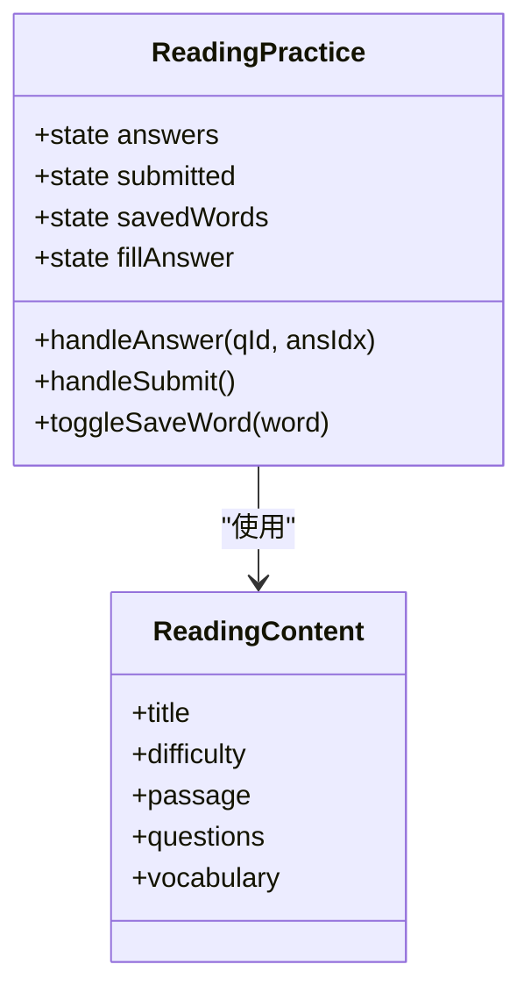
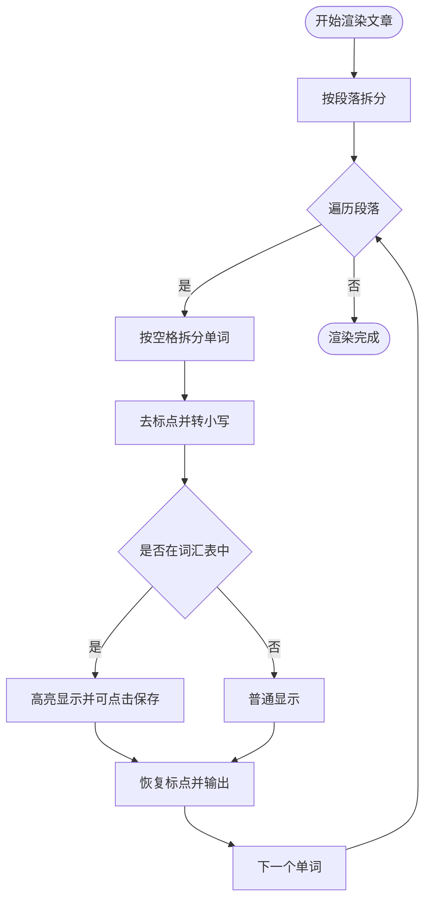
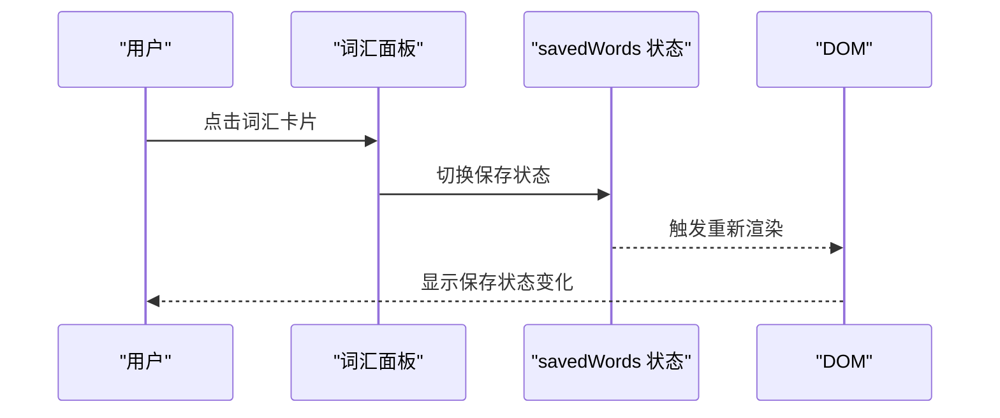
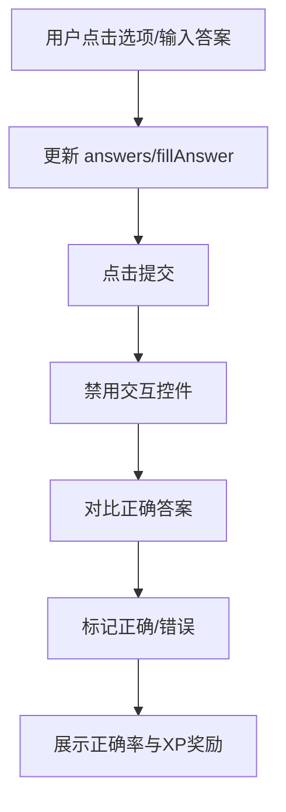
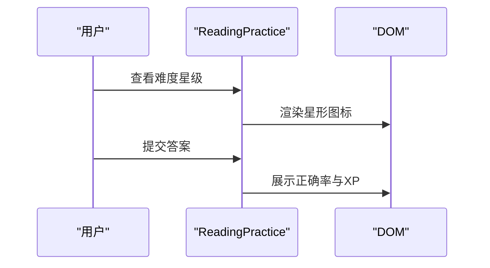
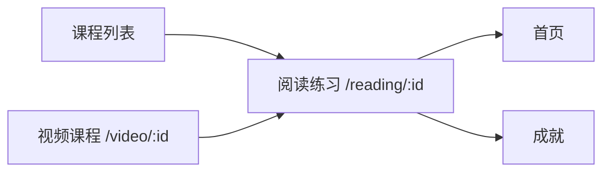
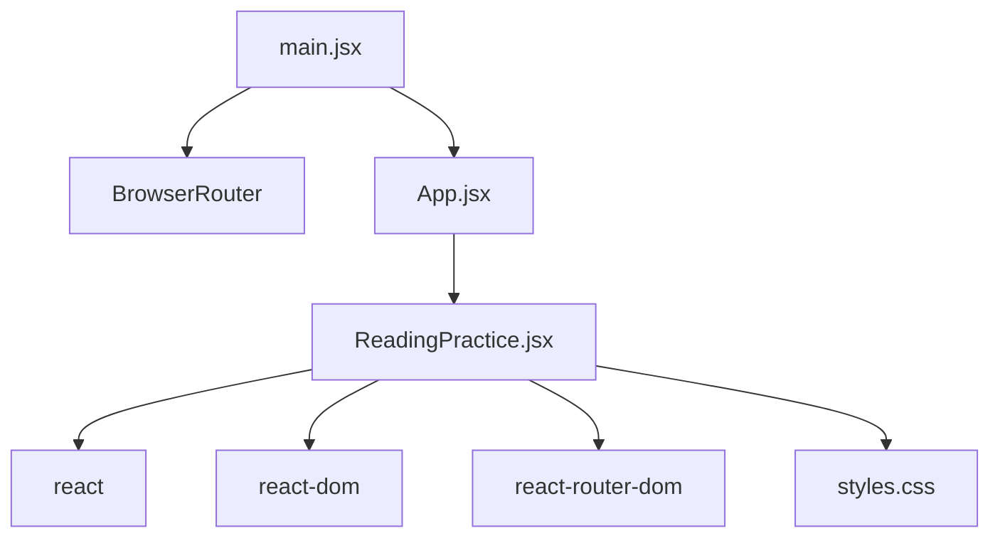

# 阅读练习组件

<cite>
**本文档引用的文件**
- [ReadingPractice.jsx](file://src/pages/ReadingPractice.jsx)
- [App.jsx](file://src/App.jsx)
- [main.jsx](file://src/main.jsx)
- [styles.css](file://src/styles.css)
- [package.json](file://package.json)
</cite>

## 目录
1. [简介](#简介)
2. [项目结构](#项目结构)
3. [核心组件](#核心组件)
4. [架构总览](#架构总览)
5. [详细组件分析](#详细组件分析)
6. [依赖关系分析](#依赖关系分析)
7. [性能考虑](#性能考虑)
8. [故障排除指南](#故障排除指南)
9. [结论](#结论)

## 简介
本技术文档聚焦于阅读练习组件，系统性地分析其在英语阅读理解与词汇学习方面的实现细节。组件包含以下关键能力：
- 文章内容展示：段落解析、文本格式化与排版
- 词汇高亮与词库管理：识别目标词汇、点击保存、显示释义
- 理解问题与答案验证：多选题、判断题、填空题三种题型
- 交互式练习设计：选择题、填空题、词汇匹配（通过点击保存）
- 进度与反馈：难度星级、提交后的正确率与经验值奖励
- 数据模型与状态管理：本地状态驱动的答题与词汇保存

该组件采用 React + Vite 构建，使用 CSS 变量与主题系统实现一致的视觉风格，并通过 React Router 提供页面级导航。

## 项目结构
阅读练习组件位于页面层，与应用壳层、样式系统协同工作：
- 页面层：ReadingPractice.jsx 负责渲染阅读材料、问题与交互
- 应用壳层：App.jsx 定义路由与底部导航，挂载 ReadingPractice
- 样式系统：styles.css 提供主题变量、组件样式与动效
- 启动入口：main.jsx 配置 BrowserRouter 并挂载 App

图表来源
- [main.jsx:1-14](file://src/main.jsx#L1-L14)
- [App.jsx:1-112](file://src/App.jsx#L1-L112)
- [ReadingPractice.jsx:1-293](file://src/pages/ReadingPractice.jsx#L1-L293)
- [styles.css:1-499](file://src/styles.css#L1-L499)

章节来源
- [main.jsx:1-14](file://src/main.jsx#L1-L14)
- [App.jsx:1-112](file://src/App.jsx#L1-L112)
- [ReadingPractice.jsx:1-293](file://src/pages/ReadingPractice.jsx#L1-L293)
- [styles.css:1-499](file://src/styles.css#L1-L499)

## 核心组件
- 阅读材料区域：标题卡片、难度星级、文章段落
- 词汇银行：可点击保存的词汇列表，支持高亮与释义提示
- 理解检查区：三类题目（多选、判断、填空），支持交互与结果展示
- 提交与反馈：提交按钮、正确率统计、经验值奖励提示

章节来源
- [ReadingPractice.jsx:45-293](file://src/pages/ReadingPractice.jsx#L45-L293)

## 架构总览
组件采用函数式组件与 Hooks 的组合模式：
- 使用 useState 管理答题状态、提交状态、已保存词汇、填空答案
- 使用内联数据结构（readingContent）承载文章、问题与词汇
- 通过条件渲染与样式切换实现交互反馈
- 通过路由参数占位符支持不同阅读练习实例

图表来源
- [ReadingPractice.jsx:45-293](file://src/pages/ReadingPractice.jsx#L45-L293)

## 详细组件分析

### 数据模型与状态管理
- 内部数据源：readingContent 包含标题、难度、文章正文、问题数组、词汇数组
- 答题状态：answers 对象记录每个题目的选择索引；submitted 控制是否进入提交态
- 词汇状态：savedWords 数组记录用户点击保存的词汇；fillAnswer 用于填空题输入
- 题目类型：多选题（multiple）、判断题（true-false）、填空题（fill）

图表来源
- [ReadingPractice.jsx:45-67](file://src/pages/ReadingPractice.jsx#L45-L67)
- [ReadingPractice.jsx:4-43](file://src/pages/ReadingPractice.jsx#L4-L43)

章节来源
- [ReadingPractice.jsx:45-67](file://src/pages/ReadingPractice.jsx#L45-L67)
- [ReadingPractice.jsx:4-43](file://src/pages/ReadingPractice.jsx#L4-L43)

### 文章内容展示与文本解析
- 段落解析：按双换行符拆分段落，逐段渲染为 p 元素
- 单词处理：按空格拆分单词，去除标点后转小写进行词汇匹配
- 词汇高亮：若单词属于词汇表，则以带下划线的绿色样式显示，并支持点击保存
- 释义提示：鼠标悬停显示对应词汇的中文释义
- 交互行为：点击词汇触发 toggleSaveWord，更新 savedWords 并改变样式

图表来源
- [ReadingPractice.jsx:125-163](file://src/pages/ReadingPractice.jsx#L125-L163)
- [ReadingPractice.jsx:132-158](file://src/pages/ReadingPractice.jsx#L132-L158)

章节来源
- [ReadingPractice.jsx:125-163](file://src/pages/ReadingPractice.jsx#L125-L163)
- [ReadingPractice.jsx:132-158](file://src/pages/ReadingPractice.jsx#L132-L158)

### 词汇高亮与词库管理
- 词汇高亮：对命中词汇表的单词添加绿色边框与背景色，并支持点击保存
- 词库面板：展示所有词汇，点击切换保存状态；已保存词汇以绿色主题显示
- 交互反馈：保存状态变化时即时更新样式与背景色

图表来源
- [ReadingPractice.jsx:166-191](file://src/pages/ReadingPractice.jsx#L166-L191)
- [ReadingPractice.jsx:176-189](file://src/pages/ReadingPractice.jsx#L176-L189)
- [ReadingPractice.jsx:61-67](file://src/pages/ReadingPractice.jsx#L61-L67)

章节来源
- [ReadingPractice.jsx:166-191](file://src/pages/ReadingPractice.jsx#L166-L191)
- [ReadingPractice.jsx:176-189](file://src/pages/ReadingPractice.jsx#L176-L189)
- [ReadingPractice.jsx:61-67](file://src/pages/ReadingPractice.jsx#L61-L67)

### 理解问题与答案验证机制
- 多选题与判断题：按钮样式根据当前选择与正确答案动态变化；提交后正确答案显示绿色边框，错误选择显示红色边框
- 填空题：输入框在提交后根据答案正确与否分别显示绿色或红色边框
- 交互限制：提交后禁用所有交互控件，防止重复修改

图表来源
- [ReadingPractice.jsx:198-278](file://src/pages/ReadingPractice.jsx#L198-L278)
- [ReadingPractice.jsx:209-264](file://src/pages/ReadingPractice.jsx#L209-L264)
- [ReadingPractice.jsx:51-59](file://src/pages/ReadingPractice.jsx#L51-L59)

章节来源
- [ReadingPractice.jsx:198-278](file://src/pages/ReadingPractice.jsx#L198-L278)
- [ReadingPractice.jsx:209-264](file://src/pages/ReadingPractice.jsx#L209-L264)
- [ReadingPractice.jsx:51-59](file://src/pages/ReadingPractice.jsx#L51-L59)

### 难度分级与进度反馈
- 难度星级：根据 difficulty 字段渲染相应数量的实心星形图标
- 正确率与XP：提交后展示正确题数与经验值奖励，使用成功色块背景突出显示

图表来源
- [ReadingPractice.jsx:78-86](file://src/pages/ReadingPractice.jsx#L78-L86)
- [ReadingPractice.jsx:276-286](file://src/pages/ReadingPractice.jsx#L276-L286)

章节来源
- [ReadingPractice.jsx:78-86](file://src/pages/ReadingPractice.jsx#L78-L86)
- [ReadingPractice.jsx:276-286](file://src/pages/ReadingPractice.jsx#L276-L286)

### 与路由和页面导航的集成
- 路由配置：App.jsx 中定义了 /reading/:id 路由，用于承载阅读练习页面
- 导航返回：各页面均提供“Back to Courses”返回链接，统一使用 Link 组件
- 页面布局：ReadingPractice 采用两栏布局，左侧为阅读材料，右侧为问题区

图表来源
- [App.jsx:88-90](file://src/App.jsx#L88-L90)
- [ReadingPractice.jsx:72-77](file://src/pages/ReadingPractice.jsx#L72-L77)

章节来源
- [App.jsx:88-90](file://src/App.jsx#L88-L90)
- [ReadingPractice.jsx:72-77](file://src/pages/ReadingPractice.jsx#L72-L77)

## 依赖关系分析
- React 生态：React、React DOM、React Router DOM
- 构建工具：Vite
- 样式系统：CSS 变量与主题系统，提供颜色、间距、圆角、阴影等设计令牌

图表来源
- [package.json:12-20](file://package.json#L12-L20)
- [main.jsx:1-14](file://src/main.jsx#L1-L14)
- [App.jsx:1-6](file://src/App.jsx#L1-L6)
- [ReadingPractice.jsx:1-2](file://src/pages/ReadingPractice.jsx#L1-L2)

章节来源
- [package.json:12-20](file://package.json#L12-L20)
- [main.jsx:1-14](file://src/main.jsx#L1-L14)
- [App.jsx:1-6](file://src/App.jsx#L1-L6)
- [ReadingPractice.jsx:1-2](file://src/pages/ReadingPractice.jsx#L1-L2)

## 性能考虑
- 文本解析复杂度：按段落与单词拆分，时间复杂度近似 O(N)，其中 N 为文章字符数；词汇匹配为 O(M)，M 为词汇表长度
- DOM 更新策略：使用 React 状态驱动渲染，避免不必要的重绘；提交后禁用交互控件减少事件处理
- 样式优化：通过 CSS 变量集中管理主题，减少重复样式声明
- 建议优化方向：
  - 将词汇表转换为 Set 结构以提升查找效率
  - 对长文章进行虚拟滚动或分页加载
  - 将内联数据源抽取为外部资源或服务端接口，便于动态更新

## 故障排除指南
- 无法看到词汇高亮
  - 检查单词大小写与标点处理逻辑，确保去标点与小写转换一致
  - 确认词汇表中的单词与文章出现形式一致
- 提交后仍可编辑
  - 确认 submitted 状态已设置为 true，且交互控件被禁用
- 题目样式未按预期变化
  - 检查 answers 与 correct 字段的索引一致性
  - 确认提交后正确/错误样式的条件分支
- 难度星级不显示
  - 检查 difficulty 字段值与星形渲染逻辑
- 路由跳转异常
  - 确认 App.jsx 中路由路径与 Link 组件的 to 属性一致

章节来源
- [ReadingPractice.jsx:132-158](file://src/pages/ReadingPractice.jsx#L132-L158)
- [ReadingPractice.jsx:51-59](file://src/pages/ReadingPractice.jsx#L51-L59)
- [ReadingPractice.jsx:209-264](file://src/pages/ReadingPractice.jsx#L209-L264)
- [ReadingPractice.jsx:78-86](file://src/pages/ReadingPractice.jsx#L78-L86)
- [App.jsx:88-90](file://src/App.jsx#L88-L90)

## 结论
阅读练习组件通过清晰的数据模型与状态管理，实现了从文章展示到理解检测的完整闭环。组件具备良好的可扩展性：可引入外部数据源、增强题型与反馈机制、优化性能与交互体验。建议后续迭代中完善数据持久化、统计分析与个性化推荐，以进一步提升学习效果与用户体验。