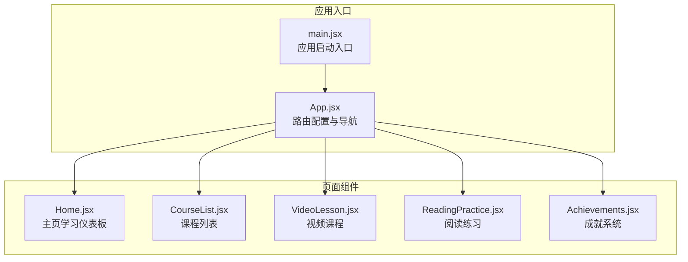
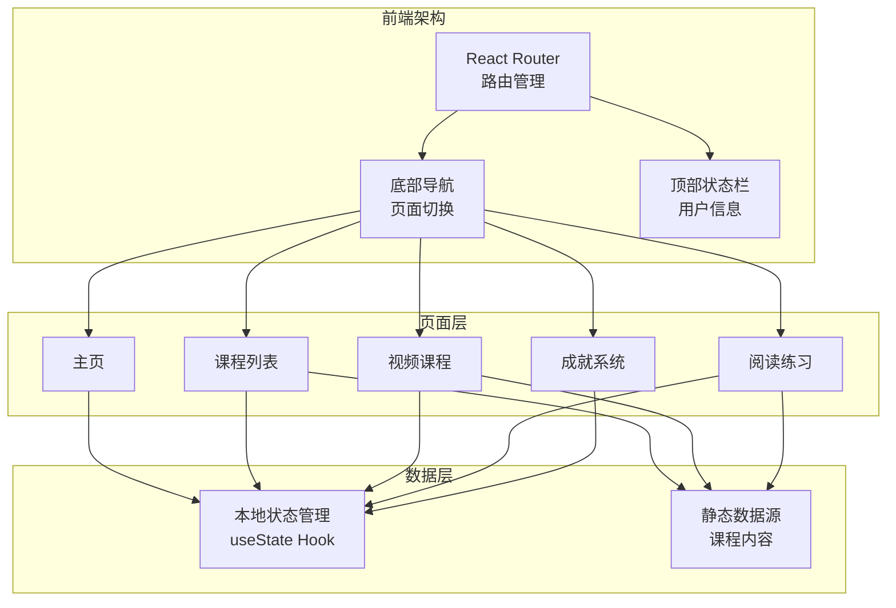
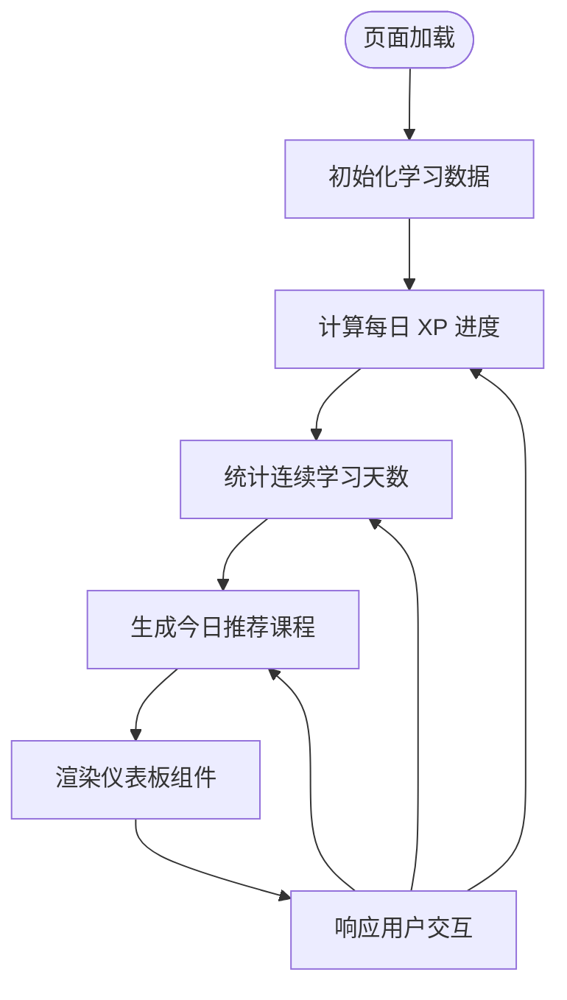
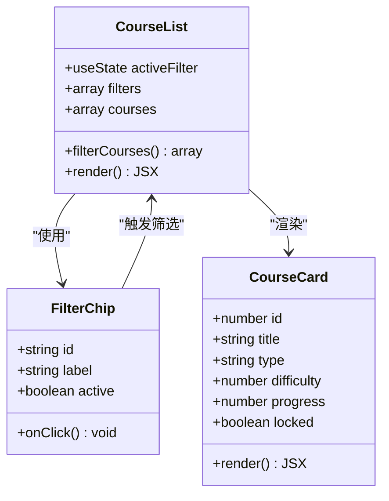
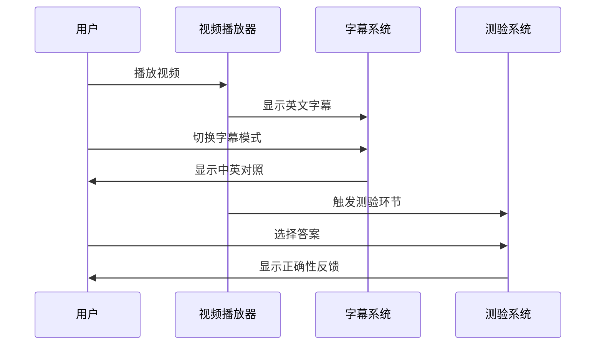
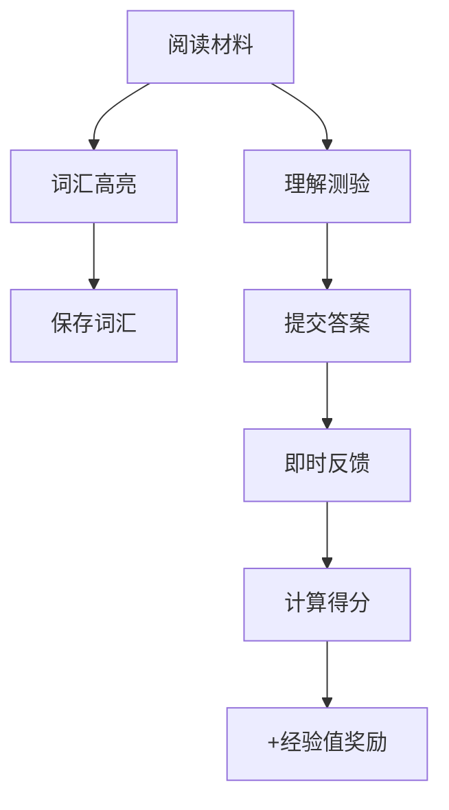
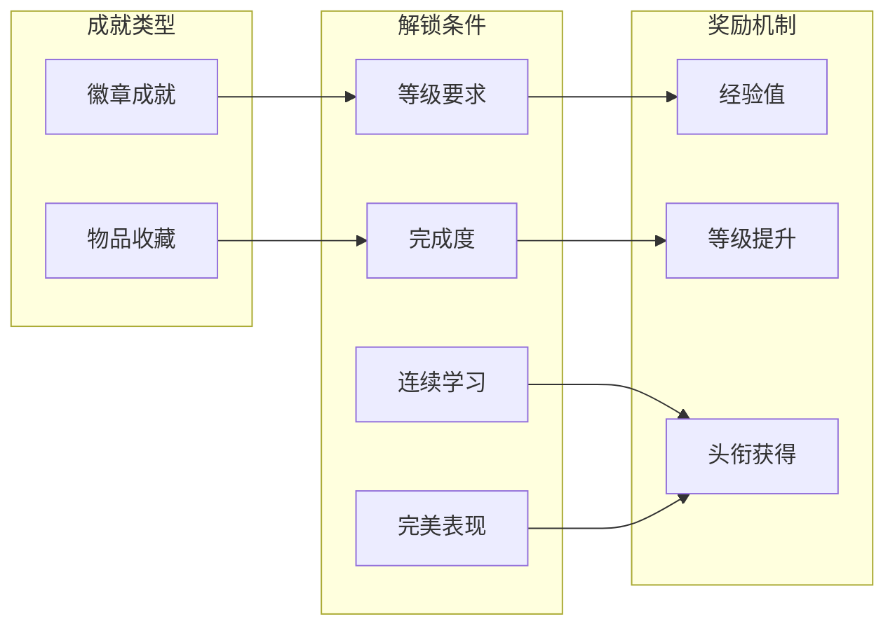
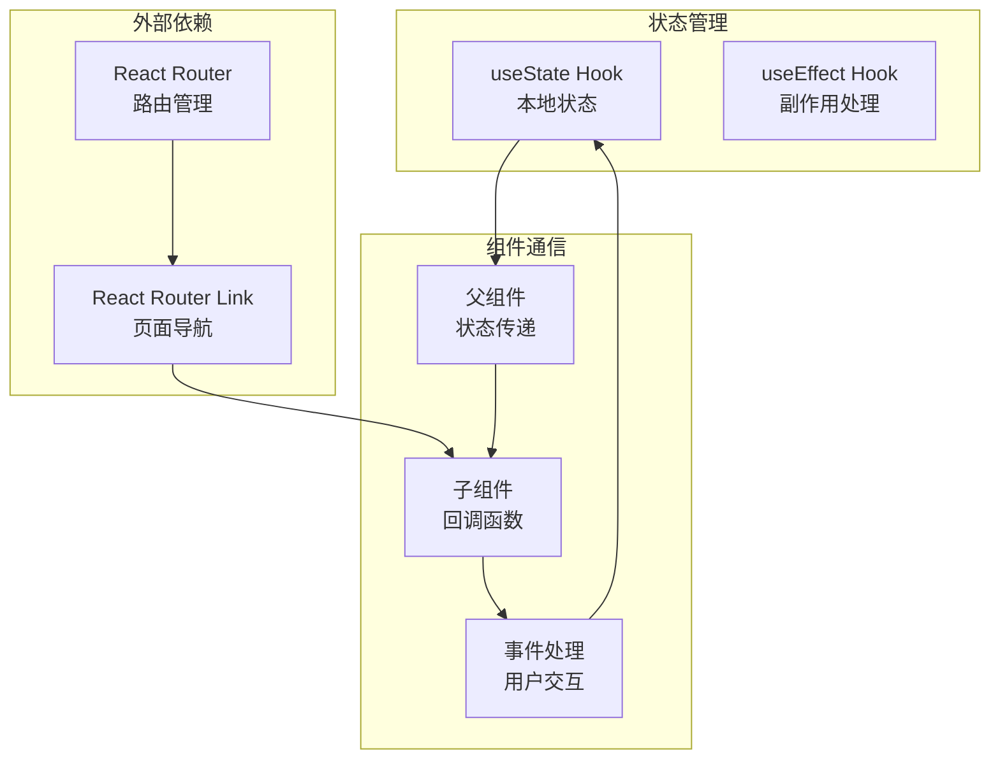

# 页面组件

<cite>
**本文档引用的文件**
- [App.jsx](file://src/App.jsx)
- [main.jsx](file://src/main.jsx)
- [Home.jsx](file://src/pages/Home.jsx)
- [CourseList.jsx](file://src/pages/CourseList.jsx)
- [VideoLesson.jsx](file://src/pages/VideoLesson.jsx)
- [ReadingPractice.jsx](file://src/pages/ReadingPractice.jsx)
- [Achievements.jsx](file://src/pages/Achievements.jsx)
</cite>

## 目录
1. [简介](#简介)
2. [项目结构](#项目结构)
3. [核心组件](#核心组件)
4. [架构总览](#架构总览)
5. [详细组件分析](#详细组件分析)
6. [依赖关系分析](#依赖关系分析)
7. [性能考虑](#性能考虑)
8. [故障排除指南](#故障排除指南)
9. [结论](#结论)

## 简介
本项目是一个基于 React 的 Minecraft 英语学习应用，采用 Vite 构建工具。应用通过像素风格界面与 Minecraft 元素主题相结合，提供沉浸式英语学习体验。系统包含五大核心页面：主页学习仪表板、课程列表、视频课程、阅读练习和成就系统，并通过底部导航在页面间进行切换。

## 项目结构
应用采用按页面组织的目录结构，每个页面组件独立封装，便于维护和扩展：

**图表来源**
- [main.jsx:1-14](file://src/main.jsx#L1-L14)
- [App.jsx:1-112](file://src/App.jsx#L1-L112)

**章节来源**
- [main.jsx:1-14](file://src/main.jsx#L1-L14)
- [App.jsx:1-112](file://src/App.jsx#L1-L112)

## 核心组件
本节概述各页面组件的主要职责和功能特性：

### 主页学习仪表板 (Home)
- **核心功能**: 展示用户学习进度、每日学习统计和推荐课程
- **关键特性**: 
  - 实时 XP 进度条显示
  - 连续学习天数徽章
  - 今日任务推荐卡片
  - 最近成就预览
- **数据展示**: 使用渐变背景和像素艺术元素营造 Minecraft 风格

### 课程列表 (CourseList)
- **核心功能**: 提供课程浏览、筛选和排序功能
- **关键特性**:
  - 多维度筛选（全部、听力、阅读、词汇）
  - 星级难度标识
  - 进度条显示完成状态
  - 锁定状态提示
- **交互设计**: 响应式网格布局，支持课程进度追踪

### 视频课程 (VideoLesson)
- **核心功能**: 提供多媒体视频学习体验
- **关键特性**:
  - 字幕切换（英文/中英对照）
  - 分段时间轴导航
  - 听力理解测验
  - 关键词汇学习
- **用户体验**: 模拟 Minecraft 场景的视频播放器界面

### 阅读练习 (ReadingPractice)
- **核心功能**: 文字阅读理解和词汇学习
- **关键特性**:
  - 可点击词汇保存功能
  - 多种题型（选择、判断、填空）
  - 自动评分和反馈
  - 难度星级标识
- **学习效果**: 支持词汇记忆和阅读理解能力提升

### 成就系统 (Achievements)
- **核心功能**: 游戏化激励机制
- **关键特性**:
  - 徽章收集系统
  - 物品收藏展示
  - 经验值等级提升
  - 完成度进度追踪
- **游戏化设计**: 通过等级、徽章和奖励增强学习动机

**章节来源**
- [Home.jsx:1-293](file://src/pages/Home.jsx#L1-L293)
- [CourseList.jsx:1-314](file://src/pages/CourseList.jsx#L1-L314)
- [VideoLesson.jsx:1-288](file://src/pages/VideoLesson.jsx#L1-L288)
- [ReadingPractice.jsx:1-293](file://src/pages/ReadingPractice.jsx#L1-L293)
- [Achievements.jsx:1-297](file://src/pages/Achievements.jsx#L1-L297)

## 架构总览
应用采用单页应用（SPA）架构，通过 React Router 实现页面路由管理：

**图表来源**
- [App.jsx:85-112](file://src/App.jsx#L85-L112)
- [main.jsx:7-13](file://src/main.jsx#L7-L13)

## 详细组件分析

### 主页学习仪表板组件分析

#### 数据流与状态管理
主页采用组合式状态管理模式，通过多个 useState Hook 管理不同维度的学习数据：

**图表来源**
- [Home.jsx:48-293](file://src/pages/Home.jsx#L48-L293)

#### 组件结构设计
主页采用模块化设计，包含以下核心区域：

1. **欢迎英雄区**: 用户个性化问候和学习引导
2. **每日进度区**: XP 积分和等级进度可视化
3. **推荐课程区**: 今日任务和快捷入口
4. **最近成就区**: 成就徽章预览和快速访问

#### 用户交互逻辑
- **导航交互**: 通过链接组件实现页面跳转
- **视觉反馈**: 使用 CSS 动画和过渡效果增强用户体验
- **响应式设计**: 支持不同屏幕尺寸的自适应布局

**章节来源**
- [Home.jsx:48-293](file://src/pages/Home.jsx#L48-L293)

### 课程列表组件分析

#### 筛选与排序机制
课程列表实现了完整的筛选系统：

**图表来源**
- [CourseList.jsx:163-314](file://src/pages/CourseList.jsx#L163-L314)

#### 课程数据模型
课程数据采用统一的结构化格式：

| 字段名 | 类型 | 描述 | 示例值 |
|--------|------|------|--------|
| id | number | 课程唯一标识符 | 1, 2, 3... |
| type | string | 课程类型 | 'listening', 'reading', 'vocabulary' |
| title | string | 课程标题 | 'Creeper Sounds & Safety' |
| desc | string | 课程描述 | 'Learn warning words...' |
| difficulty | number | 难度等级 | 1, 2, 3 |
| progress | number | 学习进度百分比 | 0-100 |
| xp | number | 学习获得经验值 | 25-80 |
| duration | string | 课程时长 | '3 min', '4 min' |
| locked | boolean | 是否锁定 | true/false |

#### 导航机制
- **动态路由**: 根据课程类型自动选择相应学习页面
- **状态保持**: 通过 URL 参数传递课程 ID
- **权限控制**: 锁定课程禁用点击交互

**章节来源**
- [CourseList.jsx:1-314](file://src/pages/CourseList.jsx#L1-L314)

### 视频课程组件分析

#### 多媒体播放架构
视频课程实现了完整的多媒体学习体验：

**图表来源**
- [VideoLesson.jsx:20-288](file://src/pages/VideoLesson.jsx#L20-L288)

#### 学习进度记录机制
视频课程采用分段学习模式：

| 时间点 | 内容 | 功能特性 |
|--------|------|----------|
| 0:00 | 欢迎语 | 自动播放开始 |
| 0:15 | 课程介绍 | 字幕同步显示 |
| 0:32 | 核心内容 | 当前片段高亮 |
| 0:48 | 互动测验 | 听力理解测试 |
| 1:05 | 总结回顾 | 学习要点强调 |

#### 词汇学习集成
- **关键词提取**: 自动识别重要英语词汇
- **点击学习**: 支持词汇点击查看详情
- **进度追踪**: 记录用户学习过的词汇

**章节来源**
- [VideoLesson.jsx:1-288](file://src/pages/VideoLesson.jsx#L1-L288)

### 阅读练习组件分析

#### 阅读理解架构
阅读练习提供了完整的阅读学习流程：

**图表来源**
- [ReadingPractice.jsx:45-293](file://src/pages/ReadingPractice.jsx#L45-L293)

#### 交互式学习体验
阅读练习支持多种学习模式：

1. **词汇学习模式**: 点击生词查看中文释义
2. **理解测验模式**: 多种题型检验阅读效果
3. **进度追踪模式**: 记录学习完成情况

#### 知识点管理
- **词汇库**: 结构化的英语词汇表
- **难度分级**: 基于词频和复杂度的分级
- **个人化学习**: 支持用户自定义词汇保存

**章节来源**
- [ReadingPractice.jsx:1-293](file://src/pages/ReadingPractice.jsx#L1-L293)

### 成就系统组件分析

#### 游戏化激励机制
成就系统通过多层次的游戏化设计激励用户持续学习：

**图表来源**
- [Achievements.jsx:113-297](file://src/pages/Achievements.jsx#L113-L297)

#### 成就数据模型
成就系统采用统一的数据结构：

| 字段名 | 类型 | 描述 | 示例 |
|--------|------|------|------|
| id | number | 成就唯一标识 | 1-8 |
| name | string | 成就名称 | 'First Steps' |
| desc | string | 成就描述 | 'Complete your first lesson' |
| icon | string | 图标类型 | 'pickaxe', 'diamond' |
| color | string | 颜色主题 | 'var(--tile-teal)' |
| xp | number | 奖励经验值 | 10-500 |
| unlocked | boolean | 是否已解锁 | true/false |
| progress | number | 当前进度 | 3 |
| total | number | 总目标 | 5, 30, 200, 20 |

#### 社交化元素
- **等级系统**: 基于经验值的等级提升
- **排行榜**: 学习成果的可视化展示
- **里程碑**: 学习过程中的重要节点

**章节来源**
- [Achievements.jsx:1-297](file://src/pages/Achievements.jsx#L1-L297)

## 依赖关系分析

### 组件间通信模式
应用采用单向数据流和事件驱动的通信模式：

**图表来源**
- [App.jsx:1-112](file://src/App.jsx#L1-L112)
- [Home.jsx:1-293](file://src/pages/Home.jsx#L1-L293)

### 数据共享策略
应用采用以下数据共享策略：

1. **局部状态管理**: 每个组件维护自己的状态
2. **属性传递**: 通过 props 在组件间传递数据
3. **URL 参数**: 使用路由参数传递课程 ID
4. **静态数据**: 课程内容和配置数据集中管理

**章节来源**
- [App.jsx:1-112](file://src/App.jsx#L1-L112)
- [CourseList.jsx:1-61](file://src/pages/CourseList.jsx#L1-L61)

## 性能考虑
基于当前实现的性能特点和优化建议：

### 渲染性能
- **组件拆分**: 按页面拆分组件，避免不必要的重渲染
- **状态隔离**: 将状态限制在需要的组件范围内
- **条件渲染**: 使用三元运算符优化条件内容渲染

### 内存管理
- **事件清理**: 注意清理定时器和事件监听器
- **图片优化**: 使用像素风格 SVG 减少图片资源
- **数据缓存**: 对静态数据进行合理缓存

### 用户体验优化
- **加载状态**: 为异步操作提供加载指示器
- **错误边界**: 实现基础的错误处理机制
- **响应式设计**: 确保在移动设备上的良好体验

## 故障排除指南

### 常见问题诊断
1. **路由不生效**
   - 检查 BrowserRouter 包装是否正确
   - 确认路由路径配置无误
   - 验证 Link 组件的 to 属性

2. **状态更新异常**
   - 检查 useState 初始化值
   - 确认状态更新函数调用方式
   - 验证组件重新渲染条件

3. **样式显示问题**
   - 检查 CSS 变量定义
   - 确认组件类名拼写
   - 验证样式优先级设置

### 调试技巧
- 使用浏览器开发者工具检查组件树
- 利用 React DevTools 分析组件状态
- 通过 console.log 跟踪数据流向
- 实施基础的错误边界处理

**章节来源**
- [App.jsx:85-112](file://src/App.jsx#L85-L112)
- [main.jsx:7-13](file://src/main.jsx#L7-L13)

## 结论
本 Minecraft 英语学习应用通过精心设计的页面组件架构，成功地将教育内容与游戏化元素相结合。各组件职责明确，交互流畅，为用户提供了沉浸式的学习体验。

### 技术亮点
- **模块化设计**: 组件职责清晰，便于维护和扩展
- **游戏化体验**: 通过徽章、等级等机制增强学习动机
- **响应式布局**: 支持多设备访问的自适应设计
- **像素风格主题**: 独特的视觉设计强化了 Minecraft 主题

### 发展建议
1. **状态管理升级**: 考虑引入 Redux 或 Context API 管理全局状态
2. **数据持久化**: 添加本地存储功能保存用户进度
3. **性能优化**: 实施代码分割和懒加载提升加载速度
4. **功能扩展**: 增加学习数据分析和个性化推荐功能

该应用为英语学习应用的开发提供了良好的参考模板，其组件化的设计思路和游戏化理念值得进一步推广和应用。