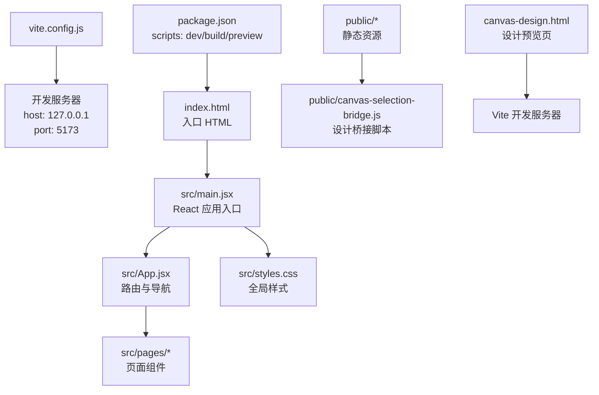
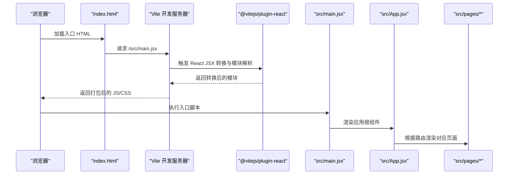
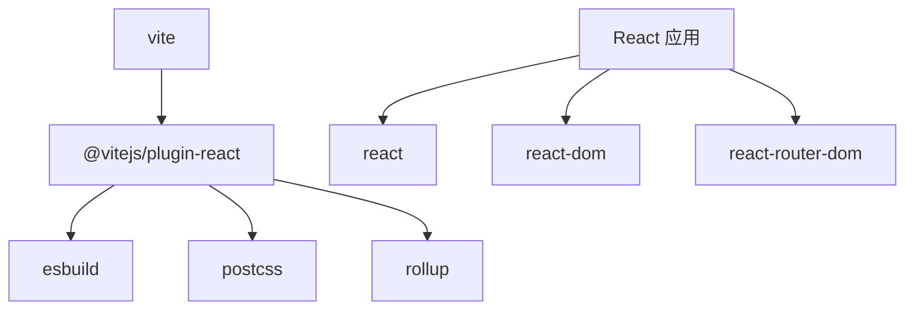

# 构建配置与优化

<cite>
**本文档引用的文件**
- [vite.config.js](file://vite.config.js)
- [package.json](file://package.json)
- [index.html](file://index.html)
- [src/main.jsx](file://src/main.jsx)
- [src/App.jsx](file://src/App.jsx)
- [src/styles.css](file://src/styles.css)
- [src/pages/Home.jsx](file://src/pages/Home.jsx)
- [src/pages/CourseList.jsx](file://src/pages/CourseList.jsx)
- [public/canvas-selection-bridge.js](file://public/canvas-selection-bridge.js)
- [canvas-design.html](file://canvas-design.html)
</cite>

## 目录
1. [简介](#简介)
2. [项目结构](#项目结构)
3. [核心组件](#核心组件)
4. [架构总览](#架构总览)
5. [详细组件分析](#详细组件分析)
6. [依赖关系分析](#依赖关系分析)
7. [性能考虑](#性能考虑)
8. [故障排查指南](#故障排查指南)
9. [结论](#结论)
10. [附录](#附录)

## 简介
本项目基于 Vite + React 的现代前端工程，采用轻量、快速的开发体验与高效的生产构建。本文档围绕 Vite 配置与优化展开，系统阐述开发服务器、代理与热重载机制，构建优化策略（代码分割、Tree Shaking、压缩）、静态资源与 CSS 处理、插件体系、生产构建参数、性能优化技巧、常见问题排查及与传统构建工具的对比。

## 项目结构
项目采用典型的 Vite + React 结构：
- 配置文件：vite.config.js
- 包管理与脚本：package.json
- 应用入口与路由：src/main.jsx、src/App.jsx
- 页面组件：src/pages/*
- 全局样式：src/styles.css
- 静态资源：public/*
- 设计桥接脚本：public/canvas-selection-bridge.js
- 设计预览页面：canvas-design.html

图表来源
- [vite.config.js:1-11](file://vite.config.js#L1-L11)
- [package.json:1-22](file://package.json#L1-L22)
- [index.html:1-20](file://index.html#L1-L20)
- [src/main.jsx:1-14](file://src/main.jsx#L1-L14)
- [src/App.jsx:1-112](file://src/App.jsx#L1-L112)
- [src/styles.css:1-499](file://src/styles.css#L1-L499)
- [public/canvas-selection-bridge.js:1-800](file://public/canvas-selection-bridge.js#L1-L800)
- [canvas-design.html:1-20](file://canvas-design.html#L1-L20)

章节来源
- [vite.config.js:1-11](file://vite.config.js#L1-L11)
- [package.json:1-22](file://package.json#L1-L22)
- [index.html:1-20](file://index.html#L1-L20)
- [src/main.jsx:1-14](file://src/main.jsx#L1-L14)
- [src/App.jsx:1-112](file://src/App.jsx#L1-L112)
- [src/styles.css:1-499](file://src/styles.css#L1-L499)
- [public/canvas-selection-bridge.js:1-800](file://public/canvas-selection-bridge.js#L1-L800)
- [canvas-design.html:1-20](file://canvas-design.html#L1-L20)

## 核心组件
- Vite 配置与插件
  - 使用 @vitejs/plugin-react 插件，启用 React Fast Refresh 与 JSX 转换。
  - 开发服务器默认监听 127.0.0.1:5173。
- React 应用入口
  - 在 src/main.jsx 中挂载 React 应用，使用 BrowserRouter 提供路由能力。
- 页面与路由
  - App.jsx 定义主应用布局与底部导航；各页面组件位于 src/pages 下。
- 样式与主题
  - src/styles.css 提供设计令牌与全局样式，支持响应式与动画。
- 静态资源与设计桥接
  - public/canvas-selection-bridge.js 为设计工具桥接脚本，实现元素选择、悬停高亮、文本编辑等功能。
  - canvas-design.html 作为设计预览入口，重定向至 Vite 开发服务器。

章节来源
- [vite.config.js:1-11](file://vite.config.js#L1-L11)
- [src/main.jsx:1-14](file://src/main.jsx#L1-L14)
- [src/App.jsx:1-112](file://src/App.jsx#L1-L112)
- [src/styles.css:1-499](file://src/styles.css#L1-L499)
- [public/canvas-selection-bridge.js:1-800](file://public/canvas-selection-bridge.js#L1-L800)
- [canvas-design.html:1-20](file://canvas-design.html#L1-L20)

## 架构总览
下图展示从浏览器请求到 React 组件渲染的关键流程，以及 Vite 开发服务器与插件的作用。

图表来源
- [index.html:1-20](file://index.html#L1-L20)
- [vite.config.js:1-11](file://vite.config.js#L1-L11)
- [src/main.jsx:1-14](file://src/main.jsx#L1-L14)
- [src/App.jsx:1-112](file://src/App.jsx#L1-L112)

## 详细组件分析

### Vite 配置与开发服务器
- 插件体系
  - @vitejs/plugin-react：启用 React JSX 转换、Fast Refresh、自动导入 React。
- 开发服务器
  - host: 127.0.0.1
  - port: 5173
  - 默认开启热重载（HMR），无需额外代理配置即可实现模块热替换。
- 生产构建
  - 使用 vite build 输出到 dist 目录，默认按需生成资源文件与哈希命名。

章节来源
- [vite.config.js:1-11](file://vite.config.js#L1-L11)
- [package.json:6-11](file://package.json#L6-L11)

### React 应用入口与路由
- 入口文件 src/main.jsx
  - 引入 React、react-dom、react-router-dom，并挂载到 #root。
- 主应用组件 src/App.jsx
  - 使用 React Router 的 Routes/Route/NavLink 实现多页面路由。
  - 提供顶部状态栏、底部导航与页面内容区域。
- 页面组件
  - Home.jsx、CourseList.jsx 等页面组件以卡片网格形式组织内容，结合样式系统实现一致的视觉风格。

章节来源
- [src/main.jsx:1-14](file://src/main.jsx#L1-L14)
- [src/App.jsx:1-112](file://src/App.jsx#L1-L112)
- [src/pages/Home.jsx:1-293](file://src/pages/Home.jsx#L1-L293)
- [src/pages/CourseList.jsx:1-314](file://src/pages/CourseList.jsx#L1-L314)

### 样式与主题系统
- 设计令牌与全局样式
  - src/styles.css 定义了种子色板、语义色、间距、圆角、阴影、字体与动效等设计令牌。
  - 通过 CSS 变量实现主题切换与组件复用。
- 组件样式
  - App.jsx 与页面组件通过类名与内联样式结合，遵循设计令牌规范。
- 动画与可访问性
  - 提供 bounce-in、float、pulse-glow 等动画类，以及针对减少动效的媒体查询。

章节来源
- [src/styles.css:1-499](file://src/styles.css#L1-L499)
- [src/App.jsx:1-112](file://src/App.jsx#L1-L112)

### 静态资源与设计桥接
- public/canvas-selection-bridge.js
  - 实现元素选择、悬停高亮、文本编辑、样式覆盖、DOM 树序列化等能力。
  - 通过 postMessage 与父窗口通信，支持可视化设计工具集成。
- canvas-design.html
  - 作为设计预览入口，重定向到 Vite 开发服务器，便于在设计工具中预览。

章节来源
- [public/canvas-selection-bridge.js:1-800](file://public/canvas-selection-bridge.js#L1-L800)
- [canvas-design.html:1-20](file://canvas-design.html#L1-L20)

### 构建优化策略
- 代码分割
  - React Router 的路由按需加载页面组件，天然实现代码分割。
- Tree Shaking
  - Vite 基于 Rollup，配合 ES Module 导出，未使用的导出会自动摇树移除。
- 压缩与产物
  - 生产构建默认启用压缩（terser），资源文件带哈希后缀，利于缓存控制。
- 资源处理
  - CSS 与静态资源由 Vite 自动处理，支持按需提取与最小化。

章节来源
- [package.json:17-21](file://package.json#L17-L21)
- [vite.config.js:1-11](file://vite.config.js#L1-L11)

### 生产环境构建配置
- 输出目录与资源路径
  - 默认输出至 dist，资源路径基于 Vite 默认策略。
- 缓存策略
  - 产物文件名含哈希，建议在 CDN 或服务端配置长期缓存策略。
- 预览命令
  - 使用 vite preview 在本地预览生产构建效果。

章节来源
- [package.json:8-10](file://package.json#L8-L10)
- [vite.config.js:1-11](file://vite.config.js#L1-L11)

### 性能优化技巧
- Bundle 分析
  - 使用 @rollup/plugin-visualizer 或第三方分析工具查看包体构成。
- 懒加载与预加载
  - 对非首屏页面组件使用动态导入实现懒加载；对关键路径资源使用 <link rel="prefetch"> 或 <link rel="preload">。
- 图片与图标
  - 使用 SVG 内联或雪碧图，减少 HTTP 请求；对大图采用懒加载与合适的尺寸。
- CSS 优化
  - 合理拆分样式，避免全局污染；利用 CSS 变量与原子化类名提升复用性。

[本节为通用指导，不直接分析具体文件，故无“章节来源”]

## 依赖关系分析
- Vite 与插件
  - @vitejs/plugin-react 依赖 esbuild、postcss、rollup 等工具链。
- 应用依赖
  - React、react-dom、react-router-dom 为核心运行时依赖。
- 开发依赖
  - vite、@vitejs/plugin-react 用于开发与构建。

图表来源
- [package.json:17-21](file://package.json#L17-L21)
- [package.json:12-16](file://package.json#L12-L16)

章节来源
- [package.json:12-21](file://package.json#L12-L21)

## 性能考虑
- 开发阶段
  - 利用 Vite 的原生 ESM 与 esbuild 加速编译，减少等待时间。
  - 启用 HMR，避免整页刷新。
- 生产阶段
  - 合理拆分代码，避免单体包过大。
  - 使用压缩与资源哈希，结合 CDN 长缓存策略。
  - 对图片与字体进行优化与懒加载。

[本节为通用指导，不直接分析具体文件，故无“章节来源”]

## 故障排查指南
- 开发服务器无法启动
  - 检查端口占用（默认 5173），必要时调整 vite.config.js 中的 port。
- 路由跳转异常
  - 确认 BrowserRouter 的使用与路由配置正确。
- 样式未生效
  - 检查 src/main.jsx 是否引入了全局样式文件。
- 设计桥接脚本无效
  - 确认 public/canvas-selection-bridge.js 已正确注入，且与设计工具的通信通道正常。

章节来源
- [vite.config.js:6-9](file://vite.config.js#L6-L9)
- [src/main.jsx:5](file://src/main.jsx#L5)
- [public/canvas-selection-bridge.js:1-800](file://public/canvas-selection-bridge.js#L1-L800)

## 结论
本项目以 Vite 为核心，结合 React Router 实现现代化前端工程。通过合理的配置与优化策略，可在开发阶段获得极佳的 DX，在生产阶段实现高性能与良好的缓存策略。建议持续关注包体构成与关键路径资源，配合懒加载与预加载策略进一步提升用户体验。

[本节为总结性内容，不直接分析具体文件，故无“章节来源”]

## 附录
- 术语说明
  - HMR：热模块替换，实现模块热更新而无需整页刷新。
  - Tree Shaking：基于 ES Module 的死代码消除。
  - Bundle：打包后的资源集合。
- 相关链接
  - Vite 官方文档：https://vitejs.dev/guide/
  - React Router 文档：https://reactrouter.com/

[本节为补充信息，不直接分析具体文件，故无“章节来源”]