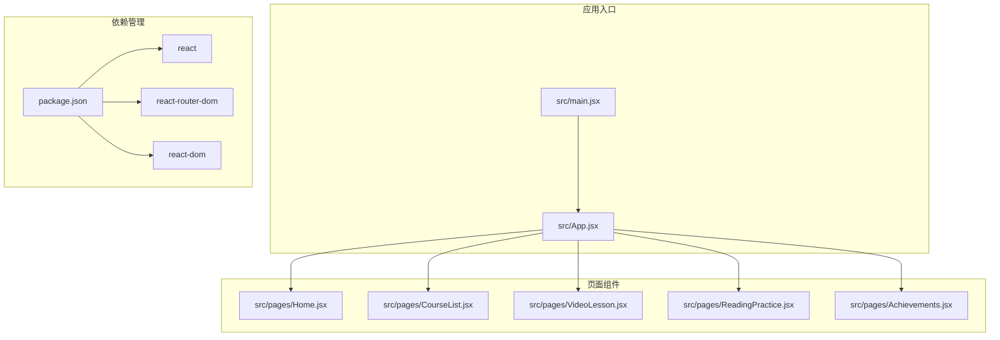
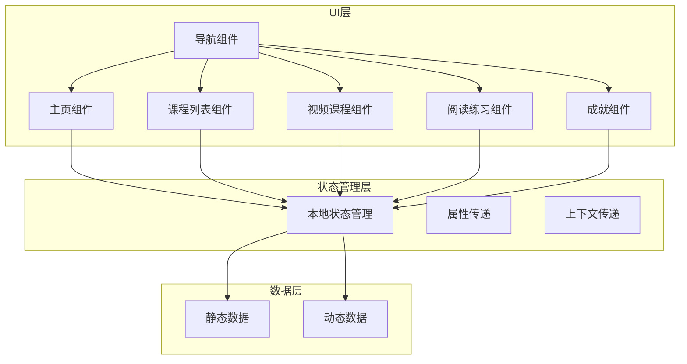
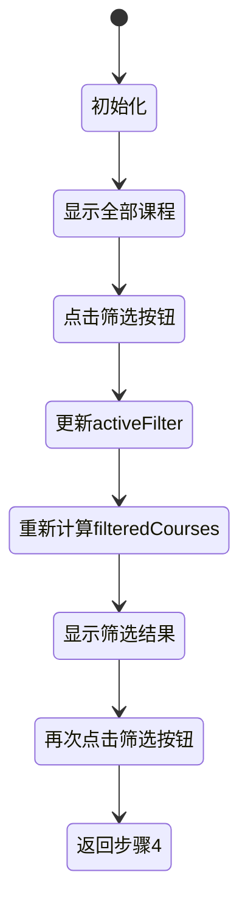

# 状态管理模式

<cite>
**本文档引用的文件**
- [App.jsx](file://src/App.jsx)
- [main.jsx](file://src/main.jsx)
- [Home.jsx](file://src/pages/Home.jsx)
- [CourseList.jsx](file://src/pages/CourseList.jsx)
- [VideoLesson.jsx](file://src/pages/VideoLesson.jsx)
- [ReadingPractice.jsx](file://src/pages/ReadingPractice.jsx)
- [Achievements.jsx](file://src/pages/Achievements.jsx)
- [package.json](file://package.json)
</cite>

## 目录
1. [引言](#引言)
2. [项目结构](#项目结构)
3. [核心组件](#核心组件)
4. [架构概览](#架构概览)
5. [详细组件分析](#详细组件分析)
6. [依赖关系分析](#依赖关系分析)
7. [性能考虑](#性能考虑)
8. [故障排除指南](#故障排除指南)
9. [结论](#结论)

## 引言

本项目是一个基于React的英语学习应用，采用Vite构建工具开发。通过深入分析代码库，我发现该项目采用了纯React Hooks的状态管理模式，没有引入第三方状态管理库（如Redux或Zustand）。这种设计选择使得状态管理更加简洁直接，适合中小型应用的开发需求。

项目的核心特点包括：
- 使用React Router进行路由管理
- 基于Hooks的本地状态管理
- 组件间通过props传递数据
- 页面级状态管理策略清晰
- 无第三方状态管理库依赖

## 项目结构

项目采用按功能模块组织的目录结构，主要分为以下几个部分：



**图表来源**
- [main.jsx:1-14](file://src/main.jsx#L1-L14)
- [App.jsx:1-112](file://src/App.jsx#L1-L112)

**章节来源**
- [main.jsx:1-14](file://src/main.jsx#L1-L14)
- [package.json:1-22](file://package.json#L1-L22)

## 核心组件

### 应用外壳组件

App.jsx作为应用的根组件，负责：
- 路由配置和导航
- 顶部状态栏显示用户信息
- 底部导航栏
- 主内容区域渲染

该组件展示了如何在顶层组件中处理路由状态，但并未实现全局状态管理，所有状态都在子组件内部管理。

### 页面级组件

项目中的页面组件都采用了独立的状态管理模式：

1. **Home组件**：展示用户学习进度和推荐课程
2. **CourseList组件**：管理课程筛选状态
3. **VideoLesson组件**：处理视频播放和测验状态
4. **ReadingPractice组件**：管理阅读练习状态
5. **Achievements组件**：展示成就和收藏品

**章节来源**
- [App.jsx:47-112](file://src/App.jsx#L47-L112)
- [Home.jsx:48-293](file://src/pages/Home.jsx#L48-L293)
- [CourseList.jsx:163-314](file://src/pages/CourseList.jsx#L163-L314)

## 架构概览

项目的整体架构遵循React的经典分层模式：



**图表来源**
- [App.jsx:85-91](file://src/App.jsx#L85-L91)
- [CourseList.jsx:163-176](file://src/pages/CourseList.jsx#L163-L176)

## 详细组件分析

### 全局状态管理策略

当前项目采用"无状态"的全局管理策略，具体体现在：

1. **顶层路由管理**：App.jsx使用useLocation()钩子管理当前路由状态
2. **无全局状态库**：未使用Redux、Zustand等第三方状态管理库
3. **组件内状态**：所有业务状态都在对应组件内部管理

这种设计的优势：
- 简化了状态管理复杂度
- 减少了不必要的依赖
- 便于理解和维护

### 页面级状态管理

#### Home组件学习进度状态

Home组件虽然没有显式的useState调用，但通过props接收用户数据，展示学习进度、经验值和连续学习天数等信息。

#### CourseList组件课程筛选状态

CourseList组件实现了完整的筛选功能：



**图表来源**
- [CourseList.jsx:163-176](file://src/pages/CourseList.jsx#L163-L176)

#### VideoLesson组件交互状态

VideoLesson组件管理多个交互状态：
- 字幕显示模式（英文/中英对照）
- 测验答案状态
- 测验显示控制

#### ReadingPractice组件练习状态

ReadingPractice组件实现了复杂的练习状态管理：
- 多种题型的答案状态
- 提交后的结果显示
- 单词收藏状态
- 填空题答案状态

### 状态提升和状态下沉原则

项目中体现了以下状态管理原则：

#### 状态提升示例

在CourseList组件中，筛选状态被提升到组件内部，通过props向下传递给子组件：

```javascript
// 状态提升：在CourseList中管理activeFilter
const [activeFilter, setActiveFilter] = useState('all')

// 状态下沉：通过props传递给子组件
<Link to={course.type === 'listening' ? `/video/${course.id}` : `/reading/${course.id}`}>
```

#### 状态下沉示例

VideoLesson组件将字幕显示状态通过props传递给子组件，实现了状态的单向流动。

### 组件间状态共享最佳实践

项目中组件间的状态共享主要通过以下方式实现：

1. **Props传递**：父组件向子组件传递数据和回调函数
2. **事件冒泡**：子组件通过回调函数向上通知状态变化
3. **路由参数**：通过URL参数传递状态信息

**章节来源**
- [CourseList.jsx:163-198](file://src/pages/CourseList.jsx#L163-L198)
- [VideoLesson.jsx:20-24](file://src/pages/VideoLesson.jsx#L20-L24)
- [ReadingPractice.jsx:45-67](file://src/pages/ReadingPractice.jsx#L45-L67)

## 依赖关系分析

项目的主要依赖关系如下：

```mermaid
graph LR
subgraph "运行时依赖"
REACT[react@^18.2.0]
DOM[react-dom@^18.2.0]
ROUTER[react-router-dom@^6.20.0]
end
subgraph "开发依赖"
VITE[vite@^5.0.0]
PLUGIN[@vitejs/plugin-react@^4.2.0]
end
subgraph "应用代码"
MAIN[src/main.jsx]
APP[src/App.jsx]
PAGES[src/pages/*.jsx]
end
MAIN --> REACT
MAIN --> DOM
MAIN --> ROUTER
APP --> REACT
APP --> ROUTER
PAGES --> REACT
PAGES --> ROUTER
MAIN -.-> VITE
MAIN -.-> PLUGIN
```

**图表来源**
- [package.json:12-21](file://package.json#L12-L21)

**章节来源**
- [package.json:1-22](file://package.json#L1-22)

## 性能考虑

### 渲染性能优化

1. **组件拆分**：将大组件拆分为多个小组件，提高渲染效率
2. **条件渲染**：使用条件渲染避免不必要的DOM更新
3. **状态局部化**：只在需要的组件中维护状态

### 状态更新优化

1. **状态合并**：将相关的状态合并到一个useState调用中
2. **避免重复渲染**：使用React.memo或useMemo优化昂贵的计算
3. **批处理更新**：React自动批处理同一事件循环内的状态更新

### 数据流优化

1. **单向数据流**：确保数据流向单一方向，减少状态同步问题
2. **状态最小化**：只存储必要的状态数据
3. **状态规范化**：将复杂状态结构化存储

## 故障排除指南

### 常见状态管理问题

1. **状态不更新**：检查是否正确使用了useState的setter函数
2. **状态丢失**：确认组件是否正确地保存和恢复状态
3. **性能问题**：分析组件渲染频率，识别不必要的重渲染

### 调试技巧

1. **React DevTools**：使用组件树检查器查看组件状态
2. **日志记录**：在关键状态变更点添加console.log
3. **状态快照**：定期保存应用状态以便问题重现

### 最佳实践建议

1. **状态设计**：设计清晰的状态结构，避免嵌套过深
2. **错误边界**：为关键组件添加错误边界处理
3. **状态验证**：在状态更新时进行基本的数据验证

## 结论

本项目展现了React Hooks状态管理的简洁性和有效性。通过采用纯Hooks的状态管理模式，项目实现了：

- **简单直观的状态管理**：无需复杂的第三方库，直接使用React内置的Hooks
- **清晰的组件职责**：每个组件都有明确的状态管理责任
- **良好的可维护性**：代码结构清晰，易于理解和修改
- **优秀的性能表现**：通过合理的状态设计和组件拆分，实现了高效的渲染性能

对于类似规模的应用，这种状态管理模式是完全适用的。如果未来应用规模扩大，可以考虑引入更高级的状态管理解决方案，但在当前阶段，纯Hooks的方案已经足够满足需求。