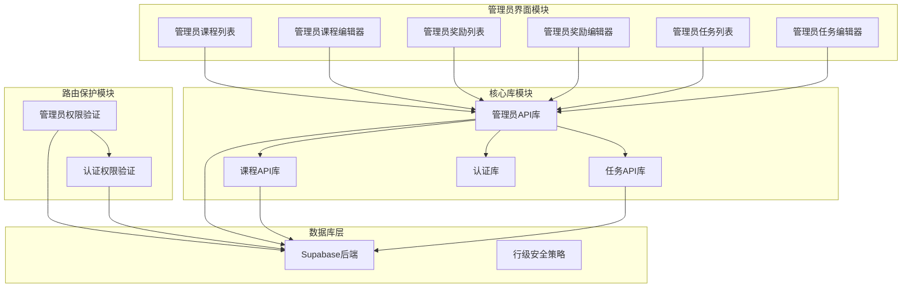
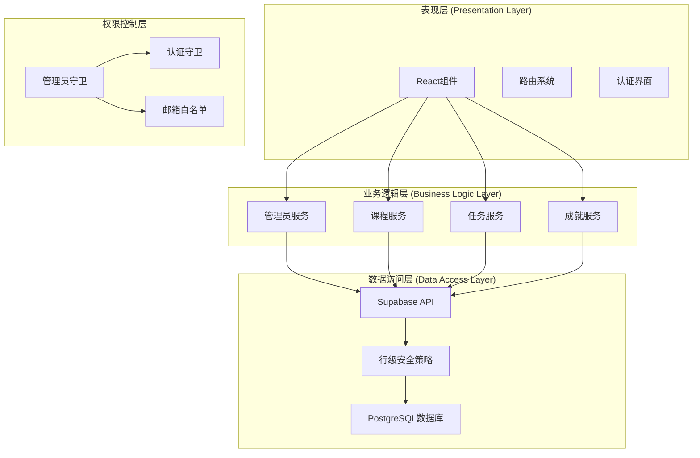
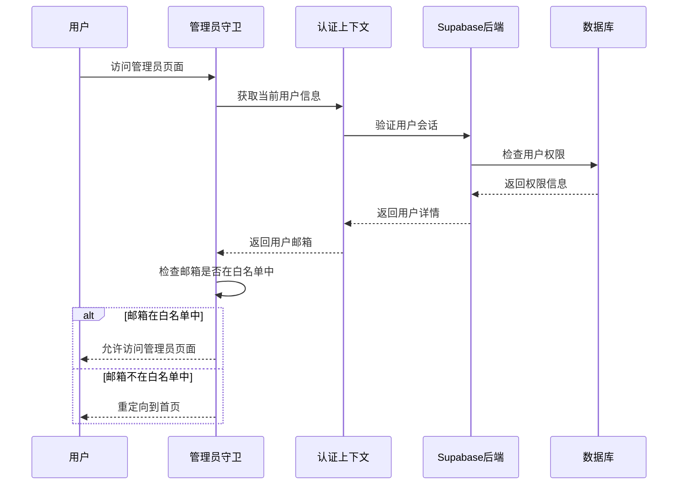
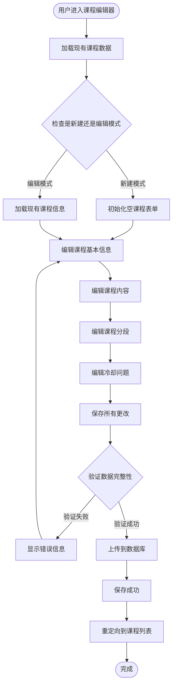
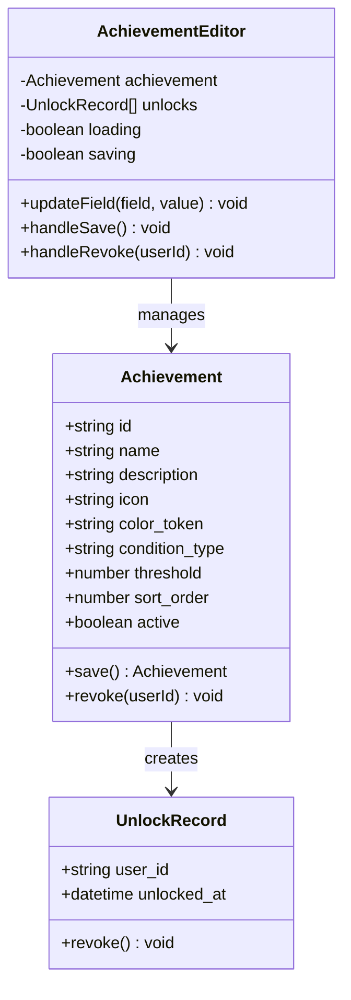
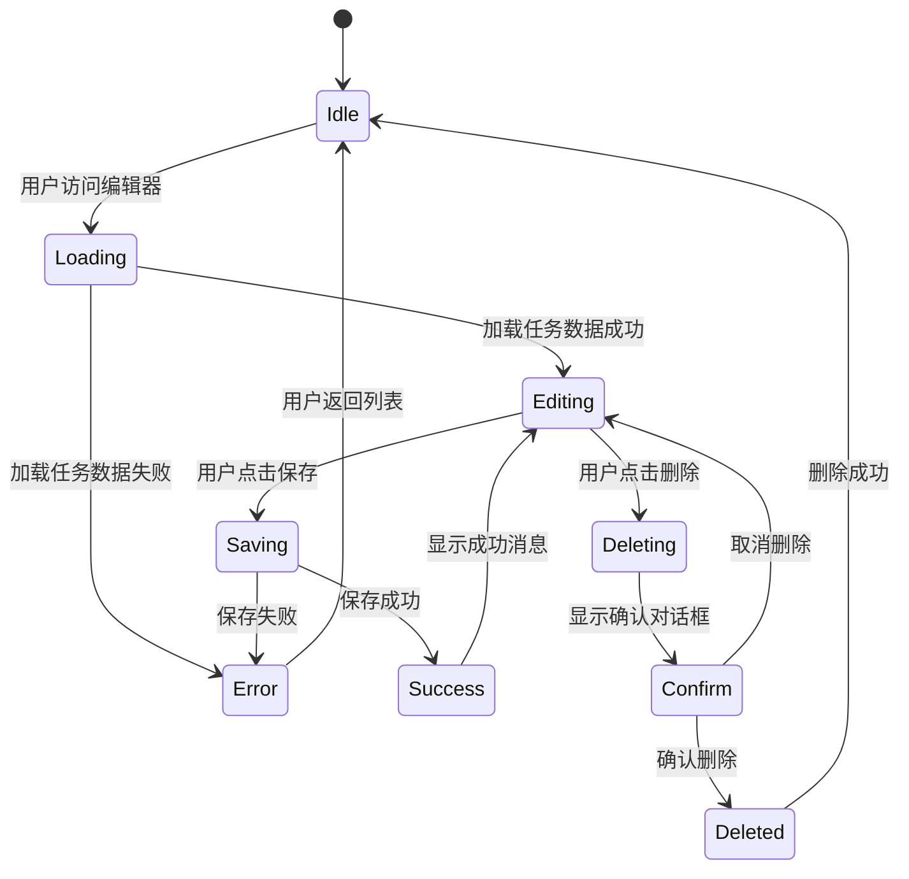
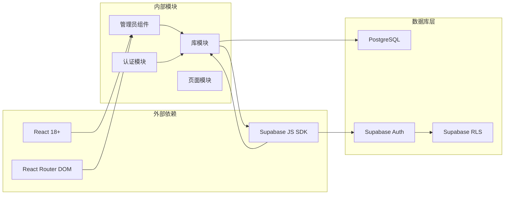

# 管理员系统

<cite>
**本文档引用的文件**
- [src/admin/AdminCourseEditor.jsx](file://src/admin/AdminCourseEditor.jsx)
- [src/admin/AdminCourseList.jsx](file://src/admin/AdminCourseList.jsx)
- [src/admin/AdminQuestsEditor.jsx](file://src/admin/AdminQuestsEditor.jsx)
- [src/admin/AdminQuestsList.jsx](file://src/admin/AdminQuestsList.jsx)
- [src/admin/AdminRewardsEditor.jsx](file://src/admin/AdminRewardsEditor.jsx)
- [src/admin/AdminRewardsList.jsx](file://src/admin/AdminRewardsList.jsx)
- [src/admin/RequireAdmin.jsx](file://src/admin/RequireAdmin.jsx)
- [src/lib/admin.js](file://src/lib/admin.js)
- [src/lib/courses.js](file://src/lib/courses.js)
- [src/lib/quests.js](file://src/lib/quests.js)
- [src/App.jsx](file://src/App.jsx)
- [src/auth/AuthContext.jsx](file://src/auth/AuthContext.jsx)
- [src/auth/RequireAuth.jsx](file://src/auth/RequireAuth.jsx)
- [supabase-migration/03_courses_schema.sql](file://supabase-migration/03_courses_schema.sql)
- [supabase-migration/07_admin_rls.sql](file://supabase-migration/07_admin_rls.sql)
</cite>

## 目录
1. [简介](#简介)
2. [项目结构](#项目结构)
3. [核心组件](#核心组件)
4. [架构概览](#架构概览)
5. [详细组件分析](#详细组件分析)
6. [依赖关系分析](#依赖关系分析)
7. [性能考虑](#性能考虑)
8. [故障排除指南](#故障排除指南)
9. [结论](#结论)

## 简介

管理员系统是基于React和Supabase构建的教育内容管理系统，为管理员提供了一个完整的课程、奖励和日常任务管理界面。该系统采用RBAC（基于角色的访问控制）模式，通过Supabase的行级安全策略实现数据隔离和权限控制。

系统支持多种内容类型，包括听力课程、阅读课程和词汇练习，每种类型都有专门的编辑器和管理界面。管理员可以通过直观的UI界面创建、编辑和删除各种学习内容，同时监控用户的学习进度和成就获取情况。

## 项目结构

管理员系统采用模块化架构设计，主要包含以下核心模块：

**图表来源**
- [src/admin/AdminCourseList.jsx:1-374](file://src/admin/AdminCourseList.jsx#L1-L374)
- [src/admin/AdminCourseEditor.jsx:1-1059](file://src/admin/AdminCourseEditor.jsx#L1-L1059)
- [src/admin/AdminRewardsList.jsx:1-225](file://src/admin/AdminRewardsList.jsx#L1-L225)
- [src/admin/AdminRewardsEditor.jsx:1-328](file://src/admin/AdminRewardsEditor.jsx#L1-L328)
- [src/admin/AdminQuestsList.jsx:1-223](file://src/admin/AdminQuestsList.jsx#L1-L223)
- [src/admin/AdminQuestsEditor.jsx:1-319](file://src/admin/AdminQuestsEditor.jsx#L1-L319)

**章节来源**
- [src/admin/AdminCourseList.jsx:1-374](file://src/admin/AdminCourseList.jsx#L1-L374)
- [src/admin/AdminCourseEditor.jsx:1-1059](file://src/admin/AdminCourseEditor.jsx#L1-L1059)
- [src/admin/AdminRewardsList.jsx:1-225](file://src/admin/AdminRewardsList.jsx#L1-L225)
- [src/admin/AdminRewardsEditor.jsx:1-328](file://src/admin/AdminRewardsEditor.jsx#L1-L328)
- [src/admin/AdminQuestsList.jsx:1-223](file://src/admin/AdminQuestsList.jsx#L1-L223)
- [src/admin/AdminQuestsEditor.jsx:1-319](file://src/admin/AdminQuestsEditor.jsx#L1-L319)

## 核心组件

管理员系统由六个主要组件构成，每个组件负责特定的管理功能：

### 课程管理组件
- **AdminCourseList**: 提供课程的列表视图，支持批量导入、激活状态切换和删除操作
- **AdminCourseEditor**: 完整的课程编辑器，支持课程信息、课程内容、分段管理和冷却问题编辑

### 奖励管理组件  
- **AdminRewardsList**: 奖励系统的列表管理界面
- **AdminRewardsEditor**: 奖励的创建和编辑功能，支持条件配置和解锁监控

### 任务管理组件
- **AdminQuestsList**: 日常任务的列表管理
- **AdminQuestsEditor**: 任务的创建和编辑功能，支持多种任务类型

### 权限控制组件
- **RequireAdmin**: 管理员权限验证，基于白名单邮箱地址
- **RequireAuth**: 认证权限验证，确保用户已登录

**章节来源**
- [src/admin/AdminCourseList.jsx:1-374](file://src/admin/AdminCourseList.jsx#L1-L374)
- [src/admin/AdminCourseEditor.jsx:1-1059](file://src/admin/AdminCourseEditor.jsx#L1-L1059)
- [src/admin/AdminRewardsList.jsx:1-225](file://src/admin/AdminRewardsList.jsx#L1-L225)
- [src/admin/AdminRewardsEditor.jsx:1-328](file://src/admin/AdminRewardsEditor.jsx#L1-L328)
- [src/admin/AdminQuestsList.jsx:1-223](file://src/admin/AdminQuestsList.jsx#L1-L223)
- [src/admin/AdminQuestsEditor.jsx:1-319](file://src/admin/AdminQuestsEditor.jsx#L1-L319)
- [src/admin/RequireAdmin.jsx:1-16](file://src/admin/RequireAdmin.jsx#L1-L16)

## 架构概览

管理员系统采用分层架构设计，确保了清晰的关注点分离和良好的可维护性：

**图表来源**
- [src/App.jsx:213-221](file://src/App.jsx#L213-L221)
- [src/admin/RequireAdmin.jsx:1-16](file://src/admin/RequireAdmin.jsx#L1-L16)
- [src/auth/RequireAuth.jsx:1-45](file://src/auth/RequireAuth.jsx#L1-L45)
- [src/lib/admin.js:1-261](file://src/lib/admin.js#L1-L261)

系统的核心特点包括：

1. **分层架构**: 清晰的层次分离确保了代码的可维护性和可测试性
2. **权限控制**: 基于邮箱白名单的管理员验证机制
3. **数据一致性**: 通过Supabase的事务处理保证数据完整性
4. **实时更新**: 使用WebSocket实现实时数据同步

**章节来源**
- [src/App.jsx:213-221](file://src/App.jsx#L213-L221)
- [src/lib/admin.js:1-261](file://src/lib/admin.js#L1-L261)
- [supabase-migration/07_admin_rls.sql:1-103](file://supabase-migration/07_admin_rls.sql#L1-L103)

## 详细组件分析

### 管理员权限验证系统

管理员权限验证系统是整个管理员系统的核心安全组件，采用多层验证机制：

**图表来源**
- [src/admin/RequireAdmin.jsx:8-15](file://src/admin/RequireAdmin.jsx#L8-L15)
- [src/auth/AuthContext.jsx:262-367](file://src/auth/AuthContext.jsx#L262-L367)

管理员权限验证的关键特性：

- **白名单机制**: 仅允许指定邮箱地址的用户访问管理员功能
- **实时验证**: 每次路由导航时都会重新验证用户权限
- **自动重定向**: 未授权用户会被自动重定向到应用首页

**章节来源**
- [src/admin/RequireAdmin.jsx:1-16](file://src/admin/RequireAdmin.jsx#L1-L16)
- [src/auth/AuthContext.jsx:262-367](file://src/auth/AuthContext.jsx#L262-L367)

### 课程管理系统

课程管理系统提供了完整的课程生命周期管理功能，支持多种课程类型和内容格式：

#### 课程编辑器工作流程

**图表来源**
- [src/admin/AdminCourseEditor.jsx:262-338](file://src/admin/AdminCourseEditor.jsx#L262-L338)

课程管理的核心功能包括：

- **多课程类型支持**: 支持听力、阅读和词汇三种课程类型
- **批量导入功能**: 支持从JSON格式批量导入课程数据
- **智能分段**: 支持从YouTube VTT字幕自动生成课程分段
- **冷却问题**: 为每门课程设置复习用的MCQ问题

#### 课程数据模型

课程系统使用以下数据结构：

| 表名 | 字段 | 类型 | 描述 |
|------|------|------|------|
| courses | id, kind, title, description | text | 课程基本信息 |
| lessons | id, course_id, step_index, kind | text | 课程内容单元 |
| lesson_segments | id, lesson_id, sort_order, start_sec, end_sec | numeric | 课程分段内容 |
| questions | id, lesson_id, kind, prompt, payload | jsonb | 冷却问题 |

**章节来源**
- [src/admin/AdminCourseEditor.jsx:1-1059](file://src/admin/AdminCourseEditor.jsx#L1-L1059)
- [src/admin/AdminCourseList.jsx:1-374](file://src/admin/AdminCourseList.jsx#L1-L374)
- [supabase-migration/03_courses_schema.sql:14-300](file://supabase-migration/03_courses_schema.sql#L14-L300)

### 奖励管理系统

奖励管理系统用于管理用户的成就和奖励，提供灵活的条件配置和解锁监控功能：

#### 奖励编辑器功能

**图表来源**
- [src/admin/AdminRewardsEditor.jsx:24-123](file://src/admin/AdminRewardsEditor.jsx#L24-L123)

奖励系统支持的条件类型：

- **任务计数**: 完成指定数量的任务
- **连续登录**: 维持指定天数的连续登录
- **等级要求**: 达到指定的游戏等级
- **词汇量**: 学习指定数量的词汇

**章节来源**
- [src/admin/AdminRewardsEditor.jsx:1-328](file://src/admin/AdminRewardsEditor.jsx#L1-L328)
- [src/admin/AdminRewardsList.jsx:1-225](file://src/admin/AdminRewardsList.jsx#L1-L225)

### 任务管理系统

任务管理系统用于创建和管理日常学习任务，提供多种任务类型和奖励机制：

#### 任务编辑器架构

**图表来源**
- [src/admin/AdminQuestsEditor.jsx:50-141](file://src/admin/AdminQuestsEditor.jsx#L50-L141)

任务系统支持的任务类型：

- **听力练习**: 听力理解练习
- **阅读理解**: 文本阅读理解
- **词汇学习**: 词汇记忆和练习
- **综合测验**: 多技能综合测试

**章节来源**
- [src/admin/AdminQuestsEditor.jsx:1-319](file://src/admin/AdminQuestsEditor.jsx#L1-L319)
- [src/admin/AdminQuestsList.jsx:1-223](file://src/admin/AdminQuestsList.jsx#L1-L223)

## 依赖关系分析

管理员系统的依赖关系体现了清晰的模块化设计：

**图表来源**
- [src/App.jsx:1-311](file://src/App.jsx#L1-L311)
- [src/lib/admin.js:1-261](file://src/lib/admin.js#L1-L261)

### 关键依赖关系

1. **路由依赖**: 所有管理员页面都依赖于RequireAdmin守卫
2. **认证依赖**: 管理员功能依赖于Supabase认证系统
3. **数据依赖**: 所有管理操作都依赖于Supabase数据库
4. **UI依赖**: 组件间存在清晰的父子关系和数据流

**章节来源**
- [src/App.jsx:213-221](file://src/App.jsx#L213-L221)
- [src/lib/admin.js:1-261](file://src/lib/admin.js#L1-L261)

## 性能考虑

管理员系统在设计时充分考虑了性能优化：

### 数据加载优化
- **懒加载**: 管理员页面按需加载，避免不必要的资源消耗
- **缓存策略**: 使用Supabase的查询缓存减少数据库压力
- **批量操作**: 支持批量导入和导出功能，提高管理效率

### 前端性能优化
- **虚拟滚动**: 对于大量数据的列表使用虚拟滚动技术
- **组件优化**: 使用React.memo和useMemo避免不必要的重渲染
- **代码分割**: 路由级别的代码分割，按需加载组件

### 数据库性能优化
- **索引优化**: 为常用查询字段建立适当的数据库索引
- **查询优化**: 使用高效的SQL查询和连接策略
- **事务处理**: 对于关键操作使用数据库事务确保数据一致性

## 故障排除指南

### 常见问题及解决方案

#### 管理员权限问题
**问题**: 管理员无法访问管理页面
**原因**: 用户邮箱不在白名单中或认证状态异常
**解决方案**: 
1. 检查用户邮箱是否在ADMIN_EMAILS数组中
2. 确认用户已完成邮箱验证
3. 刷新页面重新加载认证状态

#### 数据同步问题
**问题**: 管理员界面显示的数据与实际数据库不一致
**原因**: Supabase订阅连接异常或本地状态不同步
**解决方案**:
1. 检查网络连接状态
2. 刷新页面重新建立数据库连接
3. 检查Supabase服务状态

#### 表单提交问题
**问题**: 保存课程或奖励信息时出现错误
**原因**: 数据验证失败或数据库写入异常
**解决方案**:
1. 检查必填字段是否完整填写
2. 确认数据格式符合要求
3. 查看浏览器控制台的详细错误信息

**章节来源**
- [src/admin/RequireAdmin.jsx:1-16](file://src/admin/RequireAdmin.jsx#L1-L16)
- [src/admin/AdminCourseEditor.jsx:333-335](file://src/admin/AdminCourseEditor.jsx#L333-L335)

## 结论

管理员系统是一个功能完整、架构清晰的教育内容管理平台。系统通过模块化设计实现了良好的可维护性和扩展性，通过多层权限控制确保了数据安全，通过优化的前端架构提供了流畅的用户体验。

系统的主要优势包括：

1. **完整的管理功能**: 支持课程、奖励、任务的全生命周期管理
2. **灵活的权限控制**: 基于邮箱白名单的管理员验证机制
3. **直观的用户界面**: 采用卡片式设计和响应式布局
4. **强大的数据管理**: 支持批量操作和数据导入导出
5. **实时数据同步**: 基于Supabase的实时数据库功能

未来可以考虑的功能增强包括：
- 添加更多课程类型和内容格式支持
- 实现更精细的权限分级管理
- 增强数据分析和报告功能
- 优化移动端用户体验
- 添加内容版本管理和回滚功能