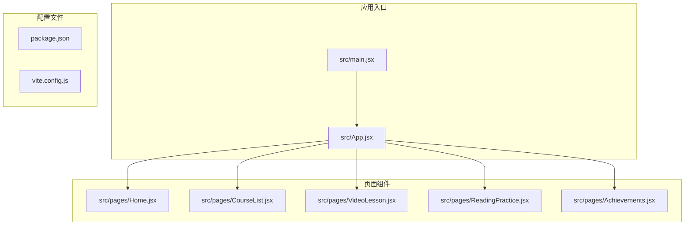
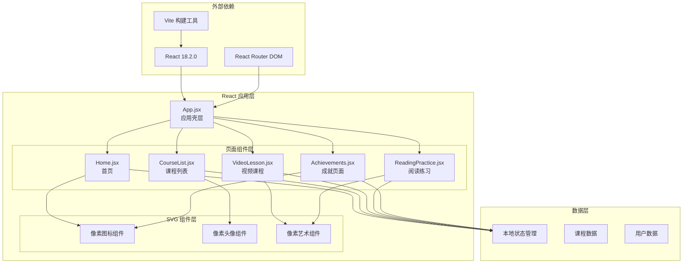
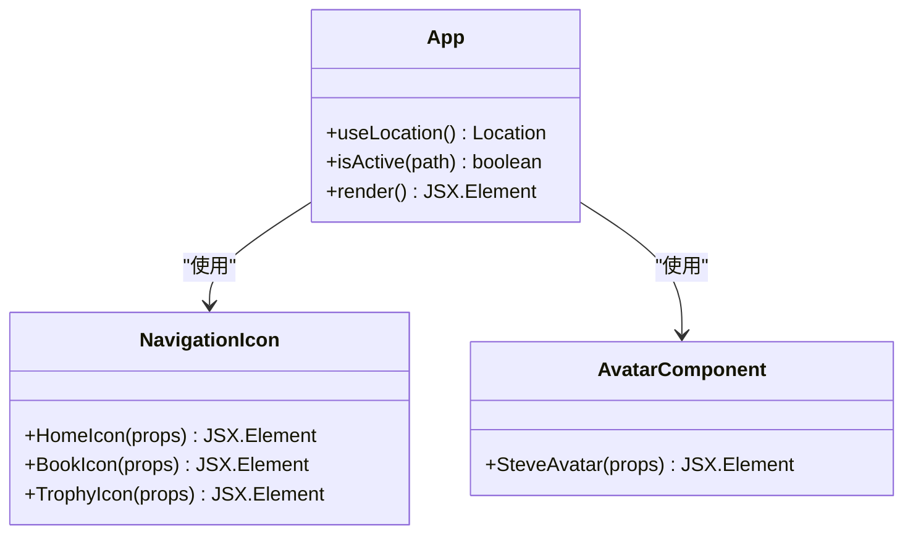
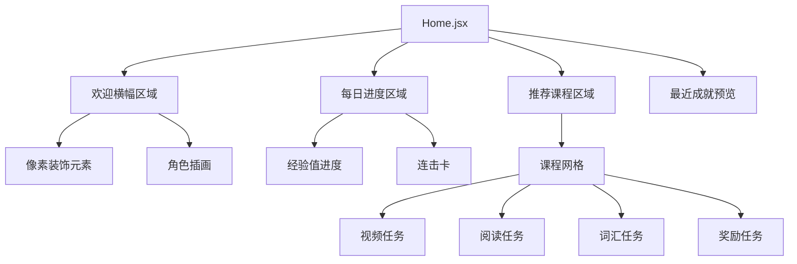
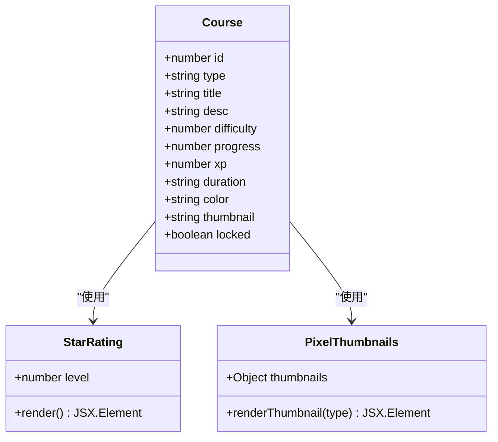
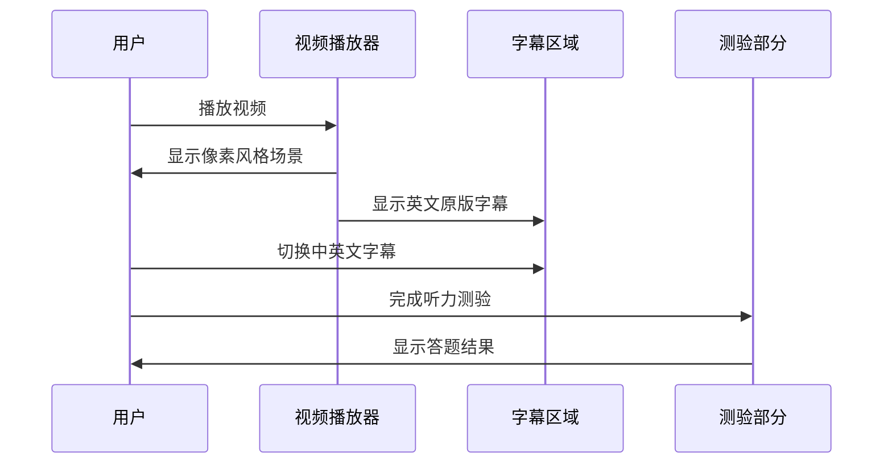
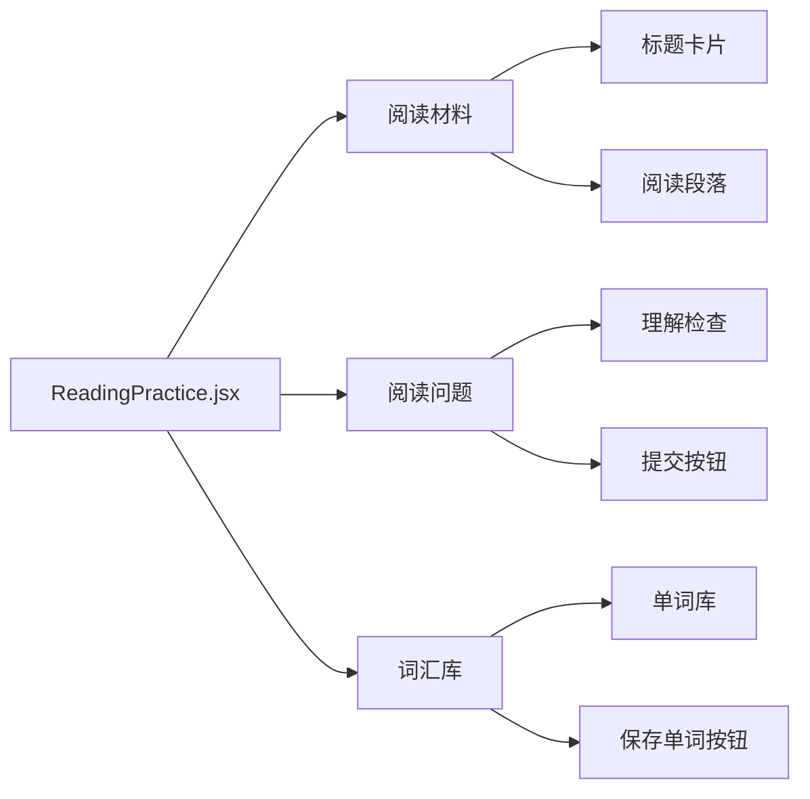
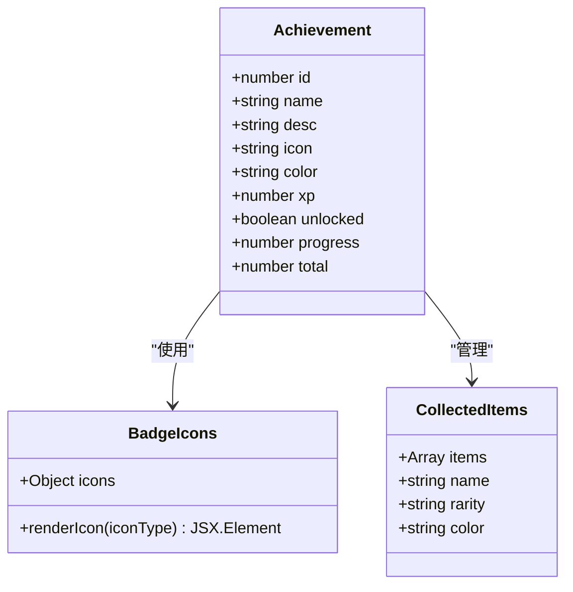

# 组件架构设计

<cite>
**本文档引用的文件**
- [src/App.jsx](file://src/App.jsx)
- [src/main.jsx](file://src/main.jsx)
- [src/qoder-design-runtime.jsx](file://src/qoder-design-runtime.jsx)
- [src/pages/Home.jsx](file://src/pages/Home.jsx)
- [src/pages/CourseList.jsx](file://src/pages/CourseList.jsx)
- [src/pages/VideoLesson.jsx](file://src/pages/VideoLesson.jsx)
- [src/pages/ReadingPractice.jsx](file://src/pages/ReadingPractice.jsx)
- [src/pages/Achievements.jsx](file://src/pages/Achievements.jsx)
- [package.json](file://package.json)
- [vite.config.js](file://vite.config.js)
</cite>

## 目录
1. [项目概述](#项目概述)
2. [项目结构](#项目结构)
3. [核心组件](#核心组件)
4. [架构概览](#架构概览)
5. [详细组件分析](#详细组件分析)
6. [依赖关系分析](#依赖关系分析)
7. [性能考虑](#性能考虑)
8. [故障排除指南](#故障排除指南)
9. [结论](#结论)

## 项目概述

这是一个基于 React 和 Vite 的 Minecraft 英语学习应用，采用函数式组件 + Hooks 的现代 React 设计模式。应用以 Minecraft 为主题，通过像素艺术风格的 SVG 组件为用户提供英语学习体验。

该应用的核心特点包括：
- 函数式组件 + Hooks 架构
- 像素艺术 SVG 组件设计
- 响应式布局和主题化设计系统
- 游戏化学习体验（经验值、等级、徽章系统）
- 多页面路由导航

## 项目结构



**图表来源**
- [src/main.jsx:1-14](file://src/main.jsx#L1-L14)
- [src/App.jsx:1-112](file://src/App.jsx#L1-L112)

**章节来源**
- [src/main.jsx:1-14](file://src/main.jsx#L1-L14)
- [package.json:1-22](file://package.json#L1-L22)
- [vite.config.js:1-11](file://vite.config.js#L1-L11)

## 核心组件

### 应用壳层组件 (App.jsx)

App.jsx 作为整个应用的壳层组件，承担着以下职责：

1. **路由管理**: 使用 React Router DOM 管理应用内的页面导航
2. **全局布局**: 提供顶部状态栏、主内容区域和底部导航的统一布局
3. **状态管理**: 使用 `useLocation` Hook 追踪当前路由状态
4. **像素艺术图标**: 内置 SVG 图标组件用于导航
5. **用户界面**: 集成用户头像、等级显示和经验值进度条

**章节来源**
- [src/App.jsx:1-112](file://src/App.jsx#L1-L112)

### 页面级组件

应用包含五个主要页面组件，每个都采用函数式组件 + Hooks 的设计模式：

1. **首页 (Home)**: 主要的学习入口页面
2. **课程列表 (CourseList)**: 展示可选的英语学习课程
3. **视频课程 (VideoLesson)**: 提供视频学习和听力练习
4. **阅读练习 (ReadingPractice)**: 文字阅读理解和词汇学习
5. **成就页面 (Achievements)**: 展示用户的学习进度和徽章

**章节来源**
- [src/pages/Home.jsx:1-293](file://src/pages/Home.jsx#L1-L293)
- [src/pages/CourseList.jsx:1-314](file://src/pages/CourseList.jsx#L1-L314)
- [src/pages/VideoLesson.jsx:1-288](file://src/pages/VideoLesson.jsx#L1-L288)
- [src/pages/ReadingPractice.jsx:1-293](file://src/pages/ReadingPractice.jsx#L1-L293)
- [src/pages/Achievements.jsx:1-297](file://src/pages/Achievements.jsx#L1-L297)

## 架构概览



**图表来源**
- [src/App.jsx:47-112](file://src/App.jsx#L47-L112)
- [src/pages/Home.jsx:48-293](file://src/pages/Home.jsx#L48-L293)
- [src/pages/CourseList.jsx:163-314](file://src/pages/CourseList.jsx#L163-L314)

## 详细组件分析

### App.jsx 组件分析

App.jsx 采用了现代化的函数式组件设计，具有以下特点：

#### 组件结构


**图表来源**
- [src/App.jsx:9-45](file://src/App.jsx#L9-L45)
- [src/App.jsx:47-112](file://src/App.jsx#L47-L112)

#### 导航系统设计
应用实现了底部导航系统，包含三个主要导航项：
- **首页导航**: 使用房屋图标，提供学习入口
- **课程导航**: 使用书本图标，展示所有课程
- **成就导航**: 使用奖杯图标，展示用户进度

#### 像素艺术头像设计
SteveAvatar 组件展示了像素艺术的设计理念：
- 使用 SVG rect 元素构建像素风格
- 精确的坐标定位确保像素对齐
- 色彩搭配体现 Minecraft 风格

**章节来源**
- [src/App.jsx:9-45](file://src/App.jsx#L9-L45)
- [src/App.jsx:47-112](file://src/App.jsx#L47-L112)

### Home.jsx 组件分析

Home.jsx 作为应用的主要入口页面，采用了卡片式布局设计：

#### 页面结构


**图表来源**
- [src/pages/Home.jsx:48-293](file://src/pages/Home.jsx#L48-L293)

#### 像素装饰元素
页面包含多个像素艺术装饰元素：
- **PixelSword**: 剑的像素艺术
- **PixelPickaxe**: 挖掘工具的像素艺术  
- **PixelHeart**: 心形像素艺术

这些组件都遵循相同的像素艺术设计原则，使用 SVG rect 元素精确控制每个像素的位置和颜色。

**章节来源**
- [src/pages/Home.jsx:4-46](file://src/pages/Home.jsx#L4-L46)
- [src/pages/Home.jsx:48-293](file://src/pages/Home.jsx#L48-L293)

### CourseList.jsx 组件分析

CourseList.jsx 实现了完整的课程管理系统：

#### 课程数据结构


**图表来源**
- [src/pages/CourseList.jsx:4-61](file://src/pages/CourseList.jsx#L4-L61)
- [src/pages/CourseList.jsx:153-161](file://src/pages/CourseList.jsx#L153-L161)

#### 过滤和排序功能
组件实现了动态过滤功能，支持按类型过滤课程：
- 所有课程
- 听力课程
- 阅读课程  
- 词汇课程

**章节来源**
- [src/pages/CourseList.jsx:163-314](file://src/pages/CourseList.jsx#L163-L314)

### VideoLesson.jsx 组件分析

VideoLesson.jsx 提供了完整的视频学习体验：

#### 视频播放器设计


**图表来源**
- [src/pages/VideoLesson.jsx:20-288](file://src/pages/VideoLesson.jsx#L20-L288)

#### 互动学习功能
- **字幕切换**: 支持英文原版和中英双语字幕
- **时间轴**: 展示视频学习进度
- **测验系统**: 提供听力理解测试
- **关键词学习**: 突出显示重要词汇

**章节来源**
- [src/pages/VideoLesson.jsx:20-288](file://src/pages/VideoLesson.jsx#L20-L288)

### ReadingPractice.jsx 组件分析

ReadingPractice.jsx 实现了沉浸式的阅读学习体验：

#### 阅读材料设计


**图表来源**
- [src/pages/ReadingPractice.jsx:45-293](file://src/pages/ReadingPractice.jsx#L45-L293)

#### 交互式学习功能
- **词汇高亮**: 自动识别并高亮显示目标词汇
- **单词收藏**: 支持用户收藏生词
- **多类型题目**: 包含选择题、判断题和填空题
- **即时反馈**: 提供实时的答案正确性反馈

**章节来源**
- [src/pages/ReadingPractice.jsx:45-293](file://src/pages/ReadingPractice.jsx#L45-L293)

### Achievements.jsx 组件分析

Achievements.jsx 实现了完整的游戏化成就系统：

#### 成就数据结构


**图表来源**
- [src/pages/Achievements.jsx:3-12](file://src/pages/Achievements.jsx#L3-L12)
- [src/pages/Achievements.jsx:26-111](file://src/pages/Achievements.jsx#L26-L111)

#### 游戏化设计元素
- **等级系统**: 基于经验值的等级提升
- **徽章收集**: 不同类型的成就徽章
- **物品收藏**: 游戏内物品的收集系统
- **进度追踪**: 可视化的学习进度显示

**章节来源**
- [src/pages/Achievements.jsx:113-297](file://src/pages/Achievements.jsx#L113-L297)

## 依赖关系分析

```mermaid
graph TB
subgraph "运行时依赖"
react[react@18.2.0]
react_dom[react-dom@18.2.0]
router[react-router-dom@6.20.0]
end
subgraph "开发依赖"
vite[vite@5.0.0]
react_plugin[@vitejs/plugin-react@4.2.0]
end
subgraph "应用组件"
main_entry[src/main.jsx]
app_shell[src/App.jsx]
pages[页面组件]
end
main_entry --> react
main_entry --> react_dom
main_entry --> router
app_shell --> react
app_shell --> router
pages --> react
pages --> react_dom
vite --> react_plugin
```

**图表来源**
- [package.json:12-21](file://package.json#L12-L21)

**章节来源**
- [package.json:1-22](file://package.json#L1-L22)

## 性能考虑

### 组件性能优化策略

1. **函数式组件 + Hooks**: 减少不必要的重渲染，提高组件复用性
2. **像素艺术优化**: SVG 组件使用精确的坐标定位，避免复杂的计算
3. **条件渲染**: 根据用户状态动态显示内容，减少不必要渲染
4. **状态提升**: 将共享状态提升到 App.jsx，避免重复状态管理

### 渲染性能优化

- **虚拟滚动**: 对于大量数据的列表，可以考虑实现虚拟滚动
- **懒加载**: 图片和大型组件可以实现懒加载
- **CSS 优化**: 使用 CSS 变量和主题系统，减少样式计算

## 故障排除指南

### 常见问题及解决方案

1. **路由不工作**
   - 检查 BrowserRouter 包装是否正确
   - 确认路由路径配置正确

2. **像素艺术显示异常**
   - 确保 SVG viewBox 设置正确
   - 检查 imageRendering 样式属性

3. **状态更新不生效**
   - 确认 useState Hook 使用正确
   - 检查状态更新函数的调用时机

**章节来源**
- [src/main.jsx:7-13](file://src/main.jsx#L7-L13)
- [src/App.jsx:47-112](file://src/App.jsx#L47-L112)

## 结论

这个 React Vite 应用展现了现代前端开发的最佳实践：

### 设计优势
- **清晰的组件层次**: 从 App.jsx 到具体页面组件的层次分明
- **一致的像素艺术风格**: 统一的视觉语言和设计系统
- **游戏化学习体验**: 通过经验值、等级和徽章系统提升用户参与度
- **响应式设计**: 适配不同屏幕尺寸的布局设计

### 技术亮点
- **函数式组件 + Hooks**: 现代 React 开发模式的最佳实践
- **SVG 像素艺术**: 创新的视觉表现方式
- **模块化设计**: 清晰的文件组织和组件分离
- **主题化系统**: 基于 CSS 变量的主题定制能力

该应用为类似教育类应用提供了优秀的架构参考，特别是在游戏化设计和像素艺术风格方面的创新实践值得借鉴。