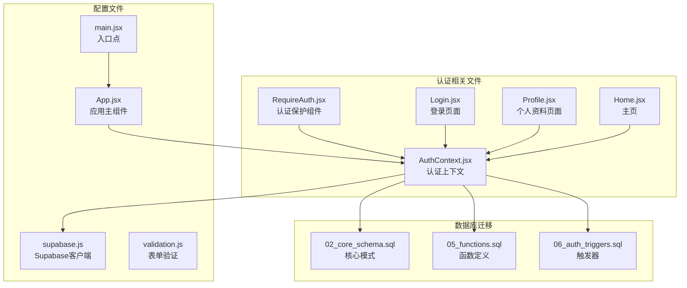
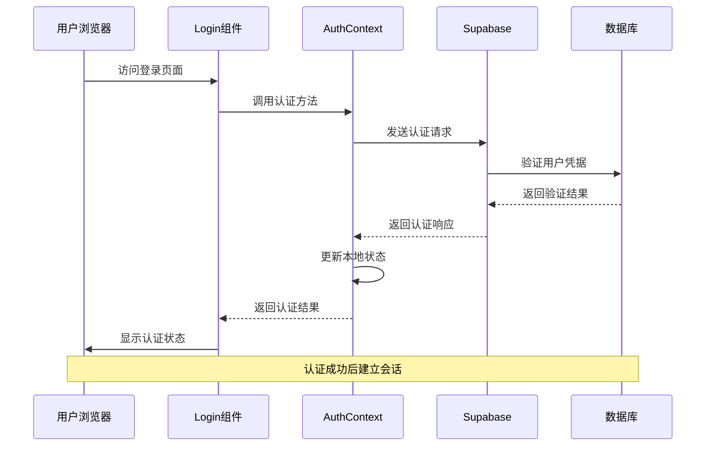
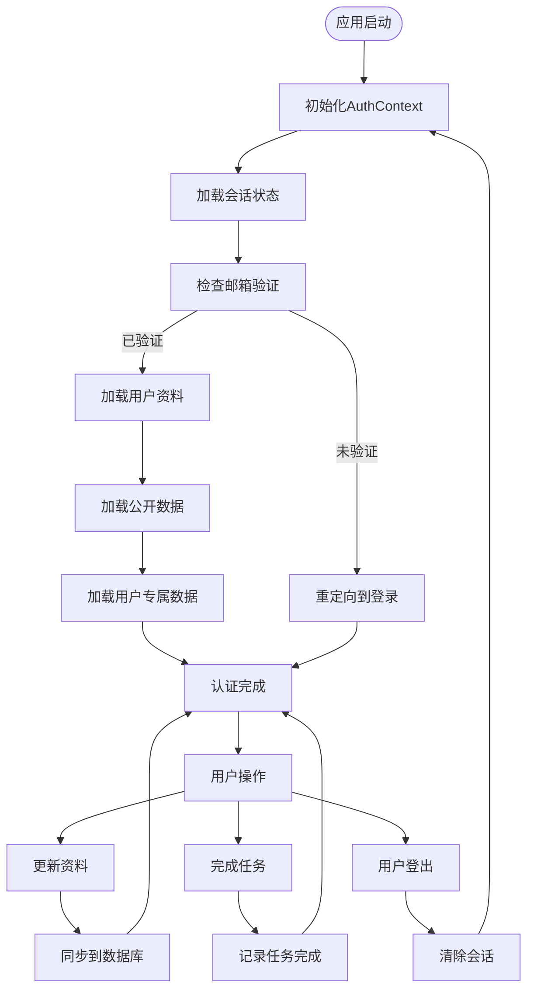
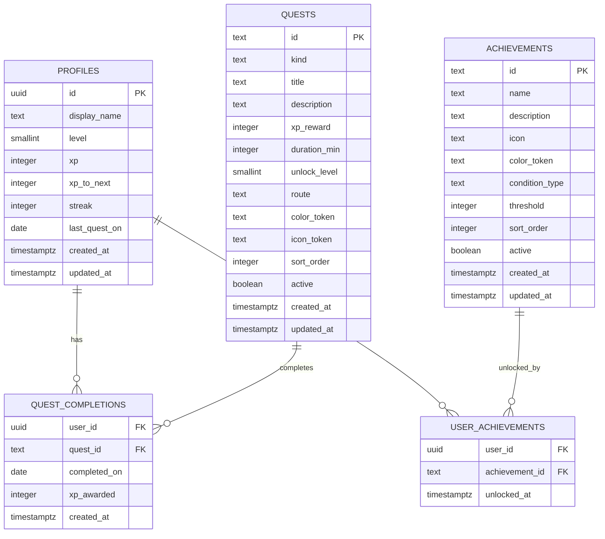
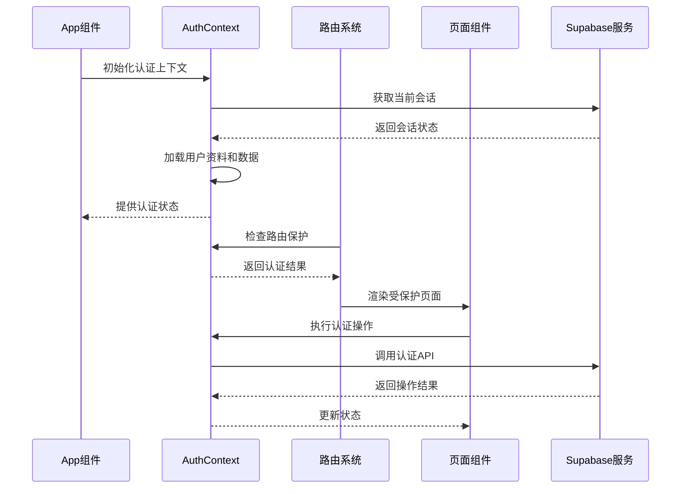

# 认证系统

<cite>
**本文档引用的文件**
- [AuthContext.jsx](file://src/auth/AuthContext.jsx)
- [RequireAuth.jsx](file://src/auth/RequireAuth.jsx)
- [Login.jsx](file://src/pages/Login.jsx)
- [supabase.js](file://src/lib/supabase.js)
- [validation.js](file://src/lib/validation.js)
- [App.jsx](file://src/App.jsx)
- [main.jsx](file://src/main.jsx)
- [05_functions.sql](file://supabase-migration/05_functions.sql)
- [02_core_schema.sql](file://supabase-migration/02_core_schema.sql)
- [06_auth_triggers.sql](file://supabase-migration/06_auth_triggers.sql)
- [Home.jsx](file://src/pages/Home.jsx)
- [Profile.jsx](file://src/pages/Profile.jsx)
</cite>

## 目录
1. [简介](#简介)
2. [项目结构](#项目结构)
3. [核心组件](#核心组件)
4. [架构概览](#架构概览)
5. [详细组件分析](#详细组件分析)
6. [依赖关系分析](#依赖关系分析)
7. [性能考虑](#性能考虑)
8. [故障排除指南](#故障排除指南)
9. [结论](#结论)

## 简介

这是一个基于 React 和 Supabase 的认证系统实现，为 Minecraft 英语学习应用提供用户身份验证、会话管理和权限控制功能。系统采用现代前端架构，结合 Supabase 的无服务器后端服务，实现了完整的用户认证流程，包括注册、登录、密码重置、会话持久化和权限管理。

## 项目结构

认证系统主要分布在以下目录和文件中：



**图表来源**
- [AuthContext.jsx:1-715](file://src/auth/AuthContext.jsx#L1-L715)
- [supabase.js:1-31](file://src/lib/supabase.js#L1-L31)
- [App.jsx:1-311](file://src/App.jsx#L1-L311)

**章节来源**
- [AuthContext.jsx:1-715](file://src/auth/AuthContext.jsx#L1-L715)
- [supabase.js:1-31](file://src/lib/supabase.js#L1-L31)
- [App.jsx:1-311](file://src/App.jsx#L1-L311)

## 核心组件

### AuthContext - 认证上下文

AuthContext 是整个认证系统的核心，负责管理用户状态、会话信息和认证相关的所有数据操作。

**主要功能特性：**
- 用户会话管理（登录、登出、自动刷新）
- 用户资料获取和更新
- 游戏化数据同步（经验值、等级、连续天数）
- 任务完成状态跟踪
- 成就系统集成

**关键数据结构：**
- `session`: 当前用户的认证会话
- `profile`: 用户游戏化资料（等级、经验值、连续天数）
- `todayCompletions`: 今日已完成的任务列表
- `weekDots`: 本周完成情况的7天网格
- `quests`: 可用任务列表
- `achievements`: 成就系统数据

**章节来源**
- [AuthContext.jsx:72-708](file://src/auth/AuthContext.jsx#L72-L708)

### RequireAuth - 认证保护组件

RequireAuth 是一个高阶组件，用于保护需要认证的路由，确保只有已认证用户才能访问特定页面。

**工作原理：**
- 检查用户会话状态
- 防止半加载状态下的组件渲染
- 自动重定向到登录页面
- 处理邮箱验证状态检查

**章节来源**
- [RequireAuth.jsx:4-45](file://src/auth/RequireAuth.jsx#L4-L45)

### Login - 登录页面

Login 组件提供了完整的用户认证界面，支持登录、注册和密码重置功能。

**功能特性：**
- 支持多种认证模式（登录、注册、忘记密码）
- 实时表单验证
- 错误处理和用户反馈
- 自动重定向到目标页面

**章节来源**
- [Login.jsx:21-316](file://src/pages/Login.jsx#L21-L316)

## 架构概览

认证系统采用分层架构设计，确保了良好的可维护性和扩展性：



**图表来源**
- [Login.jsx:87-112](file://src/pages/Login.jsx#L87-L112)
- [AuthContext.jsx:369-435](file://src/auth/AuthContext.jsx#L369-L435)

### 数据流架构



**图表来源**
- [AuthContext.jsx:262-367](file://src/auth/AuthContext.jsx#L262-L367)
- [AuthContext.jsx:437-442](file://src/auth/AuthContext.jsx#L437-L442)

## 详细组件分析

### Supabase 客户端配置

Supabase 客户端经过特殊配置以适应单页应用的使用场景：

**关键配置：**
- `persistSession: true`: 启用会话持久化
- `autoRefreshToken: true`: 自动刷新令牌
- `detectSessionInUrl: true`: 检测URL中的会话
- 自定义锁机制：解决HMR周期中的锁定问题

**章节来源**
- [supabase.js:23-30](file://src/lib/supabase.js#L23-L30)

### 表单验证系统

验证系统提供了统一的表单验证规则，确保用户输入的有效性：

**验证规则：**
- 邮箱格式验证：使用正则表达式验证邮箱格式
- 密码强度验证：最小长度8位
- 显示名称验证：最大20字符
- 密码匹配验证：确认密码一致性

**章节来源**
- [validation.js:13-51](file://src/lib/validation.js#L13-L51)

### 数据库架构设计

认证系统依赖于精心设计的数据库架构，确保数据一致性和安全性：

**核心表结构：**



**图表来源**
- [02_core_schema.sql:36-202](file://supabase-migration/02_core_schema.sql#L36-L202)

### RPC 函数实现

系统使用 PostgreSQL 函数实现复杂的业务逻辑：

**bump_streak 函数：**
- 实现连续天数计算逻辑
- 处理同日重复领取的情况
- 支持断连重置机制

**is_admin 函数：**
- 基于邮箱白名单的管理员验证
- 用于后台管理功能的权限控制

**章节来源**
- [05_functions.sql:59-107](file://supabase-migration/05_functions.sql#L59-L107)

## 依赖关系分析

认证系统的关键依赖关系如下：

```mermaid
graph TB
subgraph "前端依赖"
REACT[React 18.2.0]
ROUTER[react-router-dom 6.20.0]
SUPABASE[@supabase/supabase-js 2.106.0]
end
subgraph "认证组件"
AUTHCTX[AuthContext]
REQAUTH[RequireAuth]
LOGIN[Login]
PROFILE[Profile]
HOME[Home]
end
subgraph "数据库层"
SUPABASE_DB[Supabase数据库]
CORE_SCHEMA[核心模式]
FUNCTIONS[PostgreSQL函数]
TRIGGERS[触发器]
end
REACT --> AUTHCTX
ROUTER --> REQAUTH
SUPABASE --> AUTHCTX
AUTHCTX --> LOGIN
AUTHCTX --> PROFILE
AUTHCTX --> HOME
AUTHCTX --> SUPABASE_DB
SUPABASE_DB --> CORE_SCHEMA
SUPABASE_DB --> FUNCTIONS
SUPABASE_DB --> TRIGGERS
REQAUTH --> AUTHCTX
LOGIN --> AUTHCTX
PROFILE --> AUTHCTX
HOME --> AUTHCTX
```

**图表来源**
- [package.json:12-16](file://package.json#L12-L16)
- [AuthContext.jsx:1-17](file://src/auth/AuthContext.jsx#L1-L17)

### 组件交互流程



**图表来源**
- [App.jsx:92-103](file://src/App.jsx#L92-L103)
- [AuthContext.jsx:262-367](file://src/auth/AuthContext.jsx#L262-L367)

**章节来源**
- [App.jsx:105-223](file://src/App.jsx#L105-L223)
- [AuthContext.jsx:665-705](file://src/auth/AuthContext.jsx#L665-L705)

## 性能考虑

认证系统在设计时充分考虑了性能优化：

### 并发数据加载
- 使用 `Promise.allSettled` 并行加载多个数据源
- 避免阻塞关键路径的加载
- 单个失败不影响其他数据的加载

### 缓存策略
- 用户资料缓存避免重复查询
- 会话状态持久化减少重新认证
- 乐观更新提升用户体验

### 错误处理
- 6秒超时保护防止UI冻结
- 5秒资料加载超时保护
- 失败安全的回退机制

## 故障排除指南

### 常见问题及解决方案

**会话无法持久化**
- 检查环境变量配置
- 确认浏览器Cookie设置
- 验证Supabase项目配置

**邮箱验证问题**
- 检查邮件发送配置
- 验证邮箱格式
- 确认用户邮箱状态

**数据加载失败**
- 检查网络连接
- 验证数据库连接
- 查看控制台错误日志

**章节来源**
- [AuthContext.jsx:262-273](file://src/auth/AuthContext.jsx#L262-L273)
- [AuthContext.jsx:428-434](file://src/auth/AuthContext.jsx#L428-L434)

### 调试技巧

1. **启用开发模式**：查看详细的错误信息
2. **检查网络请求**：监控认证API调用
3. **验证状态更新**：确认状态变化是否正确
4. **测试边界条件**：验证异常情况处理

## 结论

这个认证系统展现了现代前端认证的最佳实践，通过以下关键特性实现了可靠的用户管理：

**技术优势：**
- 基于 Supabase 的无服务器架构，降低运维复杂度
- 完整的用户生命周期管理
- 优雅的错误处理和用户体验设计
- 可扩展的数据模型和业务逻辑

**架构特点：**
- 清晰的分层设计，职责分离明确
- 强大的并发处理能力
- 完善的权限控制机制
- 良好的性能优化策略

该系统为 Minecraft 英语学习应用提供了坚实的技术基础，能够支持用户认证、会话管理和权限控制等核心功能需求。