# 音频处理系统

<cite>
**本文档引用的文件**
- [parseYouTubeVtt.js](file://src/lib/parseYouTubeVtt.js)
- [ytPlayer.js](file://src/lib/ytPlayer.js)
- [PixelWaveform.jsx](file://src/components/PixelWaveform.jsx)
- [VideoLesson.jsx](file://src/pages/VideoLesson.jsx)
- [courses.js](file://src/lib/courses.js)
- [SegmentMCQ.jsx](file://src/components/SegmentMCQ.jsx)
- [ListeningReport.jsx](file://src/components/ListeningReport.jsx)
- [minecraft-10-animals.json](file://course-data/courses/minecraft-10-animals.json)
- [0hwVU0YueLQ.en.vtt](file://course-data/subs/0hwVU0YueLQ.en.vtt)
- [youtube-listening-playlist.json](file://course-data/youtube-listening-playlist.json)
- [package.json](file://package.json)
- [vite.config.js](file://vite.config.js)
</cite>

## 目录
1. [项目概述](#项目概述)
2. [系统架构](#系统架构)
3. [核心组件分析](#核心组件分析)
4. [音频处理流程](#音频处理流程)
5. [数据结构设计](#数据结构设计)
6. [用户交互流程](#用户交互流程)
7. [性能优化策略](#性能优化策略)
8. [错误处理机制](#错误处理机制)
9. [总结](#总结)

## 项目概述

这是一个基于React和Vite构建的Minecraft主题英语学习音频处理系统。系统通过YouTube视频内容，为学习者提供沉浸式的英语听力训练体验。核心功能包括：

- **音频转录解析**：自动处理YouTube自动生成的VTT字幕文件
- **微片段分割**：将长音频内容分割为适合学习的微片段
- **互动式听力练习**：提供多种类型的听力理解测试
- **实时波形显示**：可视化音频播放状态
- **进度跟踪**：记录学习者的答题情况和学习进度

## 系统架构

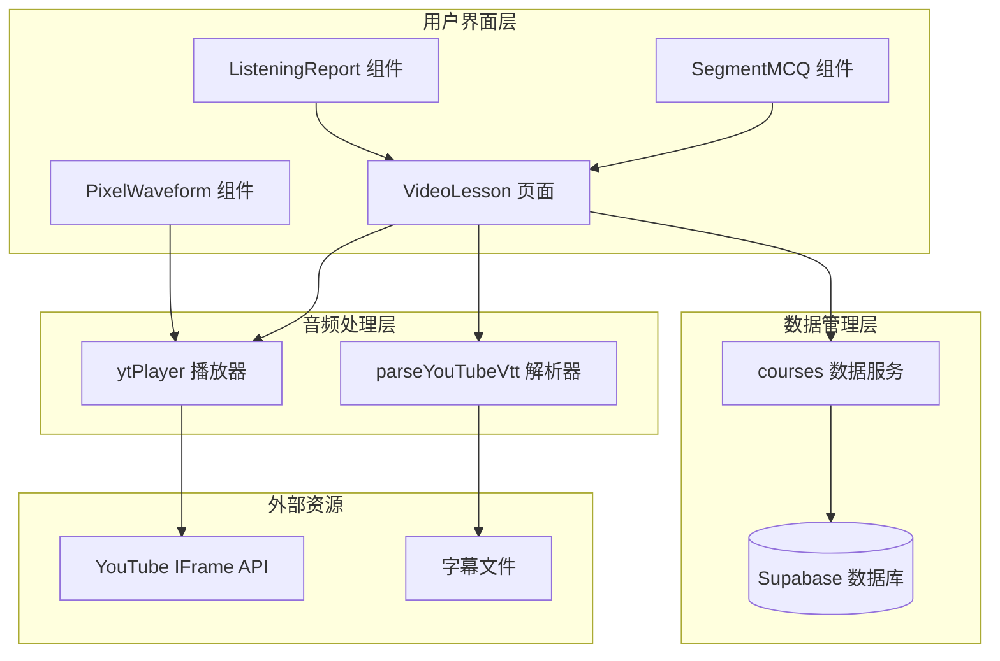

**图表来源**
- [VideoLesson.jsx:1-800](file://src/pages/VideoLesson.jsx#L1-L800)
- [parseYouTubeVtt.js:1-166](file://src/lib/parseYouTubeVtt.js#L1-L166)
- [ytPlayer.js:1-165](file://src/lib/ytPlayer.js#L1-L165)
- [courses.js:1-328](file://src/lib/courses.js#L1-L328)

## 核心组件分析

### 音频解析组件

#### parseYouTubeVtt.js - YouTube字幕解析器

该组件负责处理YouTube自动生成的VTT字幕文件，提取精确到单词级别的时间戳信息。

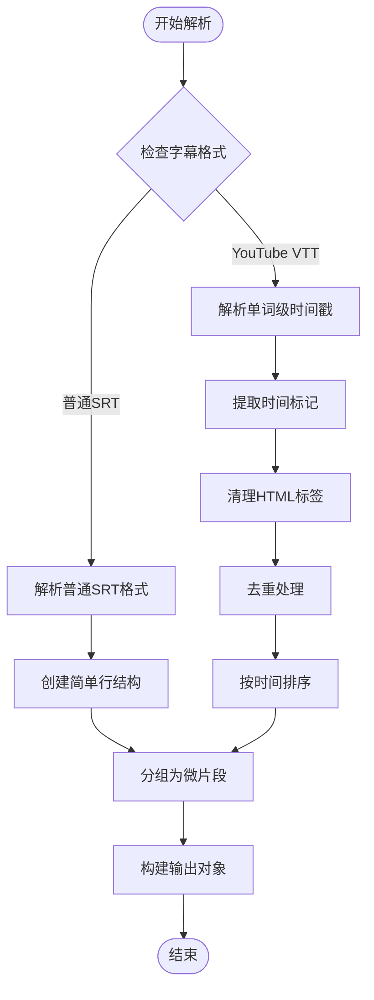

**图表来源**
- [parseYouTubeVtt.js:54-166](file://src/lib/parseYouTubeVtt.js#L54-L166)

#### ytPlayer.js - YouTube播放器控制器

管理YouTube视频播放器的生命周期和状态控制。

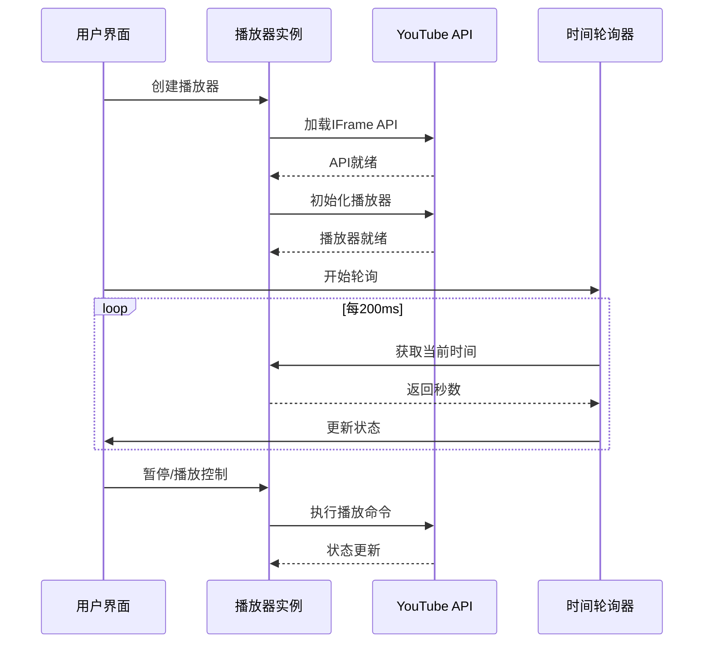

**图表来源**
- [ytPlayer.js:67-130](file://src/lib/ytPlayer.js#L67-L130)

### 视觉反馈组件

#### PixelWaveform.jsx - 像素风格波形图

提供Minecraft风格的音频波形可视化效果。

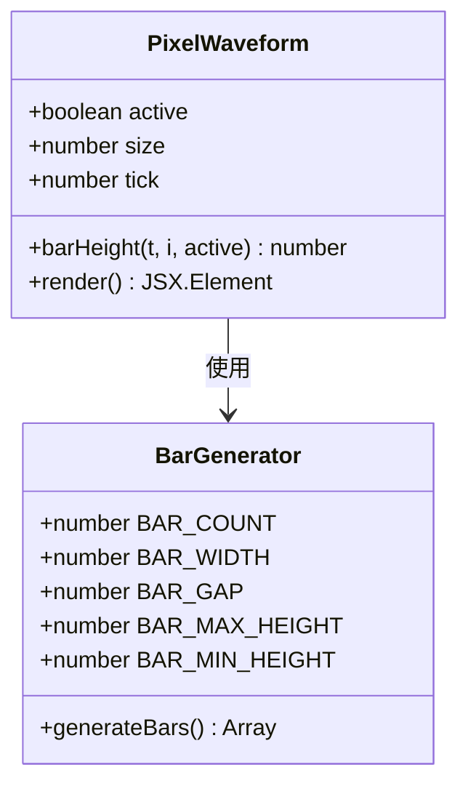

**图表来源**
- [PixelWaveform.jsx:10-76](file://src/components/PixelWaveform.jsx#L10-L76)

### 课程数据管理

#### VideoLesson.jsx - 主要学习页面

整合所有音频处理功能的核心页面组件。

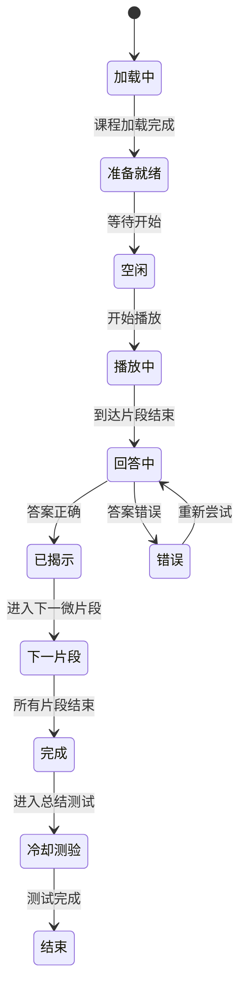

**图表来源**
- [VideoLesson.jsx:202-220](file://src/pages/VideoLesson.jsx#L202-L220)

## 音频处理流程

### 微片段分割算法

系统采用智能算法将连续的音频内容分割为适合学习的微片段：

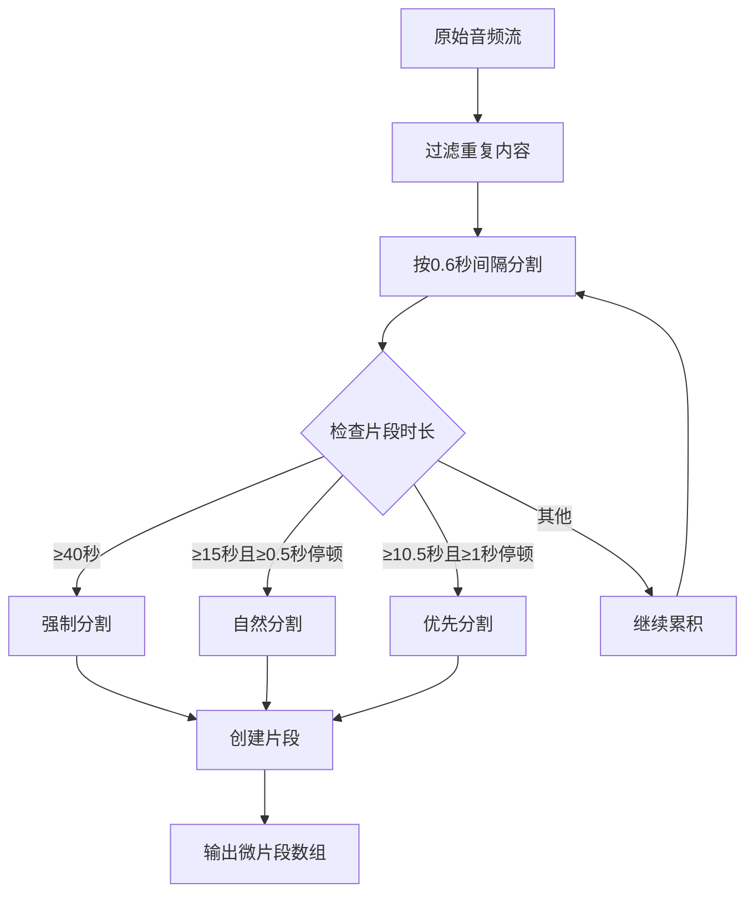

**图表来源**
- [parseYouTubeVtt.js:134-165](file://src/lib/parseYouTubeVtt.js#L134-L165)

### 字幕处理流程

系统支持两种字幕处理模式：

1. **YouTube VTT格式**：包含精确的单词级时间戳
2. **普通SRT格式**：使用整段作为字幕

## 数据结构设计

### 课程数据模型

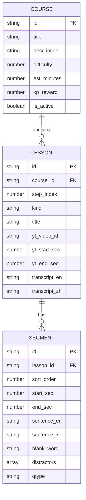

**图表来源**
- [minecraft-10-animals.json:16-107](file://course-data/courses/minecraft-10-animals.json#L16-L107)

### 用户进度追踪

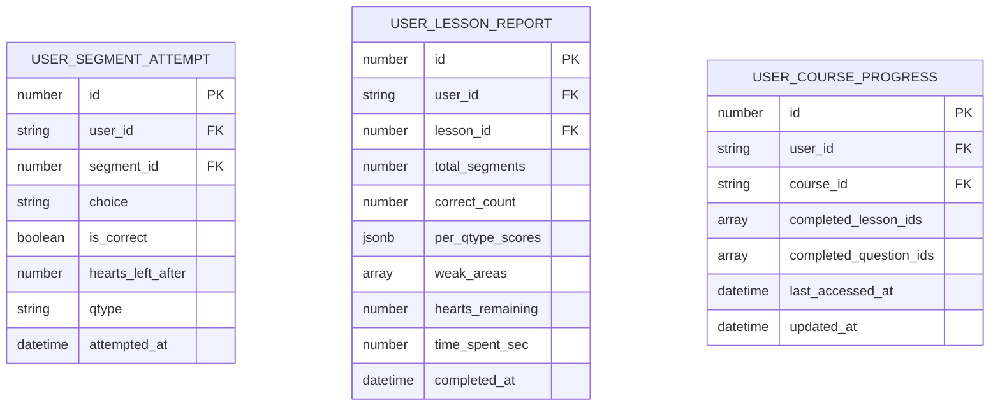

**图表来源**
- [courses.js:247-310](file://src/lib/courses.js#L247-L310)

## 用户交互流程

### 听力练习流程

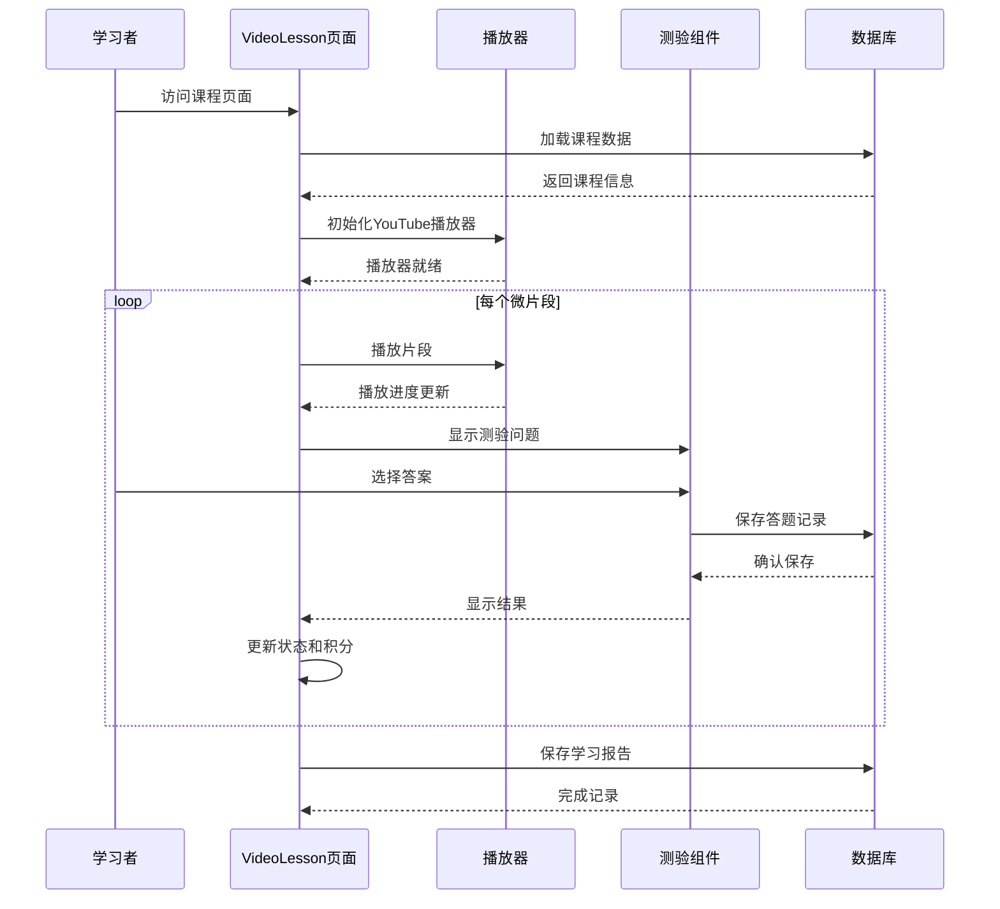

**图表来源**
- [VideoLesson.jsx:448-536](file://src/pages/VideoLesson.jsx#L448-L536)

### 冷却测验流程

系统提供多阶段的冷却测验，确保学习效果：

1. **序列重排**：训练听写能力
2. **快速问答**：提高反应速度
3. **总结测验**：评估整体掌握程度

## 性能优化策略

### 资源加载优化

系统采用多种策略优化音频处理性能：

- **懒加载YouTube API**：仅在需要时加载播放器脚本
- **像素波形动画**：使用固定120ms刷新频率，避免GPU过载
- **内存缓存**：缓存词汇表和课程数据
- **异步数据加载**：并行加载多个数据源

### 渲染优化

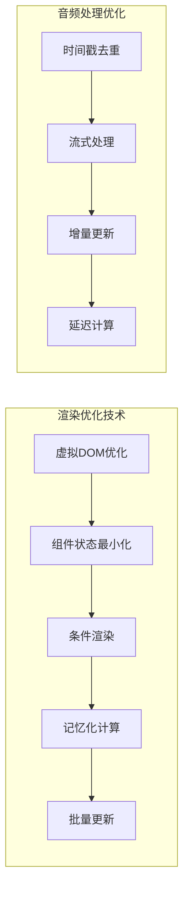

## 错误处理机制

### 弹性错误恢复

系统设计了多层次的错误处理机制：

1. **播放器初始化失败**：降级为静态播放器
2. **网络请求超时**：自动重试机制
3. **数据解析错误**：使用备用解析策略
4. **用户操作异常**：优雅降级不影响整体流程

### 数据持久化

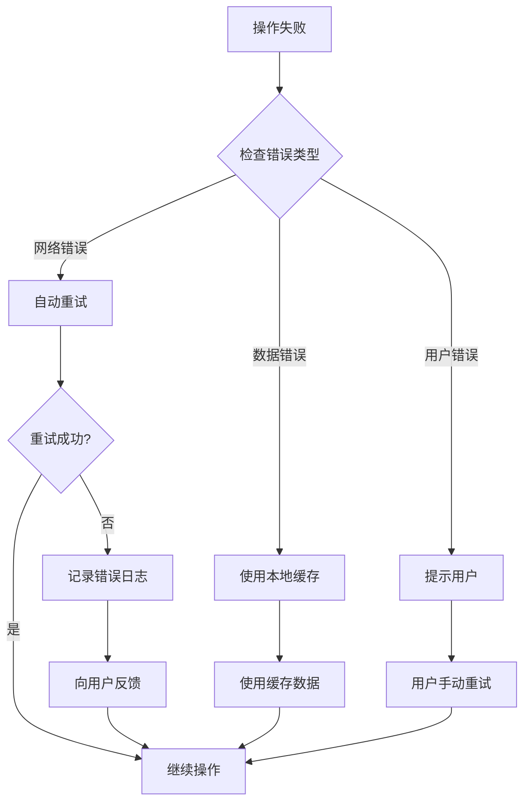

## 总结

音频处理系统通过精心设计的架构和算法，为Minecraft主题的英语学习提供了完整的解决方案。系统的主要优势包括：

- **高精度音频分割**：基于单词级时间戳的微片段分割
- **丰富的交互体验**：多种测验类型和视觉反馈
- **优秀的性能表现**：优化的渲染和数据处理策略
- **可靠的错误处理**：多层次的容错机制
- **可扩展的数据模型**：支持未来功能扩展

该系统不仅满足了当前的教育需求，还为未来的功能增强和技术演进奠定了坚实的基础。