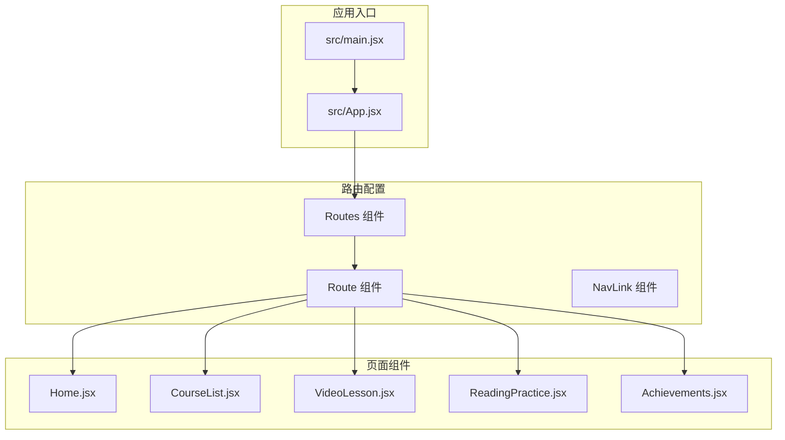
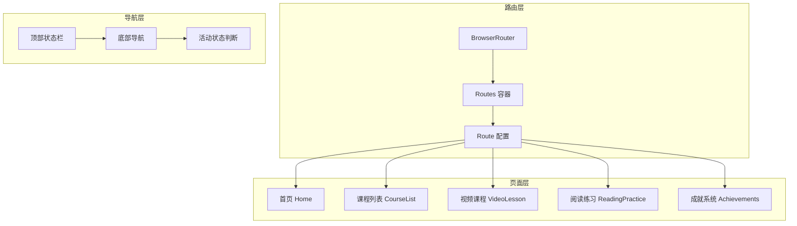
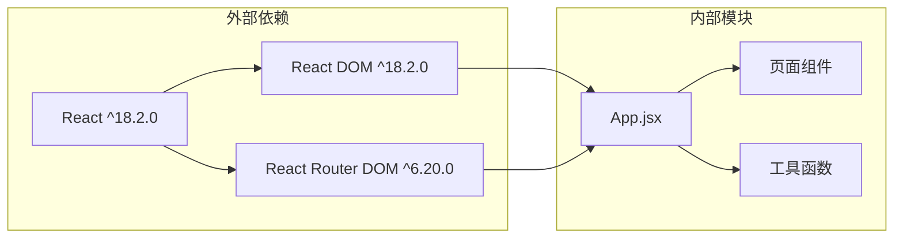

# 路由系统设计

<cite>
**本文档引用的文件**
- [App.jsx](file://src/App.jsx)
- [main.jsx](file://src/main.jsx)
- [package.json](file://package.json)
- [Home.jsx](file://src/pages/Home.jsx)
- [CourseList.jsx](file://src/pages/CourseList.jsx)
- [VideoLesson.jsx](file://src/pages/VideoLesson.jsx)
- [ReadingPractice.jsx](file://src/pages/ReadingPractice.jsx)
- [Achievements.jsx](file://src/pages/Achievements.jsx)
</cite>

## 目录
1. [项目概述](#项目概述)
2. [项目结构](#项目结构)
3. [核心组件](#核心组件)
4. [架构概览](#架构概览)
5. [详细组件分析](#详细组件分析)
6. [依赖关系分析](#依赖关系分析)
7. [性能考虑](#性能考虑)
8. [故障排除指南](#故障排除指南)
9. [结论](#结论)

## 项目概述

这是一个基于React和React Router DOM构建的Minecraft主题英语学习应用。该应用采用现代化的路由系统设计，支持响应式布局和像素艺术风格的用户界面。

## 项目结构



**图表来源**
- [main.jsx:1-14](file://src/main.jsx#L1-L14)
- [App.jsx:85-91](file://src/App.jsx#L85-L91)

**章节来源**
- [main.jsx:1-14](file://src/main.jsx#L1-L14)
- [package.json:1-22](file://package.json#L1-L22)

## 核心组件

### 路由配置系统

应用使用React Router DOM的最新版本（^6.20.0）实现客户端路由管理。路由系统采用声明式配置，通过Routes和Route组件定义页面映射关系。

### 导航系统

应用实现了顶部状态栏和底部导航的双重导航结构：

- **顶部状态栏**：显示用户头像、等级徽章和XP进度条
- **底部导航**：提供主要功能区域的快速访问

**章节来源**
- [App.jsx:47-112](file://src/App.jsx#L47-L112)

## 架构概览



**图表来源**
- [App.jsx:1-112](file://src/App.jsx#L1-L112)
- [main.jsx:7-12](file://src/main.jsx#L7-L12)

## 详细组件分析

### App.jsx - 主应用组件

主应用组件是整个路由系统的核心，负责：

#### 路由配置
- 根路径 '/' 映射到 Home 页面
- 课程列表 '/courses' 映射到 CourseList 页面  
- 视频课程 '/video/:id' 映射到 VideoLesson 页面
- 阅读练习 '/reading/:id' 映射到 ReadingPractice 页面
- 成就系统 '/achievements' 映射到 Achievements 页面

#### 活动状态导航
实现了自定义的活动状态判断逻辑：
```javascript
const isActive = (path) => {
  if (path === '/') return location.pathname === '/'
  return location.pathname.startsWith(path)
}
```

#### 像素艺术图标集成
集成了多种像素风格SVG图标：
- HomeIcon：主页图标
- BookIcon：书籍/课程图标  
- TrophyIcon：奖杯/成就图标
- SteveAvatar：用户头像

**章节来源**
- [App.jsx:47-112](file://src/App.jsx#L47-L112)

### 路由参数传递机制

#### 动态路由参数
应用使用React Router的动态路由参数功能：

**视频课程路由参数**
- 路径：`/video/:id`
- 参数传递：从课程列表页通过Link组件传递课程ID
- 使用场景：支持多个视频课程内容的统一处理

**阅读练习路由参数**  
- 路径：`/reading/:id`
- 参数传递：从课程列表页通过Link组件传递课程ID
- 使用场景：支持多个阅读材料的统一处理

#### 参数获取方式
在目标组件中通过`useParams()` Hook获取路由参数：
```javascript
// 在 VideoLesson 或 ReadingPractice 组件中
const { id } = useParams()
```

**章节来源**
- [CourseList.jsx:209](file://src/pages/CourseList.jsx#L209)
- [App.jsx:88-89](file://src/App.jsx#L88-L89)

### 导航组件实现

#### NavLink 组件
应用使用NavLink组件实现导航链接，具有以下特性：

**活动状态样式**
- 动态添加'active'类名
- 支持精确匹配和前缀匹配
- 自定义样式绑定

**像素艺术图标集成**
- 每个导航项都配有对应的像素风格图标
- 图标尺寸统一为24x24像素
- 支持悬停和激活状态的颜色变化

**章节来源**
- [App.jsx:96-108](file://src/App.jsx#L96-L108)

### 页面组件路由映射

#### 首页 (Home)
- 路径：`/`
- 功能：展示用户学习进度、推荐课程和成就预览
- 特殊导航：包含到课程列表的直接跳转

#### 课程列表 (CourseList)  
- 路径：`/courses`
- 功能：展示所有可选课程，支持按类型筛选
- 动态路由：根据课程类型自动选择对应的学习页面

#### 视频课程 (VideoLesson)
- 路径：`/video/:id`
- 功能：提供视频播放、字幕切换、词汇学习和听力练习
- 状态管理：包含字幕显示模式、测验答案等状态

#### 阅读练习 (ReadingPractice)
- 路径：`/reading/:id`  
- 功能：提供阅读材料、词汇学习和理解测试
- 交互功能：支持词汇收藏、答案提交和结果反馈

#### 成就系统 (Achievements)
- 路径：`/achievements`
- 功能：展示用户获得的成就徽章和物品收集
- 数据展示：包含进度条、统计信息和解锁状态

**章节来源**
- [App.jsx:86-90](file://src/App.jsx#L86-L90)
- [Home.jsx:155-206](file://src/pages/Home.jsx#L155-L206)

## 依赖关系分析



**图表来源**
- [package.json:12-16](file://package.json#L12-L16)

### 外部依赖
- **React (^18.2.0)**：核心框架库
- **React DOM (^18.2.0)**：DOM渲染库  
- **React Router DOM (^6.20.0)**：客户端路由库

### 内部模块依赖
- App.jsx 作为路由配置中心
- 各页面组件独立维护自身状态
- 工具函数提供通用功能支持

**章节来源**
- [package.json:1-22](file://package.json#L1-L22)

## 性能考虑

### 路由性能优化

1. **懒加载策略**
   - 建议对大型页面组件实施代码分割
   - 使用React.lazy和Suspense实现按需加载

2. **状态管理优化**
   - 避免在路由组件中进行昂贵的计算
   - 使用useMemo和useCallback优化重渲染

3. **图标性能**
   - SVG图标内联渲染，避免额外HTTP请求
   - 像素艺术图标尺寸固定，减少计算复杂度

### 渲染性能

1. **组件拆分**
   - 将大型组件拆分为更小的可复用组件
   - 实现细粒度的状态提升

2. **事件处理**
   - 使用事件委托减少事件监听器数量
   - 避免在渲染过程中创建新函数

## 故障排除指南

### 常见问题及解决方案

#### 路由不生效
**症状**：点击导航链接但页面不更新
**解决方案**：
1. 确认BrowserRouter正确包裹App组件
2. 检查Route路径是否与NavLink to属性匹配
3. 验证useLocation Hook的正确使用

#### 参数获取失败
**症状**：动态路由参数为undefined
**解决方案**：
1. 确保在目标组件中正确导入useParams
2. 检查路由路径中的参数名称一致性
3. 验证Link组件的to属性格式

#### 活动状态异常
**症状**：导航高亮状态不正确
**解决方案**：
1. 检查isActive函数的路径匹配逻辑
2. 确认NavLink的className绑定语法
3. 验证路径前缀匹配的边界情况

**章节来源**
- [App.jsx:50-53](file://src/App.jsx#L50-L53)

## 结论

该React应用的路由系统设计体现了现代前端开发的最佳实践：

### 设计优势
1. **清晰的路由层次**：简洁的路径设计便于用户理解和记忆
2. **灵活的参数传递**：支持动态路由参数，适应多内容场景
3. **优雅的导航体验**：像素艺术风格的图标和活动状态反馈
4. **模块化的组件设计**：每个页面组件职责明确，易于维护

### 技术亮点
- 使用React Router DOM v6的现代化API
- 实现了完整的导航状态管理
- 集成了丰富的UI组件和动画效果
- 支持响应式设计和移动端适配

### 改进建议
1. **添加路由守卫**：实现用户认证和权限控制
2. **实现嵌套路由**：支持更复杂的页面结构
3. **添加程序化导航**：提供编程式的路由跳转能力
4. **优化错误处理**：实现404页面和错误边界

该路由系统为Minecraft主题的英语学习应用提供了坚实的技术基础，为后续的功能扩展和性能优化奠定了良好的开端。