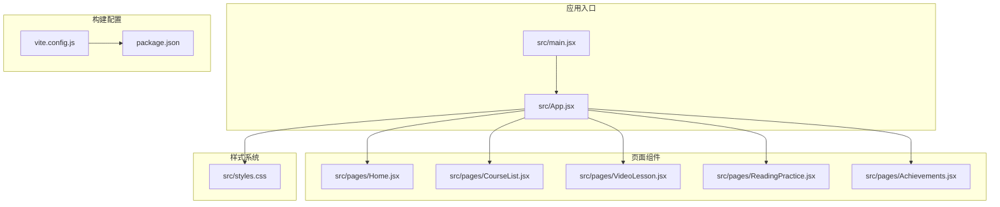
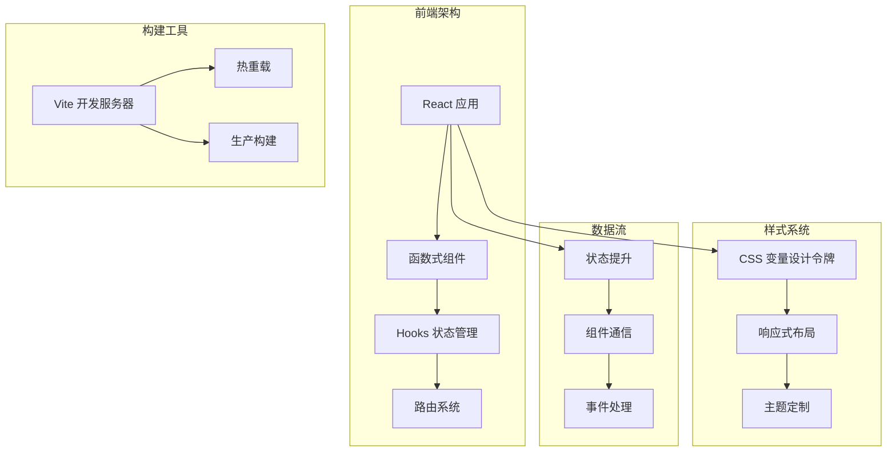
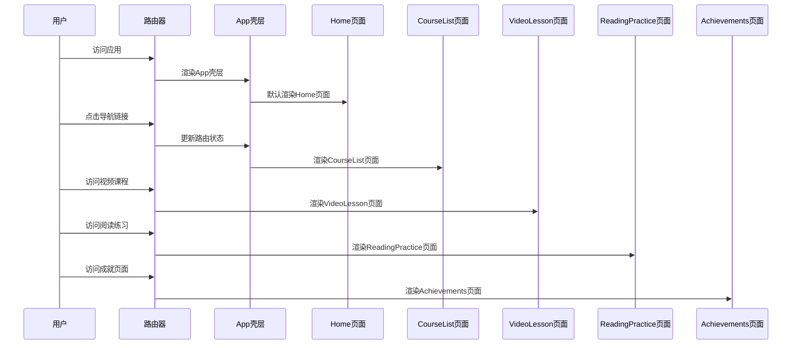
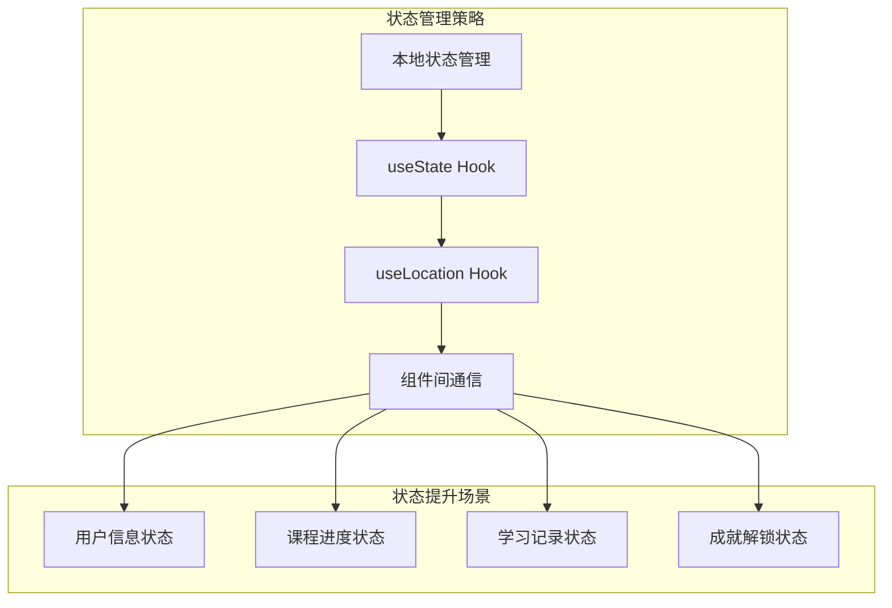
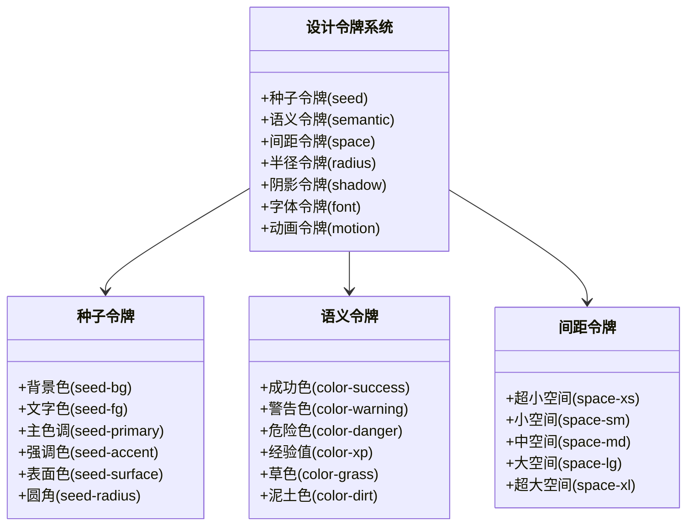

# 项目架构

<cite>
**本文档引用的文件**
- [package.json](file://package.json)
- [vite.config.js](file://vite.config.js)
- [src/main.jsx](file://src/main.jsx)
- [src/App.jsx](file://src/App.jsx)
- [src/styles.css](file://src/styles.css)
- [src/pages/Home.jsx](file://src/pages/Home.jsx)
- [src/pages/CourseList.jsx](file://src/pages/CourseList.jsx)
- [src/pages/VideoLesson.jsx](file://src/pages/VideoLesson.jsx)
- [src/pages/ReadingPractice.jsx](file://src/pages/ReadingPractice.jsx)
- [src/pages/Achievements.jsx](file://src/pages/Achievements.jsx)
</cite>

## 目录
1. [项目概述](#项目概述)
2. [项目结构](#项目结构)
3. [核心组件](#核心组件)
4. [架构总览](#架构总览)
5. [详细组件分析](#详细组件分析)
6. [依赖关系分析](#依赖关系分析)
7. [性能考虑](#性能考虑)
8. [故障排除指南](#故障排除指南)
9. [结论](#结论)

## 项目概述

这是一个基于 React 和 Vite 的 Minecraft 英语学习应用，采用函数式组件 + Hooks 的现代 React 设计模式。项目通过 CSS 变量设计令牌系统实现统一的主题管理，结合响应式布局和像素艺术风格，为用户提供沉浸式的英语学习体验。

## 项目结构



**图表来源**
- [src/main.jsx:1-14](file://src/main.jsx#L1-L14)
- [src/App.jsx:1-112](file://src/App.jsx#L1-L112)
- [vite.config.js:1-11](file://vite.config.js#L1-L11)
- [package.json:1-22](file://package.json#L1-L22)

**章节来源**
- [src/main.jsx:1-14](file://src/main.jsx#L1-L14)
- [src/App.jsx:1-112](file://src/App.jsx#L1-L112)
- [vite.config.js:1-11](file://vite.config.js#L1-L11)
- [package.json:1-22](file://package.json#L1-L22)

## 核心组件

### 应用壳层组件

App 组件作为整个应用的外壳，负责：
- 状态栏显示用户信息（头像、等级、经验值）
- 主内容区域的路由渲染
- 底部导航栏的页面切换
- 响应式布局适配

### 页面级组件

各页面组件采用独立的功能模块化设计：

- **Home 页面**：主界面展示，包含每日进度、推荐课程、成就预览等
- **CourseList 页面**：课程列表展示，支持分类筛选和进度追踪
- **VideoLesson 页面**：视频学习界面，包含字幕显示、分段播放、听力练习
- **ReadingPractice 页面**：阅读理解练习，支持多种题型和词汇学习
- **Achievements 页面**：成就系统展示，包含徽章收集和物品收藏

**章节来源**
- [src/App.jsx:47-112](file://src/App.jsx#L47-L112)
- [src/pages/Home.jsx:48-293](file://src/pages/Home.jsx#L48-L293)
- [src/pages/CourseList.jsx:163-314](file://src/pages/CourseList.jsx#L163-L314)
- [src/pages/VideoLesson.jsx:20-288](file://src/pages/VideoLesson.jsx#L20-L288)
- [src/pages/ReadingPractice.jsx:45-293](file://src/pages/ReadingPractice.jsx#L45-L293)
- [src/pages/Achievements.jsx:113-297](file://src/pages/Achievements.jsx#L113-L297)

## 架构总览



**图表来源**
- [src/App.jsx:1-112](file://src/App.jsx#L1-L112)
- [src/styles.css:1-499](file://src/styles.css#L1-L499)
- [vite.config.js:1-11](file://vite.config.js#L1-L11)

## 详细组件分析

### 路由系统与页面组织



**图表来源**
- [src/App.jsx:85-91](file://src/App.jsx#L85-L91)
- [src/main.jsx:3-13](file://src/main.jsx#L3-L13)

### 状态管理模式

项目采用 React Hooks 实现状态管理：



**图表来源**
- [src/pages/CourseList.jsx:164](file://src/pages/CourseList.jsx#L164)
- [src/pages/VideoLesson.jsx:21-24](file://src/pages/VideoLesson.jsx#L21-L24)
- [src/pages/ReadingPractice.jsx:46-49](file://src/pages/ReadingPractice.jsx#L46-L49)
- [src/App.jsx:48](file://src/App.jsx#L48)

### CSS 变量设计令牌系统



**图表来源**
- [src/styles.css:7-87](file://src/styles.css#L7-L87)

**章节来源**
- [src/App.jsx:1-112](file://src/App.jsx#L1-L112)
- [src/styles.css:1-499](file://src/styles.css#L1-L499)

## 依赖关系分析

```mermaid
graph LR
subgraph "运行时依赖"
A[react ^18.2.0]
B[react-dom ^18.2.0]
C[react-router-dom ^6.20.0]
end
subgraph "开发依赖"
D[@vitejs/plugin-react ^4.2.0]
E[vite ^5.0.0]
end
subgraph "项目文件"
F[main.jsx]
G[App.jsx]
H[页面组件]
I[styles.css]
end
F --> A
G --> A
H --> A
I --> A
F --> B
G --> C
H --> C
D --> E
```

**图表来源**
- [package.json:12-21](file://package.json#L12-L21)

**章节来源**
- [package.json:1-22](file://package.json#L1-L22)

## 性能考虑

### 构建优化

- **按需加载**：使用 React Router 的路由懒加载机制
- **代码分割**：Vite 自动进行代码分割和 Tree Shaking
- **资源压缩**：生产环境自动压缩 JavaScript 和 CSS 文件

### 运行时优化

- **虚拟滚动**：大量数据渲染时可考虑虚拟滚动技术
- **防抖节流**：输入框和搜索功能使用防抖优化
- **图片懒加载**：像素艺术资源使用懒加载策略

### 样式优化

- **CSS 变量缓存**：浏览器原生 CSS 变量具有良好的缓存性能
- **原子化样式**：减少重复样式的定义
- **媒体查询优化**：移动端优先的响应式设计

## 故障排除指南

### 常见问题

1. **路由跳转失效**
   - 检查 BrowserRouter 包装是否正确
   - 确认 Link 组件的 to 属性路径正确

2. **样式不生效**
   - 检查 CSS 变量命名是否正确
   - 确认 styles.css 文件是否正确导入

3. **构建错误**
   - 检查 Vite 配置文件语法
   - 确认 Node.js 版本兼容性

### 调试建议

- 使用 React DevTools 检查组件树结构
- 利用浏览器开发者工具分析网络请求
- 检查控制台错误信息和警告

**章节来源**
- [src/main.jsx:1-14](file://src/main.jsx#L1-L14)
- [vite.config.js:1-11](file://vite.config.js#L1-L11)

## 结论

该 React Vite 应用通过精心设计的架构实现了以下目标：

1. **现代化技术栈**：采用 React 18 + Vite 的最新技术组合
2. **组件化设计**：清晰的组件层次结构和职责分离
3. **主题化系统**：基于 CSS 变量的设计令牌系统，支持灵活的主题定制
4. **用户体验**：响应式布局和流畅的交互体验
5. **开发效率**：快速的热重载和简洁的构建配置

该架构为后续的功能扩展和维护提供了良好的基础，特别是在英语学习内容的持续更新和新功能的添加方面具有良好的可扩展性。