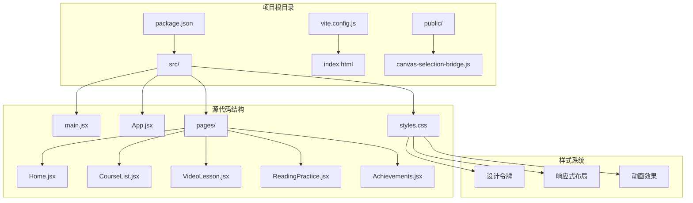
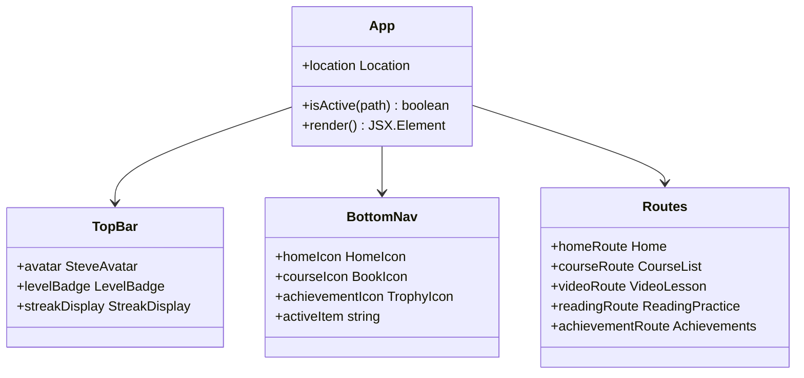
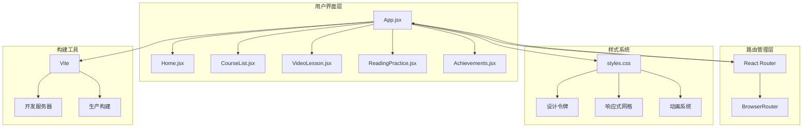
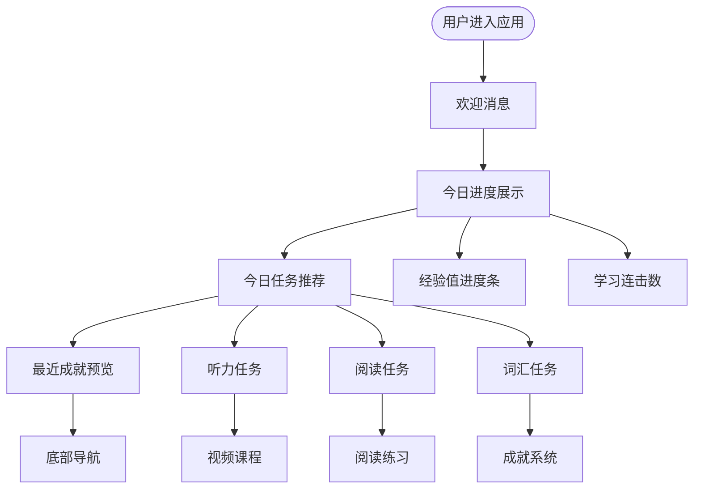
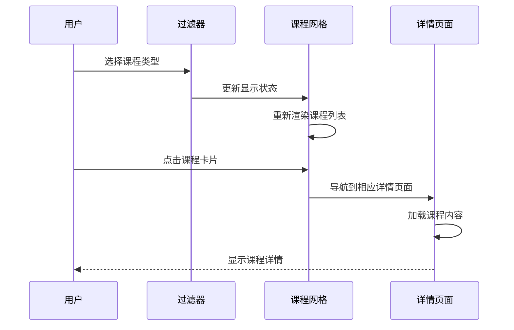
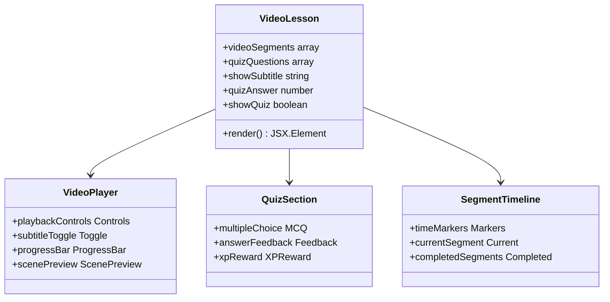
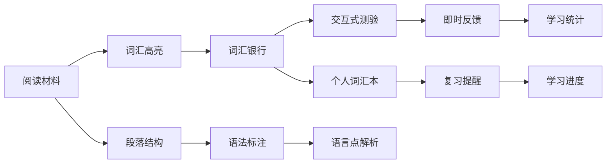
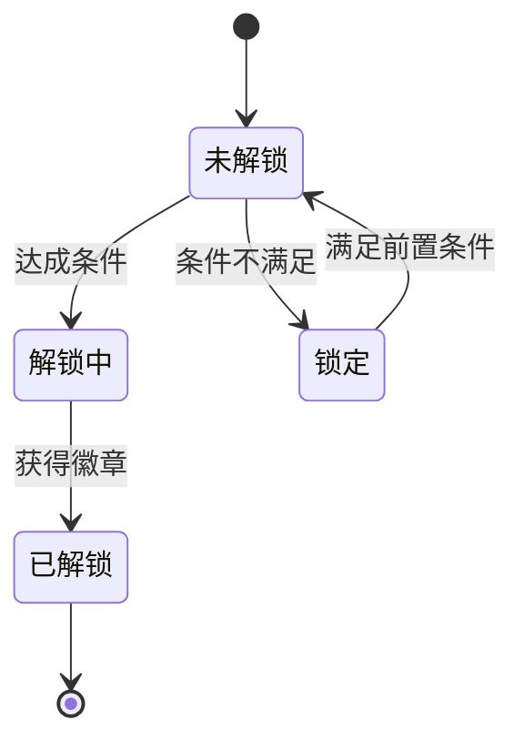

# 项目概述

<cite>
**本文档引用的文件**
- [package.json](file://package.json)
- [vite.config.js](file://vite.config.js)
- [index.html](file://index.html)
- [src/main.jsx](file://src/main.jsx)
- [src/App.jsx](file://src/App.jsx)
- [src/styles.css](file://src/styles.css)
- [src/pages/Home.jsx](file://src/pages/Home.jsx)
- [src/pages/CourseList.jsx](file://src/pages/CourseList.jsx)
- [src/pages/VideoLesson.jsx](file://src/pages/VideoLesson.jsx)
- [src/pages/ReadingPractice.jsx](file://src/pages/ReadingPractice.jsx)
- [src/pages/Achievements.jsx](file://src/pages/Achievements.jsx)
- [AGENTS.md](file://AGENTS.md)
</cite>

## 目录
1. [项目简介](#项目简介)
2. [项目结构](#项目结构)
3. [核心组件](#核心组件)
4. [架构概览](#架构概览)
5. [详细组件分析](#详细组件分析)
6. [依赖关系分析](#依赖关系分析)
7. [性能考虑](#性能考虑)
8. [故障排除指南](#故障排除指南)
9. [结论](#结论)

## 项目简介

CraftWords 是一个基于 Minecraft 主题的英语学习 React 应用，旨在通过游戏化的学习体验帮助用户提升英语能力。该项目采用像素艺术设计风格，将 Minecraft 元素与英语学习相结合，创造了一个既有趣又富有教育意义的学习平台。

### 核心价值主张

**游戏化学习体验**：通过 Minecraft 主题和像素艺术风格，将传统的英语学习转化为沉浸式的游戏体验，提高学习者的参与度和持续性。

**多模态学习方法**：提供听、说、读、写的全方位英语训练，包括视频听力练习、阅读理解、词汇学习等多种学习模式。

**进度追踪系统**：内置经验值系统、等级制度和成就徽章，通过游戏化元素激励用户持续学习。

**个性化学习路径**：根据用户的学习进度和能力水平，提供个性化的课程推荐和难度调整。

### 目标用户群体

- **英语学习者**：希望以有趣方式学习英语的各个水平的学习者
- **Minecraft 玩家**：喜欢 Minecraft 主题内容的年轻用户群体
- **游戏化学习爱好者**：偏好通过游戏机制进行学习的用户
- **移动设备用户**：需要在平板或手机上进行碎片化学习的学习者

### 主要功能特性

**学习仪表板**：提供每日学习进度、经验值统计和学习成就概览
**课程体系**：包含听力、阅读、词汇等多类型英语学习课程
**游戏化成就系统**：通过徽章、等级和奖励机制激励学习
**互动式学习内容**：提供视频课程、阅读材料和练习测试
**进度追踪**：实时显示学习进度、完成度和学习统计

## 项目结构

该应用采用标准的 React 单页应用程序架构，使用 Vite 作为构建工具和开发服务器。



**图表来源**
- [package.json:1-22](file://package.json#L1-L22)
- [src/main.jsx:1-14](file://src/main.jsx#L1-L14)
- [src/App.jsx:1-112](file://src/App.jsx#L1-L112)

### 技术架构选择

**React + Vite 技术栈选择理由**：

1. **开发效率**：Vite 提供极速的开发服务器启动和热模块替换(HMR)，显著提升开发体验
2. **构建性能**：现代化的打包工具链，优化生产环境构建速度
3. **生态兼容**：与 React 生态系统完美集成，支持最新的 JavaScript 特性
4. **移动端优化**：针对移动设备的性能优化，适合教育类应用的跨平台需求

**设计系统架构**：

项目采用基于设计令牌的设计系统，通过 CSS 变量实现主题定制和响应式设计。像素艺术风格通过专门的 CSS 类和 SVG 组件实现，确保视觉一致性。

**章节来源**
- [package.json:1-22](file://package.json#L1-L22)
- [vite.config.js:1-11](file://vite.config.js#L1-L11)
- [src/styles.css:1-87](file://src/styles.css#L1-L87)

## 核心组件

### 应用外壳组件

App.jsx 作为应用的主要外壳，负责路由管理和全局状态管理。它包含了顶部状态栏、主内容区域和底部导航栏的完整布局结构。



**图表来源**
- [src/App.jsx:47-112](file://src/App.jsx#L47-L112)

### 页面组件架构

每个页面组件都遵循统一的设计模式，包含头部导航、主要内容区域和交互元素。所有组件都使用相同的样式系统和设计令牌，确保视觉一致性。

**章节来源**
- [src/App.jsx:1-112](file://src/App.jsx#L1-L112)
- [src/main.jsx:1-14](file://src/main.jsx#L1-L14)

## 架构概览

应用采用客户端路由架构，通过 React Router 实现页面间的无缝切换。整体架构体现了现代前端应用的最佳实践。



**图表来源**
- [src/App.jsx:1-112](file://src/App.jsx#L1-L112)
- [src/main.jsx:1-14](file://src/main.jsx#L1-L14)
- [vite.config.js:1-11](file://vite.config.js#L1-L11)

### 数据流架构

应用采用单向数据流模式，状态管理相对简单，主要通过 React 的 useState 和 useEffect 钩子实现。对于更复杂的状态管理需求，可以考虑引入 Context API 或状态管理库。

**章节来源**
- [src/App.jsx:1-112](file://src/App.jsx#L1-L112)
- [src/pages/CourseList.jsx:1-314](file://src/pages/CourseList.jsx#L1-L314)

## 详细组件分析

### 学习仪表板组件

Home.jsx 作为应用的主界面，提供了完整的用户学习概览和快捷入口。



**图表来源**
- [src/pages/Home.jsx:48-293](file://src/pages/Home.jsx#L48-L293)

#### 设计特色分析

**像素艺术元素**：
- 使用 SVG 形状构建像素风格的图标和装饰元素
- 通过 CSS 的 image-rendering 属性确保像素化效果
- 设计了专门的像素风格徽章和装饰图案

**Minecraft 主题元素**：
- 使用绿色调的草块颜色方案
- 地牢风格的圆角设计
- 像素风格的 Steve 头像和各种游戏元素图标

**交互设计**：
- 流畅的卡片悬停动画效果
- 渐变色的进度条设计
- 响应式的网格布局系统

**章节来源**
- [src/pages/Home.jsx:1-293](file://src/pages/Home.jsx#L1-L293)
- [src/styles.css:45-87](file://src/styles.css#L45-L87)

### 课程列表组件

CourseList.jsx 实现了完整的课程浏览和筛选功能，支持多种学习类型的分类展示。



**图表来源**
- [src/pages/CourseList.jsx:163-314](file://src/pages/CourseList.jsx#L163-L314)

#### 功能特性

**多维度筛选**：
- 支持按学习类型（听力、阅读、词汇）筛选
- 实时的课程进度显示
- 难度等级标识系统

**课程状态管理**：
- 完成状态的可视化反馈
- 锁定状态的保护机制
- 进度百分比的动态更新

**响应式设计**：
- 网格布局自动适配屏幕尺寸
- 移动端友好的触摸交互
- 视觉层次的合理组织

**章节来源**
- [src/pages/CourseList.jsx:1-314](file://src/pages/CourseList.jsx#L1-L314)

### 视频课程组件

VideoLesson.jsx 提供了完整的视频学习体验，包含字幕切换、分段播放和互动测验功能。



**图表来源**
- [src/pages/VideoLesson.jsx:20-288](file://src/pages/VideoLesson.jsx#L20-L288)

#### 学习交互设计

**多语言支持**：
- 英文原声字幕
- 中英双语字幕切换
- 关键词汇高亮显示

**渐进式学习**：
- 分段式视频播放
- 关键概念重复强调
- 即时测验巩固知识

**学习反馈**：
- 实时答案验证
- 正确率统计
- 经验值奖励系统

**章节来源**
- [src/pages/VideoLesson.jsx:1-288](file://src/pages/VideoLesson.jsx#L1-L288)

### 阅读练习组件

ReadingPractice.jsx 实现了完整的阅读理解练习系统，包含文本分析、词汇学习和测验功能。



**图表来源**
- [src/pages/ReadingPractice.jsx:45-293](file://src/pages/ReadingPractice.jsx#L45-L293)

#### 阅读学习特色

**智能词汇识别**：
- 自动识别文章中的关键词汇
- 词汇高亮和点击查询功能
- 个人词汇本管理

**多样化练习形式**：
- 选择题、判断题、填空题
- 即时答案反馈
- 错误分析和正确答案展示

**学习进度追踪**：
- 阅读理解能力评估
- 词汇掌握程度统计
- 学习时间记录

**章节来源**
- [src/pages/ReadingPractice.jsx:1-293](file://src/pages/ReadingPractice.jsx#L1-L293)

### 成就系统组件

Achievements.jsx 实现了完整的游戏化成就系统，通过徽章收集和等级提升激励用户持续学习。



**图表来源**
- [src/pages/Achievements.jsx:113-297](file://src/pages/Achievements.jsx#L113-L297)

#### 成就系统设计

**多层次成就体系**：
- 基础成就：完成课程、达到学习时长
- 进阶成就：掌握特定技能、获得高分
- 专家成就：完成全部课程、达到高级别

**多样化的奖励机制**：
- 数字徽章收集
- 物品收藏系统
- 等级和头衔提升

**社交激励元素**：
- 成就分享功能
- 排行榜系统
- 学习社区互动

**章节来源**
- [src/pages/Achievements.jsx:1-297](file://src/pages/Achievements.jsx#L1-L297)

## 依赖关系分析

### 核心依赖关系

项目采用最小化依赖策略，只包含必要的运行时依赖和开发依赖。

```mermaid
graph TB
subgraph "运行时依赖"
A[react ^18.2.0] --> B[React 核心库]
C[react-dom ^18.2.0] --> D[DOM 操作库]
E[react-router-dom ^6.20.0] --> F[路由管理]
end
subgraph "开发依赖"
G[@vitejs/plugin-react ^4.2.0] --> H[Vite React 插件]
I[vite ^5.0.0] --> J[构建工具]
end
subgraph "项目配置"
K[package.json] --> L[依赖声明]
M[vite.config.js] --> N[构建配置]
O[index.html] --> P[入口页面]
end
A --> K
C --> K
E --> K
G --> M
I --> M
O --> K
```

**图表来源**
- [package.json:12-20](file://package.json#L12-L20)
- [vite.config.js:1-11](file://vite.config.js#L1-L11)

### 样式系统依赖

项目采用 CSS 变量驱动的设计系统，通过集中式的样式管理实现主题的一致性和可维护性。

**章节来源**
- [package.json:1-22](file://package.json#L1-L22)
- [src/styles.css:1-499](file://src/styles.css#L1-L499)

## 性能考虑

### 构建优化

**代码分割**：通过路由级别的代码分割，实现按需加载，减少初始包体积。

**资源优化**：使用 Vite 的内置优化功能，包括图片压缩、CSS 优化和 JavaScript 压缩。

**缓存策略**：合理的缓存头设置，提升二次访问性能。

### 运行时优化

**虚拟滚动**：对于大量数据的列表，考虑使用虚拟滚动技术提升渲染性能。

**懒加载组件**：对非关键路径的组件实现懒加载，提升首屏加载速度。

**内存管理**：合理清理事件监听器和定时器，避免内存泄漏。

## 故障排除指南

### 常见问题诊断

**开发服务器问题**：
- 端口冲突：修改 vite.config.js 中的 server.port 配置
- 热重载失效：检查网络连接和防火墙设置
- 依赖安装失败：清理 node_modules 和 package-lock.json 后重新安装

**样式问题**：
- CSS 变量未生效：检查浏览器兼容性和 CSS 变量定义
- 像素艺术效果异常：确认 image-rendering 属性设置
- 响应式布局错乱：验证媒体查询断点设置

**路由问题**：
- 页面刷新后路由丢失：检查 BrowserRouter 的配置
- 导航链接失效：确认 Link 组件的 to 属性正确性
- 嵌套路由配置：验证 Route 组件的层级关系

**性能问题**：
- 页面加载缓慢：分析网络请求和资源大小
- 交互卡顿：检查组件渲染和状态更新逻辑
- 内存泄漏：使用浏览器开发者工具监控内存使用

**章节来源**
- [vite.config.js:6-9](file://vite.config.js#L6-L9)
- [src/styles.css:451-456](file://src/styles.css#L451-L456)

## 结论

CraftWords 项目成功地将 Minecraft 游戏元素与英语学习相结合，创造了一个独特而有效的教育应用。通过像素艺术设计、游戏化机制和多模态学习方法，该项目为英语学习者提供了一个既有趣又高效的学习平台。

### 技术优势总结

**架构简洁性**：采用标准的 React + Vite 技术栈，架构清晰，易于维护和扩展。

**用户体验优秀**：游戏化设计提升了学习的趣味性和持续性，像素艺术风格增强了品牌识别度。

**功能完整性**：涵盖了从基础学习到高级成就的完整学习体验，满足不同层次用户的需求。

**性能表现良好**：通过现代化的构建工具和优化策略，确保了良好的加载速度和交互性能。

### 发展建议

**功能扩展方向**：
- 添加更多语言学习模式和内容类型
- 集成本地化学习计划和个性化推荐算法
- 增强社交功能，如学习小组和排行榜系统

**技术升级建议**：
- 考虑引入状态管理库处理复杂的应用状态
- 实现离线学习功能，提升应用的可用性
- 添加多语言支持，扩大用户覆盖范围

该项目为教育类应用的开发提供了优秀的参考案例，展示了如何通过技术创新和设计思维创造有价值的产品。